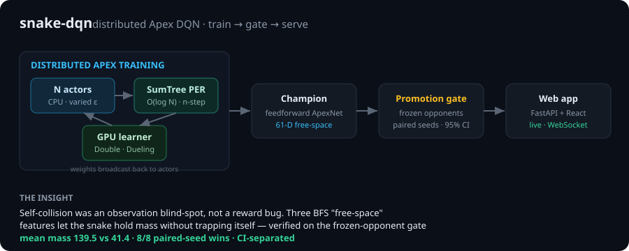

# snake-dqn

Multi-agent reinforcement learning that teaches snakes to play a slither.io-style game with a
distributed **Apex DQN** built from scratch — a hand-rolled actor/learner/buffer system, a
disciplined frozen-opponent evaluation harness, and a live web app to watch the trained policy
think in real time.




---

## The headline result

The interesting finding wasn't a reward tweak — it was a diagnosis. The agent kept dying by
**self-collision once it got long**, and no amount of reward shaping fixed it, because it wasn't a
reward problem: the snake **couldn't see the trap in its observation**. Adding three bounded
BFS flood-fill **"free-space"** features (reachable open area for turn-left / straight / turn-right)
gave it that signal.

On the promotion benchmark — a candidate hero vs **frozen** opponents, **paired seeds**, greedy
rollouts, scoring *stored mass* (not food flow):

| model | mean mass | vs frozen champ | result |
|---|---:|---:|---|
| **61-D free-space (champion)** | **139.5** | **41.4** | 8/8 paired wins · CI-separated |
| 58-D baseline | ~56 | — | the free-space model's warm-start parent |

The model is a single feedforward Dueling DQN. The win comes from **observation design**, validated
by an eval harness built specifically to resist self-play inflation (see
[Evaluation](#evaluation-the-promotion-gate)).

## Quickstart

```bash
python -m venv venv && . venv/bin/activate
pip install -r requirements.txt

# Watch the trained champion play — or play against it yourself — in the browser
cd web/frontend && npm install && npm run build && cd ../..
python web/serve.py            # -> http://localhost:8000   (or: make web)
#                                open the "Play" tab to steer a snake and top the leaderboard

# Train headless (no GUI needed)
python src/main.py --headless --episodes 100000

# Evaluate a checkpoint against frozen opponents (the promotion gate)
python src/scripts/tournament_eval.py saved_snakes/champion_a5_freespace_20260621.pth \
  --opponent saved_snakes/best_apex_stage1_fs.pth \
  --config configs/eval_free_space.yaml --frames 1500 --seeds 0-15
```

## The web app

A **server-authoritative** UI: the Python engine is the single source of truth, and the React
frontend is a pure view that renders frames streamed over a WebSocket — no game logic or model
inference runs in the browser. Six panels:

- **Game** — the live arena; the hero snake is outlined.
- **Play** — *take the controls yourself.* Steer a snake with the arrow keys / WASD against the
  trained AI, boost with space, and submit your final score to a **SQLite-backed leaderboard**
  (see [Human play](#human-play--leaderboard)).
- **Inspector** — the hero's 58-/61-D state vector (grouped + labeled), live Q-values → chosen
  action, and the free-space features.
- **Network** — live `forward_with_activations` heat-mapped across input / hidden / output layers.
- **Dashboard** — the eval leaderboard parsed from `logs/eval_*.json` + the checkpoint inventory.
- **Controls** — play/pause, speed, ε, hero selector, checkpoint loader, watch↔train toggle.

### Human play + leaderboard

The **Play** tab pits *you* against the trained snakes on the same engine. Movement is decoupled
from any UI toolkit ([`HumanSnake.apply_direction_input`](src/game/human_snake.py)), so the browser
drives it over the WebSocket. A run freezes until your first key ("press an arrow to start"), your
death ends the run (AI opponents keep respawning), and the score is computed **server-side** from
length, food, kills, and survival — so it can't be spoofed by the client.

Scores persist in a small dedicated SQLite database ([`ScoreStore`](src/data/score_store.py),
`scores.db`), separate from the large experience-replay DB. REST surface:
`GET /api/leaderboard`, `GET /api/players/{name}`, `POST /api/scores`.

> A screenshot/GIF lives best at `docs/web_app.png` — the app is one command away (`make web`).
> See [web/README.md](web/README.md) for the design.

## Architecture

### Distributed Apex DQN (`src/training/`)

N actor processes (CPU, varied ε) → a `SumTree`-backed prioritized buffer (O(log N) sampling,
n-step returns) → one GPU learner; weights broadcast back to actors. Implements:

- **Double DQN** (online selects, target evaluates)
- **Dueling architecture** (separate value / advantage streams)
- **Prioritized Experience Replay** with importance sampling
- **N-step returns** and target networks

A `Policy` ABC and a `BaseReplayBuffer` ABC keep the pieces swappable; `SnakeFactory` injects the
shared policy into snakes via DI; configuration is immutable frozen dataclasses.

### One model, one state representation

The project ships a **single** network — the feedforward Dueling DQN `ApexNetwork`. (GRU/DRQN and
CNN variants were evaluated and removed: across paired, frozen-opponent benchmarks the feedforward
+ 61-D free-space model strictly dominated them.) The state is selectable via `use_free_space`: the
58-D hand-crafted vector, or the 61-D variant that appends the three free-space features
(`input_size: 61`, `use_free_space: true`).

The `Snake` class is split by concern: entity/lifecycle (`snake.py`), observation
(`snake_state.py` → `SnakeStateMixin`), and reward (`snake_reward.py` → `SnakeRewardMixin`).

### Evaluation: the promotion gate

`src/scripts/tournament_eval.py` is the differentiator. Naïve self-play eval inflates skill (a Red
Queen effect — opponents improve too, and survival saturates at the frame cap). Instead this harness
pits the candidate against opponents running a **fixed frozen checkpoint**, on **paired seeds**
(identical RNG per candidate), greedy (ε=0, deterministic), scoring **stored mass** (which doesn't
saturate the way episode length does). Promotion requires a **CI-separated** win on mean mass with
survival held. This is what caught a mislabeled reward contract during development.

## Train your own on an H100

The winner is feedforward, so it runs on the fast distributed path (1 GPU learner + many CPU
actors). See [docs/h100_training_recipe.md](docs/h100_training_recipe.md) for the exact warm-start,
config, and gating recipe.

## Project structure

```
src/
├── core/        immutable config, device manager
├── model/       ApexNetwork (Dueling DQN) + mixins
├── training/    Apex policy, actor, learner, SumTree/PER buffers, curriculum
├── game/        snake entity + state/reward mixins, game loop, factory (DI)
└── scripts/     apex_train, tournament_eval (promotion gate), warm-start tooling
web/             FastAPI backend + React/TS frontend (the live UI)
configs/         YAML configs (free_space_v2 = production; eval_free_space = the gate arena)
docs/            architecture, H100 recipe, history
saved_snakes/    champion + frozen eval opponents
```

## Development

```bash
make install-dev    # deps + pre-commit hooks
make test           # pytest (1235 tests)
make lint           # black --check + isort --check + flake8
make format         # auto-format
cd web/frontend && npm test    # frontend unit tests (vitest, 23 tests)
```

CI runs lint + Python tests + the frontend build **and its vitest suite** on every push
([.github/workflows/ci.yml](.github/workflows/ci.yml)).

## References

- **[docs/ml_algorithm.md](docs/ml_algorithm.md)** — the algorithm design in depth: dueling network,
  Double-DQN + n-step targets, PER, action masking, the distributed topology, and design directions.
- [Ape-X](https://arxiv.org/abs/1803.00933) — Distributed Prioritized Experience Replay
- [Double DQN](https://arxiv.org/abs/1509.06461) · [Dueling Networks](https://arxiv.org/abs/1511.06581) · [PER](https://arxiv.org/abs/1511.05952)

## License

MIT
