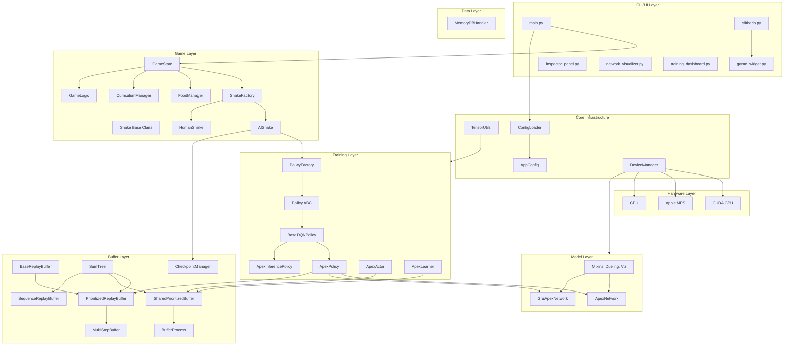

# Snake RL Architecture

## Overview

Multi-agent reinforcement learning platform for training AI snakes using **Apex DQN**. Features a **modular architecture** with base classes, mixins, dependency injection, and immutable configuration.

**Key Innovations:**
- **Apex DQN** with distributed training (N actor processes + buffer process + GPU learner)
- **SumTree-backed prioritized replay** for O(log N) experience sampling
- **Dueling + Double DQN** with 6 relative actions (left/straight/right x normal/boost)
- **GRU/DRQN variant** for temporal memory with sequence replay and burn-in
- **58-D state vector** with food density, danger map, enemy features, kill opportunities
- **Kill attribution** and **curriculum learning** for progressive difficulty
- **Circular arena** option and **speed boost** mechanic
- **Immutable configuration system** with frozen dataclasses and YAML loading
- **Dependency injection** for testable, loosely-coupled components
- **Mixin-based model composition** for flexible network architectures

## System Architecture



## Module Structure

```
src/
├── core/                          # Core infrastructure
│   ├── device_manager.py         # Singleton device management with test overrides
│   ├── game_config.py            # Immutable AppConfig dataclass system
│   └── config_loader.py          # YAML loading with validation
│
├── data/                          # Data layer (Repository pattern)
│   ├── memory_repository.py      # Abstract interface
│   ├── memory_db_handler.py      # SQLite storage
│   └── sqlite_repository.py      # SQLite implementation
│
├── model/                         # Neural network models
│   ├── base_network.py           # BaseDQNVisualization, WeightManagementMixin, init helpers
│   ├── model_mixins.py           # DuelingMixin, NoisyMixin (unused), VisualizationMixin
│   ├── apex_network.py           # ApexNetwork - Dueling DQN (58→512→256→V+A)
│   ├── gru_network.py            # GruApexNetwork - GRU/DRQN variant with temporal memory
│   ├── noisy_linear.py           # Noisy linear layer (available, not currently used)
│   ├── checkpoint_manager.py     # Centralized save/load with versioning
│   └── model_factory.py          # Model creation
│
├── training/                      # RL algorithms
│   ├── policy.py                 # Abstract Policy and OfflineCapablePolicy interfaces
│   ├── base_dqn_policy.py       # BaseDQNPolicy - shared DQN policy base class
│   ├── policy_factory.py         # Policy creation and discovery
│   ├── apex_policy.py            # ApexPolicy - Apex DQN with optional GRU/DRQN mode
│   ├── apex_inference.py         # ApexInferencePolicy - inference-only policy
│   ├── base_buffer.py            # BaseReplayBuffer ABC and utility functions
│   ├── replay_buffer.py          # UniformReplayBuffer, PrioritizedReplayBuffer (SumTree)
│   ├── multistep_buffer.py       # MultiStepBuffer - N-step returns wrapper
│   ├── sum_tree.py               # SumTree - O(log N) binary sum-tree data structure
│   ├── sequence_buffer.py        # SequenceReplayBuffer - trajectory buffer for DRQN
│   ├── apex_buffer.py            # SharedPrioritizedBuffer, BufferProcess, IPC clients
│   ├── apex_priorities.py        # Priority computation utilities
│   ├── apex_actor.py             # Distributed actor process for Apex training
│   ├── apex_learner.py           # Centralized GPU learner for Apex training
│   ├── curriculum.py             # CurriculumManager - progressive difficulty (5 phases)
│   ├── online_trainer.py         # Online training loop
│   ├── metrics_tracker.py        # Training metrics collection
│   └── tensorboard_logger.py     # TensorBoard logging
│
├── game/                          # Game logic
│   ├── game_state.py             # Game state management (uses managers)
│   ├── game_logic.py             # Collision detection, rewards, relative actions
│   ├── snake.py                  # Base snake class (shared behavior)
│   ├── ai_snake.py               # AI snake (dependency injection)
│   ├── human_snake.py            # Human-controlled snake
│   ├── snake_factory.py          # Factory for creating snakes
│   └── food_manager.py           # Food spawning and consumption
│
├── ui/                            # User interface
│   ├── slitherio.py              # Main game window
│   ├── game_widget.py            # Game rendering (supports circular arena)
│   ├── inspector_panel.py        # Snake inspector
│   ├── network_visualizer.py     # Neural network visualization
│   └── training_dashboard.py     # Live training metrics
│
├── utils/                         # Utility modules
│   ├── tensor_utils.py           # Batch building and tensor conversion
│   ├── nn_utils.py               # Neural network utilities
│   └── colab_loader.py           # Google Colab model loading
│
└── scripts/                       # CLI tools
    ├── apex_train.py              # Distributed Apex training coordinator
    ├── generate_experiences.py    # Experience generation
    └── imitation_learning.py      # Train from human gameplay
```

## Class Hierarchies

### Policy Hierarchy

```
Policy (ABC)
└── OfflineCapablePolicy       # Adds memory storage/retrieval methods
    └── BaseDQNPolicy          # Shared DQN functionality (epsilon, state dict, cleanup)
        ├── ApexPolicy         # Apex DQN with PER, Double DQN, optional GRU/DRQN
        └── ApexInferencePolicy  # Inference-only (no training, no buffer)
```

**ApexPolicy provides:**
- Target network management with hard updates
- Prioritized experience replay (SumTree-backed)
- N-step returns via MultiStepBuffer
- Epsilon-greedy exploration (per-actor epsilon in distributed mode)
- Dueling architecture (value + advantage streams)
- Double DQN (action selection vs evaluation)
- Optional GRU/DRQN mode with SequenceReplayBuffer and burn-in
- Gradient clipping
- Checkpoint save/load
- Distributed training support (actors + centralized learner)

### Buffer Hierarchy

```
BaseReplayBuffer (ABC)                    # add(), sample(), update_priorities(), clear()
├── UniformReplayBuffer                   # Simple uniform sampling (deque-based)
├── PrioritizedReplayBuffer               # O(log N) prioritized replay via SumTree
│   └── MultiStepBuffer                   # N-step returns wrapper
├── LocalApexBuffer                       # Local fallback for Apex (BaseReplayBuffer)
└── (standalone classes):
    ├── SharedPrioritizedBuffer            # Apex distributed buffer (SumTree-backed, thread-safe)
    ├── SequenceReplayBuffer               # Trajectory buffer for DRQN (SumTree-backed)
    └── SumTree                            # O(log N) binary sum-tree data structure

BufferProcess                              # Dedicated process wrapping SharedPrioritizedBuffer
ActorBufferClient                          # IPC client for actor → buffer communication
LearnerBufferClient                        # IPC client for learner → buffer communication
```

**BaseReplayBuffer provides:**
- `add()` - Store transition with optional priority
- `sample()` - Sample batch (returns batch dict, indices, importance weights)
- `update_priorities()` - Update TD-error priorities (no-op for uniform)
- `__len__()` - Buffer size
- `get_all_memories()` - Return all memories for saving
- `clear()` - Reset buffer

### Model Hierarchy

```
nn.Module
├── ApexNetwork                # Dueling DQN (58→512→256 → V+A streams, 6 outputs)
│   └── uses DuelingMixin, WeightManagementMixin, BaseDQNVisualization
└── GruApexNetwork             # GRU/DRQN variant (58→512→256→GRU(256)→V+A, 6 outputs)
    └── uses DuelingMixin, WeightManagementMixin, BaseDQNVisualization

Mixins (composable):
├── DuelingMixin               # Value/Advantage stream separation
├── NoisyMixin                 # Noisy layer utilities (available, not currently used)
├── VisualizationMixin         # Network visualization helpers
├── WeightManagementMixin      # Weight copying, sharing for distributed training
└── BaseDQNVisualization       # Visualization support base class
```

**ApexNetwork provides:**
- Shared feature extraction (input→512→256 with ReLU)
- Dueling streams (value stream + advantage stream)
- Orthogonal or Xavier weight initialization
- torch.compile() support for H100 optimization
- Efficient weight sharing for actor synchronization

**GruApexNetwork adds:**
- GRU recurrent layer between feature extractor and dueling streams
- Temporal memory across sequential observations (DRQN)
- Supports both single-step and sequence forward passes
- Hidden state management for episode boundaries
- Forward returns (q_values, hidden_state) tuple

### Snake Hierarchy

```
Snake (Base)
├── AISnake                    # AI-controlled (uses dependency injection)
│   └── policy: Policy         # Injected Apex DQN policy
└── HumanSnake                 # Human-controlled
```

## Configuration System

### Immutable AppConfig

The configuration system uses frozen dataclasses for compile-time safety:

```python
@dataclass(frozen=True)
class GameSettings:
    width: int = 1450
    height: int = 830
    num_snakes: int = 4
    segment_size: int = 10
    initial_food: int = 250
    max_food: int = 300
    min_boost_length: int = 5
    boost_length_cost_frames: int = 3
    arena_type: str = "rectangular"    # "rectangular" or "circular"
    arena_radius: int = 400

@dataclass(frozen=True)
class NetworkSettings:
    input_size: int = 58               # 58-D state vector
    hidden_size: int = 512
    output_size: int = 6               # 3 relative dirs x 2 speed modes
    use_gru: bool = False              # Enable GRU/DRQN mode
    gru_hidden_size: int = 256
    sequence_length: int = 20
    burn_in_length: int = 5

@dataclass(frozen=True)
class TrainingSettings:
    batch_size: int = 128
    memory_size: int = 100000
    learning_rate: float = 0.005
    gamma: float = 0.99
    epsilon_start: float = 1.0
    epsilon_end: float = 0.02
    epsilon_decay: float = 0.99995
    priority_alpha: float = 0.6       # Priority exponent
    priority_beta_start: float = 0.4  # Importance sampling

@dataclass(frozen=True)
class RewardSettings:
    death: float = -3.0
    food_base: float = 3.0
    survival: float = 0.01
    kill_base: float = 1.0            # Kill attribution
    kill_length_scale: float = 0.05
    kill_max: float = 5.0

@dataclass(frozen=True)
class ApexSettings:
    num_actors: int = 64
    buffer_size: int = 1_000_000
    batch_size: int = 512

@dataclass(frozen=True)
class CurriculumSettings:
    enabled: bool = False
    window_size: int = 50

@dataclass(frozen=True)
class AppConfig:
    game: GameSettings
    network: NetworkSettings
    training: TrainingSettings
    rewards: RewardSettings
    checkpoint: CheckpointSettings
    apex: ApexSettings
    curriculum: CurriculumSettings
```

### Configuration Loading

```python
from src.core.game_config import AppConfig, initialize_config, get_config

# Initialize from YAML
config = initialize_config('configs/production.yaml')

# Or use defaults
config = initialize_config()

# Access anywhere
config = get_config()
print(config.game.width)      # 1450
print(config.training.gamma)  # 0.99

# Access actions (cardinal directions for reference)
actions = config.actions          # ((0,-1), (1,0), (0,1), (-1,0))
colors = config.snake_colors      # RGB tuples

# Note: The actual action space uses 6 relative actions (left/straight/right x normal/boost).
# Cardinal directions in config.actions are used internally by GameLogic for direction mapping.
```

## Dependency Injection

### AISnake Pattern

AISnake no longer holds a reference to GameState. Instead, it receives:
1. A `Policy` instance (created by SnakeFactory)
2. Callbacks for frame access

```python
class AISnake(Snake):
    def __init__(
        self,
        id: int,
        color: Tuple[int, int, int],
        start_pos: Tuple[int, int],
        segment_size: int,
        game_width: int,
        game_height: int,
        policy: Policy,                           # Injected policy
        policy_type: str = 'apex_dqn',
        get_frame: Optional[Callable[[], int]] = None,    # Callback
        set_frame: Optional[Callable[[int], None]] = None  # Callback
    ):
        super().__init__(...)
        self.policy = policy
        self._get_frame = get_frame or (lambda: 0)
        self._set_frame = set_frame or (lambda f: None)
```

### SnakeFactory

Centralizes snake creation with dependency injection:

```python
from src.game.snake_factory import SnakeFactory

# Create AI snake with injected Apex DQN policy
snake = SnakeFactory.create_ai_snake(
    snake_id=0,
    color=(255, 0, 0),
    start_pos=(100, 100),
    policy_type='apex_dqn',
    get_frame=lambda: game_state.frame,
    set_frame=lambda f: setattr(game_state, 'frame', f)
)

# Create human snake
human = SnakeFactory.create_human_snake(
    snake_id=1,
    color=(0, 255, 0),
    start_pos=(200, 200)
)

# Create all snakes for a game
snakes = SnakeFactory.create_snakes_for_game(
    num_snakes=4,
    position_generator=lambda: game_state.get_random_position(),
    human_mode=False,
    get_frame=lambda: game_state.frame,
    set_frame=lambda f: setattr(game_state, 'frame', f)
)
```

### FoodManager

Extracted food logic from GameState:

```python
from src.game.food_manager import FoodManager

fm = FoodManager(
    game_width=1450,
    game_height=830,
    max_food=300,
    initial_food=250
)

# Maintain food count
fm.maintain_count(snakes)

# Check food consumption
if fm.consume_at(snake.head, snake.segment_size):
    snake.grow()

# Get nearest food
nearest = fm.get_nearest_food(position)

# Get food in radius
nearby = fm.get_food_in_radius(position, radius=100)
```

## Tensor Utilities

Standardized batch building for Apex DQN:

```python
from src.utils.tensor_utils import (
    ensure_tensor,
    build_tensor_batch,
    build_tensor_batch_with_priority,
    normalize_batch_rewards,
    clip_rewards
)

# Convert to tensor
tensor = ensure_tensor(data, device, dtype=torch.float32)

# Build batch from samples
batch = build_tensor_batch(samples, device)
# Returns: {'states', 'actions', 'rewards', 'next_states', 'dones'}

# Build batch with priority weights
batch = build_tensor_batch_with_priority(samples, weights, device)
# Returns: {'states', 'actions', 'rewards', 'next_states', 'dones', 'weights'}

# Normalize rewards
normalized = normalize_batch_rewards(rewards, eps=1e-8)

# Clip rewards
clipped = clip_rewards(rewards, min_val=-10.0, max_val=10.0)
```

## DeviceManager

Singleton with test override capability:

```python
from src.core.device_manager import DeviceManager

# Get device (auto-detects CUDA > MPS > CPU)
device = DeviceManager.get_device()

# For testing - override device
DeviceManager.override_device(torch.device('cpu'))
assert DeviceManager.get_device() == torch.device('cpu')

# Reset for clean test state
DeviceManager.reset_for_testing()

# Check if override is active
if DeviceManager.is_override_active():
    print("Using test device")
```

## Policy Interface

The Apex DQN policy implements the unified `Policy` interface:

```python
class Policy(ABC):
    @abstractmethod
    def select_action(self, state: torch.Tensor) -> int:
        """Select action given state."""
        pass

    @abstractmethod
    def update(self, state, action, reward, next_state, done) -> Tuple[Optional[float], float]:
        """Update policy. Returns (loss, exploration_param)."""
        pass

    @abstractmethod
    def get_state_dict(self) -> dict:
        """Return serializable state for checkpointing."""
        pass

    @abstractmethod
    def load_state_dict(self, state_dict: dict) -> None:
        """Load from checkpoint."""
        pass

    @abstractmethod
    def get_policy_name(self) -> str:
        """Return policy type identifier."""
        pass

    @property
    @abstractmethod
    def epsilon(self) -> float:
        """Exploration parameter."""
        pass


class OfflineCapablePolicy(Policy):
    """Extended interface adding memory storage and retrieval."""
    @abstractmethod
    def get_all_memories(self) -> list: ...
    @abstractmethod
    def prepare_memories_for_saving(self) -> list: ...
    def cleanup(self) -> None: ...
```

### ApexPolicy Properties

| Property/Method | Description |
|-----------------|-------------|
| `epsilon` | Epsilon-greedy exploration (decays from 1.0 to 0.02) |
| `memory` | PrioritizedReplayBuffer (SumTree-backed) or SequenceReplayBuffer (GRU mode) |
| `n_step` | N-step returns (default: 3) |
| `distributed` | Whether running in distributed Apex mode |
| `use_gru` | Whether using GRU/DRQN temporal memory |
| `cleanup()` | Clear buffer and reset networks |

## Neural Network Architecture

### ApexNetwork (Standard)

Uses `DuelingMixin` with epsilon-greedy exploration:

```
Input (58) → Feature Layer → Dueling Streams → Q-values (6 actions)

Feature Layer:
  Linear(58 → 512) + ReLU
  Linear(512 → 256) + ReLU

Value Stream (from DuelingMixin):
  Linear(256 → 512) + ReLU
  Linear(512 → 1)             # V(s)

Advantage Stream (from DuelingMixin):
  Linear(256 → 512) + ReLU
  Linear(512 → 6)             # A(s,a) for 6 actions

Q(s,a) = V(s) + (A(s,a) - mean(A(s,:)))
```

### GruApexNetwork (DRQN Variant)

Adds GRU temporal memory between feature extractor and dueling streams:

```
Input (58) → Feature Layer → GRU → Dueling Streams → Q-values (6 actions)

Feature Layer:
  Linear(58 → 512) + ReLU
  Linear(512 → 256) + ReLU

GRU Layer:
  GRU(256 → 256, 1 layer, batch_first=True)

Value Stream:
  Linear(256 → 512) + ReLU
  Linear(512 → 1)             # V(s)

Advantage Stream:
  Linear(256 → 512) + ReLU
  Linear(512 → 6)             # A(s,a) for 6 actions

Returns: (q_values, new_hidden_state)
```

### Action Space (6 Relative Actions)

| Action | Direction | Speed |
|--------|-----------|-------|
| 0 | Turn left | Normal |
| 1 | Go straight | Normal |
| 2 | Turn right | Normal |
| 3 | Turn left | Boost |
| 4 | Go straight | Boost |
| 5 | Turn right | Boost |

Speed boost moves 2 cells/frame, costs 1 body segment every `boost_length_cost_frames` frames,
and requires minimum `min_boost_length` length. Relative actions prevent 180-degree turns by design.

**Key Components:**
- **Dueling Architecture**: Separates value and advantage streams
- **Epsilon-Greedy Exploration**: Decays from 1.0 to 0.02 (per-actor epsilon in distributed mode)
- **Double DQN**: Action selection via main network, evaluation via target network
- **N-step Returns**: Multi-step TD targets for faster learning
- **Prioritized Replay**: SumTree-backed O(log N) sampling of important transitions
- **Optional GRU/DRQN**: Temporal memory for partially observable environments

## State Representation (58-D)

| Index | Feature | Count | Description |
|-------|---------|-------|-------------|
| 0-3 | Direction | 4 | One-hot (Up, Right, Down, Left) |
| 4 | Length | 1 | Normalized snake length |
| 5-6 | Food Relative XY | 2 | Nearest food relative position |
| 7 | Food Distance | 1 | Normalized distance to food |
| 8-23 | Food Density Map | 16 | 360 degree vision sectors |
| 24-39 | Danger Map | 16 | Obstacle proximity |
| 40-43 | Boundary Distances | 4 | Wall distances (L/R/T/B) |
| 44-46 | Nearest Enemy | 3 | Relative x, y, size |
| 47-48 | Enemy Heading | 2 | Direction dx, dy |
| 49 | Enemy Trend | 1 | Closing (+1) vs separating (-1) |
| 50-52 | 2nd Nearest Enemy | 3 | Relative x, y, size |
| 53 | Kill Opportunity | 1 | Adjacent to enemy path score |
| 54-56 | Per-Action Danger | 3 | Danger for left/straight/right |
| 57 | Boost Available | 1 | Can boost (length >= 5) |

## Memory System

### SumTree Data Structure

Binary sum-tree in flat numpy array for O(log N) prioritized sampling. Internal nodes store
the sum of their children; leaf nodes store individual priorities. Data is stored in a
separate array with ring buffer semantics. Also maintains a min-tree for efficient
importance sampling weight computation.

### Buffer Variants

| Buffer | Backing | Use Case |
|--------|---------|----------|
| `UniformReplayBuffer` | deque | Baseline (no priorities) |
| `PrioritizedReplayBuffer` | SumTree | Single-process training with PER |
| `MultiStepBuffer` | SumTree (inherits PrioritizedReplayBuffer) | N-step returns |
| `SharedPrioritizedBuffer` | SumTree + threading.RLock | Distributed Apex (thread-safe) |
| `SequenceReplayBuffer` | SumTree | DRQN training (fixed-length trajectories) |
| `LocalApexBuffer` | SumTree | Local fallback when BufferProcess unavailable |

### Distributed Buffer Architecture (Apex)

```
N Actor Processes (CPU, varied epsilon)
    ↓ [Experience Queue]
BufferProcess (SharedPrioritizedBuffer, SumTree O(log N))
    ↓ [Sample Queue]
1 Learner Process (GPU)
    ↑ [Priority Update Queue]
```

### Buffer Features

| Feature | Description |
|---------|-------------|
| SumTree Sampling | O(log N) stratified segment sampling |
| Prioritized Replay | TD-error based priority weighting |
| Importance Weights | Beta-annealed correction for non-uniform sampling |
| Priority Updates | Updates priorities after learning |
| N-step Returns | MultiStepBuffer computes n-step TD targets |
| Sequence Storage | SequenceReplayBuffer stores trajectories with burn-in masks |
| Thread Safety | SharedPrioritizedBuffer uses RLock for concurrent access |

## Training Flow

### Single-Process Training (GUI/Headless)

```
1. GameState.update() → SnakeFactory created AISnake
2. AISnake.update() → gets state via get_state() (58-D vector)
3. ApexPolicy.select_action(state) → action (epsilon-greedy, 0-5)
4. GameLogic converts relative action to absolute direction
5. Snake moves (with optional speed boost), FoodManager checks consumption
6. GameState.handle_collisions() → kill attribution (collision-pair tracking)
7. ApexPolicy.update(state, action, reward, next_state, done)
   - Stores transition in MultiStepBuffer (computes n-step returns)
   - Samples prioritized batch via SumTree with importance weights
   - Computes Double DQN loss (main selects, target evaluates)
   - Updates priorities based on TD-errors
   - Backprops with gradient clipping
   - Hard updates target network at target_update_frequency
8. AISnake tracks loss for UI
```

### Distributed Apex Training (Multi-Process)

```
1. Coordinator (apex_train.py) launches N actors + buffer process + learner
2. Each actor runs game episodes with unique epsilon (epsilon_base^(1 + i/N * alpha))
3. Actors send experiences to BufferProcess via ActorBufferClient (IPC queues)
4. Learner pulls batches from BufferProcess via LearnerBufferClient
5. Learner trains on GPU, sends priority updates back to buffer
6. Learner broadcasts weights to actors at configurable interval
7. CurriculumManager optionally adjusts difficulty based on training progress
```

### Game Mechanics

- **Kill Attribution**: Collision-pair tracking identifies killer when a snake dies from
  head-to-body collision. Killer receives scaled reward: `kill_base + kill_length_scale * victim_length`,
  capped at `kill_max`.
- **Speed Boost**: Actions 3-5 activate boost (2 cells/frame). Costs 1 body segment every
  `boost_length_cost_frames` frames. Requires minimum `min_boost_length` length.
- **Circular Arena**: Optional (`arena_type: circular`). Replaces rectangular walls with
  circular boundary. Affects collision detection, state representation, rendering, and spawning.
- **CurriculumManager**: 5 phases of progressive difficulty (solo easy, food seeking,
  multi-snake, kill practice, full competitive). Promotes based on average episode length
  or kill/death ratio.

## Testing Support

### DeviceManager Override

```python
def test_apex_policy_cpu():
    DeviceManager.override_device(torch.device('cpu'))
    try:
        policy = ApexPolicy(58, 512, 6)
        # Test on CPU regardless of available hardware
    finally:
        DeviceManager.reset_for_testing()
```

### Dependency Injection Testing

```python
def test_ai_snake():
    mock_policy = MockPolicy()
    snake = AISnake(
        id=0, color=(255,0,0), start_pos=(100,100),
        segment_size=10, game_width=800, game_height=600,
        policy=mock_policy  # Inject mock
    )
    # Test without real policy
```

## Scripts & Workflows

```bash
# GUI mode with AI training
python src/main.py

# Human play mode (arrow keys)
python src/main.py --human

# Headless training (fast, no UI)
python src/main.py --headless --episodes 100000

# Load trained model
python src/main.py --load saved_snakes/best_apex.pth

# Configuration via YAML
python src/main.py --config configs/production.yaml

# Distributed Apex training (multi-process)
python src/scripts/apex_train.py --num-actors 4 --total-steps 100000

# Full distributed (H100 server)
python src/scripts/apex_train.py --num-actors 64 --total-steps 10000000 --batch-size 512

# Resume from checkpoint
python src/scripts/apex_train.py --resume saved_snakes/apex_checkpoint.pth

# Experience generation
python src/scripts/generate_experiences.py --episodes 5000

# Imitation learning
python src/main.py --human --episodes 100
python src/scripts/imitation_learning.py
```

## Summary

This architecture provides:

- **Apex DQN** with distributed training (N actors + buffer process + GPU learner)
- **Dueling DQN** with value/advantage stream separation
- **Double DQN** for stable action evaluation
- **SumTree-backed prioritized replay** for O(log N) sampling
- **GRU/DRQN variant** for temporal memory (optional)
- **6 relative actions** (left/straight/right x normal/boost) preventing 180-degree turns
- **58-D state vector** with food density, danger map, enemy features, kill opportunities
- **Kill attribution** via collision-pair tracking with scaled rewards
- **CurriculumManager** for progressive difficulty training
- **Circular arena** option with polar coordinate spawning
- **Speed boost** mechanic with length cost
- **Mixin-based model composition** for flexible network architecture
- **Immutable configuration** with frozen dataclasses and YAML loading
- **Dependency injection** for testable, loosely-coupled components
- **Extracted managers** (FoodManager, SnakeFactory, CurriculumManager)
- **Standardized tensor utilities** for batch building
- **Test-friendly DeviceManager** with overrides

**For usage instructions, see [README.md](README.md)**
