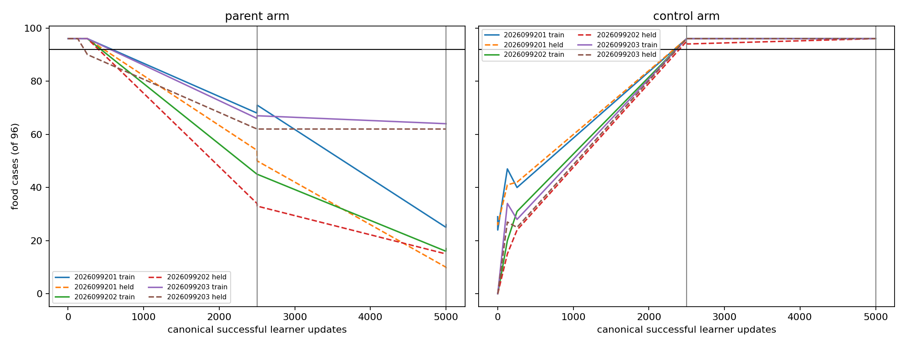
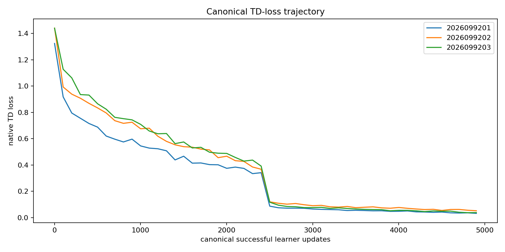
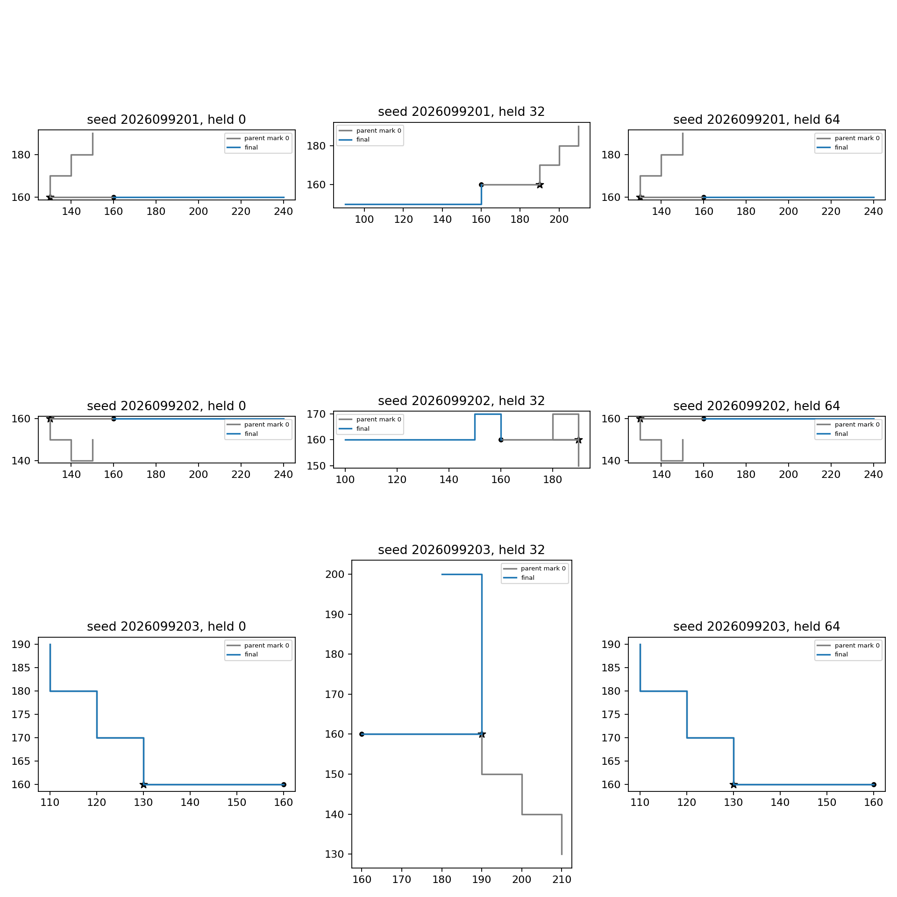

# Canonical Apex learns the small food task from scratch; imitation transfer regresses

All three freshly initialized control networks learned food collection in all 96 training and 96 adaptive held cases through native TD updates alone. The same recipe failed to retain the three imitation-trained policies. This is repeatable small-task RL behavior, with the primary warm-start retention hypothesis rejected.

Canonical Apex updates did not retain the three supervised parent policies’ native food behavior. At the fixed 5,000-update endpoint, every parent lineage failed the predeclared train-and-held retention rule despite all games surviving. The parent endpoint food totals were 26/9, 17/15, and 64/62 (train/held) for seeds 2026099201, 2026099202, and 2026099203; each required at least 92/96 food cases and 96/96 survival on both splits.

| Seed | Arm | Initial train / held food | Final train / held food | Final train / held survival | Fixed endpoint result |
| --- | --- | ---: | ---: | ---: | --- |
| 2026099201 | Parent BC512 | 96 / 96 | 26 / 9 | 96 / 96 | Fail |
| 2026099201 | Control BC0 | 29 / 27 | 96 / 96 | 96 / 96 | Descriptive |
| 2026099202 | Parent BC512 | 96 / 96 | 17 / 15 | 96 / 96 | Fail |
| 2026099202 | Control BC0 | 0 / 0 | 96 / 96 | 96 / 96 | Descriptive |
| 2026099203 | Parent BC512 | 96 / 96 | 64 / 62 | 96 / 96 | Fail |
| 2026099203 | Control BC0 | 0 / 0 | 96 / 96 | 96 / 96 | Descriptive |

The controls are useful descriptive context: all three learned 96/96 food on both adaptive splits from their weak BC0 initial behavior. They do not rescue the failed parent-retention test or establish representation, algorithm, or survival learning claims.

## What was tested

Each arm used a fresh CPU canonical `ApexLearner`, fresh Adam state, and local prioritized replay, initialized from either the authenticated supervised BC512 parent or its BC0 control. The kernel used 61→512→6, batch 256, learning rate 1e-4, gamma .99, three-step returns, target copies every 2,500 successful updates, gradient clip 10, and priority alpha .6. The replay beta schedule was explicitly overridden from .4 to 1.0 across 5,000 updates. This was a local transport experiment over the canonical learner and local PER; it was not distributed Ape-X IPC throughput evidence.

Collection used complete native H8 TRAIN sweeps, ε=.4 through the actual `AISnake` selection path, and the same ex-ante seed maps for each paired parent/control comparison. Subsequent trajectories and random draw counts necessarily diverge as policies diverge. Each arm completed exactly 5,000 native Adam updates and both target synchronizations. Adaptive held worlds supplied retention evidence; prior BC0/BC512 mark-0 gameplay was reused rather than rerun.

Final teacher agreement was measured separately from greedy gameplay:

| Seed | Arm | Train agreement | Adaptive held agreement |
| --- | --- | ---: | ---: |
| 2026099201 | Parent BC512 | 48.26% | 23.44% |
| 2026099201 | Control BC0 | 100% | 100% |
| 2026099202 | Parent BC512 | 19.10% | 21.09% |
| 2026099202 | Control BC0 | 100% | 100% |
| 2026099203 | Parent BC512 | 85.76% | 89.58% |
| 2026099203 | Control BC0 | 99.31% | 99.74% |

The third control reaches every food target despite a few teacher-action disagreements. Exact teacher agreement and task success are distinct measurements.

The initial and final fit-agreement measurements are separate from gameplay. They measure teacher-action agreement on saved data and do not supply gradient updates. The native food/survival totals in the table are the decision authority.

The initial raw Q scale was much larger for the parents (maximum Q 11.66, 14.67, and 12.44) than for controls (.272, .247, and .426). This is descriptive scale evidence, not a demonstrated cause of the retention failure.

## Execution and audit

The discarded engineering qualification took 5.220 seconds. Science took 285.833 seconds, analysis 1.680 seconds, and audit 2.299 seconds: 295.032571291 seconds of the 2,400-second budget. All 15 supervisor receipts completed with no failed receipt. The audit passed.

Each arm accepted 19,968 replay rows and sampled all 19,968 unique rows; each made 1,280,000 prioritized sample draws. Across science this produced 14,976 collection games and 119,808 collection steps, 9,216 new greedy games and 73,728 frames, 30,000 updates, 7.68 million samples, and 48 saved checkpoints. Maximum science RSS was 495,370,240 bytes; minimum available memory was 33,223,606,272 bytes.

Held teacher states had zero exact replay-input overlap. Final held-policy overlap was 1/0/19 for parents and 19/17/13 for controls. The saved data do not establish where in the episode those overlaps occur, so no post-food interpretation is claimed.

The H8 random baseline already survived every game; this study does not demonstrate learned survival. The reused placement grid is adaptive development evidence, even though no held cases were collected for replay. Checkpoints contain online/target weights, Adam and learner clocks, but no replay/RNG state, so they are not exact interrupted-run recovery artifacts.

The parent line is closed as failed at the fixed endpoint. There is no fresh-world confirmation, incumbent promotion, or long-run claim. The next proposed step is a separately frozen broader H16 evaluation of the saved control endpoints, with zero additional training.

Primary saved evidence: `snake-dqn-artifacts/ongoing-research-20260913/apex-canonical-retention/analysis/report.json` and `snake-dqn-artifacts/ongoing-research-20260913/apex-canonical-retention/audit.json`. Provenance: intent `0a09b104e2d09d0c72939de1c5160fa1b6daf00636d055ef72fb5ad85857ca2b`, audit `755952b98a4488cdcd2fca3c817cc0b5959b144f84d04d25290ebffb32ce1a98`, and closeout `6c5245d49538beffc0a023fed97cc330046c5dbdb526b90d418648d2a9fcb78e`.

Research context: [DQfD](https://arxiv.org/abs/1704.03732) combines TD updates with demonstration classification; this experiment instead tests a plain supervised-weight warm start followed by native TD only. Its failure is not a test of the full DQfD algorithm. [Ape-X](https://arxiv.org/abs/1803.00933) separates actors and learning through prioritized replay; this local kernel study does not validate that distributed execution system.
