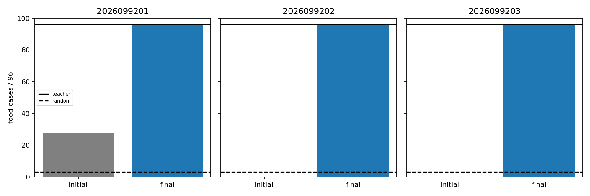
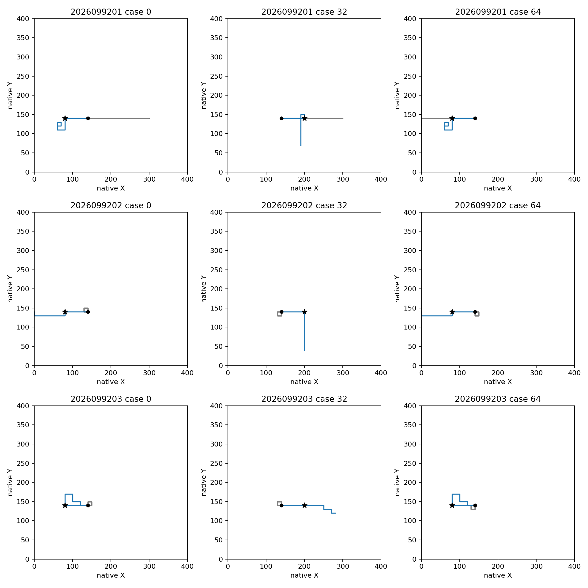

# Apex food seeking transfers to a new H16 grid

Status: **COMPLETE_AUDITED_ALL_THREE_FRESH_H16_SUCCESS**. All three fixed canonical
Apex RL endpoints collected food and survived in all 96 new cases, with no further
training. These are the from-scratch control models from the
[canonical retention study](../apex_canonical_retention_2026-09-22/README.md), each
saved after exactly 5,000 TD updates. The imitation-parent retention failures in
that study remain unchanged.

| Training seed | Untrained food | Learned food | Learned survival | Net food gain | Teacher agreement |
| --- | ---: | ---: | ---: | ---: | ---: |
| 2026099201 | 28/96 | 96/96 | 96/96 | +68 | 100% |
| 2026099202 | 0/96 | 96/96 | 96/96 | +96 | 100% |
| 2026099203 | 0/96 | 96/96 | 96/96 | +96 | 100% |

There were zero paired food losses. Each endpoint met the frozen requirements:
at least 92/96 food, exactly 96/96 survival, and a net gain of at least 24 cases
over its same-lineage untrained checkpoint. The native teacher scored 96/96 food;
safe-random play scored 3/96. Both survived all 96 cases.

## What changed from the training task

The new native task runs for 16 frames. It crosses four heads at `(140,140)`,
`(260,140)`, `(140,260)`, `(260,260)` with four cardinal headings, three relative
food bearings, and distances six/ten moves. The original training grid used
distances two/four and eight-frame episodes. The arena remains 400×400 with one
snake, initial length three, one pellet, and no replenishment. Mechanics and
rewards remain v1, using vector61 and the existing six-output network. Length
never exceeds four here, so boost remains unavailable.

The complete bank and teacher/random trajectories were materialized, qualified,
and frozen **before any candidate checkpoint was loaded**. Exact initial
float32-state plus six-bit-mask overlap was zero against 10,877 distinct prior
inputs gathered from the old teacher traces and all six retention replay sets.
This check concerns initial states; it is not a claim that every later frame has
never appeared in any earlier trajectory.

This is a fixed, adaptively designed but model-fresh placement grid shared by
three independent training initializations. It supports structured spatial and
distance transfer, not unrestricted world generalization or three independent
world-population samples. Random survival is already at ceiling, so the result
does not demonstrate learned survival.

## Behavior and fit

The 768 pre-food teacher rows are diagnostics only. Every model selected the
teacher action on every row, and actual closed-loop greedy gameplay independently
collected every target. No teacher labels, fresh observations, or rewards were
used for optimization in this screen.

These predeclared cases 0/32/64 vary relative bearing and starting heading. Gray
shows the untrained policy and blue the fixed learned endpoint. Black circles
mark starts and stars mark food. All 16 native frames are included, including
movement after food collection. Axes show native coordinates over the full arena.

The already completed
[H8 learning curves](../apex_canonical_retention_2026-09-22/figures/food-learning-curve.png)
remain the training evidence. This screen adds a new endpoint comparison; it does
not rerun training or select an intermediate checkpoint.

## Verification and limits

All six checkpoint file hashes and their lineage/mark metadata were bound before
evaluation. Saved-record checks reconcile all game files, case joins, paired
counts, thresholds, input freezes, and receipts. An independent Luna release
check confirmed those identities and the completion/resource records. All three
supervised jobs exited naturally with no source drift or failures. The two figures
were visually reviewed.

The screen used 768 new games, 12,288 native frames, and **zero training updates**.
Qualification took 1.884 seconds, evaluation 4.193, and saved analysis/audit 0.840:
6.917 guarded seconds against a 480-second budget. Peak child RSS was 389,513,216
bytes, with at least 33,377,926,168 bytes available. Two CPU threads, the 8-GiB RSS
cap, and the 9.6-GiB available-memory reserve stayed unchanged.

The next bounded question is repeated collection as the body grows. That requires
preserving all six actions once boost becomes legal and qualifying the new task
before judging these fixed models. No additional training, long run, opponents,
or promotion follows automatically. Apex remains the operational incumbent under
the existing shared tournament gate.

Artifacts: `snake-dqn-artifacts/ongoing-research-20260913/apex-fresh-h16/`.
Intent SHA `63dd71f8199d0b29a15b7c526a59f5a7bb2440546192767cd7be0a4a0f7a2a94`;
finish SHA `b559e715e952e2556576cb1dcd31a00c5fde7f2886315efda17d5c79f251f37e`;
closeout SHA `cde752c9758e1deb0869022c8624a845784b965f34135133dd8f6acc3d63f3c8`.
