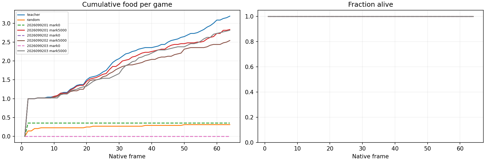
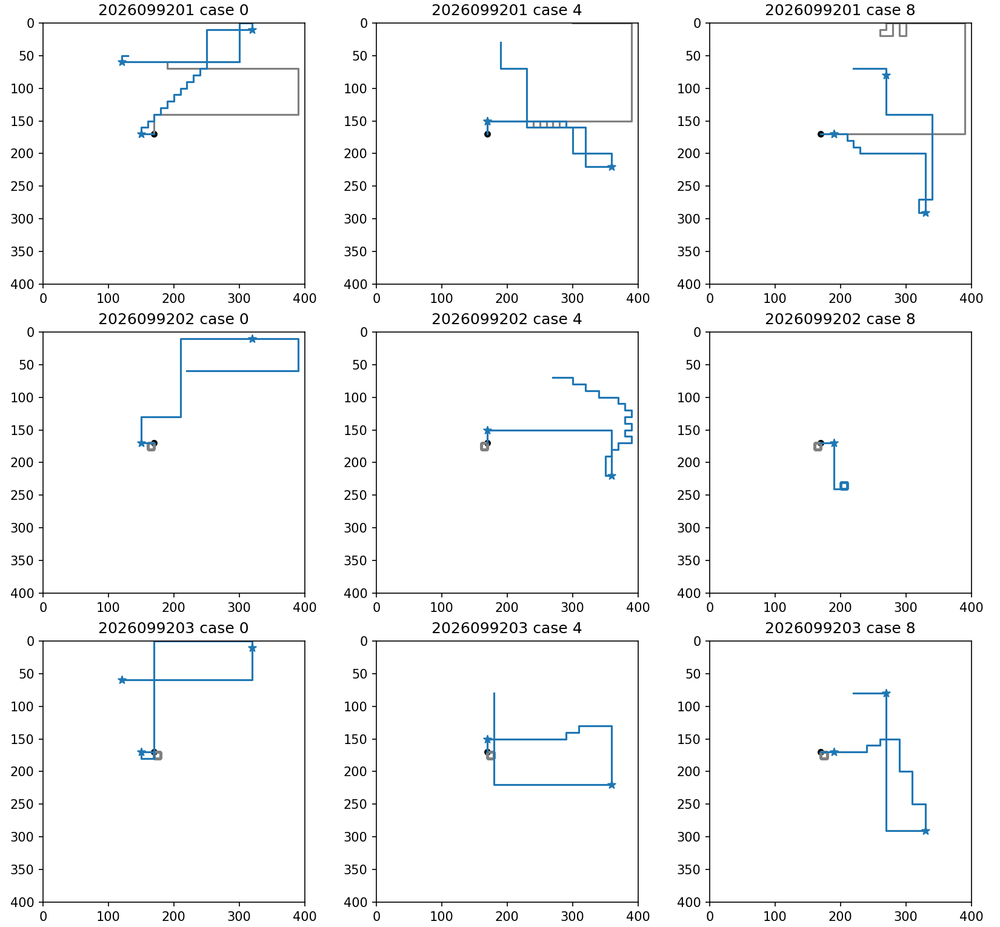

# H64 growth screen: two of three canonical endpoints meet the full package

The fixed H64 growth screen produced substantial food gains for all three saved
canonical control endpoints, but its frozen all-three criterion failed. Seeds
2026099201 and 2026099203 met the full package; seed 2026099202 reached every
first food and survived every case but recorded 42 joint two-food-and-boost-
exposure cases, below the required 44. The sealed result is therefore
**COMPLETE_AUDITED_TWO_OF_THREE_H64_SUCCESS**, not an all-seed success and not a
license for more training.

The screen loaded existing mark-0 and mark-5000 checkpoints only. It performed
**zero new training updates**. The result adds a fixed native growth evaluation
of saved endpoints; it does not revise the earlier H8 learning evidence, the
successful fresh H16 screen, or the failed supervised-parent retention result.

| Seed | Initial food | Final food | First food | Survival | Joint two-food + boost exposure | Paired wins / losses | Full frozen package |
| --- | ---: | ---: | ---: | ---: | ---: | ---: | --- |
| 2026099201 | 17 | 136 | 48/48 | 48/48 | 45/48 | 47 / 0 | Pass |
| 2026099202 | 0 | 122 | 48/48 | 48/48 | 42/48 | 48 / 0 | **Fail** |
| 2026099203 | 0 | 135 | 48/48 | 48/48 | 47/48 | 48 / 0 | Pass |

Each final endpoint cleared the food and survival portions of the package: all
collected at least one food in 48/48 cases, survived 48/48 cases, and improved
the paired food count by at least 24 cases. The all-three decision remains false
because seed 2026099202 missed the independently required joint-event threshold.

## What the screen measured

This was a 400×400, one-snake native `GameState` task using v1 mechanics,
v1 rewards, vector61 observations, and the six-output Apex action contract.
Episodes had a fixed H64 horizon. Snakes began at logical length three; the
native `FoodManager` replenished one ambient pellet after consumption, so food
collection could grow the body into boost eligibility. The policy still chose
through the native `AISnake` callback and its six-action safe mask. No scripted
food itinerary replaced native replenishment.

The shared bank contains 48 cases: four cardinal headings, three relative food
bearings, and four interior placements. Food began two moves away. It is one
fresh shared bank across the three endpoint lineages, not three independent
world-population samples. The predeclared H32 summaries are descriptive only;
the full H64 endpoint is the decision authority.

The frozen gate required, per seed, 48/48 survival, 48/48 cases with at least
one food, at least 44/48 joint cases, aggregate food at least 75% of the native
teacher total, and paired food-count wins minus losses of at least 24 versus the
matching initialization. A joint case requires two ambient foods and a later
pre-action state with logical length at least five, `state[57] == 1`, and a safe
boost action. Selecting boost was recorded but was not itself a gate condition.

## Qualification and anchors

Qualification ran before any endpoint checkpoint was loaded. It used the same
48-case bank and the production native callback path. The safe-normal teacher
collected 153 foods, reached the joint condition in 48/48 cases, and survived
48/48. The private-RNG safe-six-action random baseline collected 15 foods,
reached the joint condition in 0/48, and survived 48/48. The random-survival
ceiling means this experiment does **not** establish learned survival.

Three one-frame forced probes started at logical length five and made native
actions 3, 4, and 5. They verified the boosted action mapping and the true
two-cell movement path. Per-frame records preserve the native state and mask,
chosen action, reward, termination, pre/post lengths, food, boost counter,
food events, and movement positions. Terminal v1 corpse drops were retained as
native behavior; the one-pellet cap applies to live pre/post action worlds.

Freshness admission found zero exact initial `(float32 state, six-bit mask)`
overlaps against 11,361 saved prior inputs. This is an initial-state support
check. It does not claim later states or policy-conditioned food sequences are
unseen. Global Python food spawning was seeded per case after `GameState`
construction; random-controller choices used a separate private RNG. Once a
policy moves differently, occupied-cell rejection makes later native food
locations policy-conditioned even with common initial seeds.

## Descriptive boost telemetry

Boost execution was present and recorded, but these quantities do not establish
that boost caused the endpoint food gains.

| Seed | Final boost frames | Native boost burns | Safe-boost exposure frames |
| --- | ---: | ---: | ---: |
| 2026099201 | 41 | 9 | 1,714 |
| 2026099202 | 6 | 0 | 1,698 |
| 2026099203 | 62 | 16 | 1,562 |

The comparison remains behavioral. It does not identify a causal value for
boosting, a representation explanation, or an algorithmic improvement.

The representative paths use the predeclared cases 0, 4, and 8. Gray traces
are the matching mark-0 policies and blue traces are the mark-5000 endpoints;
black circles identify starts and colored stars mark consumed pellets. The plots retain all native frames,
including post-food movement, and were copied byte-for-byte from the audited
analysis output.

## Relationship to earlier evidence

The earlier [canonical H8 study](../apex_canonical_retention_2026-09-22/README.md)
showed all three from-scratch control endpoints learning its small native food
task, while the supervised-parent retention line failed its fixed retention
gate. The [fresh H16 screen](../apex_fresh_h16_2026-09-22/README.md) then showed
these same saved control endpoints collecting one fixed food and surviving in
all 96 new cases. This H64 screen is a different growth question: repeated
native food collection after boost becomes available.

The H8 learning curve is reused context, not new H64 training evidence:

The two-of-three H64 result does not override the parent-retention failure or
promote an endpoint. It also does not justify a longer run, more TD updates,
opponents, or a change to the operational Apex incumbent. The sealed next step
is a saved-record failure census before any separately designed distribution
intervention.

## Execution, audit, and provenance

The study was frozen with a 480-second qualification/evaluation/finish budget,
two CPU threads, an 8-GiB RSS guard, a 24-GiB MPS cap, and a 9.6-GiB
available-memory reserve.
All three guarded jobs exited naturally and wrote real supervisor receipts. The
combined guarded time was 12.348 seconds; peak child RSS was 0.383 GiB
and minimum available memory was 31.19 GiB. The audit passed,
the plots were visually reviewed, and the saved reports account for 387 new
games and 24,579 native frames.

Primary saved artifacts are under
`snake-dqn-artifacts/ongoing-research-20260913/apex-growth-h64/`:

- intent: `088a851cab6f0ee5de850cadd50310268fa444ea4482dd3b5c51233f049dd0d6`
- qualification: `4f5fd4c9bdee3ea48bf500c58e8fdd58ac4a9d35a9462384bced1f31d7a31b66`
- evaluation: `6053449582bca48041cdc3cbf3667a48d5203b1dd47883cff5ddb9f044694eb0`
- finish report: `420e2308054ca59a1866b9c542e593f68cfc1c297fbd266697854211f59805fc`
- closeout: `6b9fe271adb84f6a03f9a4e2d23c15859175c51ebaa85a0f85fce1dd1a98b13e`

The frozen source baseline was `c525fbf405fea41d1d4a4c1ac001e55f6e5f00d0`.
