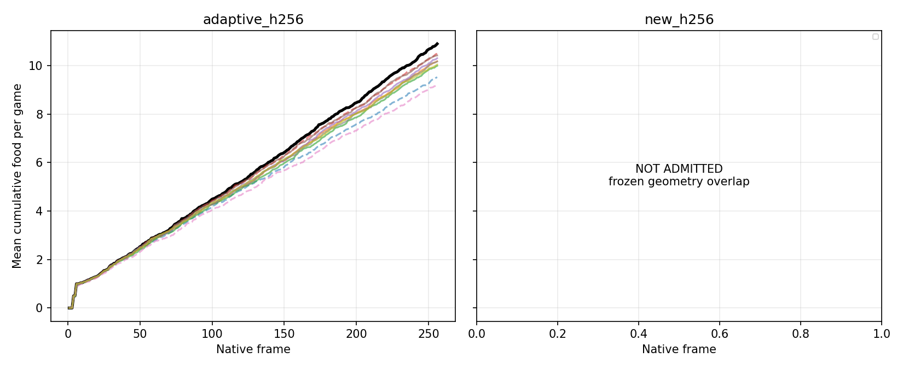
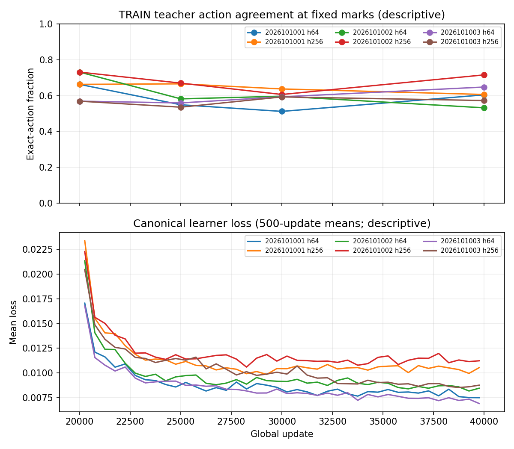
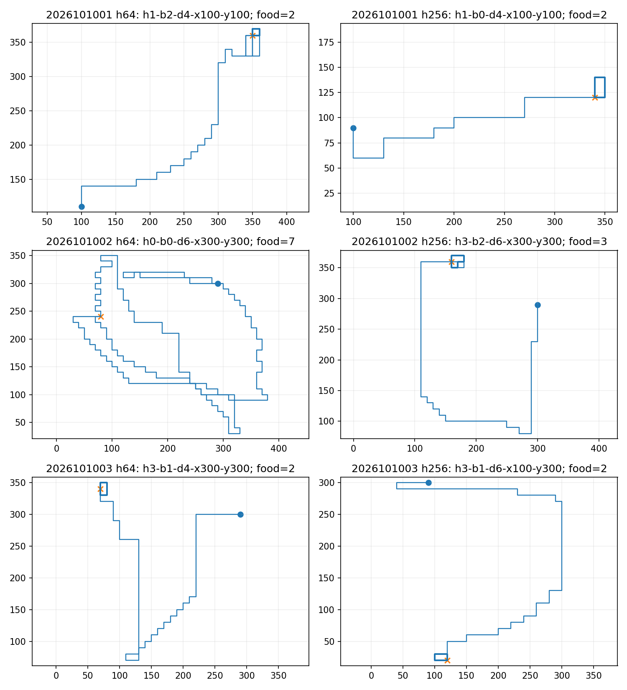

# Apex collection-horizon continuation

**Audited outcome: `INVALID_STOP` for the full question.** The new H256 held bank overlapped
an older H16 bank in 48 raw initial geometries. Qualification stopped before any held games,
model queries, or checkpoint loads. The frozen cases were neither filtered nor replaced, so the
fresh-world comparison, fresh parent games, and H256-versus-H64 collection-gain gate were not
admitted. Six continuation arms had already completed, and their once-only evaluations on the
seven existing adaptive and retention banks remain valid descriptive evidence. On the existing
H256 adaptive bank, **neither arm met the required 96/96 survival in any seed**. More native
food was collected in some seed comparisons, but sustained food-seeking improvement was not
reliable under the fixed all-seed package. No checkpoint was promoted.

The immutable [closeout](/Users/josenunez/Projects/ml/snake-dqn-artifacts/ongoing-research-20260913/apex-horizon-collection-continuation/closeout.json)
(SHA-256 `0a330d340773c976c4a68fae0a44e8ec0802caacb6cfc7634a3c9803c203e4f1`),
frozen [intent](/Users/josenunez/Projects/ml/snake-dqn-artifacts/ongoing-research-20260913/apex-horizon-collection-continuation/intent.json),
[saved analysis](/Users/josenunez/Projects/ml/snake-dqn-artifacts/ongoing-research-20260913/apex-horizon-collection-continuation/analysis/report.json),
and [independent audit](/Users/josenunez/Projects/ml/snake-dqn-artifacts/ongoing-research-20260913/apex-horizon-collection-continuation/audit/report.json)
are the source records. The audit passed while retaining the `INVALID_STOP` branch and the
original child failure. The [normalized held FAIL report](/Users/josenunez/Projects/ml/snake-dqn-artifacts/ongoing-research-20260913/apex-horizon-collection-continuation/qualification/held-v2/report.json)
authenticates that failure; it is not a second qualification. The full per-seed, per-bank result
is copied byte-for-byte in [table.md](table.md). `None` in the short-bank joint column means
that metric was not recorded and was not part of the short-task gate.

## Question and fixed protocol

The study asked whether one **fixed additional continuation package** improves sustained native
food seeking, and whether collecting that package to H256 beats matched H64 collection. The
three sources were the `w512_n96` final-20,000 checkpoints from the completed width/breadth
screen, seeds `2026101001`, `2026101002`, and `2026101003`. They were selected after that screen
for simplicity and cost, not designated beforehand as follow-up references and not chosen as
performance winners. The [scaling report](../apex_scaling_width_breadth_2026-09-23/README.md)
records their origin. The prior [H256 reference screen](../apex_reference_h256_2026-09-23/README.md)
supplied the existing adaptive H256 bank and saved parent games; neither was rerun.

Each source's complete online network, target network, Adam state, and 20,000-update clocks was
authenticated and restored artifact-locally. The legacy checkpoints had no continuation-recipe
metadata or old replay state. This was **not** an uninterrupted replay/RNG resume, a weights-only
warm start, or an experiment isolating additional updates. Both arms used a fresh PER buffer with
constant `beta_start=beta_end=1`, preserving the parents' terminal annealed beta rather than
resetting it to 0.4. The canonical vector61 learner, width 512, ε=0.4, n-step 3, batch 256,
target-copy schedule, and optimizer recipe were held fixed.

For each seed and arm, the continuation accepted exactly 79,872 new native rows in 104 chunks
and completed 20,000 additional successful updates, ending at global update 40,000. The six
arms totalled **479,232 accepted rows, 120,000 updates, and 30.72 million replay draws**.
The H64 and H256 arms used the original narrow TRAIN96 geometries derived from the qualified
TRAIN384 bank with seed-specific metadata, plus the same ex-ante root/occurrence schedules.
Native exploration and future food used shared Python RNG, so policy-dependent consumption can
diverge after matched starts. Only these newly collected TRAIN96 rows entered optimization;
teacher probes, evaluation games, and the rejected held descriptors did not. Death was terminal;
live horizon or chunk-quota truncation retained the live successor for bootstrap. The only
gameplay decision endpoint was 40,000; 25,000/30,000
marks and TRAIN teacher-action agreement were diagnostics, never a best-checkpoint search.

The finite guarded plan capped the study at 6,360 seconds, with per-stage caps, serialized
jobs, CPU thread and memory guards, and a separate 120-second handoff allowance. Original
TRAIN96 teacher qualification passed at H256: 96/96 first food, joint success, and survival;
1,022 total food against its 768 floor. Runtime qualification used discarded collection and
updates; it did not enter scientific optimization. All six scientific training deliveries
passed. The independent audit checked the 479,232 rows, 120,000 updates, 30.72 million draws,
and the 3,456 new adaptive evaluation games comprising 238,769 native frames and online
forwards. Scientific collection recorded 4,680 games and 479,232 frames; training recorded
648,359 network forward invocations including target and probe work. The 18 supervised child
receipts ended naturally: 17 successful and one preserved original held-qualification failure.
Guarded elapsed time was 1,131.64 seconds, peak child RSS 1,466,466,304 bytes, and minimum
available memory 29,715,775,488 bytes. Two supervisor process-exit monitoring races were
resolved from confirmed code-0 exits without repeating the completed teacher or training work.
The window is closed.

## Existing-bank results

The existing adaptive H256 teacher had 1,046 total food, 754 food in frames 65–256, and
96/96 first-food, joint, and survival success. The previously saved source parents had food
totals **914 / 1,007 / 882**, suffix totals **634 / 719 / 614**, and survival **92 / 95 / 95**.
The candidate results below are ordered by the same three seeds. All six candidate cells had
96/96 first-food and joint success, but none had the required 96/96 survival.

| Collection arm | Total food | Frames 65–256 food | Survival |
|:---|:---|:---|:---|
| H64 | 977 / 989 / 976 | 694 / 700 / 688 | 94 / 95 / 94 |
| H256 | 959 / 1,000 / 964 | 675 / 711 / 673 | 92 / 93 / 93 |

The complete H256-bank gate also required at least 90% of teacher total and suffix food,
96 first-food and survival cases, joint success ≥92, and nondecrease against the immediate
source. Relative gain needed at least 24 total and 18 suffix food per seed, with no first,
joint, or survival regression and pooled paired food wins exceeding losses. H256 collection
additionally had to clear those margins against **both** source and H64 on both H256 banks.
The unqualified fresh H256 bank leaves these full-package and relative-gain atoms unknown;
the observed existing-bank survival failures already prevent any all-seed absolute pass.

On the available adaptive bank, total/suffix food changes versus source were
**+63/+60, −18/−19, +94/+74** for H64 and **+45/+41, −7/−8, +82/+59** for H256.
H256 minus H64 was **−18/−19, +11/+11, −12/−15**. None of these comparisons clears
the +24 total/+18 suffix margins across all three seeds even on this one bank.

All six endpoints met food and survival 96/96 on each of the three short H8/H16 banks. The
scaling H64 and two older 48-case H64 banks were harder retention checks: only the H256 arm of
seed `2026101002` passed their combined compatibility package. A passing short-bank or old-bank
cell cannot override the H256 failures. Random survival on the previous H256 screen was already
96/96, so candidate survival is not evidence of learned survival. These banks also differ in
geometry and horizon; the observed comparison is not an isolated causal test of horizon alone.

## Frozen held-bank stop and interpretation

Only after the six final endpoints and marks were sealed did the fixed generator materialize the
new 96-case H256 held descriptors. The first observed novelty failure was against `h16_held`:
**48 matching raw initial tuples and zero matching root IDs**. The original child exited on
that check, before `native_context`, any held teacher/random games, or model inference. The
preserved [original failure](/Users/josenunez/Projects/ml/snake-dqn-artifacts/ongoing-research-20260913/apex-horizon-collection-continuation/qualification/held/failure.json),
[child receipt](/Users/josenunez/Projects/ml/snake-dqn-artifacts/ongoing-research-20260913/apex-horizon-collection-continuation/supervisor-runs/qualification-held/receipt.json),
and [case file](/Users/josenunez/Projects/ml/snake-dqn-artifacts/ongoing-research-20260913/apex-horizon-collection-continuation/qualification/held/cases.json)
were bound into a versioned metadata-only FAIL normalization. It records the observed overlap
without claiming that all eight exclusion checks finished. The fresh bank was not used for
optimization or confirmation, and no cases were resampled, removed, or relabeled.

The resulting `INVALID_STOP` is an admission failure, **not** a completed negative result on
fresh H256 worlds. Existing-bank evaluation of each final endpoint was retained exactly once;
fresh source and endpoint games were not run. The audit's `PASS` means the saved outputs and
branch accounting are internally consistent, not that the scientific package passed. Exact
state-and-mask overlap on the proposed fresh held games is likewise `NOT_ADMITTED`, not zero.
There is no automatic dose, horizon, beta, epsilon, replay, opponent, or promotion follow-up.
This three-lineage screen does not prove that capacity never matters or establish a general
population effect.

Apex remains the operational incumbent. Only the shared strict tournament gate can promote
a replacement; the incumbent's larger historical training dose does not establish superiority.

## Saved figures

The following are byte-identical copies of the saved analysis figures. The learning curves and
teacher-action agreement are descriptive training-path measurements. Representative paths are
deterministic illustrations, not a population sample.

The food-accrual figure's existing-bank panel has no visible embedded legend. Its lines are:
teacher **black**; seed `1001` parent **dashed blue**, H64 **solid orange**, H256 **solid green**;
seed `1002` parent **dashed red**, H64 **solid purple**, H256 **solid brown**; seed `1003` parent
**dashed pink**, H64 **solid gray**, H256 **solid olive**. The right panel is explicitly
`NOT_ADMITTED` because fresh held qualification failed; no fresh curves are implied.

