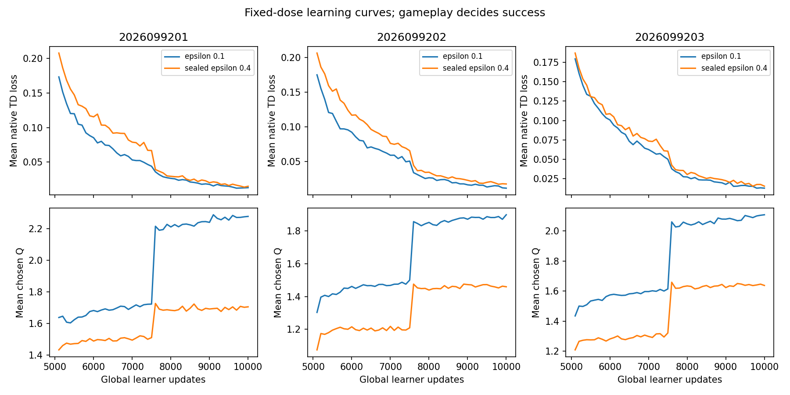
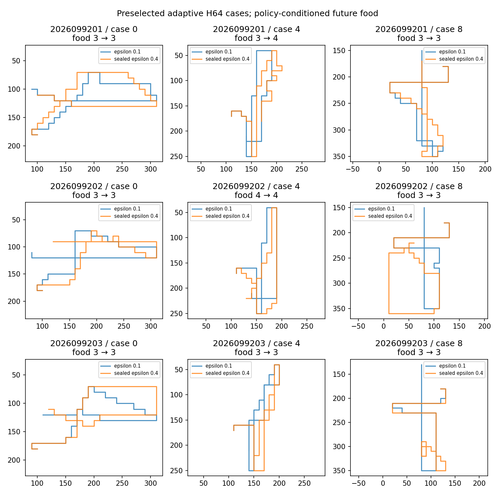

# Apex lower-exploration continuation — 2026-09-22

The sealed decision is **`EPSILON01_REJECTED`**. Collecting native H64 Apex
experience at epsilon 0.1 delivered H64 food and joint-event gains on all three
lineages, but the fixed mark-10,000 policies failed two prospective retention
requirements. Seed `2026099201` collected food in only **93/96** previously
fresh, now adaptive H16 cases, below the required **96/96**. Seed `2026099203` collected
**149** foods on the previously fresh H64 bank, below its saved epsilon-0.4
control's **150**. Both survived every case in those banks. The favorable H64
gains cannot override either failure.

This one-point sensitivity screen followed the
[second-food continuation](../apex_second_food_continuation_2026-09-22/README.md).
It reused that study's completed epsilon-0.4 H64 control and the canonical
mark-5,000 source policies; those comparators were not retrained or reevaluated.
The [sealed closeout](/Users/josenunez/Projects/ml/snake-dqn-artifacts/ongoing-research-20260913/apex-low-exploration-continuation/closeout.json)
and [independent audit](/Users/josenunez/Projects/ml/snake-dqn-artifacts/ongoing-research-20260913/apex-low-exploration-continuation/audit/report.json)
are the decision authorities. The copied [compact result table](table.md) and
figures below are the completed analysis artifacts.

## Question and fixed protocol

The question was whether lowering **native collection epsilon from 0.4 to
0.1**, at the same H64 row and update dose, would improve reliable greedy food
seeking while retaining the source and epsilon-0.4 control's demonstrated
behavior. Three lineages (`2026099201`, `2026099202`, `2026099203`) each started
from their exact canonical source mark 5,000: online network, target network,
full Adam state at age 5,000, and both learner clocks. Each new arm used fresh
PER and the same predeclared replay, Torch, root-order, and episode-seed maps as
its saved control. This was a new continuation from a saved learner state, not
an interrupted-run replay or RNG resume.

Each lineage collected **19,968** H64 native decisions in 26 chunks of 768:
14 warm chunks (10,752 rows), then 12 refresh chunks during **5,000** additional
successful canonical Apex updates. The global marks were 5,000, 7,500, and
10,000; target copies occurred at 7,500 and 10,000. Only the **fixed final
mark 10,000** decided behavior. Mark 7,500 and the TRAIN teacher-agreement and
TD/Q curves are descriptive. The adapter retained the six-action selection
mask, native death/truncation and n-step handling, and the prior episode-seed
formula. It asserted the actual epsilon was 0.1 on every collected frame.

The seed maps are shared prospectively, but epsilon changes actions, food
encounters, and subsequent draws from the shared Python action/food RNG. This
tests a policy-conditioned collection package, not a fixed-transition causal
effect or the distributed Ape-X actor mixture.

## Final gameplay at mark 10,000

The H8 TRAIN and previously held banks each have 96 cases; H16 has 96
previously fresh, now adaptive cases. Entries below are **food cases / survived cases**.
The frozen short-bank rule required both to be 96/96 for every seed and bank.

| Seed | H8 TRAIN | H8 previously held | H16 previously adaptive | Short-bank retention |
| --- | ---: | ---: | ---: | --- |
| 2026099201 | 96 / 96 | 96 / 96 | **93 / 96** | **Fail** |
| 2026099202 | 96 / 96 | 96 / 96 | 96 / 96 | Pass |
| 2026099203 | 96 / 96 | 96 / 96 | 96 / 96 | Pass |

Both H64 banks contain 48 cases per seed. In the next two tables, entries are
**total foods / joint cases / survived cases**. A joint case meets the saved
two-food and boost-exposure objective. Source is mark 5,000; control is the
previously completed H64 epsilon-0.4 continuation at mark 10,000; candidate is
this epsilon-0.1 continuation at mark 10,000.

| Seed | Known adaptive H64 source | Epsilon-0.4 control | Epsilon-0.1 candidate |
| --- | ---: | ---: | ---: |
| 2026099201 | 136 / 45 / 48 | 139 / 48 / 48 | **147 / 48 / 48** |
| 2026099202 | 122 / 42 / 48 | 143 / 48 / 48 | **152 / 48 / 48** |
| 2026099203 | 135 / 47 / 48 | 140 / 46 / 48 | **149 / 48 / 48** |

| Seed | Previously fresh H64 source | Epsilon-0.4 control | Epsilon-0.1 candidate |
| --- | ---: | ---: | ---: |
| 2026099201 | 141 / 45 / 48 | 143 / 48 / 48 | **152 / 48 / 48** |
| 2026099202 | 131 / 44 / 48 | 144 / 47 / 48 | **154 / 48 / 48** |
| 2026099203 | 139 / 46 / 48 | **150 / 47 / 48** | **149 / 48 / 48** |

All candidates reached 48/48 joint and 48/48 survival on both H64 banks. The
seed-9203 previously fresh food total nevertheless failed the rule to retain
at least the matching control total. The rule also required the original
absolute H64 floors (joint at least 44 and food at least 75% of the saved
teacher total); none was relaxed.

The strict non-ceiling joint-gain and pooled paired-gain screens passed on
both H64 banks. Across the 144 seed/case pairs in the known bank, candidate
food wins/losses were **53/8** against source and **29/5** against control;
joint wins/losses were **10/0** and **2/0**. On the previously fresh bank,
food wins/losses were **44/9** against source and **26/8** against control;
joint wins/losses were **9/0** and **2/0**. Ties were excluded from wins. These
are paired outcomes on adaptive, reused cases, not independent new
replications.

Final TRAIN teacher agreement was **96.53%, 100%, and 100%** across the three
seeds (288 TRAIN labels each). It is a fit diagnostic, not a behavioral gate;
the corresponding mark-7,500 values and native TD/Q telemetry cannot rescue
the two retention failures.

## Completed figures

The figures and table in this directory are byte copies of the sealed
analysis. The learning curves include the descriptive midpoint; final greedy
gameplay above determines the decision.





Representative paths illustrate selected saved cases. They do not establish
arbitrary-world competence or learned survival.

## Delivery, accounting, and limits

Qualification passed by reproducing **64 + 64** epsilon-0.4 native frames with
the source and adapted collectors, then asserting actual epsilon 0.1 over
**10,752** discarded warm frames and taking **one discarded** canonical update.
That is **10,880** physical qualification frames and zero scientific updates.
The completed restorer, n-step, and target arithmetic qualifications were
reused. Scientific collection then accepted **59,904** rows across **936**
games, with 19,968 unique replay slots and 1,280,000 PER draws per seed:
**3,840,000** draws in total. Post-first replacement-present rows were
18,860, 18,858, and 18,864 for seeds 9201–9203, respectively, above the
predeclared delivery minimum. The three arms made **15,000** new learner
updates. Final greedy evaluation added **1,152** games and **27,648** frames
across the five reused banks. No new fresh confirmation worlds were generated
or evaluated.

The short H8 banks were already easy, and survival was at ceiling for the
source and control on the relevant H64 comparisons. Perfect candidate
survival there supplies **no evidence of learned survival**. The H64 banks
were adaptive, including the one previously called fresh, so these results do
not support a fresh-world generalization claim. The saved source/control
evaluations are historical comparators, and no new opponent or tournament
promotion gate was run. Apex remains the incumbent; no candidate was
promoted. The failed retention rule ends this epsilon line without an epsilon
sweep, added dose, midpoint selection, or long run.

All nine guarded jobs exited naturally; no recovery was used. Their receipts
charge **180.2616 seconds** total, with peak child RSS **585,728,000 bytes**
and minimum available memory **30,639,915,008 bytes**. The study window is
closed, and no numerical job remains active. The serial controller entry point
was:

```bash
/Users/josenunez/Projects/ml/snake-dqn/venv/bin/python /Users/josenunez/Projects/ml/snake-dqn-artifacts/ongoing-research-20260913/apex-low-exploration-continuation/run.py
```

The saved controller dispatched each child through `supervise.py` on CPU with
two CPU threads, an 8 GiB child RSS ceiling, a 24 GiB MPS-driver ceiling, and
a 9.6 GiB available-memory reserve. The compute budget was 1,500 guarded seconds. Before admitting each stage,
the controller required its full cap, all remaining required stages, and a
separate 120-second handoff reserve to fit the frozen deadline. The study used
180.2616 guarded seconds in total.

## Provenance

- [Frozen intent](/Users/josenunez/Projects/ml/snake-dqn-artifacts/ongoing-research-20260913/apex-low-exploration-continuation/intent.json): SHA-256 `2c20be79cc66d81448c7a62674ca12b33c2f1c3d32e859c2204e312db91224f2`.
- [Input freeze](/Users/josenunez/Projects/ml/snake-dqn-artifacts/ongoing-research-20260913/apex-low-exploration-continuation/input-freeze.json): SHA-256 `964b92767e11e09541bde71b699347e74b1dcee8b4efa1937164581607626a84`.
- [Completed analysis](/Users/josenunez/Projects/ml/snake-dqn-artifacts/ongoing-research-20260913/apex-low-exploration-continuation/analysis/report.json): `COMPLETE`, SHA-256 `eb33421bff9c1aa3cb0e96d5a454747cbc3e93e7a1de6085ae17ba826836a911`.
- [Independent audit](/Users/josenunez/Projects/ml/snake-dqn-artifacts/ongoing-research-20260913/apex-low-exploration-continuation/audit/report.json): `PASS`, SHA-256 `00264b689ffb1e571413344618083ba1a72f94a9de1d7e9642d7456c449fbaaa`.
- [Sealed closeout](/Users/josenunez/Projects/ml/snake-dqn-artifacts/ongoing-research-20260913/apex-low-exploration-continuation/closeout.json): `COMPLETE_AUDITED_H64_GAIN_RETENTION_FAILED`; decision `EPSILON01_REJECTED`; SHA-256 `dd8ca87075175aa36fd493bbf3d6f44a1d5449d8ca551566a63075816daf31ca`.

The copied assets retain their source SHA-256 values: `learning-curves.png`
`d46dae7686192ba28dbcb001872a8d0b04b278f64078252028ab4e1b5c686b5b`,
`representative-paths.png`
`2e37dd3adeea449689e812eccec3466c486481e422ea6a3d76e72b86c5b042e0`,
and `table.md` `0734dcf62db350ffaa098ef258f04d0ae634c3968f4e909db3dc6c014b5e0853`.
