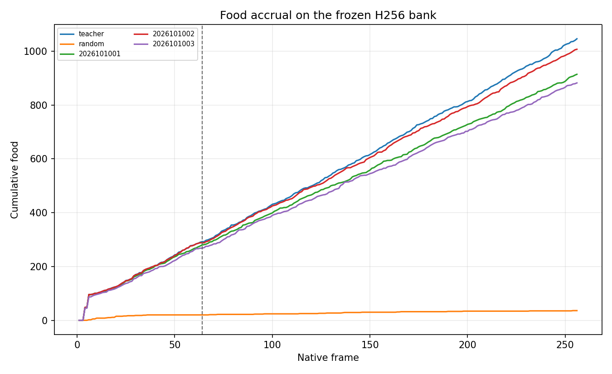
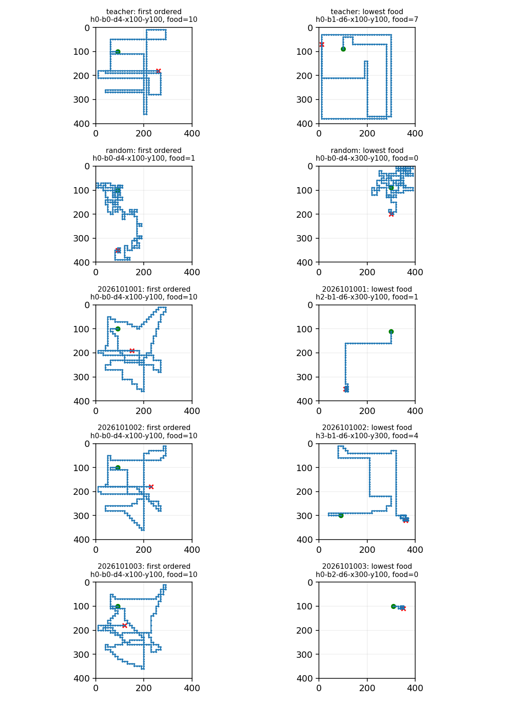

# Apex reference H256 screen

**Complete and audited: `REFERENCE_H256_LIMIT_OBSERVED`.** The three frozen `w512_n96` checkpoints retained substantial native solo food collection through 256 frames, but none passed every predeclared per-seed gate. The combined independent audit passed after preserving two checker failures and completing only the unfinished checks. There is no model selection or promotion.

The [frozen intent](/Users/josenunez/Projects/ml/snake-dqn-artifacts/ongoing-research-20260913/apex-reference-h256-screen/window-v2/intent.json), [qualification report](/Users/josenunez/Projects/ml/snake-dqn-artifacts/ongoing-research-20260913/apex-reference-h256-screen/window-v2/qualification/report.json), and [saved analysis](/Users/josenunez/Projects/ml/snake-dqn-artifacts/ongoing-research-20260913/apex-reference-h256-screen/window-v2/analysis/report.json) are the source records. The [per-case table](table.md) is copied byte for byte from that analysis. The [original audit child log](/Users/josenunez/Projects/ml/snake-dqn-artifacts/ongoing-research-20260913/apex-reference-h256-screen/window-v2/supervisor-runs/audit/child.log) records the preserved checker stop. The [tail audit](/Users/josenunez/Projects/ml/snake-dqn-artifacts/ongoing-research-20260913/apex-reference-h256-screen/window-v2/audit-tail-v4/report.json) and [root closeout](/Users/josenunez/Projects/ml/snake-dqn-artifacts/ongoing-research-20260913/apex-reference-h256-screen/window-v2/closeout.json) seal the completed result.

## Question and bank

This screen asks whether the smallest-width, narrowest-root Apex condition sustains food collection for 256 native solo frames. It uses only the three saved `w512_n96` mark-20,000 checkpoints. This reference was chosen *after* the width/breadth study for simplicity and compute cost; it was one of that study's prespecified arms, but it was not a previously designated follow-up reference or a performance-selected winner. No additional training occurred.

The new 96-case bank crosses four head placements, four headings, three relative food bearings, and initial food distances of four or six native steps. It uses the 400×400 native `GameState`, vector61, mechanics and rewards v1, one ambient food item, and all six native actions and resolved masks. Its root IDs and initial head/heading/food tuples had zero overlap against the bound scaling TRAIN384/HOLD96 banks and five bound old-bank identities. This is a scoped initial-identity check, not an all-history novelty claim. The [materialized cases](/Users/josenunez/Projects/ml/snake-dqn-artifacts/ongoing-research-20260913/apex-reference-h256-screen/window-v2/qualification/cases.json) retain the frozen case seeds. Food replacement uses the native Python RNG; controller trajectories can consume it differently, so later food locations are not claimed to match across controllers.

Each H64 prefix below comes from the **first 64 saved frames of the same H256 game**. No separate H64 games were run. First food means at least one native food event by frame 256. Joint success means at least two native food events followed by a strictly later recorded frame with pre-action cumulative food at least two and a native resolved mask enabling some boost action. Taking boost is not required. The same predicate applies to teacher, random, and candidate play.

## Saved outcomes

Teacher and random qualification completed before any checkpoint load. Teacher reached first food, joint success, and survival in all 96 cases, with 1,046 food events. Random play recorded 36 food, joint success in 4 cases, and survival in all 96. Random survival was already at ceiling, so survival by itself is not evidence that a checkpoint learned survival.

The candidate gate required, **in each seed**, first food and survival in all 96 cases, joint success in at least 92, total food at least 942 (`ceil(0.9 × 1046)`), and food during frames 65–256 at least 679 (`ceil(0.9 × 754)`). All three seeds had to pass.

| Controller | H256 food | Food 65–256 | First food | Joint | Survival | H64-prefix food | Gate |
|---|---:|---:|---:|---:|---:|---:|---|
| Teacher | 1,046 | 754 | 96/96 | 96/96 | 96/96 | 292 | Qualification pass |
| Random | 36 | 16 | 32/96 | 4/96 | 96/96 | 20 | Qualification pass |
| Seed 2026101001 | 914 | 634 | 96/96 | 95/96 | 92/96 | 280 | Fail: food, suffix food, survival |
| Seed 2026101002 | 1,007 | 719 | 96/96 | 96/96 | 95/96 | 288 | Fail: survival |
| Seed 2026101003 | 882 | 614 | 93/96 | 90/96 | 95/96 | 268 | Fail: first food, joint, food, suffix food, survival |

The H64-prefix survival count was 96/96 for every controller and seed. The candidate H64-prefix joint counts were 95, 96, and 90 in seed order; these are descriptive and do not replace earlier H64 retention gates. The fixed 20,000-update dose and longer gameplay horizon do not isolate the value of more training. This new bank also changes starting geometry, so the comparison with older banks does not isolate the causal effect of horizon alone. Earlier historical compatibility failures remain unresolved.

The analysis records every case, paired food differences against the teacher, food-accrual curves, and deterministic first-ordered and lowest-food gameplay paths. Exact float32 state-plus-mask overlap is reported separately against each of the three bound training replays; it was descriptive and did not filter held play or affect decisions. See the [saved analysis JSON](/Users/josenunez/Projects/ml/snake-dqn-artifacts/ongoing-research-20260913/apex-reference-h256-screen/window-v2/analysis/report.json) for those counts and the individual [seed reports](/Users/josenunez/Projects/ml/snake-dqn-artifacts/ongoing-research-20260913/apex-reference-h256-screen/window-v2/results/2026101001/report.json), [second seed report](/Users/josenunez/Projects/ml/snake-dqn-artifacts/ongoing-research-20260913/apex-reference-h256-screen/window-v2/results/2026101002/report.json), and [third seed report](/Users/josenunez/Projects/ml/snake-dqn-artifacts/ongoing-research-20260913/apex-reference-h256-screen/window-v2/results/2026101003/report.json).

## Audit and decision boundary

An earlier freeze window expired before numerical admission. A reviewed renewal kept the same scientific design and code and set a new finite window. The renewed window completed one teacher/random qualification, three checkpoint evaluations, and one saved-JSON analysis.

The first independent audit stopped because it incorrectly applied the one-item ambient-food cap to a terminal post-state. Native v1 death can add corpse food; the existing qualified validator already exempted terminal post-states from that ambient cap. The recovery kept all scientific criteria unchanged. Its first attempt stopped during identity authentication because a copied SHA literal omitted one character; the saved log still matched its frozen hash. Both failed receipts and the erroneous static review were preserved. The final tail authenticated the original evidence and resumed at the unfinished frame-241 post-state check. The completed prefix was inferred from pinned source and traceback, with no durable intermediate audit state; aggregate inputs were reconstructed without repeating completed assertions. Qualification, gameplay, model queries, and analysis were not repeated.

All eight supervised children exited naturally: six succeeded and two preserved checker attempts failed. They used **71.236 seconds** in total, including recovery. Peak child RSS was **2.02 GiB**, and available RAM stayed above **26.98 GiB**, exceeding the 9.6 GiB reserve. The study recorded **480 games, 122,666 native frames, 73,514 online forwards, three checkpoint loads, and zero optimizer updates or target queries**. The original 1,200-second guarded budget was not increased.

The sealed closeout SHA is `2cd740791ab25e239237febf8de02372f023b9bc6062a0662e5cd50db6a4bc62`; the completed tail audit SHA is `d477ca0d3c2f555e1cd85ed89573ae1381e1424cf943f618a1458d50e6469684`. Every seed and every failed gate remains reported.

This screen permits a separate continuation design review; it does not automatically authorize a new numerical run, opponents, promotion, or repair of prior historical failures. Apex remains the operational incumbent, and only the separate shared tournament gate can promote a replacement.

## Saved figures

These images are byte-identical copies of the completed analysis outputs; they were not regenerated for this document.

