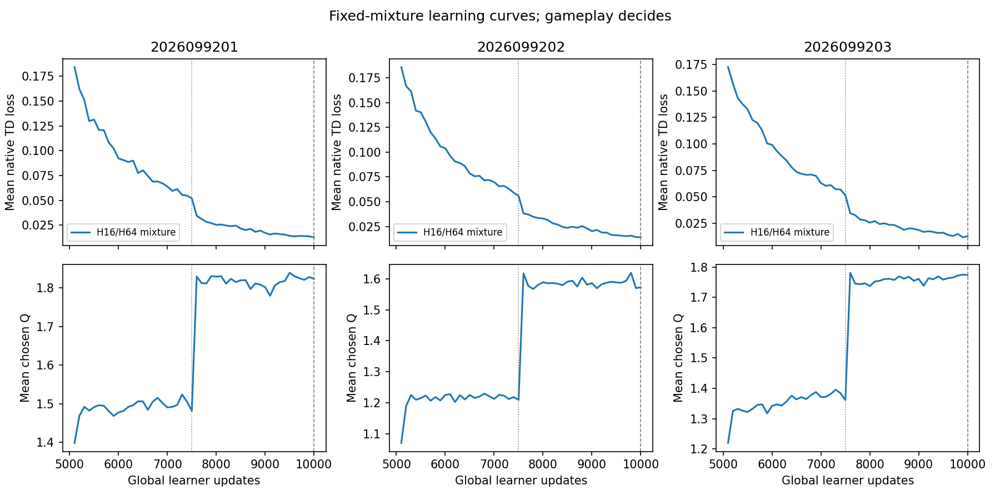
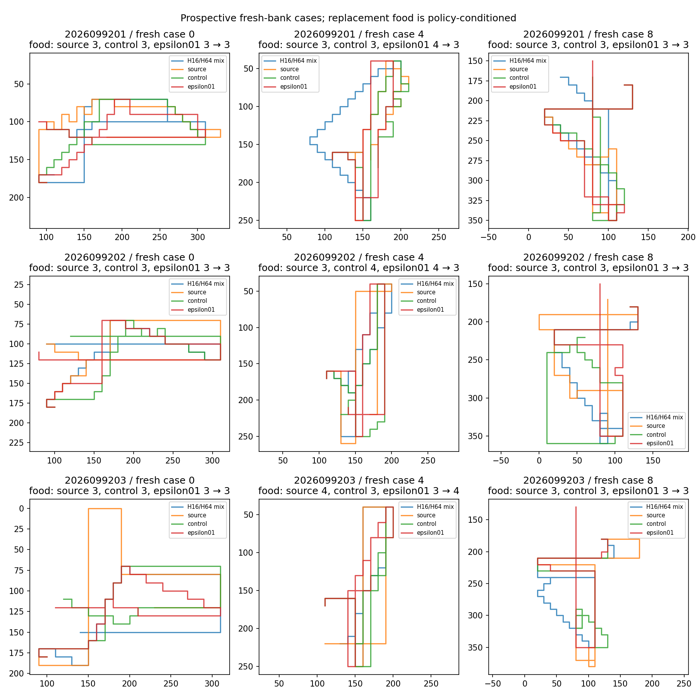

# Apex native replay-mixture continuation

**Result: `MIXTURE_RETENTION_REJECTED`.** Collection and replay delivery passed, but the fixed H16/H64 package failed the H64 retention gates, and the pooled paired-gain gate also failed. Short-task behavior stayed at 96/96 food and survival across every lineage and short bank. All three models reached 100% agreement with the 288 fixed TRAIN teacher rows at both checkpoints; this fit result does not establish growth competence or learned survival.

## Question and frozen treatment

The screen tested whether replacing a fixed minority of native H64 growth collection with native H16 food-seeking episodes could retain short-task competence while matching or improving the saved growth endpoints across three source lineages. This is a collection-package comparison, not an isolated replay-sampling intervention or a causal test of forgetting.

Each lineage restored the authenticated source-at-global-update-5000 online model, target model, and full Adam state. It used a fresh prioritized replay buffer and fresh replay/Torch RNG streams, so this was an artifact-local continuation rather than an interrupted-run resume. Collection kept the native Apex learner and **epsilon 0.4**. Each lineage collected 19,968 rows: six 768-row H16 chunks without food replenishment (4,608 rows) and twenty 768-row H64 growth chunks (15,360 rows). It visited the frozen 96 TRAIN roots; every short chunk collected food without replacement-present rows, every growth chunk contained post-first replacement rows, and the required 9,984-row growth replacement floor was met. Replay sampling was reported from observed PER draws, not assumed from collection proportions.

The dose was 5,000 successful updates per lineage, from global update 5,000 through 10,000. Checkpoint 7,500 and teacher-row fit were descriptive. Only endpoint 10,000 decided behavior. No peak selection, ratio or epsilon sweep, additional updates, diagnostic optimization, teacher-imitation optimization, selected-failure training, or new worlds were used.

## Results

Every short bank passed: H8 TRAIN, H8 previously-held adaptive, and H16 previously-fresh adaptive each had 96/96 food and 96/96 survival for all three seeds.

| Seed | H64 bank | Food / frozen floor | First food | Joint | Survival | Retention |
|---|---|---:|---:|---:|---:|---|
| 2026099201 | Known adaptive | 138 / 147 | 48 | 46 | 48 | Fail |
| 2026099201 | Previously-fresh adaptive | 143 / 152 | 48 | 48 | 48 | Fail |
| 2026099202 | Known adaptive | 141 / 152 | 48 | 45 | 48 | Fail |
| 2026099202 | Previously-fresh adaptive | 151 / 154 | 48 | 48 | 48 | Fail |
| 2026099203 | Known adaptive | 140 / 149 | 48 | 45 | 48 | Fail |
| 2026099203 | Previously-fresh adaptive | 139 / 150 | 48 | 45 | 48 | Fail |

The known-bank joint counts were 46/48, 45/48, and 45/48; the previously-fresh-bank food counts were below their frozen floors for all three seeds, and its third-seed joint count was 45/48. Although survival and first food were 48/48 in all six seed/bank cells, that does not satisfy the full retention package. The original absolute guards remain recorded: joint at least 44/48 and food at least 75% of the saved teacher total. The stronger fixed food floors and 48/48 joint requirement determined this screen.

| H64 bank | Comparator | Food wins / losses / ties | Joint wins / losses / ties |
|---|---|---:|---:|
| Known adaptive | Source-5000 | 42 / 18 / 84 | 10 / 8 / 126 |
| Known adaptive | Epsilon 0.4 | 23 / 24 / 97 | 2 / 8 / 134 |
| Known adaptive | Epsilon 0.1 | 8 / 32 / 104 | 0 / 8 / 136 |
| Previously-fresh adaptive | Source-5000 | 35 / 18 / 91 | 8 / 2 / 134 |
| Previously-fresh adaptive | Epsilon 0.4 | 18 / 18 / 108 | 2 / 3 / 139 |
| Previously-fresh adaptive | Epsilon 0.1 | 10 / 29 / 105 | 0 / 3 / 141 |

Each H64 row pools 144 matched seed/case comparisons. These cases are not independent training replications. The required food wins-over-losses condition failed against epsilon 0.4 and epsilon 0.1 on both banks, and against epsilon 0.4 on the previously-fresh bank it tied. Joint wins exceeded losses against source-5000 on both banks but not against epsilon 0.4. Epsilon 0.1 already had 48/48 joint outcomes in every cell, so ties with it count only as retention.

| Gate | Result |
|---|---|
| Mixture delivery | Pass |
| Short retention | Pass |
| H64 retention | Fail |
| Paired gain | Fail |
| Overall branch | `MIXTURE_RETENTION_REJECTED` |

Each lineage sampled all 4,608 short replay slots at least once. Short-row draws were 190,998, 212,186, and 200,676 for seeds 9201, 9202, and 9203, respectively; all exceed the 64,000-draw floor and all 4,608 slots exceed the 768-slot floor. The endpoint models had 100% teacher-label agreement on the fixed 288-row TRAIN set at both 7,500 and 10,000. This is an inference diagnostic, not supervised training, a survival measure, calibrated-value claim, or proxy for gameplay. The native TD-loss curves are descriptive; lower loss does not demonstrate growth competence. Greedy outcomes are limited to adaptive development and retention banks. Random-baseline survival was already perfect, so these results provide no evidence of learned survival. They do not establish representation insufficiency, forgetting, or target-sync causality.

## Accounting and recovery history

Across all three lineages the sealed closeout records 59,904 scientific replay rows, 15,000 successful updates, and 3,840,000 replay draws. Collection used 1,584 games. Endpoint evaluation reused saved comparator games and added 1,152 candidate games and 27,648 candidate frames. Qualification used 284 cumulative native games (8 fixture games and 276 warm-collection games), 11,072 native frames, 6,711 network forwards, and one discarded update. Eleven supervisor receipts totalled 185.472216128 guarded seconds; peak child RSS was 668,139,520 bytes and minimum available memory was 32,857,718,784 bytes.

The original qualification attempt was preserved as failed. It stopped with `TypeError: only length-1 arrays can be converted to Python scalars` after two H64 parity fixtures and the first 16-frame H16 fixture (three games, 144 frames, 82 forwards). The checker expected an exported replay tuple layout; the actual buffer exposed internal tuples with a different field position. Versioned qualification recovery reused those three completed games and reconstructed the H16 records from saved transition data; it ran five new fixture games (176 frames), collected the prescribed 10,752 warm rows, and made one discarded canonical update. No completed fixture games were repeated, and the scientific criteria were unchanged.

The first audit attempt was also preserved. It verified the five-bank comparator files but then failed a dictionary-equality assertion because the analysis saved comparator summaries for all five banks while that audit version assembled only the two H64 summaries. Versioned audit-tail recovery reused the pinned, verified audit prefix and completed the remaining all-five-bank summary and aggregation checks without rerunning training, evaluation, games, or the completed audit prefix. The final audit-tail report passed, checked all 45 comparator-bank summaries and 864 H64 pairs, and confirmed `MIXTURE_RETENTION_REJECTED`.

## Figures and sealed artifacts

The paths image uses prospectively selected case indices 0, 4, and 8 from the **previously-fresh adaptive retention bank**. The figure’s legacy “fresh-bank” wording refers to that existing bank; it does not indicate new fresh-world confirmation. The table is copied byte-for-byte from the sealed analysis output.

- [Outcome table](table.md)
- [Sealed analysis report](/Users/josenunez/Projects/ml/snake-dqn-artifacts/ongoing-research-20260913/apex-replay-mix-continuation/analysis/report.json) — SHA-256 `efae6ed3965486b6a67001d24343acc9f335692222eb63d6d38b2bd032cbeb09`
- [Audit-tail report](/Users/josenunez/Projects/ml/snake-dqn-artifacts/ongoing-research-20260913/apex-replay-mix-continuation/audit-tail/report.json) — PASS, SHA-256 `c17637e489fdebb494ed9872fb255b5e57eed4f0b601f1f9b3651ded4a349d74`
- [Closeout record](/Users/josenunez/Projects/ml/snake-dqn-artifacts/ongoing-research-20260913/apex-replay-mix-continuation/closeout.json) — SHA-256 `d53bafacf4a2f9c75585d730a5271b633a589eaf8d6252153cb5a6858552f091`
- [Frozen intent](/Users/josenunez/Projects/ml/snake-dqn-artifacts/ongoing-research-20260913/apex-replay-mix-continuation/intent.json) — SHA-256 `b99f5e55790616b7bfe5911e2ae5f7187137b72c8e8895df76747937ef234a3c`
- [Original qualification failure](/Users/josenunez/Projects/ml/snake-dqn-artifacts/ongoing-research-20260913/apex-replay-mix-continuation/qualification/failure.json) — SHA-256 `dc9fcadcc2fea44c1837ef794874dae84bce8b3cb25e8b81d52670d519493b2e`
- [Versioned qualification recovery report](/Users/josenunez/Projects/ml/snake-dqn-artifacts/ongoing-research-20260913/apex-replay-mix-continuation/qualification-v2/report.json) — SHA-256 `049cc9ca8a448532f4ba3c530b970eb1fb3075b48f9c44bdd47c038fc73c301c`
- [Qualification recovery amendment](/Users/josenunez/Projects/ml/snake-dqn-artifacts/ongoing-research-20260913/apex-replay-mix-continuation/recovery-amendment.json) — SHA-256 `7ed1d46cc587023b19ebd8d67877fb279eb3bffbf37e9d5e2e83228ed1de81b3`
- [Original audit receipt](/Users/josenunez/Projects/ml/snake-dqn-artifacts/ongoing-research-20260913/apex-replay-mix-continuation/supervisor-runs/audit/receipt.json) — preserved, SHA-256 `0bf67a4328b17553bd1458614f36d0a4858360110d9711f29c464cb613efd50a`
- [Audit-tail recovery amendment](/Users/josenunez/Projects/ml/snake-dqn-artifacts/ongoing-research-20260913/apex-replay-mix-continuation/audit-recovery-amendment.json) — SHA-256 `ffe979a447a303bd284149974b131323476bf0b6f2fc599b5d21674871d07df0`

The fixed-mixture line ends here: no ratio sweep, extra dose, epsilon change, intermediate-peak selection, fresh confirmation, opponents, or promotion follows.
