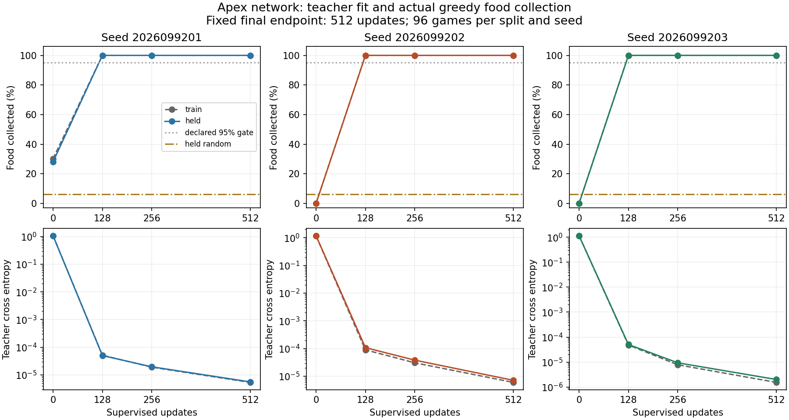
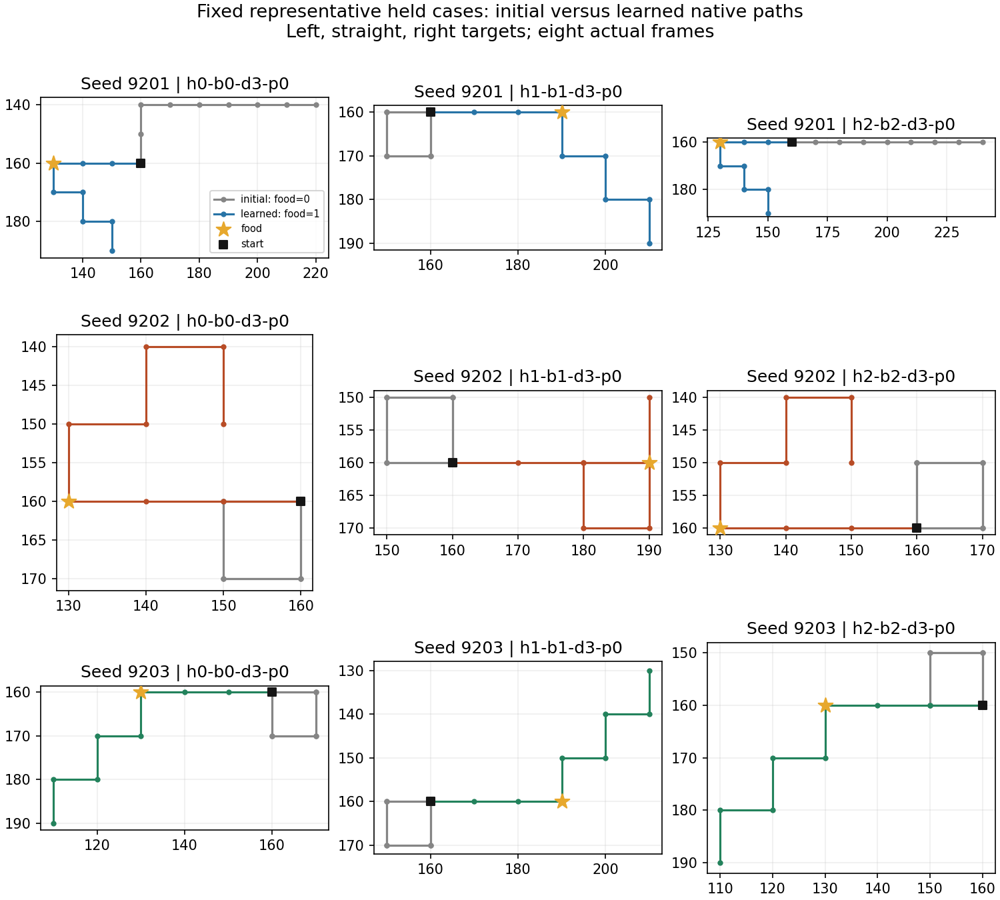

# Applying the research lessons to Apex

Status: **COMPLETE_AUDITED_ALL_THREE_SUCCESS** for the supervised food-seeking diagnostic.
No Apex reinforcement-learning update or promotion was performed in this study.

All three freshly initialized Apex networks learned to collect food in every one
of the 96 held placement cases. Their untrained results were 27/96, 0/96, and 0/96.
The actual greedy gameplay result matches the teacher-fit improvement. This is a
repeatable small-task learning result, not evidence of long-game survival or
superiority over PQN.

## Results for every seed

| Seed | Initial held food | Final train fit | Final held fit | Final train food | Final held food | Held survival |
|---|---:|---:|---:|---:|---:|---:|
| 2026099201 | 27/96 | 100% | 100% | 96/96 | 96/96 | 96/96 |
| 2026099202 | 0/96 | 100% | 100% | 96/96 | 96/96 | 96/96 |
| 2026099203 | 0/96 | 100% | 100% | 96/96 | 96/96 | 96/96 |

The held scripted teacher achieved 96/96 food contacts; held random normal-action
play achieved 6/96 (6.25%). Both survived every case. All learned marks 128, 256,
and 512 achieved 96/96 train and held food contacts in every seed. The frozen
512-update endpoint alone decided success; earlier marks were not selected.

The upper panels show actual greedy food collection. The lower panels show
teacher cross entropy. Gray dashed lines are training data; colored solid lines
are the held placement grid. The dotted food threshold and random baseline are
unchanged. All three final teacher cross entropies are below 0.00001.

These are fixed left/straight/right held cases, across varied headings, for every
seed. Gray is the initial policy and the colored path is the final policy. The
star marks food and the black square the start. All eight native frames remain
visible, including post-food behavior that was absent from the training examples.

## Frozen experiment

The network is the existing `ApexNetwork(61,512,6)` with orthogonal initialization.
Each seed receives exactly 512 full-batch updates using Adam at learning rate
0.001 and masked teacher cross entropy. These are supervised updates, with no TD
targets, target network, replay, or reward optimization. They are neither the
local `ApexPolicy` recipe nor the distributed `ApexLearner` recipe.

The task uses the real `GameState`, native `AISnake` vector61 observation and
six-action interface, eight-frame episodes, initial logical length three, one
reachable food pellet, and no food replenishment. Controllers use normal actions
0–2. The config pins mechanics/rewards v1 and champion-compatible gamma .99 and
n-step 3 metadata; the latter are not used by the supervised loss.

Training comprises 96 factorial cases over four positions: four headings, three
relative food bearings, and distances two/four moves. The 288 pre-food decision
rows contain 32 left, 224 straight, and 32 right actions, weighted equally by row.
They contain 160 unique exact observation/mask inputs and no conflicting labels.
Post-food rows never enter optimization.

The 96 held cases use four different positions and distances three/five moves.
Held native states and labels were generated only after all three endpoints had
been saved. They contain 384 pre-food rows, 192 unique exact inputs, and no label
conflicts. The actual optimization inputs have **zero exact observation/mask
overlap** with either held teacher rows or final held gameplay frames.

The three initializations share this one structured held grid. The result tests
initialization robustness and interpolation across positions/distances; it does
not estimate arbitrary-world generalization. Teacher and random survival were
already 100%, so H8 survival is an execution check with little learning headroom.

Fixed success required every seed to achieve at least 99% training agreement,
92/96 food contacts on both train and held games, and 96/96 survival on both.
Held teacher success, random food at most 72/96, and conflict-free label admission
were prerequisites. No threshold, seed, dose, or endpoint was changed after results.

## Native qualification and verification

Before training, a separately frozen 96-case native qualification achieved
teacher food/survival 96/96 and random food 18/96, with random survival 96/96.
This bank differs from the later held bank. All heading/bearing strata, three
specified deterministic replays, observation/action checks, and a forced native
wall-terminal probe passed. Death and live horizon truncation stayed distinct.

The qualification exercised the policy callback's actual native selection mask.
The supervised experiment then used a greedy network callback through that same
native game path. Canonical replay-tail flushing and TD bootstrapping remain for
the next learner qualification; neither inference callback has a replay buffer.

The independent saved-record audit checked all 24 gameplay files, all 12 saved
checkpoint file hashes, the 122 frozen inputs, every final gate, and train/held
support separation. It ran no model inference or gameplay. Three-seed training
and evaluation used 2,592 new games and 1,536 optimizer updates, totaling 442,368
training-example presentations. All checkpoints and raw trajectories are retained.

The supervised job completed naturally in 12.480 seconds with no input drift;
peak child RSS was 0.4055 GiB and available RAM stayed above 32.17 GiB. Saved-data
figure rendering took 1.042 seconds, for 13.523 monitored child seconds against the
480-second study budget. Numerical jobs were serialized with two CPU threads,
8-GiB RSS and 24-GiB MPS caps, and the 9.6-GiB available-RAM reserve. No MPS work
was needed. Compilation, formatting, and lint checks passed for the drivers;
Sol and Luna reviewed the scientific and runtime contracts before admission.

## Interpretation and next question

The PQN controlled encounter studies remain complete and failed. Neither full
first-cycle coverage plus more native updates nor the ambient reward treatment
cleared the unchanged all-seed competence and retention package. Their negative
conclusions are not reopened by this Apex result.

What transferred was the method: teacher/random task qualification, correct
native observations/actions, separate training fit and greedy gameplay, distinct
placement banks, three fresh seeds, fixed endpoints, and explicit retention gates.
Raster weights and the failed PQN reward/anchoring treatments were not transferred.
Apex already observes logical length and free-space features.

The next bounded question is whether the **canonical Apex learner can preserve
this learned food seeking while performing genuine TD updates**. It must use the
actual intended learner and PER/n-step contract. Local `ApexPolicy` uses AdamW
with weight decay 1e-5 and a target clip of 50; distributed `ApexLearner` uses Adam
with epsilon 1.5e-4, zero weight decay, and a default configured Q clip of 100.
A short local-policy run cannot establish distributed Ape-X improvement.

A later continuation must account for uncalibrated supervised Q values, a fresh
RL optimizer, native reward and truncation semantics, replay exposure, and actual
target synchronizations. The incumbent cadence is 2,500 updates. No long run is
justified by this supervised result alone. Apex's historical training dose still
prevents treating its incumbent strength as inherent algorithm superiority.
The shared strict tournament workflow remains the only promotion authority.

Primary research context: [Ape-X](https://arxiv.org/abs/1803.00933) motivates testing
replay and target-network differences; [DQfD](https://arxiv.org/abs/1704.03732)
motivates demonstrations as a route into RL. This diagnostic does not implement
or replicate full DQfD.

## Evidence identities

Artifacts are under
`/Users/josenunez/Projects/ml/snake-dqn-artifacts/ongoing-research-20260913/`.

- Qualification: `apex-solo-transfer-qualification/closeout.json`, SHA
  `ca1668b90648269678004173b58dac0b8b8d0d1bd2184ea8f52f45fd2ec6db6e`.
- Supervised intent: `apex-solo-imitation/intent.json`, SHA
  `d4759057ff07d50cf038232dfa918a7700c301f2e5e1617db4a7f2a0e0e94674`.
- Independent audit: `apex-solo-imitation/audit.json`, SHA
  `e60b6870d8ce1b621a182edd25c353de56a9553b6ad9429967b1f2f0b736514c`.
- Supervised closeout: `apex-solo-imitation/closeout.json`, SHA
  `59907bee70f2c823071bf547156c2277c4407637c413cbc157d7815784c4760e`.

The user renewed open-ended research authority with “continue until i say stop”
after requesting Apex. The original eight-hour review is still recorded; it no
longer causes automatic pausing. Each next experiment still needs its own frozen
question, criteria, compute cap, and admission deadline. No remote publication was
requested or performed.
