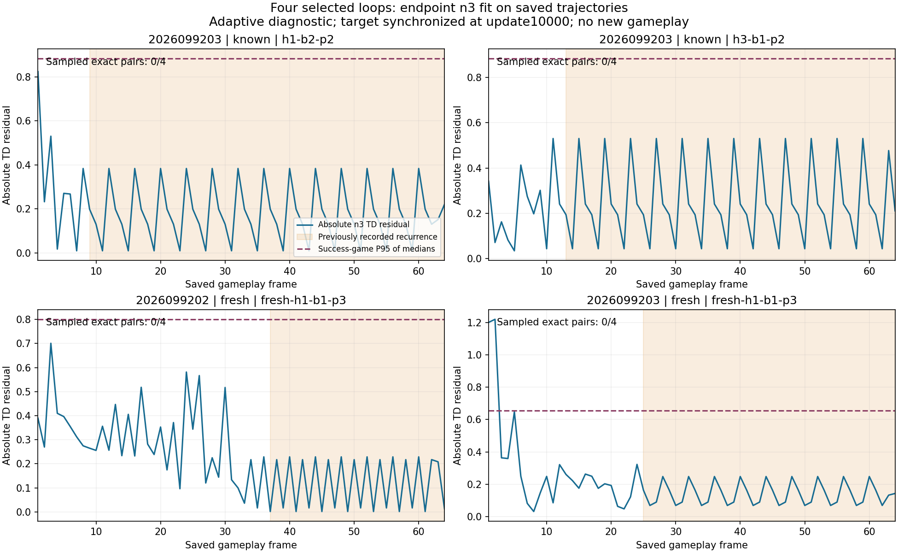

# Apex saved-growth TD census — 2026-09-22

> **Outcome:** the completed saved-record diagnostic took the
> `EXACT_CYCLE_COVERAGE_ABSENT_ALL4` branch. Each selected recurrent suffix had
> zero exact state, state-action, and sampled-state-action matches in the saved
> replay join. This is a coverage observation, not evidence that missing
> training exposure caused the loops. The prior `FAILURE_GUARD` remains in
> force; there is no promotion or automatic training action.

This forward-only audit answers a narrow question: whether the four selected
saved recurrent loops have exact replay-join coverage, and how their canonical
n=3 endpoint TD residuals compare with successful saved gameplay from the same
seed and bank. It created no worlds and made no optimizer updates. For the
actual learner and gameplay findings, see the [second-food continuation](../apex_second_food_continuation_2026-09-22/README.md), its
[TD/Q learning curve](../apex_second_food_continuation_2026-09-22/td-q-learning-curve.png),
and the [saved-record regression census](../apex_second_food_regression_census_2026-09-22/README.md).

## Population and method

The census covers 288 complete saved greedy games from three fixed
`h64_growth` endpoints at update 10,000. Four selected looping failures are
compared with all 284 successful same-stratum references across six seed/bank
strata. Seed `2026099201` has no selected failure.

Each suffix uses the native n=3 calculation, including the live k=1 and k=2
tails, death handling, saved successor state, and successor-mask semantics.
Greedy action parity uses the saved selection mask. The target network was
copied from the online network at update 10,000, so the residual is an
endpoint-consistency measurement. It is not a historical training residual,
calibration result, or guarantee that a small TD error produces useful play.

Coverage uses exact float32 observation and selection-mask digests plus action
against collection-row metadata from the H64 continuation's fresh PER. This
does not cover the checkpoint's ancestral training history. It separately reports state-only,
state-action, and sampled-state-action counts. The join does not establish
exact n=3 transition coverage, sampling time, priority history, or causal
exposure.

## Selected-loop result

Every selected case contains four unique suffix pairs. Each has `0 / 0 / 0`
matches for exact state / state-action / sampled-state-action coverage.

| Seed | Bank | Saved case | Unique suffix pairs | Exact coverage (state / state-action / sampled) | Suffix median absolute TD | Matched-success P95 absolute TD |
| --- | --- | --- | ---: | --- | ---: | ---: |
| 2026099203 | known | `h1-b2-p2` | 4 | 0 / 0 / 0 | 0.175616 | 0.882906 |
| 2026099203 | known | `h3-b1-p2` | 4 | 0 / 0 / 0 | 0.202269 | 0.882906 |
| 2026099202 | fresh | `fresh-h1-b1-p3` | 4 | 0 / 0 / 0 | 0.112408 | 0.800729 |
| 2026099203 | fresh | `fresh-h1-b1-p3` | 4 | 0 / 0 / 0 | 0.137976 | 0.655664 |

The reference comparison supplies context for the four saved loops only. Exact
P95 values summarize successful games' per-game median absolute residuals,
with each game weighted equally. Exact
coverage absence may also occur in successful saved gameplay, so this result
does not identify a failure-specific causal gap and does not justify training
on the held paths. A saved-only comparison of success-reference coverage is a
separately saved [next design](/Users/josenunez/Projects/ml/snake-dqn-artifacts/ongoing-research-20260913/apex-coverage-specificity-design/design.json),
not new evidence or a fresh-world claim. It has not been implemented, frozen,
or admitted; it proposes 20 seconds for analysis and 20 for independent audit,
with no further model access, gameplay, or training.

*The figure is a byte-for-byte copy of the completed analysis artifact; it was
not re-rendered.*

## Saved-record and recovery accounting

The diagnostic examined 18,432 saved frames from 288 games. Its inference phase
queried 18,184 unique inputs in 36,368 recovered forward calls. A first child run
finished its queries but failed while serializing NumPy values, leaving no
complete report and an inferred 36,368 lost forward calls; the combined
attempted/inferred total is 72,736. No new games or updates occurred.

The NumPy-serialization child failure took 5.408 seconds. One recovery took
7.732 seconds, analysis 1.237 seconds, and audit 2.509 seconds: 16.886 seconds
in total. Peak RSS was 0.835343 GiB and minimum available memory was 32.971558
GiB. The original partial `report.json` is preserved immutably; `report-v2.json`
is the valid report, with `run_v3` and `audit_v3` as the final execution and
audit records.

## Provenance and checks

Completed artifacts live under
`snake-dqn-artifacts/ongoing-research-20260913/apex-saved-growth-td-census/`:

- [intent.json](/Users/josenunez/Projects/ml/snake-dqn-artifacts/ongoing-research-20260913/apex-saved-growth-td-census/intent.json)
  — SHA-256 `a1aff1b1ab89d743bfc95b21ac8bae78c592d701438864c69b385d71828e98f5`
- [pre-admission amendment](/Users/josenunez/Projects/ml/snake-dqn-artifacts/ongoing-research-20260913/apex-saved-growth-td-census/pre-admission-amendment-v2.json)
  — SHA-256 `ce741cd56f047c4c6f2f849a6f34ba3c6577c7a417331e478f8affaf23f4a745`
- [recovery amendment](/Users/josenunez/Projects/ml/snake-dqn-artifacts/ongoing-research-20260913/apex-saved-growth-td-census/recovery-amendment-v1.json)
  — SHA-256 `e13db9a3dea55604556e4ccacb590fdeb09ff6b325f2040a709e4d92ff421ef5`
- [analysis.json](/Users/josenunez/Projects/ml/snake-dqn-artifacts/ongoing-research-20260913/apex-saved-growth-td-census/analysis.json)
  — `COMPLETE`, branch `EXACT_CYCLE_COVERAGE_ABSENT_ALL4`, SHA-256
  `7a3c50d4e65e4104fd5d7750f45c2c1ba301c7cff84cb250e81ecccfdf174b08`
- [audit.json](/Users/josenunez/Projects/ml/snake-dqn-artifacts/ongoing-research-20260913/apex-saved-growth-td-census/audit.json)
  — `PASS`, SHA-256 `b9a0e5a0cba449f249438e9dbfd4f5acaf998a795d282180da77c76152f7bbcc`
- [closeout.json](/Users/josenunez/Projects/ml/snake-dqn-artifacts/ongoing-research-20260913/apex-saved-growth-td-census/closeout.json)
  — `COMPLETE_AUDITED_ADAPTIVE_TD_CENSUS`, SHA-256
  `bc1dd817aa6d7aecd311e01e97f80aa1a269ec49290ce2d1be50f37cb1856ddb`

The local figure has SHA-256
`48a6d05196773e8785a29ecd0d51b1183ecb967756012d7c8d04d39434515db0` and was
checked against the analysis copy after copying.
