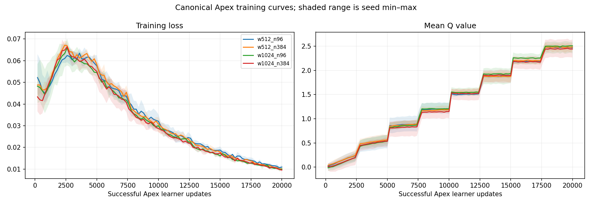
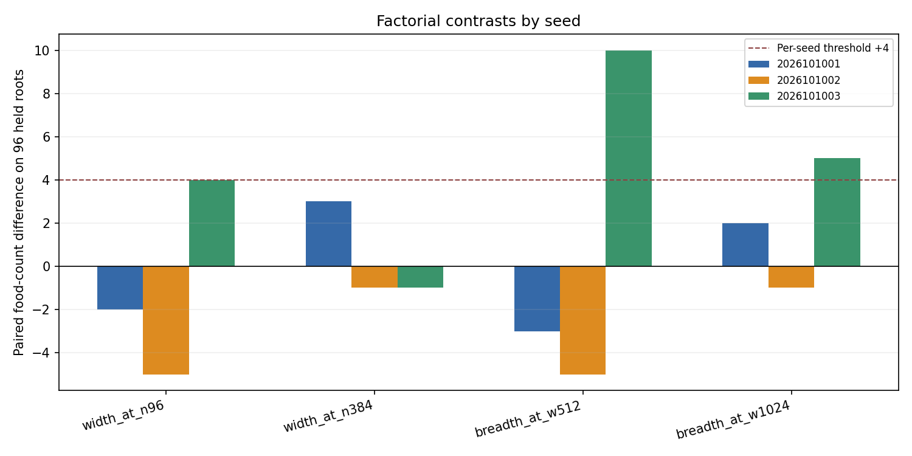
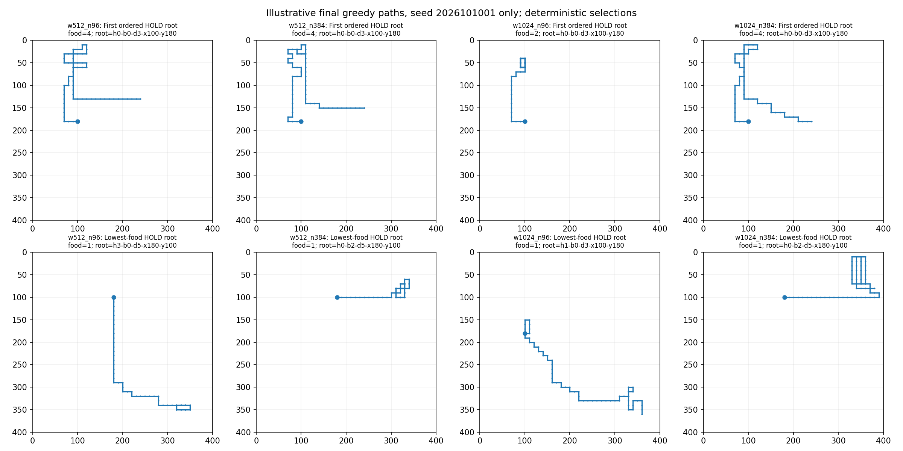
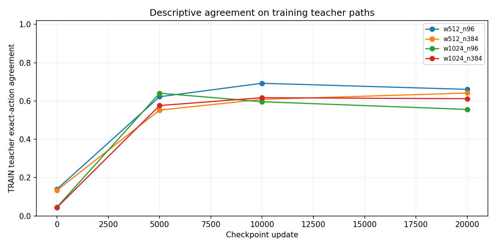

# Apex width and breadth screen

**Final audited result: `NO_RELIABLE_SCALING_BENEFIT`.** The fixed fresh-start screen showed strong
food learning but no width or TRAIN-root breadth contrast cleared its predeclared paired rule.
Fresh-HOLD feasibility passed in 11 of 12 cells, while the stricter all-cell retention package
failed. No winner was selected, no training was extended, and no model was promoted.

The initial analyzer report is at
[`analysis/report.json`](/Users/josenunez/Projects/ml/snake-dqn-artifacts/ongoing-research-20260913/apex-scaling-width-breadth/analysis/report.json),
with its saved summary at
[`analysis/README.md`](/Users/josenunez/Projects/ml/snake-dqn-artifacts/ongoing-research-20260913/apex-scaling-width-breadth/analysis/README.md).
The independent audit tail passed at
[`audit-tail-v3/report.json`](/Users/josenunez/Projects/ml/snake-dqn-artifacts/ongoing-research-20260913/apex-scaling-width-breadth/audit-tail-v3/report.json).
The immutable root closeout is
[`closeout.json`](/Users/josenunez/Projects/ml/snake-dqn-artifacts/ongoing-research-20260913/apex-scaling-width-breadth/closeout.json)
(SHA-256 `8572a8f34c1bb54bbf1e059bb022da6dcb1988eecefd99764fdc91fcdf7f08b0`). Its metadata-only
[`closeout-v2.json`](/Users/josenunez/Projects/ml/snake-dqn-artifacts/ongoing-research-20260913/apex-scaling-width-breadth/closeout-v2.json)
clarifies that choosing a follow-up reference occurs after this study; no results changed. The frozen protocol
is [`intent.json`](/Users/josenunez/Projects/ml/snake-dqn-artifacts/ongoing-research-20260913/apex-scaling-width-breadth/intent.json).

## Design and fixed dose

The 2 × 2 screen crossed fresh canonical Apex hidden widths 512/1024 with nested TRAIN root banks
of 96/384, on three fixed seed blocks. Each narrow bank was an exact subset of its broad bank.
All 12 cells received 79,872 accepted native rows, 20,000 successful updates, batch size 256, and
5.12 million replay draws per cell. The learner used vector61, ε=0.4, and fresh online, target,
optimizer, and replay state. No parent checkpoint or behavioral-cloning warm start was used.

Checkpoints at updates 0, 5,000, 10,000, and 20,000 support descriptive curves; gameplay decisions
use only the 20,000-update endpoint. Mark 0 and the endpoint were evaluated on the same new shared
96-root native H64 HOLD bank. The HOLD bank was generated after all 12 training endpoints were
sealed. Legacy retention remained separate: H8 TRAIN, H8 held, and H16 no-replenishment banks,
plus the known-adaptive and fresh-adaptive H64 banks.

Equal rows, replay draws, and updates did not mean equal compute. The 512-wide per-cell training
jobs took about 163–174 seconds; 1024-wide jobs took about 300–313 seconds, roughly twice as long.
The study used two CPU threads. Across 30 supervised receipts, 29 children completed successfully
and one initial audit checker failure was preserved. Guarded elapsed time was 3,045.32 seconds;
peak child RSS was 2,637,348,864 bytes and minimum available memory was 31,078,498,304 bytes.

Across the 12 cells, the study collected 958,464 accepted rows, completed 240,000 learner updates,
and drew 61.44 million replay samples. Native collection recorded 14,976 games; evaluation recorded
6,912 games, 258,048 frames, and 259,488 inference forwards. Training forward calls were not
separately instrumented, so no all-stage forward total is claimed. The audit tail added zero games,
frames, forwards, checkpoint loads, or updates. Per-stage identities and resource accounting are
bound in the root closeout.

## Fresh-HOLD results

Fresh feasibility required, per cell and seed: food ≥274 (90% of the 304-food teacher total),
first food in 96/96 games, joint two-food-plus-boost exposure in at least 92/96, and survival in
96/96. Eleven of 12 cells passed; three of four arms passed across all three seeds. The only
failure was `2026101001-w1024_n384`, with 292 food, joint success 91/96, and survival 96/96.

The `w512_n96` condition reached 292/301/293 food across its three seeds, against
304 for the teacher and 14 for random play on the same qualified 96-root bank. Its initial greedy
mark-0 food totals were 1/2/31. It passed fresh-HOLD feasibility in all three seeds. Random play
also survived all 96 H64 games, so survival alone was at ceiling in this short screen.

All 12 seed/cell outcomes, including every short-bank and H64 retention failure, are in
[`per-seed-table.md`](per-seed-table.md). Across all cells, the H8 TRAIN gate passed 12/12, H8 held
passed 10/12, and H16 passed 9/12. Every short-bank failure was a missed first-food event; survival
was 96/96 throughout. Only two of 24 old-H64 bank/cell outcomes passed their combined first-food,
joint, survival, and global food-floor gate: both known and fresh H64 passed for
`2026101002-w512_n96`. Therefore the strict all-cell reliability package failed.

## Paired width and breadth contrasts

Each contrast pairs the same 96 new HOLD roots within each seed. A pass required food gain ≥4 in
every seed, nondecreasing joint success and survival in every seed, and pooled paired food wins
greater than losses. None passed:

| Contrast | Food delta, seeds 1 / 2 / 3 | Pooled food wins / losses | Pass |
|---|---:|---:|---|
| Width at 96 roots | −2 / −5 / +4 | 18 / 24 | No |
| Width at 384 roots | +3 / −1 / −1 | 17 / 17 | No |
| Breadth at width 512 | −3 / −5 / +10 | 24 / 23 | No |
| Breadth at width 1024 | +2 / −1 / +5 | 23 / 16 | No |

The descriptive width-by-breadth interaction is not a selection rule. The result supports neither a
reliable wider-network advantage nor a reliable broader-root advantage at this fixed dose.

## Learning curves, trajectory scope, and audit history

The training-curve figure shows 200-update binned loss and mean Q: each line averages the three
seed curves, and the shaded band is their minimum-to-maximum range. The teacher-agreement figure
averages TRAIN exact-action agreement across seeds at the four checkpoint marks. This is a
training-path diagnostic, not behavioral cloning, held-world generalization, or TD loss. Agreement
is computed on fixed teacher trajectories; policy-conditioned collection can take different
trajectories and consume different shared native RNG draws.

The paired-food plot shows the four final endpoint contrasts by seed. Representative paths use the
first ordered and lowest-food case for each arm from seed 2026101001; they are deterministic
illustrations, not a representative sample. Exact float32 state-plus-mask overlap is scoped to the
new HOLD teacher/policy frames versus each cell’s scientific replay digests. It makes no
all-history independence claim and did not filter data.

Before audit admission, a versioned correction changed the auditor's expected hash field from
`intent_sha256_canonical` to the analyzer's actual `intent_sha256`. The admission controller was
paused, its active training child finished naturally, and the replacement controller reused the
two completed qualifications and eleven completed training jobs. Original files and logs remain intact.

The audit-v2 checker then stopped at `2026101002-w512_n96/3` because it required positive
replacement delivery in every 768-row chunk. The frozen protocol required all per-chunk counts to
be reported and the arm’s total replacement rows to be positive; it did not set a positive minimum
for each chunk. That preserved checker failure was not treated as a scientific training failure.
The versioned v3 audit kept the total-positive gate, treated zero-replacement chunks as diagnostic,
authenticated and reused the completed audit prefix, and checked the remaining saved records. The
prefix was inferred from the pinned source, receipt and unique failure location; no durable
intermediate audit state existed. It
passed without repeating training, qualification, game collection, evaluation, or analysis. The
amendments are [`amendment-v2.json`](/Users/josenunez/Projects/ml/snake-dqn-artifacts/ongoing-research-20260913/apex-scaling-width-breadth/amendment-v2.json)
and [`amendment-v3.json`](/Users/josenunez/Projects/ml/snake-dqn-artifacts/ongoing-research-20260913/apex-scaling-width-breadth/amendment-v3.json).

## Figures

These copies are byte-identical to the four analysis outputs:

## Limits and decision

Three seeds are screening evidence, not precise population inference. Equal sample/update dose did
not equalize compute. The screen compares fresh-start packages and cannot causally attribute prior
results to model capacity or data breadth. H64 safety masking and 100% random survival may conceal
survival differences. This fixed 20,000-update study does not answer whether longer training helps.
The food outcome depends on the future-food replacement process and policy-conditioned trajectory;
it should not be read as an isolated food-reward effect.

The audited result is **`NO_RELIABLE_SCALING_BENEFIT`**. No cell is selected or promoted, no
automatic dose continuation is authorized, and competition remains under the separate tournament
authority.
