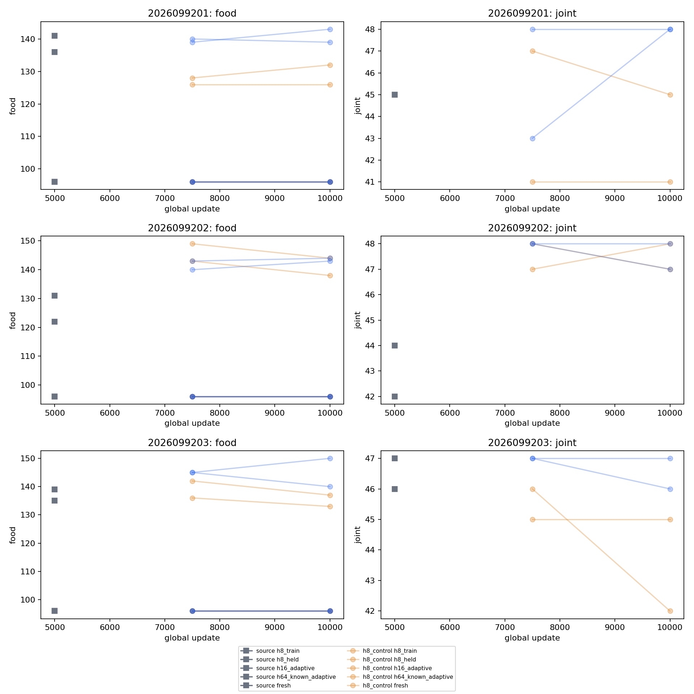
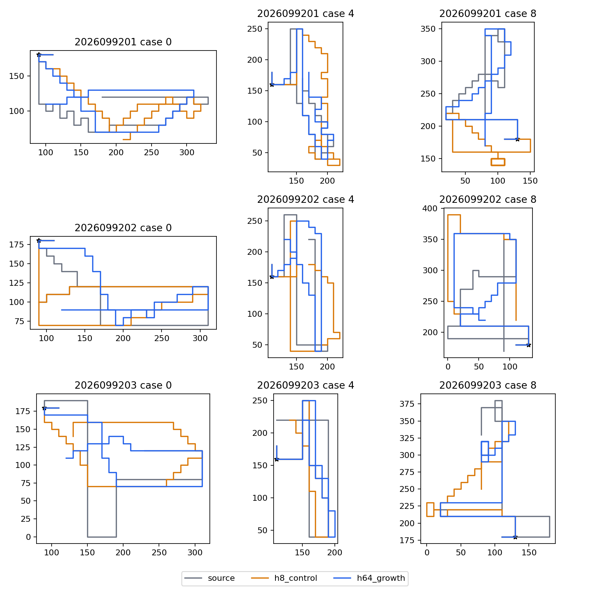
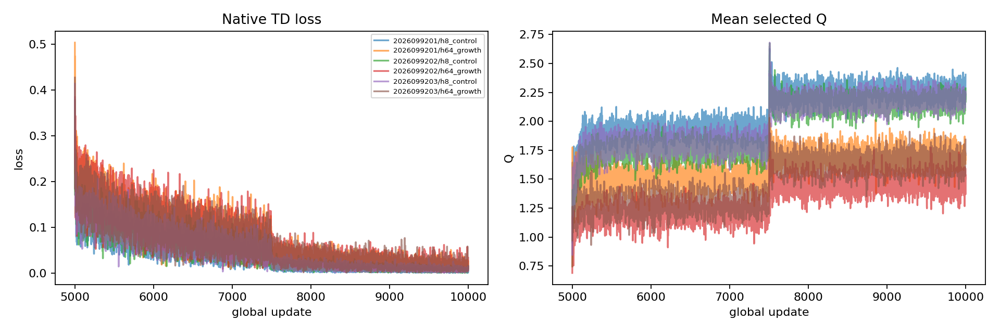

# Apex second-food continuation — 2026-09-22

Longer native replenishing collection produced fresh-bank food and joint-event
gains over the saved source policies, but failed a frozen known-H64 retention
guard. The sealed decision is `FAILURE_GUARD`: seed `2026099203` recorded 46
known-H64 joint cases after growth, below its source's 47. The all-three
success package remains false, so this study does not justify peak selection,
altering the criteria, promotion, opponent work, or a very long run. Apex
remains the incumbent.

This closeout is for readers reviewing the Apex continuation evidence. It
assumes familiarity with the saved mark-5,000 source policies and the earlier
H8/H64 studies. The [sealed closeout](/Users/josenunez/Projects/ml/snake-dqn-artifacts/ongoing-research-20260913/apex-second-food-continuation/closeout.json)
is the compact authority; this document presents its completed evidence without
re-running or re-rendering it.

## Question and protocol

The question was whether, with equal fresh replay rows and canonical updates,
longer native replenishing collection would repair second-food gaps better than
another dose of the original H8 drill. Each of the three saved source policies
(`2026099201`–`2026099203`) supplied two continuations from the same mark-5,000
state: `h8_control` and `h64_growth`. Each arm received 19,968 new replay rows
and 5,000 updates, ending at global mark 10,000. Mark 7,500 is descriptive
only; the final mark is the decision endpoint. Both arms restored the exact
online network, target network, full Adam state at age 5,000, and learner clocks,
then used fresh PER and reset its beta schedule. Target copies occurred at
7,500 and 10,000. This is a new experiment from a saved learner state, not an
interrupted-run replay/RNG resume.

The treatment is the package of longer horizon, native replenishment, and the
resulting growth/boost states. It does not identify a causal contribution from
any one of those components. The canonical Apex learner, terminal handling,
and decision algorithm were unchanged. In particular, terminal aggregate rows
retain their canonical zero-successor/no-mask semantics; no algorithm change
was made during recovery.

Every arm sampled every accepted replay row with PER: 19,968 unique slots per
arm. Growth's post-first replacement-present rows were 18,128, 17,900, and
17,722 for seeds 9201, 9202, and 9203, respectively, out of 19,968; H8 had
zero such rows by design. This verifies treatment delivery, not a behavioral
success claim.

## Final gameplay result

The known-H64 bank is adaptive development evidence. The fresh bank is a
48-case fixed shared bank per seed. `Food / joint` is the total food count and
the number of cases with both two foods and boost exposure; each survival count
is out of 48. The source/H8/growth rows are kept separate so the decision is
auditable per seed.

| Seed | Known H64 source: food / joint | H8 control at 10,000: food / joint | Growth at 10,000: food / joint |
| --- | ---: | ---: | ---: |
| 2026099201 | 136 / 45 | 132 / 45 | 139 / 48 |
| 2026099202 | 122 / 42 | 138 / 48 | 143 / 48 |
| 2026099203 | 135 / 47 | 137 / 45 | **140 / 46** |

The final row for seed `2026099203` is the guard failure: growth food increased
but joint evidence fell from 47 to 46. It makes known-H64 growth retention
false, therefore ends the full package even though the other required gates
passed.

| Seed | Fresh source: food / joint / survived | Fresh H8 control: food / joint / survived | Fresh growth: food / joint / survived |
| --- | ---: | ---: | ---: |
| 2026099201 | 141 / 45 / 48 | 126 / 41 / 47 | 143 / 48 / 48 |
| 2026099202 | 131 / 44 / 48 | 144 / 47 / 48 | 144 / 47 / 48 |
| 2026099203 | 139 / 46 / 48 | 133 / 42 / 48 | 150 / 47 / 48 |

Fresh source→growth joint pairs recorded 9 wins and 2 losses (+7); H8→growth
recorded 14 wins and 2 losses (+12); source→H8 recorded 6 wins and 11 losses
(−5). These paired fresh comparisons are descriptive support, not a way to
override the failed known-retention guard. Both arms also achieved food 96/96
and survival 96/96 on each H8 and H16 bank. The single fresh H8-control death
was seed `2026099201` (47/48 survival).

The fresh teacher collected 159 foods and met the joint objective in 48/48
cases; random collected 17 foods and met it in 0/48. Both survived 48/48.

Final TRAIN teacher agreement was 100% for all H8 controls and 100%, 96.18%,
and 100% for the three growth policies, despite all achieving 96/96 TRAIN
food collection. Teacher agreement and the TD/Q curves are measured separately from
gameplay. They are diagnostics only: no fit, scalar loss, or Q-scale value can
satisfy or rescue a behavioral gate.

## Figures

The three files below are byte copies of the completed analysis figures.
Mark-7,500 curves or points are descriptive; the decision uses only the final
mark-10,000 results above.

*Completed per-bank food and joint-event summary. The final known-H64 retention
comparison, rather than a favorable fresh point, determines the failure guard.*

*Representative fresh native paths. They illustrate fixed-bank branches and do
not establish arbitrary-world competence or learned survival.*

*Completed training diagnostic. It shows the update path through the
descriptive midpoint and final mark; it has no gate authority.*

## Qualification, accounting, and limits

The original qualification stopped after 13 frames and zero updates because an
over-strict metadata assertion rejected terminal aggregate rows. That failed
artifact is preserved. Recovery corrected only that assertion, reused already
completed restores, negative preflights, and live fixtures through an
authenticated sequential trace, and completed the previously unreached work.
It consumed 10,766 more qualification frames and one discarded update. The
two phases total 10,779 discarded qualification frames and one discarded
update; they are excluded from the scientific accounting.

Scientific work consists of 30,000 new updates, 119,808 new replay rows,
7,680,000 sample draws, and 8,424 training-collection games. New evaluation
work consists of 4,848 games and 125,948 frames. No scientific checkpoint was
selected from an intermediate mark.

Fresh initial-state novelty was zero exact matches against 68,499 prior
digests. That applies to initial inputs only. Future native food locations are
policy-conditioned, and the random controller survived 48/48, so neither fact
supports a claim of learned survival or broad generalization.

There was no promotion, new opponent evaluation, coefficient/dose sweep, or
very-long-run extension. The next permitted direction is a separately frozen
saved-record regression diagnostic, while preserving this failure result.

## Execution and provenance

The 14 guarded receipt summaries charged 323.080028914148 seconds, including
the preserved failed qualification. Thirteen receipts completed and one is the
recorded qualification child failure. Peak child RSS was 483,409,920 bytes
(0.45021057 GiB); minimum available memory was 33,410,875,392 bytes
(31.1163 GiB).

- [Frozen intent](/Users/josenunez/Projects/ml/snake-dqn-artifacts/ongoing-research-20260913/apex-second-food-continuation/intent.json)
  — SHA-256 `880996435ee33385a7efd09be996cc6cedb5b50429dd376b6a4f26fe39754662`.
- [Pre-admission amendment v1](/Users/josenunez/Projects/ml/snake-dqn-artifacts/ongoing-research-20260913/apex-second-food-continuation/pre-admission-amendment-v1.json)
  — clarified strict fresh benefit before numerical work; SHA-256 `dd9131cda069b9754474c12aa11d55dbb2b28fed8657dd3f85c4823cfb82f39f`.
- [Recovery amendment v2](/Users/josenunez/Projects/ml/snake-dqn-artifacts/ongoing-research-20260913/apex-second-food-continuation/recovery-amendment-v2.json)
  — preserves the initial failure and scopes recovery; SHA-256 `b9478a4440774018fa90feb59cfc69c82cb4be7a0323787f5e53ad61bba31810`.
- [Completed analysis](/Users/josenunez/Projects/ml/snake-dqn-artifacts/ongoing-research-20260913/apex-second-food-continuation/analysis/analysis.json)
  — `COMPLETE`, `FAILURE_GUARD`; SHA-256 `4927de6110f88b7d3d311176f54ec4fba5701311a42357b0779a759be8bec09c`.
- [Independent audit](/Users/josenunez/Projects/ml/snake-dqn-artifacts/ongoing-research-20260913/apex-second-food-continuation/audit.json)
  — `PASS`; SHA-256 `cd414e8bb8347d5d898d315390e4a50ab2e5373e7bb857b94101dc434848f563`.
- [Sealed closeout](/Users/josenunez/Projects/ml/snake-dqn-artifacts/ongoing-research-20260913/apex-second-food-continuation/closeout.json)
  — `COMPLETE_AUDITED_FRESH_GAIN_KNOWN_RETENTION_FAILED`; SHA-256 `dd4c19340d725d76173ce2d6145c423fa01dec42202c610f830b99e358134d36`.

The packaged figures were verified as byte-identical to their completed source
files (`cmp -s` and SHA-256):

| Figure | SHA-256 |
| --- | --- |
| `food-joint-per-bank.png` | `6cc531e683442b2f1554c0527c2b41a3305a93121cd8e533b174afa0c85810c3` |
| `representative-fresh-paths.png` | `0c9ebc6efaa5121eaaf4ad83c5dc41526e3776dc95e798667ed304dc498ff50a` |
| `td-q-learning-curve.png` | `556df9d78d9d10ad91f0659e528395506e910acaa7852c18d96e3aa043923ea9` |
