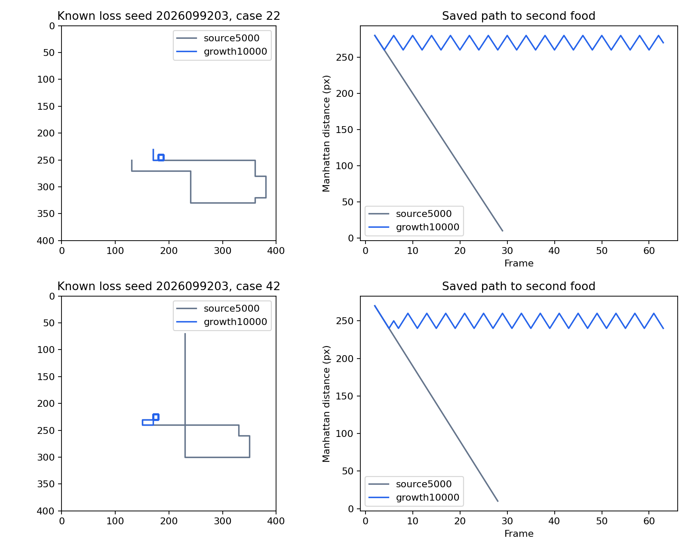

# Apex second-food regression census — 2026-09-22

This saved-record census localizes the failures behind the preceding Apex
second-food continuation. It found a retrospective
`CROSS_BANK_SECOND_FOOD_PATTERN`: the ten old known-bank misses became
successes, while growth introduced two known-bank second-food loops in seed
`2026099203` and one matching fresh-bank loop in each of seeds `2026099202`
and `2026099203`. The original study decision remains `FAILURE_GUARD`.

This is descriptive triage, not a prospective confirmation test, selected-action
causality proof, or training result. The reviewer saw paired data before the
branching rule was frozen. It does not authorize training on held paths, a
longer run, automatic promotion, or a policy change.

For the study protocol, final gameplay tables, and learning curve, see the
[second-food continuation](../apex_second_food_continuation_2026-09-22/README.md)
and its [completed TD/Q learning curve](../apex_second_food_continuation_2026-09-22/td-q-learning-curve.png).
This census does not replot that training evidence.

## What was read

The census aligned 288 source-to-growth pairs across the known and fresh banks
and read 576 saved games. It reused all 144 previously classified source-known
rows, then classified growth failures and located the first source/growth
action divergence symmetrically for gained and lost pairs. It ran zero games,
model forwards, or updates.

`Retained`, `gained`, `lost`, and `persistent fail` below classify whether a
pair did or did not meet the two-food-and-later-legal-boost-exposure joint outcome in the saved
paths. These counts are per seed and bank, not independent world replications.

| Seed | Known: retained | Known: gained | Known: lost | Known: persistent fail |
| --- | ---: | ---: | ---: | ---: |
| 2026099201 | 45 | 3 | 0 | 0 |
| 2026099202 | 42 | 6 | 0 | 0 |
| 2026099203 | 45 | 1 | 2 | 0 |

| Seed | Fresh: retained | Fresh: gained | Fresh: lost | Fresh: persistent fail |
| --- | ---: | ---: | ---: | ---: |
| 2026099201 | 45 | 3 | 0 | 0 |
| 2026099202 | 43 | 4 | 1 | 0 |
| 2026099203 | 45 | 2 | 1 | 0 |

All ten old known failures changed to success: seven were prior cycles, two
were stalls, and one was prior progress. The new known failures are both loops
in seed `2026099203`. The two fresh losses share the same fresh case identifier
across seeds 9202 and 9203, so they are not independent world replications.

## Failure pattern and boundary

The four growth failures all have a period-four recurrence in both the
exact input/action tail and the recorded-world tail. They collect the first food
at frame 2, never collect a second food, and occur before boost. Their
post-first-food recurrence tails contain 56, 52, 28, and 40 frames. The first
source/growth divergence appears at frames 5 and 6 for the known losses, and
at frames 13 and 3 for the fresh losses; every divergence is after the first
food and before the second.

Those observations locate a cross-bank second-food pattern. They do not prove
that the first divergent action caused the regression. In both fresh pairs, the immediate
action on either side reduces distance, so it would be inaccurate to describe
every divergent turn as immediately moving away from food. Recorded context is
limited to saved state, masks, pre-action information, and prior actions; it
does not reconstruct hidden physical or RNG identity.

*All known-bank lost source-to-growth pairs, included without peak selection.
The figure illustrates saved paths only and has no training or causal-action
authority.*

## Decision status and next work

The retained original decision is `FAILURE_GUARD`. The retrospective branch
does not revise the completion result from the continuation study. It indicates
that a new source, reward, or coverage investigation may be designed, but no
new training, held-path optimization, dose sweep, opponent expansion, policy
promotion, or long-run admission follows automatically.

Two guarded saved-record jobs completed in 1.261507333 seconds. The audit
passed after checking all 288 aligned pairs. Since the work only read saved
artifacts, it reports zero new games, model forwards, and updates.

## Provenance

- [Frozen intent](/Users/josenunez/Projects/ml/snake-dqn-artifacts/ongoing-research-20260913/apex-second-food-regression-census/intent.json)
  — `FROZEN_BEFORE_EXECUTION`; SHA-256 `c221d0b0173fff3c7b003b8f9b97fec5c6fdbb9f7e11ec25a9041e078704970b`.
- [Completed census report](/Users/josenunez/Projects/ml/snake-dqn-artifacts/ongoing-research-20260913/apex-second-food-regression-census/report.json)
  — `COMPLETE`, retrospective `CROSS_BANK_SECOND_FOOD_PATTERN`; SHA-256 `a91e2958f96b374ba5353959dbadf639d1af4aeb5ef801228ca1feb2b7d8f59c`.
- [Independent audit](/Users/josenunez/Projects/ml/snake-dqn-artifacts/ongoing-research-20260913/apex-second-food-regression-census/audit.json)
  — `PASS`; SHA-256 `13043cd6cd61fed375f801d332360a3f2165aebb4e224f6f4b6c7fedc3735e01`.
- [Sealed closeout](/Users/josenunez/Projects/ml/snake-dqn-artifacts/ongoing-research-20260913/apex-second-food-regression-census/closeout.json)
  — `COMPLETE_AUDITED_DESCRIPTIVE_TRIAGE`; SHA-256 `c9a0d72f5ff39f451c286c0b682770b5c50d0e9645af0befd1cbc59d1c4214a7`.

`known-loss-paths.png` was copied byte-for-byte from the completed census
artifact and verified with `cmp -s`; SHA-256
`680cddb4730e4b9ca0d1f6ad3466d6a1504807f829d0967a2784079af289726e`.
