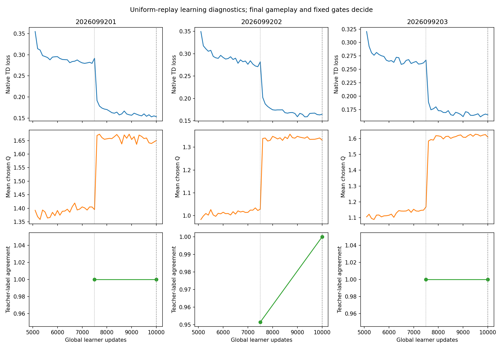
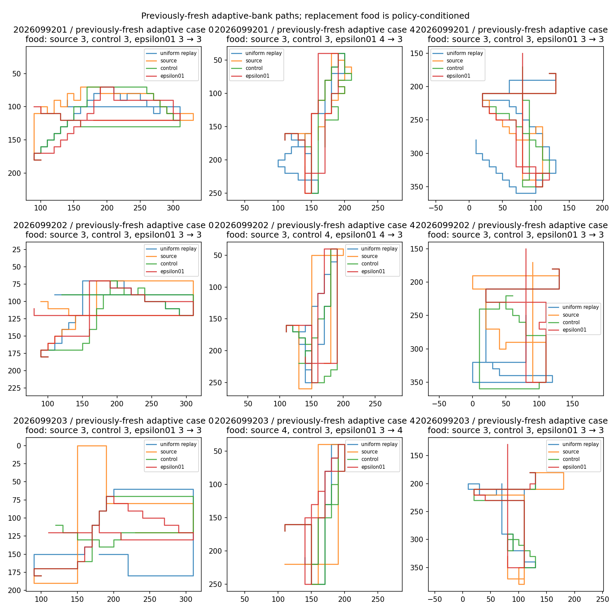

# Uniform replay continuation: H64 retention rejected

The fixed alpha-zero replay package passed delivery, retained all short-bank behavior, and failed the H64 retention and paired-gain gates. The sealed decision is `UNIFORM_REPLAY_RETENTION_REJECTED`. No candidate-improvement, promotion, fresh-world, or causal PER claim follows.

| Seed | H64 bank | Food / floor | First food | Joint | Survival |
|---|---|---:|---:|---:|---:|
| 2026099201 | Known adaptive | 129 / 147 | 48 | 47 | 48 |
| 2026099202 | Known adaptive | 142 / 152 | 48 | 47 | 48 |
| 2026099203 | Known adaptive | 143 / 149 | 48 | 48 | 48 |
| 2026099201 | Previously fresh adaptive | 135 / 152 | 48 | 48 | 48 |
| 2026099202 | Previously fresh adaptive | 142 / 154 | 48 | 48 | 48 |
| 2026099203 | Previously fresh adaptive | 145 / 150 | 48 | 46 | 48 |

Every short bank—H8 TRAIN, H8 held, and H16 adaptive—retained 96/96 food and survival for each seed. Every H64 bank reached first food and survival in all 48 cases. Food missed its frozen floor in all six seed-bank cells; joint also fell below the required 48 in three cells. The floors and saved metrics are reproduced in [table.md](table.md).

The pooled paired food-gain rule failed on both H64 banks against epsilon 0.4 and epsilon 0.1. Food wins exceeded losses against the source on both banks. Joint wins exceeded losses against the source, but were tied against epsilon 0.4 on both banks. Epsilon 0.1 joint outcomes remain a ceiling-retention comparison, not a gain gate. These are paired adaptive-world counts, not independent training replications.

## What was tested

Three lineages each completed 5,000 additional updates from global mark 5,000 to 10,000, with 19,968 replay rows and 1,280,000 stratified replay draws per lineage. Total science dose was 15,000 updates, 59,904 rows, and 3.84 million draws. Training collection covered 936 games and 59,904 native frames. The final endpoint was the only gameplay decision point. The new candidates played 1,152 games across the five existing banks for 27,648 native frames; old source, epsilon 0.4, and epsilon 0.1 games were reused.

The injected replay buffer used effective alpha 0.0 while the nominal learner configuration retained priority alpha 0.6. Equal-probability native stratified segment sampling is not iid uniform sampling. Sampling probabilities and resulting importance weights changed together, so this bounded package comparison does not isolate a causal PER defect. The five banks are adaptive development and retention worlds; “previously fresh” names an existing adaptive bank and does not mean new confirmation. The saved 288-row TRAIN agreement diagnostic reached 100% at the final mark, but this does not establish broad policy competence or learned survival.

## Preserved recovery record

The first seed’s original training launch failed with `ModuleNotFoundError: No module named 'src'` before any physical game, frame, forward, or optimizer work. Its failure record and receipt were preserved. A separately reviewed launcher-only v2 inserted the project and artifact roots before importing the unchanged trainer, used new attempt directories, and retained the original qualification PASS rather than repeating it. The science settings, seeds, parent states, collection, dose, alpha-zero package, thresholds, and resource caps were unchanged.

The final closeout records 10 supervisor receipts and 158.453803668 seconds guarded time, a peak child RSS of 695,287,808 bytes, and minimum available memory of 34,921,250,816 bytes. All receipt processes exited naturally; one preserved child failure was the zero-work launch above. Reused qualification accounted for 168 native games, 10,752 frames, 6,464 forwards, and one discarded update; its synthetic buffer check used 64 rows, four sample calls, and 128 draws.

The frozen recovery amendment SHA-256 is `dd492447f0582d63c062d5da86e854a97660447d3d615c87aff65006263714ef`; original study intent SHA-256 is `30929fc3b90a798f4c16a6347054819348d968a51ddc7db7ed309e79e2921e75`. The saved analysis SHA-256 is `552ab18422271f46180d66863c5e3be120b6e9129d88402d01aec903964850a3`, the independent audit SHA-256 is `b18523b1e84e07a77b22bbcea1598597df4423ac749ee4dbef18b4162e84ef2f`, and the final closeout SHA-256 is `3ee744c8c2f778707ea7ea1ca873dc3639737c12ef1c3511f72c3b251d195f93`.

No epsilon, alpha, beta, ratio, or dose sweep; intermediate checkpoint selection; extension; confirmation; or promotion was performed or authorized. A separate saved-only reward/credit diagnostic is the next design question, not an admitted experiment.

## Existing analysis figures

The figures below are byte-identical copies of the sealed analysis outputs; they were not regenerated. The path panels use preselected case indices 0, 4, and 8 from each seed’s previously-fresh adaptive bank. Some original panel labels are crowded at the boundaries; the fixed indices and source table provide the unambiguous identities.

