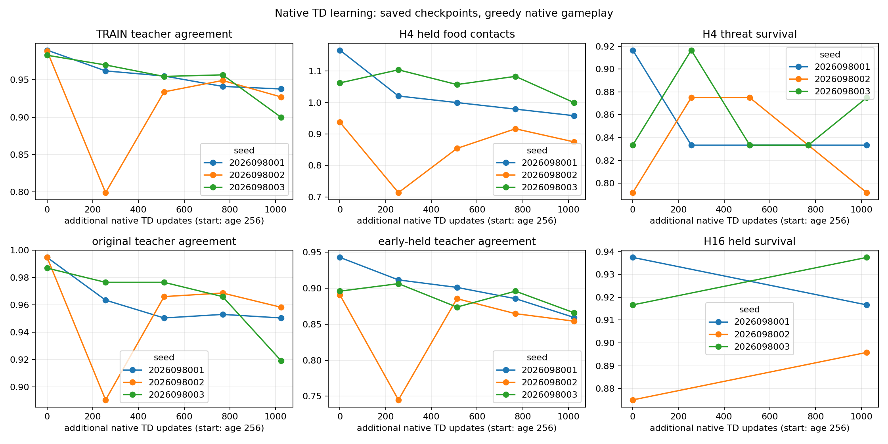
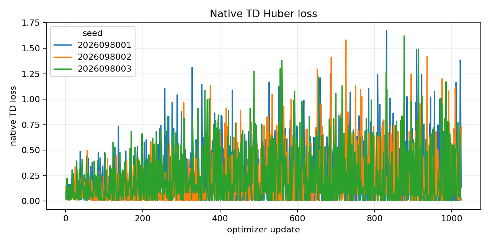
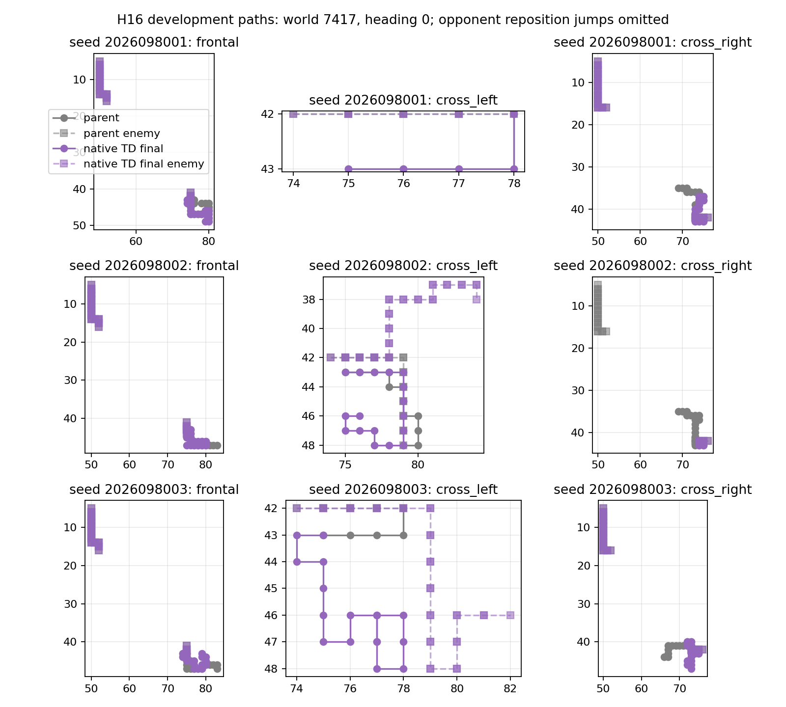
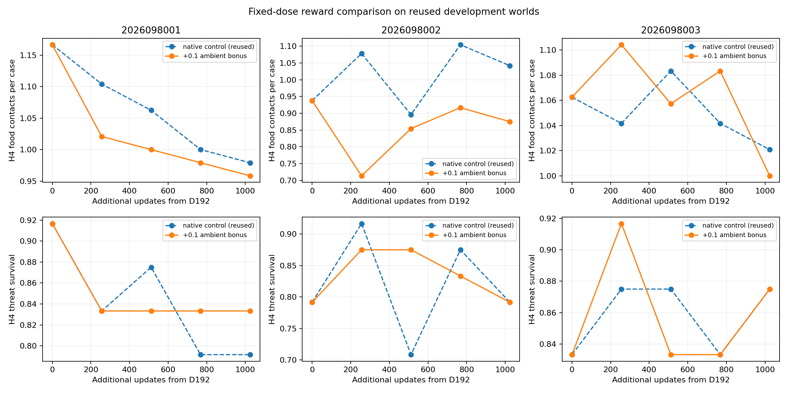

# Controlled-encounter ambient objective — 2026-09-22

The κ=0.1 ambient-food reward overlay did not preserve the established
competence and retention requirements after 1,024 native updates in any of the
three D192 parent lineages. This reward line is ended: there is no coefficient
or dose sweep, promotion, fresh-world confirmation, or claim of a population
effect. Apex remains the incumbent.

This closeout is for readers reviewing the controlled-encounter PQN research.
It assumes familiarity with the prior `SHORT64`, D192, and completed N native
control artifacts. The compact [closeout record](/Users/josenunez/Projects/ml/snake-dqn-artifacts/ongoing-research-20260913/controlled-encounter-ambient-objective/closeout.json)
is the authoritative result; the detailed reports are linked below.

## Treatment and fixed protocol

Each candidate restored the complete D192 network and Adam state at age 256,
then made exactly 1,024 updates (marks 0, 256, 512, 768, and 1,024). The only
intervention was an added reward of κ=0.1 for an ambient-food pickup when the
transition was valid and the hero was alive after the step. Corpse food, death,
and invalid rows received no overlay. The qualified N native control was
reused without retraining or new control games; action, root, and SGD maps were
the same paired streams. Candidate and N use the same ex-ante seeds and RNG
algorithms, but their trajectories and draw counts can diverge after the reward
treatment changes an action or state.

The three candidate lineages were `2026098001`, `2026098002`, and
`2026098003`. They account for 3,072 scientific updates and 292,519 hero agent
steps. The qualification made three discarded updates over 288 native valid
transitions; it wrote no checkpoint and accessed no held data.

## Result

All three lineages failed the fixed final absolute/competence package,
teacher-membership fit package, global-relative package, cumulative-parent
retention package, `SHORT64` retention package, and immediate-D192 retention
package. All three completed the declared first-cycle root coverage (6,144
roots per lineage). This coverage result does not offset the failed gates.

The H16 gameplay endpoints below are counts across 192 cases per lineage.
Teacher-membership fit is evaluated separately in the closeout's `fit` records;
it is a saved-set agreement measurement, not gameplay success. The table keeps
the H16 food/survival outcome separate from that fit evidence.

| Seed | Ambient treatment at 1,024: food / survived | Reused N control at 1,024: food / survived | D192 parent: food / survived | Final gate packages |
| --- | ---: | ---: | ---: | --- |
| 2026098001 | 849 / 176 | 984 / 168 | 1,064 / 180 | absolute, fit, relative, cumulative, SHORT64, and D192 retention: fail; first-cycle coverage: pass |
| 2026098002 | 868 / 172 | 889 / 172 | 978 / 168 | absolute, fit, relative, cumulative, SHORT64, and D192 retention: fail; first-cycle coverage: pass |
| 2026098003 | 909 / 180 | 1,034 / 180 | 1,055 / 176 | absolute, fit, relative, cumulative, SHORT64, and D192 retention: fail; first-cycle coverage: pass |

Food point estimates were lower than the matched N control in every lineage.
H16 survival was higher for seed `2026098001` and unchanged for the other two;
it does not establish a fresh-world or population-level effect. The decision
uses the predeclared all-lineage conjunction rather than this descriptive
comparison.

The treatment's final teacher-membership fit is reported separately below. It
measures membership in the fixed teacher action set, so it neither substitutes
for nor explains the H16 gameplay outcomes above.

| Seed | Own TRAIN membership at 1,024 | Early-held membership at 1,024 |
| --- | ---: | ---: |
| 2026098001 | 93.7851% | 85.9375% |
| 2026098002 | 92.7116% | 85.4167% |
| 2026098003 | 89.9867% | 86.5885% |

## Figures

The four files below are byte copies of completed analysis outputs. Their
captions state the encoding for each figure; the figures were not re-rendered.

*Learning curves at the fixed marks. Blue, orange, and green identify seeds
`2026098001`, `2026098002`, and `2026098003`, respectively. These are
development-study measurements, not fresh-world confirmation.*

*Native-TD loss over each of the 1,024 updates. Blue, orange, and green identify
seeds `2026098001`, `2026098002`, and `2026098003`, respectively; it does not
establish a causal learning mechanism.*

*Representative H16 development paths. Purple final is the ambient-bonus
treatment at mark 1,024 and gray is the D192 parent; selected paths do not
generalize beyond the fixed development worlds.*

*Paired comparison with the completed reused N control. Blue dashed is reused
N and orange solid is the ambient-bonus treatment; it does not represent a new
control training or evaluation run.*

## Execution and boundaries

Nine guarded attempts completed naturally with return code 0 and no observed
source or driver drift. They charged 2,278.1068100829143 seconds against the
4,200-second budget. The receipts recorded minimum available memory of
30,257,152,000 bytes and peak RSS of 6,306,447,360 bytes. MPS allocations are
latest-heartbeat values rather than measured peaks, so they are not added to
RSS on unified memory.

The evaluation used eight adaptively reused development worlds. It is neither
an untouched generalization study nor fresh confirmation. The study's result
ends only this ambient-reward line; the closeout admits no new numerical work.

## Evidence and integrity

- [Frozen intent](/Users/josenunez/Projects/ml/snake-dqn-artifacts/ongoing-research-20260913/controlled-encounter-ambient-objective/intent.json)
  — `FROZEN_BEFORE_EXECUTION`; SHA-256 `593a891a6136909008d6acc88538a785d7b2f7ac1b64f0ffadb638c712d2aa9f`.
- [Qualification report](/Users/josenunez/Projects/ml/snake-dqn-artifacts/ongoing-research-20260913/controlled-encounter-ambient-objective/qualification/report.json)
  — `PASS`; SHA-256 `ab15acbc2df6af09a81a34a3af70fc65685f14e7838ba3893f03aba672fdbdaf`.
- [Audited analysis](/Users/josenunez/Projects/ml/snake-dqn-artifacts/ongoing-research-20260913/controlled-encounter-ambient-objective/analysis/report.json)
  — `COMPLETE_AUDITED`; SHA-256 `18e36676e601fe0dc398f8303d48d87a889552d2e1f2d342d136882afb755501`.
- [Independent audit](/Users/josenunez/Projects/ml/snake-dqn-artifacts/ongoing-research-20260913/controlled-encounter-ambient-objective/audit/report.json)
  — `PASS` with `errors: []`; SHA-256 `3cf225aaabbdef6491099ea06c9c7114e004f9b30e5487ac0d9deb5a740932d0`.
- [Closeout](/Users/josenunez/Projects/ml/snake-dqn-artifacts/ongoing-research-20260913/controlled-encounter-ambient-objective/closeout.json)
  — `COMPLETE_AUDITED_AMBIENT_REWARD_LINE_ENDED`; SHA-256 `0d72f4013faeb495adea93dc6f90f00eb782166039b364cef582d0e9b76cba40`.

The packaged figures were verified as byte-identical to their completed source
files (`cmp -s` and SHA-256):

| Figure | SHA-256 |
| --- | --- |
| `learning-curves.png` | `d145d2e6a098cd2bf6139908833ebeda373cadbb9760e39d93e448d341956580` |
| `native-td-loss.png` | `5a745f9f3080dd1865f018c7eed7037e354b7f3dbcebc6614c5fe867966805b3` |
| `representative-h16-paths.png` | `1e9fcd9b03d37aaa3ffe7bb39dcaa3c97e9308cb8ebebbdd7c33812ace0c090f` |
| `matched-native-comparison.png` | `8f027dae9adba7d05f51cbb27f8cc32ff3960cb2a3110581b25cfbedb7872a01` |
