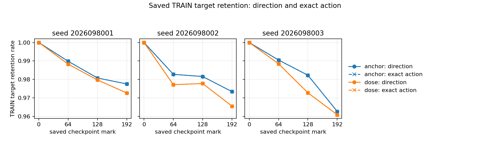

# Controlled-encounter anchor retention — 2026-09-22

The completed saved-record census found that the direction-anchor arm retained
slightly more eligible TRAIN parent directions than native TD. That static
retention result does not rescue the anchor arm's completed gameplay result:
all original all-three gates remain false, with no fresh confirmation or
promotion eligibility.

This record is for researchers assessing whether the completed anchor changed
its frozen parent direction on the existing TRAIN corpus. It assumes familiarity
with the [direction-anchor study](../controlled_encounter_direction_anchor_2026-09-22/README.md),
which remains the source for gameplay and endpoint evidence. The census used
saved actions and cached parent targets only; it ran no neural-network forward,
SGD update, new gameplay, fresh inference, or physical-Q-margin calculation.

## What was checked

For each seed, arm, mark, scope, and curve, the census compared saved greedy
actions with the cached parent direction. The TRAIN dataset has 25,616 rows:
24,576 unique `(case, step)` pairs plus 1,040 alternate-prefix rows. Its frozen
ordinal is the row identity. The supplemental audit validated that this is the
correct identity model; it did not incorrectly require unique case-step pairs.

All 360 aggregates and 614,784 saved-fit rows were verified. At mark 0, the
anchor and native-TD actions and directions exactly matched their caches for all
three lineages. Across the curves, every changed action was a direction change:
there were zero speed-only changes and zero changes to both direction and speed.

## Final saved-direction retention

The final mark compares the direction-anchor arm with native TD on each seed's
eligible crossing TRAIN rows. Percentages are retained parent directions divided
by eligible rows. “Fewer changes” is descriptive, not a gameplay metric.

| Seed | Anchor retained | Native TD retained | Anchor rate | Native TD rate | Fewer changed TRAIN directions |
| --- | --- | --- | --- | --- | --- |
| 2026098001 | 8,196 / 8,384 | 8,155 / 8,384 | 97.7576% | 97.2686% | 41 |
| 2026098002 | 8,196 / 8,420 | 8,130 / 8,420 | 97.3397% | 96.5558% | 66 |
| 2026098003 | 8,102 / 8,416 | 8,087 / 8,416 | 96.2690% | 96.0908% | 15 |

The modest 41, 66, and 15 direction-change differences do not establish a
physical-Q margin, a causal mechanism for the completed learning trajectory, or
better behavior. The anchor study's saved gameplay and gate result remain
unchanged: its all-three mechanism, competence, parent-retention, incremental,
relative, and old-competence packages are false.

## Audit history and limits

The original independent audit is preserved with status `FAIL`. Its eight
errors were assumption failures: seven producer guard fields were looked up in
the child command rather than the structured launch/receipt records, and the
auditor imposed the incorrect unique-case-step requirement. The original failed
receipt remains part of the evidence history.

The supplemental audit passed without rerunning numerical analysis. It reused
the original numerical and ordered-action checks, verified the 360 existing
curves, read the correct structured guard fields (`cpu`, one environment, two
threads, 90-second wall limit), and accepted the 1,040 alternate-prefix rows
under frozen ordinal row identity. This resolves the auditor's assumptions; it
does not change any saved actions, prior verdicts, or the scope of the census.

There were three charged attempts: two completed and one failed, totaling
`87.59706270892639` seconds of the 210-second budget. The supplemental work
performed zero learning updates, model forwards, and native games. The completed
closeout preserves all three receipts and the original failure. Peak RSS was
3.150 GiB; minimum available memory was 29.327 GiB.
The configured limits remained 8 GiB RSS, 24 GiB MPS, and a 9.6 GiB reserve.

## Next direction

The rehearsal line stops: no margin or coefficient sweep follows this failed
gameplay result. The next separately frozen question is whether a larger fixed
native PQN dose from the completed D endpoints can recover behavior after a
complete first pass through all TRAIN roots. That study must retain every prior
criterion and use its fixed final endpoint. This census does not establish that
more native training will work; it keeps the prior failures intact.

- [Frozen intent](/Users/josenunez/Projects/ml/snake-dqn-artifacts/ongoing-research-20260913/controlled-encounter-anchor-retention/intent.json)
  — SHA-256 `69a9fd441a84415e7ac06464b06fb2f3134d39dd8d7180653ec4dc9568c3357a`.
- [Saved-record analysis](/Users/josenunez/Projects/ml/snake-dqn-artifacts/ongoing-research-20260913/controlled-encounter-anchor-retention/analysis/report.json)
  — `COMPLETE_SAVED_RECORDS`; SHA-256 `fa4088b5d171e429f3abf49e3c0130a454c486f4bf0d4fd4b7ead8a0332f15ad`.
- [Preserved original audit](/Users/josenunez/Projects/ml/snake-dqn-artifacts/ongoing-research-20260913/controlled-encounter-anchor-retention/audit/report.json)
  — `FAIL`; SHA-256 `aacc8504f29f932e6e5567414a674da76b1142c0efdf72126e3c2856a1cc4221`.
- [Audit supplement](/Users/josenunez/Projects/ml/snake-dqn-artifacts/ongoing-research-20260913/controlled-encounter-anchor-retention/audit-supplement/report.json)
  — `PASS`; SHA-256 `819b9e64f874cc817514090e5eeed49b7b951893e5c1d43c403032a32525ab96`.

- [Completed closeout](/Users/josenunez/Projects/ml/snake-dqn-artifacts/ongoing-research-20260913/controlled-encounter-anchor-retention/closeout.json)
  — SHA-256 `85e8f57e37b9297686367568e2364fee61822cd6bee4a57cd4143244b28006f2`.
