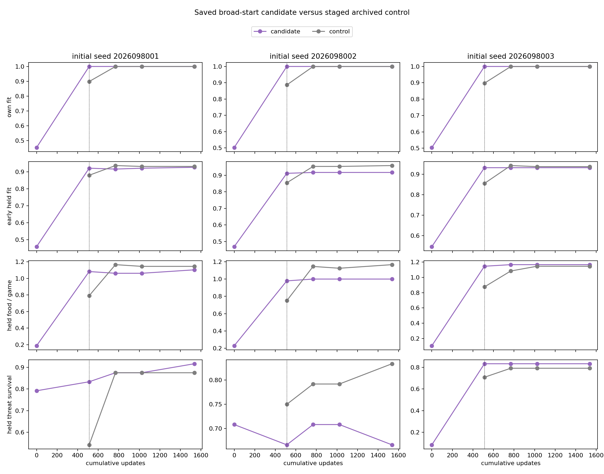
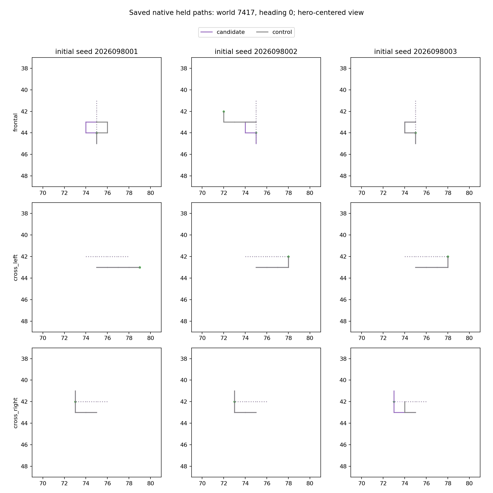

# Controlled-encounter broad-start learning — 2026-09-21

Training on the 256-world corpus from update 1 did not produce a reliable
held-world benefit at the matched 1,536-update dose. All three relative-effect
packages and all three candidate-competence packages are false, so fresh
confirmation is not permitted. This study does not promote or replace the
incumbent Apex policy.

The comparison continues the admitted
[global-teacher learning study](../controlled_encounter_global_teacher_learning_2026-09-21/README.md).
Both arms began from the same untrained mark-0 network and empty Adam state
in each of the three existing initialization lineages. The broad-start candidate
restored that archived initial state and trained for 512 updates on the 256-world corpus, then
used the exact 1,024-update global-corpus suffix. Its staged control used 512
small-corpus updates before that same global suffix. The early corpus breadth
and sample order therefore change together; total dose and the final 1,024
batches are matched. These were fresh runs from archived initial states, not
previously unseen seeds or independent datasets.

## Final behavior at mark 1536

Every broad-start candidate reached 100% membership on its own corpus by mark
512. The table uses the final fixed mark, with no best-checkpoint selection.
The held set comprises eight adaptively reused development worlds and is not
fresh confirmation.

| Lineage | Held food: staged control → broad start | Held survivors: staged control → broad start | Broad-start early-held fit | Food change per case, 95% CI | Threat-survival change, 95% CI |
| --- | ---: | ---: | ---: | --- | --- |
| 2026098001 | 220 → 212 | 180 → 184 | 92.71% | −0.0417, [−0.1859, +0.1026] | +0.0417, [−0.1369, +0.2203] |
| 2026098002 | 224 → 192 | 176 → 160 | 91.67% | −0.1667, [−0.3773, +0.0440] | −0.1667, [−0.3773, +0.0440] |
| 2026098003 | 220 → 224 | 172 → 176 | 93.23% | +0.0208, [−0.0685, +0.1101] | +0.0417, [−0.1369, +0.2203] |

The original criteria remain unchanged (SHA-256
`69814e5ded5fda4ba8adfc8fca3f00aae0d41f0fd1aa64ef654877a8e1896fd4`).
Each relative package fails the food and threat lower-bound gates, although
benign noninferiority passes. Every candidate also fails its complete
competence package, including the retained absolute and fit requirements. The
staged mark-512 result is a frozen retention reference, not a candidate parent.

The saved curves use purple for the broad-start candidate and gray for the
staged control. The control has no update-0 global-fit curve because its first
512 updates used the small corpus. Both figures report fixed saved marks and do
not alter the decision.

## Qualification, execution, and audit scope

The three broad-start candidates used 4,608 scientific updates and 589,824
examples in total. An eight-update qualification was discarded; every
scientific run reloaded the exact initial state. One qualification attempt
failed before any update after comparing archived optimizer metadata as integer
`0` versus float `0.0`; it was preserved and charged 8.336927 seconds. The
versioned v2 trainer restored the exact archived empty-Adam state for all
scientific runs.

Across 10 attempts, nine completed and one failed qualification was preserved.
Charged execution was 637.1944867920829 seconds of the 1,470-second budget.
Peak RSS was 8,008,155,136 bytes and minimum available memory was
29,523,230,720 bytes.

The root-saved audit is `COMPLETE_AUDITED_PASS`. It recomputed final saved-game
endpoints and intervals, and checked initial-state proofs, suffix batches,
dose, qualification, receipts, and unchanged criteria. It relies on the
qualified analysis for tensor contents, native mechanics, NPZ fit, and absolute
gates. This is a root audit. A separate pre-execution static review cleared five drivers, but explicitly
provides neither runtime qualification nor behavioral evidence. The closeout is
`COMPLETE_AUDITED_NO_RELIABLE_BENEFIT`. No new confirmation-world gameplay ran
and no Apex promotion is authorized.

## Source records

- [Frozen broad-start intent](/Users/josenunez/Projects/ml/snake-dqn-artifacts/ongoing-research-20260913/controlled-encounter-broad-start-learning/intent.json)
  — SHA-256 `73a7d2ad54fb496cf84126fb37d83f11c1c1bca2d53570ff5edf20518502b7d9`
- [Unchanged learning criteria](/Users/josenunez/Projects/ml/snake-dqn-artifacts/ongoing-research-20260913/controlled-encounter-broad-start-learning/learning-criteria.json)
  — SHA-256 `69814e5ded5fda4ba8adfc8fca3f00aae0d41f0fd1aa64ef654877a8e1896fd4`
- [Completed saved analysis](/Users/josenunez/Projects/ml/snake-dqn-artifacts/ongoing-research-20260913/controlled-encounter-broad-start-learning/analysis/report.json)
  — SHA-256 `8bec5fd5984d580f640b8d312e7f5d731f7200a2c58cb876bd30764c6f460181`
- [Root-saved audit](/Users/josenunez/Projects/ml/snake-dqn-artifacts/ongoing-research-20260913/controlled-encounter-broad-start-learning/root-saved-audit.json)
  — SHA-256 `3622a99da26705be3467ed45d811cf30b3a797a5c494c861d0b375fcb7ae0842`; [audit script](/Users/josenunez/Projects/ml/snake-dqn-artifacts/ongoing-research-20260913/controlled-encounter-broad-start-learning/root-saved-audit.py)
  — SHA-256 `016b94c3ddb044f3c028338f2a8a3623f6ec5edda4ee986f6174a666afeac960`
- [Repair note](/Users/josenunez/Projects/ml/snake-dqn-artifacts/ongoing-research-20260913/controlled-encounter-broad-start-learning/repair-note.json)
  — SHA-256 `df50745c15155be6143bb77891d0b8dabc8218f9c91508a237a98634897be1de`
- [Pre-execution static review](/Users/josenunez/Projects/ml/snake-dqn-artifacts/ongoing-research-20260913/controlled-encounter-broad-start-learning/static-review.json)
  — SHA-256 `6fbc211f38432e2fafef32c43f88b87ab6673da09179d5531ae9f42907cfdc2d`
- [Audited closeout](/Users/josenunez/Projects/ml/snake-dqn-artifacts/ongoing-research-20260913/controlled-encounter-broad-start-learning/closeout.json)
  — SHA-256 `4f2dce4cdba540ba79ae87633fb18f4306c9249d005c60d78bd1499eecd3b677`
- [Saved curve source](/Users/josenunez/Projects/ml/snake-dqn-artifacts/ongoing-research-20260913/controlled-encounter-broad-start-learning/analysis/learning-curves.png) and [path source](/Users/josenunez/Projects/ml/snake-dqn-artifacts/ongoing-research-20260913/controlled-encounter-broad-start-learning/analysis/representative-paths.png)
