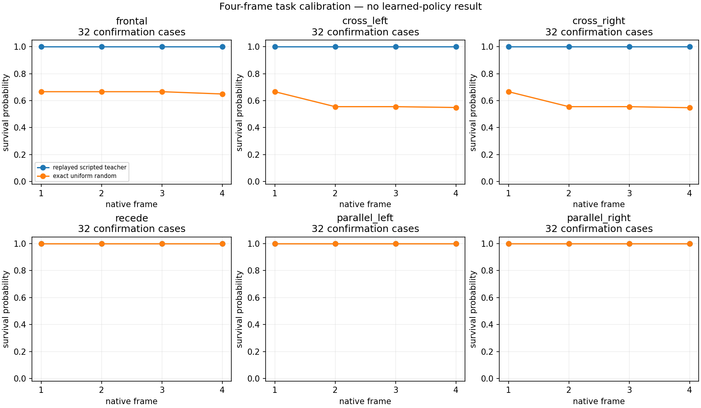
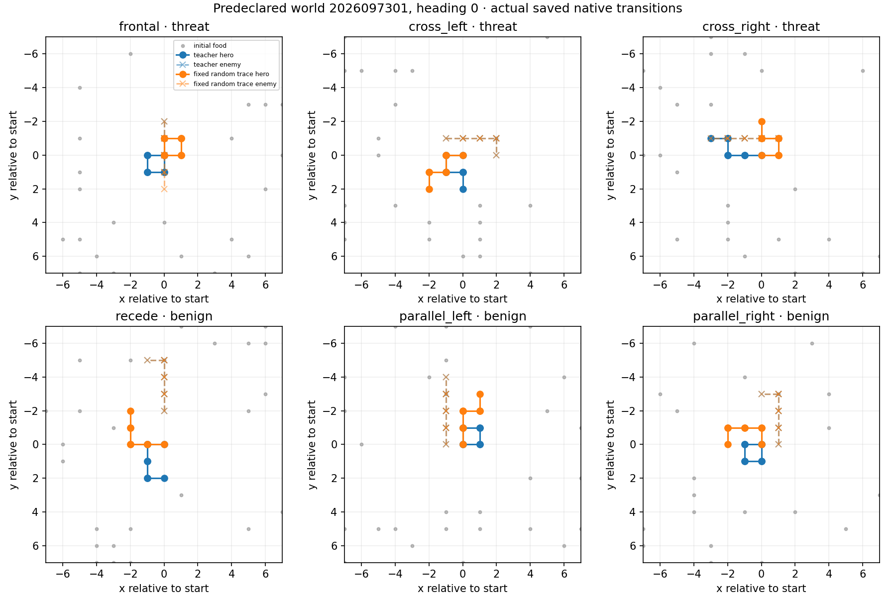

# Controlled encounter calibration

This completed calibration establishes a finite, scripted encounter bank for
measuring immediate opponent handling without running a learned model. It is not a
policy evaluation, promotion result, or claim about global observability. The
audited closeout used 576 candidates across six families, all of which were
admitted. It made zero model-inference calls and is not promotion-eligible.

The bank separates frontal, cross-left, and cross-right threat encounters from
parallel-left, parallel-right, and receding benign encounters. Every calibration
family had 64 admitted cases (16 per heading); the independent confirmation split
had 32 (8 per heading). Heading counterfactuals changed only channel 3 across 96
checks. Ordinary, food-maintenance, and opponent-respawn cases retained full native
state/RNG parity while leaving the original node unchanged.

The scripted teacher survived all 576 cases. On confirmation worlds, exact random
survival was 64.97% for frontal encounters, 54.94% for cross-left, and 54.78% for
cross-right; all three benign families were 100% up to floating-point roundoff.
The mean teacher advantage on confirmation threats was 41.77 percentage points.
All six task-viability gates passed. These are calibration measurements, not
learned performance. The task uses four-frame episodes, length-one starting
snakes, fixed GreedyFood opponents, and controlled local food density. Results
cannot establish long-game survival or general opponent handling.

The run used two CPU threads and serialized jobs, with an 8 GiB RSS limit and at
least 9.6 GiB available system memory. Peak RSS was 292,339,712 bytes and minimum
available memory was 32,552,402,944 bytes. It used no MPS learner. The audited
closeout SHA-256 is
`877352fab51e99b575a5c32a5d4567a5149b7a85615490012c69968776819651`.

Five physical attempts consumed 82.337 seconds of a 720-second budget. A
`plotting-v2` attempt failed before child launch when a relative interpreter path
was resolved in the source worktree; its receipt is retained and its full 30-second
cap was conservatively charged. `plotting-v3` changed only that interpreter path.
The calibration, qualification, and repaired plotting completed, and the closeout
records visual inspection of these saved figures.

The next planned measurement is a six-checkpoint encounter probe: the three
immediate parents and three final-dose checkpoints will first be observed playing
this task greedily, before any targeted learning is considered. That probe is
planned work, not a result recorded here.
