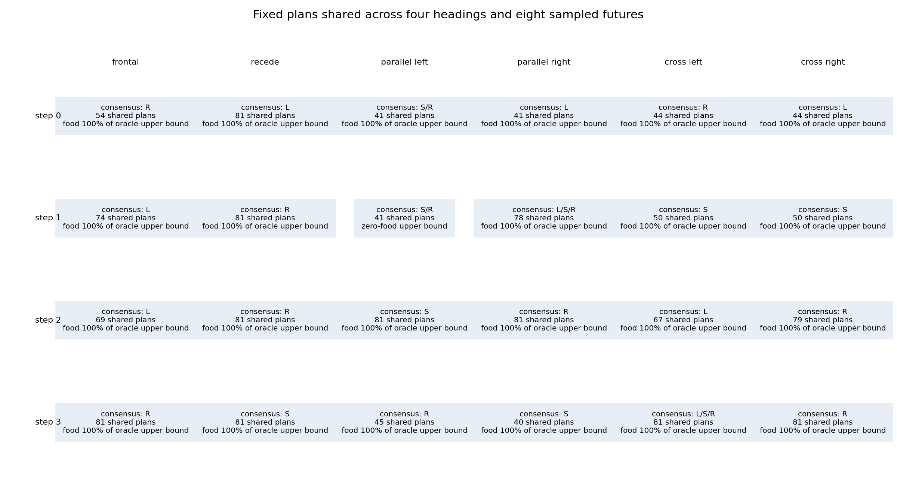

# Controlled-encounter common-path feasibility probe — 2026-09-21

All six frozen feasibility gates passed for a proposed common-path teacher
target. Across 25 selected four-heading groups and eight sampled future RNG
states per group, all 800 counterfactual cells were eligible and every group
had at least one common valid four-action plan. This permits a separately
frozen qualification of a *receding* teacher only. It does not admit new data,
replace labels, train a learner, show a learned-policy gain, or reopen the
rejected 256-world expansion.

This study follows the [world-expansion rejection](../controlled_encounter_world_expansion_2026-09-21/README.md) and the
[expansion-alias probe](../controlled_encounter_expansion_alias_2026-09-21/README.md),
which supplied the prior same-input/future-RNG evidence. The completed
[world-breadth learning comparison](../controlled_encounter_world_breadth_learning_2026-09-21/README.md)
remains the source of the previous learning curves and native policy paths.

## What the target requires

At an actual current Watch decision, the probe captured the prepared receiver,
then varied only the post-Watch, pre-action future-RNG state before evaluating
candidate action plans. Each group joins four equal retained-input headings and
uses eight donor RNG states, giving 32 scenarios. A common path is an exact
surviving, resolved-valid four-action sequence shared by every scenario. Its
target contains all first-action ties among the highest-scoring common paths:
sum total food first, then summed early-food priority `8/4/2/1`.

All six resolved native actions remained in the candidate contract, including
boost-speed actions; the probe did not collapse actions 3–5 into actions 0–2.
The one adapter-qualification query used saved oracle parity for case 3416
after prefix `0,1`. It verified the new capture point against the saved
native-node result. It is one parity check, not 800 repeated baseline oracle
queries.

## Feasibility result

All six gates passed:

- all 800 cells were eligible;
- all 25 groups had a nonempty common path;
- all 24 controls had the same first-action target for each RNG half and all
  eight donors;
- every positive control collected food;
- positive-control food utility was at least 80% of its oracle upper bound;
- the known right-action alias witness was exactly stable.

The 24 controls had exact half-versus-full equality. The 23 positive-food
control groups contributed 1,120 food contacts across 736 scenarios, matching
the summed oracle upper bound. Both the macro ratio and minimum group ratio
were 1.0. Control 09 had a zero-food upper bound and is reported separately;
controls were selected without consulting food outcomes. The known-conflict
group (cases 3416–3419) retained right in both donor halves and all eight donors,
with 64 food contacts across its 32 scenarios, matching its oracle upper bound.

The full selected-group table is available in [per-group.csv](per-group.csv).

## What this result does and does not establish

The fixed common-plan requirement demonstrates feasibility for these 25
selected training-state groups and eight sampled futures. It is deliberately
more restrictive than a receding teacher: a legitimate teacher would regroup
by the current retained input, recompute a target, take one action, and plan
again at the next decision. Fixed-plan feasibility therefore does not show
receding gameplay, target stability under all futures, or learned behavior.

The group comparisons condition on the full native state apart from the RNG
factor, and on four selected headings. The 80% utility floor is an engineering
threshold, not a confidence interval. A future failed group may not be dropped
or replaced. The rejected expansion, its unexecuted learning comparison, all
existing evaluation criteria, and the Apex incumbent remain unchanged. Apex is
retained because the shared tournament gate remains the promotion authority;
this is not an inherent-superiority or historical-dose comparison.

## Execution and audit

The native probe and saved analysis completed with two successful receipts and
no failure. They charged 108.67119708302198 seconds of the 300-second budget.
Peak RSS was 2,473,672,704 bytes and minimum available memory was
30,842,798,080 bytes. The probe performed 152 native prefix steps, 800
counterfactual H4 queries, and one saved-oracle parity query; it made zero
learner updates and zero model inferences.

The independent audit and consolidated closeout are `COMPLETE_AUDITED`, with
180 independent checks passed. The audit recomputed all group reductions and
verified the relevant evidence, 263 seed declarations, and runtime source
closure. It did not independently reread the full 10.1 GB inherited input map;
the guarded jobs checked that frozen map before and after execution.
Receding-teacher qualification remains the next experiment.

## Source records

- [Frozen common-path intent](/Users/josenunez/Projects/ml/snake-dqn-artifacts/ongoing-research-20260913/controlled-encounter-common-path/intent.json)
  — SHA-256 `947770cfa5894f8b659853cf3c206ef599f061ba7f6bbf7999fcef200ca1fd16`
- [Completed common-path probe](/Users/josenunez/Projects/ml/snake-dqn-artifacts/ongoing-research-20260913/controlled-encounter-common-path/probe/report.json)
  — SHA-256 `8da98973da84d31cbe4cc808fd71ec418928b67be59661e77072ffb07c3262b3`
- [Completed saved analysis](/Users/josenunez/Projects/ml/snake-dqn-artifacts/ongoing-research-20260913/controlled-encounter-common-path/analysis/report.json)
  — SHA-256 `d316609bf1b1c8817f49b1ac7ae634b6e5bfb50c81a9760147a9191c20818e20`
- [Native-probe receipt](/Users/josenunez/Projects/ml/snake-dqn-artifacts/ongoing-research-20260913/controlled-encounter-common-path/supervisor-runs/probe/receipt.json)
  and [saved-analysis receipt](/Users/josenunez/Projects/ml/snake-dqn-artifacts/ongoing-research-20260913/controlled-encounter-common-path/supervisor-runs/analysis/receipt.json)
- [Copied comparison figure source](/Users/josenunez/Projects/ml/snake-dqn-artifacts/ongoing-research-20260913/controlled-encounter-common-path/analysis/common-path-comparison.png)
  and [per-group source](/Users/josenunez/Projects/ml/snake-dqn-artifacts/ongoing-research-20260913/controlled-encounter-common-path/analysis/per-group.csv)

- [Independent audit](/Users/josenunez/Projects/ml/snake-dqn-artifacts/ongoing-research-20260913/controlled-encounter-common-path/independent-audit.json)
- [Consolidated closeout](/Users/josenunez/Projects/ml/snake-dqn-artifacts/ongoing-research-20260913/controlled-encounter-common-path/closeout.json)
  — SHA-256 `43813e7c8aa443eb68d729dc1fe44f29496ddbd2d1ab87a174b760bdd42ec604`
