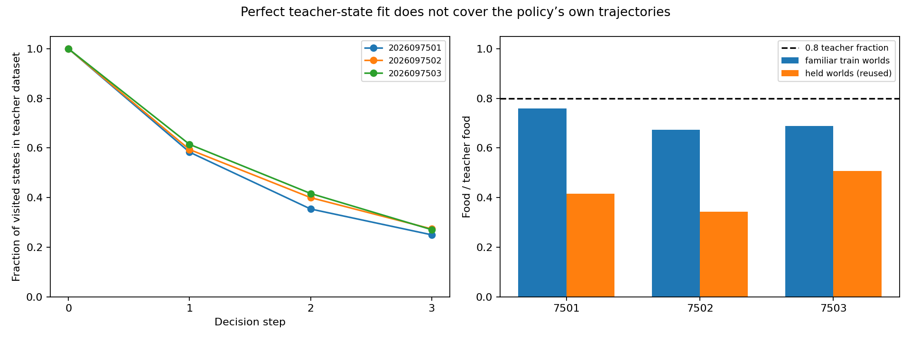

# Controlled-encounter coverage diagnostic — 2026-09-21

This diagnostic measured whether the final food-label learners
visited states exactly present in their original teacher training dataset. It
loaded the completed final checkpoints and ran new greedy gameplay on all 384
training-world cases for each seed. It reused the completed held evaluations;
it did not rerun held games, fit a model, or infer teacher labels for uncovered states.

## Familiar-world coverage

On the 384 familiar train games, the three final seeds collected 291, 258, and
264 food contacts against 383 teacher contacts. They survived 380, 364, and 380
of 384 games. Exact teacher-input coverage was 54.69%, 56.81%, and 57.55%.

| Seed | Food / teacher | Survivors | Exact state coverage | First uncovered state: step 1 / 2 / 3 / never | Fourth-step covered / visited |
| --- | ---: | ---: | ---: | --- | ---: |
| 2026097501 | 291 / 383 | 380 / 384 | 54.69% | 160 / 88 / 40 / 96 | 96 / 384 |
| 2026097502 | 258 / 383 | 364 / 384 | 56.81% | 156 / 76 / 48 / 104 | 104 / 380 |
| 2026097503 | 264 / 383 | 380 / 384 | 57.55% | 148 / 76 / 56 / 104 | 104 / 384 |

Every covered action was checked as a member of its stored teacher set; this was
a run-completion invariant. The original teacher NPZ contains 1,536 state rows
but only 429 unique transformed inputs. Coverage means exact membership in that
stored set, not a distance estimate or an oracle label for states outside it.

## What the diagnostic establishes

The coverage gap and the familiar-world underperformance are observed together:
only about 55–58% of visited states were covered, and all three familiar-world
food totals were below the teacher total. First uncovered states occurred after
the shared initial state, most often at step 1. The fourth-step coverage counts
show that many later visited states remained outside the original dataset.

This is not a causal estimate. In particular, a DAgger-style data-aggregation
intervention may help, may not help, or may affect another failure mechanism;
its benefit is untested. No held games were rerun, and this diagnostic makes no
learning, promotion, or policy-selection claim.

## Execution boundary

The frozen diagnostic used two guarded jobs—trajectory diagnosis and
saved-artifact analysis—in **19.55 seconds**, within its 150-second budget.
Both receipts record natural exit code 0 and no source/driver drift. Peak RSS
was 951,353,344 bytes (about 907 MiB), and minimum available memory was
31,976,341,504 bytes (about 29.8 GiB). It preserved the existing
food-label evaluation outputs and original teacher arrays. A separate
train-only aggregation-label feasibility check is being frozen next; this report
does not assume its result.

## Source records

- `controlled-encounter-coverage-diagnostic/diagnose/report.json`
- `controlled-encounter-coverage-diagnostic/analysis/report.json`
- `controlled-encounter-coverage-diagnostic/closeout.json` — SHA-256
  `eed64d35ecac84fbb260fff2f6aca9c363fa5d5d64a73b5fac8857d36af8349c`
- `controlled-encounter-coverage-diagnostic/supervisor-runs/*/receipt.json`
- [Food-label study closeout](../controlled_encounter_food_labels_2026-09-21/README.md)
