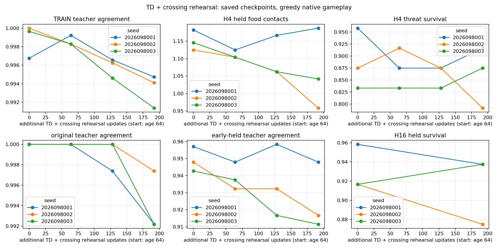
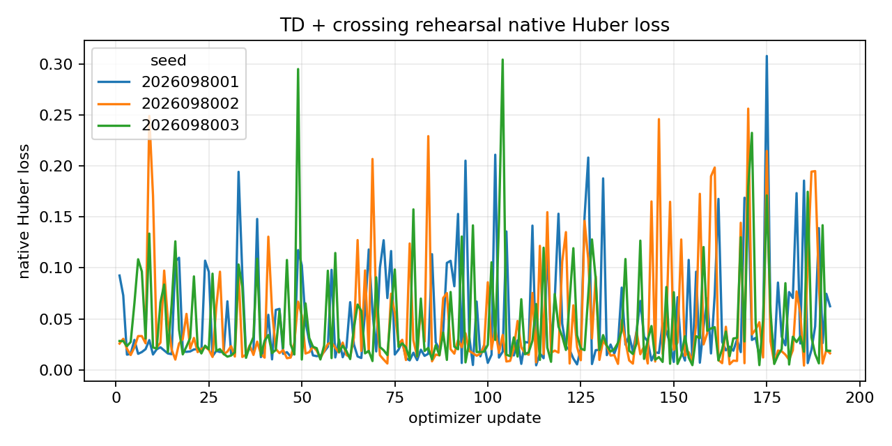
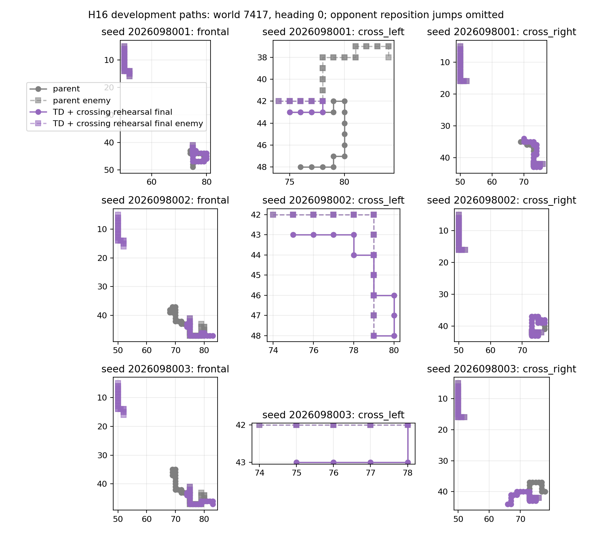

# Controlled-encounter crossing rehearsal — 2026-09-22

This prospective continuation adds a small teacher-set rehearsal term to the
qualified native TD update on crossing-family TRAIN rows. The completed analysis
and independent audit agree: none of the three seeds satisfies the combined
crossing-recovery and frontal-retention criteria. Every original all-seed gate
package also fails. These development results do not justify a very long run.

## Protocol

Each of the three lineages warm-started from the authenticated SHORT64 model and
full Adam state, then continued from optimizer age 64 to 256 for 192 updates.
The native update, 24 lanes, T=4 rollout, frame-16 cap, and Adam step remained
in place. Each update also drew 64 `cross_left` and 64 `cross_right` admitted
TRAIN rows from independent without-replacement family permutations and added
`0.01 ×` masked teacher-set NLL on physical Q values scaled by 0.1. Held states
never enter this auxiliary batch.

The scientific run comprises 576 updates and 54,946 recorded hero steps across
the three seeds. Five qualification updates were discarded. Training-fit rows
measure agreement with the teacher set; they are distinct from the native
gameplay endpoints below.

## Saved development endpoints

Entries are `food contacts / survivors`. H4 is the held 192-case slice; H16 is
the held 192-case continuation endpoint. `Parent` is SHORT64, `D` is the
unmodified dose continuation, and `R` is TD plus crossing rehearsal.

| Seed | Parent H4 | D H4 | R H4 | Parent H16 | D H16 | R H16 |
| --- | --- | --- | --- | --- | --- | --- |
| 2026098001 | 227 / 188 | 224 / 184 | 228 / 184 | 1,094 / 184 | 1,064 / 180 | 1,082 / 180 |
| 2026098002 | 216 / 180 | 180 / 172 | 184 / 172 | 1,106 / 176 | 978 / 168 | 946 / 168 |
| 2026098003 | 220 / 176 | 204 / 176 | 200 / 180 | 1,069 / 176 | 1,055 / 176 | 1,076 / 180 |

The fixed crossing recovery counts are 0/8, 4/12, and 8/8 by seed. Fixed
frontal retention is 4/4, 0/4, and 4/8. The prospectively frozen minima were
6/8, 9/12, and 6/8 crossing recoveries, together with 3/4, 3/4, and 6/8 retained
frontal gains. No seed meets both. No new crossing loss falls outside the
previous D loss set, and benign survival remains 96/96 for every seed.

These are adaptive development cases, not independent fresh-world trials.
The original relative, cumulative parent retention, incremental, and old
competence all-seed packages are false. The new mechanism package is also false.
Final TRAIN teacher agreement is 99.473%, 99.411%, and 99.137%; higher training
fit than D does not establish better gameplay.

The fixed representatives use world `2026097417`, heading 0, and indices 384
(`frontal`), 388 (`cross_left`), and 392 (`cross_right`) for each seed. They
are presentation evidence for those already selected paths only. Agreement and
survival axes are zoomed; H16 has only the two measured endpoints.

## Scope and next step

The eight development worlds are adaptive and remain unsuitable for a fresh
claim. The rehearsal intervention did not make the original gate package pass,
so this result is not ready to justify a long run. The next bounded question is
a gradient/credit diagnostic that tests how the auxiliary and native terms
interact; it should not select from these endpoints or open promotion.

The intervention draws on the native learner described by
[PQN](https://arxiv.org/abs/2407.04811) and the general use of prior examples in
[CLEAR](https://arxiv.org/abs/1811.11682) and
[Deep Q-learning from Demonstrations](https://arxiv.org/abs/1704.03732).
These are motivations, not claims to reproduce those methods.

## Evidence status

Independent audit-v4 passed with no errors. Twelve successful jobs and three
failed or partial attempts charged 902.6028096703812 seconds against the frozen
3,000-second budget. All three train/evaluation pairs completed once and were
reused during analysis repairs.

The import failure, analysis watchdog stop, and audit memory stop are preserved
with confirmed child exits. The audit memory stop peaked at 8,672,460,800 bytes
before the 8 GiB process guard terminated it. Releasing the previous seed's
large JSON objects allowed the completed audit to peak at 8,004,288,512 bytes.
Minimum available Mac memory across every attempt was 29,168,877,568 bytes
(27.166 GiB), above the 9.6 GiB reserve. Guards were unchanged.

The figures above are verified local copies of presentation-v4, which corrected
inherited candidate labels and reused the same saved data and fixed selectors.

- [Frozen intent](/Users/josenunez/Projects/ml/snake-dqn-artifacts/ongoing-research-20260913/controlled-encounter-crossing-rehearsal/intent.json)
  — SHA-256 `385166f4a92c841c1aae8efbab4ef95d6d8f45fb35f3d89507f6cab8faefa4b5`.
- [Analysis](/Users/josenunez/Projects/ml/snake-dqn-artifacts/ongoing-research-20260913/controlled-encounter-crossing-rehearsal/analysis/report.json)
  — SHA-256 `b43b6b722955dff9bd7e271745182a44b97e1b984fe9681adc3507b1dedb5204`.
- [Independent audit](/Users/josenunez/Projects/ml/snake-dqn-artifacts/ongoing-research-20260913/controlled-encounter-crossing-rehearsal/audit-v4/report.json)
  — `PASS`; SHA-256 `45e422ceaab5cde0145e55ea9c9e1c41f3d3f4dbae201815103422303f05174d`.
- [Presentation record](/Users/josenunez/Projects/ml/snake-dqn-artifacts/ongoing-research-20260913/controlled-encounter-crossing-rehearsal/presentation-v4/report.json)
  — SHA-256 `87d330ab56f7d0dc76e0bdc7e46ff29bfa81d2aec00d0c6f0c55acd64c14b86e`.
- [Closeout and every attempt](/Users/josenunez/Projects/ml/snake-dqn-artifacts/ongoing-research-20260913/controlled-encounter-crossing-rehearsal/closeout.json)
  — SHA-256 `6f1534d26dfdaa8e08bcf68d1e80585cb74846f86dfb1edd39541ec2be62c07d`.
