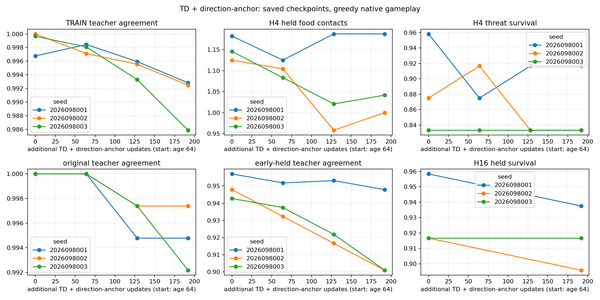
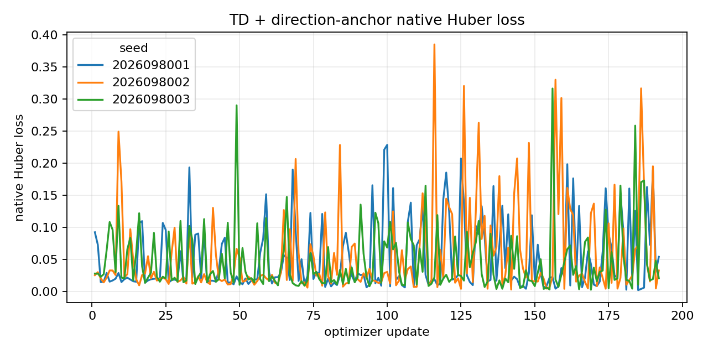
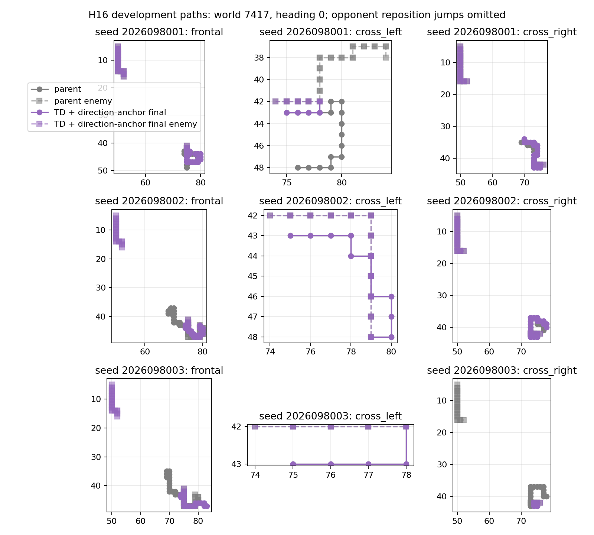

# Controlled-encounter direction anchor — 2026-09-22

The completed sparse direction-anchor intervention did not meet its frozen
three-lineage recovery rule. Every all-seed original package and the mechanism package
is false, so it opens neither fresh confirmation nor promotion. This is a
completed adaptive development result, not evidence for a longer run.

This record is for researchers comparing the bounded controlled-encounter
interventions. It assumes familiarity with the `SHORT64` parents, the native-TD
continuation (`D`), and the crossing-rehearsal arm (`R`). The anchor arm (`A`)
started from the same authenticated parent and full Adam state, then added a
crossing-only hinge that ranks the frozen parent's direction on admitted TRAIN
rows. The target did not anchor speed mode, Q calibration, value offsets,
frontal rows, non-crossing families, or behavior outside the sampled crossing
TRAIN states.

The direction-ranking margin is motivated by [DQfD's large-margin action
classification term](https://arxiv.org/html/1704.03732v4), without reproducing
DQfD or asserting its reported results apply here. The derivative-bound comparison
was loss-design motivation only;
it does not establish realized network-gradient, Adam-direction, or
long-horizon equivalence.

## Protocol and decision boundary

Each seed began from its authenticated `SHORT64` checkpoint at optimizer age 64
and completed 192 scientific updates to age 256. The native collector,
rehearsal stream, Adam state, and guards were retained. On each crossing-only
TRAIN batch, a frozen parent direction was admitted only where the existing
teacher mask allowed it, and the hinge used the maximum legal Q across the two
speed modes for each relative direction.

The study recorded marks 0, 64, 128, and 192. Mark 192 was the frozen endpoint;
it was not selected because it happened to be a peak. The study ran 576
scientific updates, plus five separately discarded qualification updates. The
25,260 cached parent-inference rows and 73,728 direction-anchor draws are
preparation/sampling records, not learning updates or gameplay.

The shared held bank and the eight development worlds are reused adaptive
evidence. No untouched confirmation was opened. The earlier `D` and `R`
endpoints are included only as completed-study comparators; differences from
`R` are descriptive and do not revise either frozen verdict or support promotion.

## Saved endpoints

Entries are `food contacts / survivors`. `Parent` is the authenticated
`SHORT64` state, `D` is the completed native-TD dose continuation, and `A` is
the direction-anchor endpoint at mark 192. H4 and H16 are the fixed saved
evaluation horizons, each with 192 held cases. These values come from the reused bank, so they do not
constitute fresh-world confirmation.

| Seed | Parent H4 | D H4 | A H4 | Parent H16 | D H16 | A H16 |
| --- | --- | --- | --- | --- | --- | --- |
| 2026098001 | 227 / 188 | 224 / 184 | 228 / 184 | 1,094 / 184 | 1,064 / 180 | 1,075 / 180 |
| 2026098002 | 216 / 180 | 180 / 172 | 192 / 176 | 1,106 / 176 | 978 / 168 | 1,041 / 172 |
| 2026098003 | 220 / 176 | 204 / 176 | 200 / 176 | 1,069 / 176 | 1,055 / 176 | 1,069 / 176 |

`A` differs from the completed `R` endpoint in some saved-bank counts, but the
shared adaptive cases make that comparison descriptive. The frozen decision
required every lineage to pass its mechanism and original competence/retention
packages; it did not permit cross-seed compensation or choosing an endpoint
from these differences.

## Mechanism result

The anchor preserved the selected D frontal gains, but did not recover enough
selected D crossing losses. The recovery threshold was 75% in each lineage.

| Seed | D crossing losses recovered | Required | D frontal gains retained | Required | Mechanism result |
| --- | --- | --- | --- | --- | --- |
| 2026098001 | 0 / 8 | 6 / 8 | 4 / 4 | 3 / 4 | FAIL |
| 2026098002 | 0 / 12 | 9 / 12 | 4 / 4 | 3 / 4 | FAIL |
| 2026098003 | 4 / 8 | 6 / 8 | 8 / 8 | 6 / 8 | FAIL |

Every seed retained its frontal cases, but none reached the crossing-recovery
minimum. Seed 2026098003 also introduced four new crossing losses outside the
original D loss set. The audited mechanism package is therefore false. All original
absolute competence, cumulative-parent retention, incremental retention,
relative retention, and old-competence all-seed packages are also false. No
fresh confirmation is permitted, and the shared tournament gate remains the
only promotion authority.

These presentation figures reuse the completed saved records. They performed
zero learning updates, model forwards, and native games. The representative
paths are fixed presentation cases (world `2026097417`, heading 0, indices 384
for `frontal`, 388 for `cross_left`, and 392 for `cross_right`); they do not
expand the mechanism set or provide fresh gameplay evidence.

## What this result allows next

The next small direction is a saved-record direction-retention join. It may
connect the completed records to inspect retention structure, but it must not
run a new learner, tune a coefficient, change a margin, sweep eligibility or
dose, or open confirmation. The result here does not justify coefficient
tuning or another direction-anchor training arm.

## Evidence status

All 14 guarded jobs completed; there were no failed attempts. The audit passed
with no errors, including the anchor-cache, qualification, sampling, and
primary decision-boundary checks. Total charged time was
`898.7905182121322` seconds of the frozen 3,000-second budget. The audit
records 576 scientific updates, five discarded qualification updates, 73,728
anchor draws, and 25,260 cache-inference rows as distinct quantities. Scientific
collection produced 54,861 valid hero transitions: 18,286 / 18,274 / 18,301 by
seed. Peak RSS was 7.501 GiB under the 8 GiB cap; available system memory stayed
above 27.862 GiB. The receipts do not expose an observed MPS peak, so the 24 GiB
MPS guard is not reported as measured consumption.

The frozen runtime source was `1f32d2de1987d97441fa74c1898ed9039b535f24`;
`main` at freeze was `dc47ab598ce6d847f56d722041d2a445a6e772f8`. The root
closeout reconciles all receipts and records the failed mechanism decision.
Apex remains incumbent; this is a promotion-status boundary, not a claim that
Apex is inherently superior to a learner with fewer training steps.

- [Closeout](/Users/josenunez/Projects/ml/snake-dqn-artifacts/ongoing-research-20260913/controlled-encounter-direction-anchor/closeout.json)
  — SHA-256 `51916ca411357ab9bf993b529cd0acbce281d9a59f6a6d40b5815c3e964bf8cf`.
- [Frozen intent](/Users/josenunez/Projects/ml/snake-dqn-artifacts/ongoing-research-20260913/controlled-encounter-direction-anchor/intent.json)
  — SHA-256 `c84a696893ae4427e182e5b310e7171e12e708e71ac10222c97469ca8fa4e310`.
- [Audited analysis](/Users/josenunez/Projects/ml/snake-dqn-artifacts/ongoing-research-20260913/controlled-encounter-direction-anchor/analysis/report.json)
  — `COMPLETE_AUDITED`; SHA-256 `957cf43b199d5af84e8b9926ff289c35d31a62f0d44bd45ae35ad2249880657e`.
- [Independent audit](/Users/josenunez/Projects/ml/snake-dqn-artifacts/ongoing-research-20260913/controlled-encounter-direction-anchor/audit/report.json)
  — `PASS`; SHA-256 `d0726401b41a9a18f820ec9ce92c4a74f828b5e4ef47339bdf559d331bba53ef`.
- [Presentation record](/Users/josenunez/Projects/ml/snake-dqn-artifacts/ongoing-research-20260913/controlled-encounter-direction-anchor/presentation/report.json)
  — `COMPLETE_PRESENTATION_ONLY`; SHA-256 `249ac05f1bab044b2dcdbde24d8757751732c283159d9997f435a6117671eb20`.
- [Prior crossing-rehearsal documentation](../controlled_encounter_crossing_rehearsal_2026-09-22/README.md)
  — completed `R` study, retained here only for descriptive comparison.
