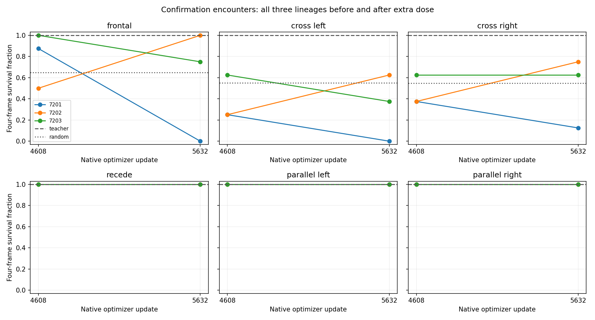
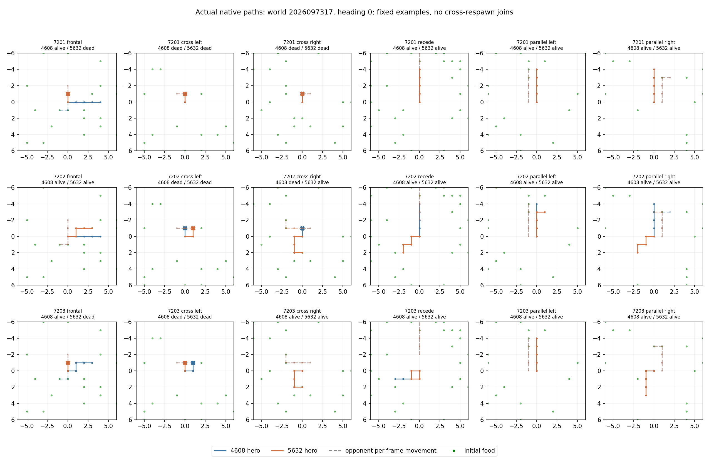

# Controlled encounter dose probe

This audited, inference-only probe measured six existing checkpoints on the finite
controlled encounter bank: each of the three immediate parents at update 4608 and
each corresponding final-dose checkpoint at 5632. It ran no fitting, made no causal
architecture claim, and is not promotion-eligible. Four physical jobs completed in
49.763 guarded seconds of a 390-second budget with no failed attempts; 2,075 input
files were rehashed. The analysis contains 3,456 cases, 72 model-by-cell results,
and paired 95% confidence intervals.

Threat endpoint survival on the confirmation split was:

| Lineage | 4608 | 5632 |
| --- | ---: | ---: |
| 7201 | 48/96 (50.0%) | 4/96 (4.2%) |
| 7202 | 36/96 (37.5%) | 76/96 (79.2%) |
| 7203 | 72/96 (75.0%) | 56/96 (58.3%) |

Benign endpoint survival was 96/96 for every model, passing the benign requirement.
None of the six checkpoints passed the complete frozen proficiency package:
95% overall threat survival, 90% in each threat family, and 99% benign survival.
Two final-dose models were worse
than their immediate parent and one was better. The result is descriptive behavior
of these existing lineages, not evidence that additional dose reliably helps.

The calibrated teacher survived all cases, but its initial best-action labels
contain only actions 0 and 2 (left and right). All threat cases admit both of these
initial actions as potentially survivable. Fixed left-first, straight-first, and
right-first policies are therefore being measured before training, to check
whether an unconditional turning preference could solve survival. This document
records no imitation-training result.

The probe used two CPU threads, one numerical job at a time, an 8 GiB RSS ceiling,
and a 9.6 GiB available-memory reserve. Peak RSS was 1,165,508,608 bytes; minimum
available system memory was 30,720,622,592 bytes. Checkpoint weights were unchanged
by inference, and the supervisor reported no source or driver drift.

The next work is task nontriviality checks before considering any targeted learning.
