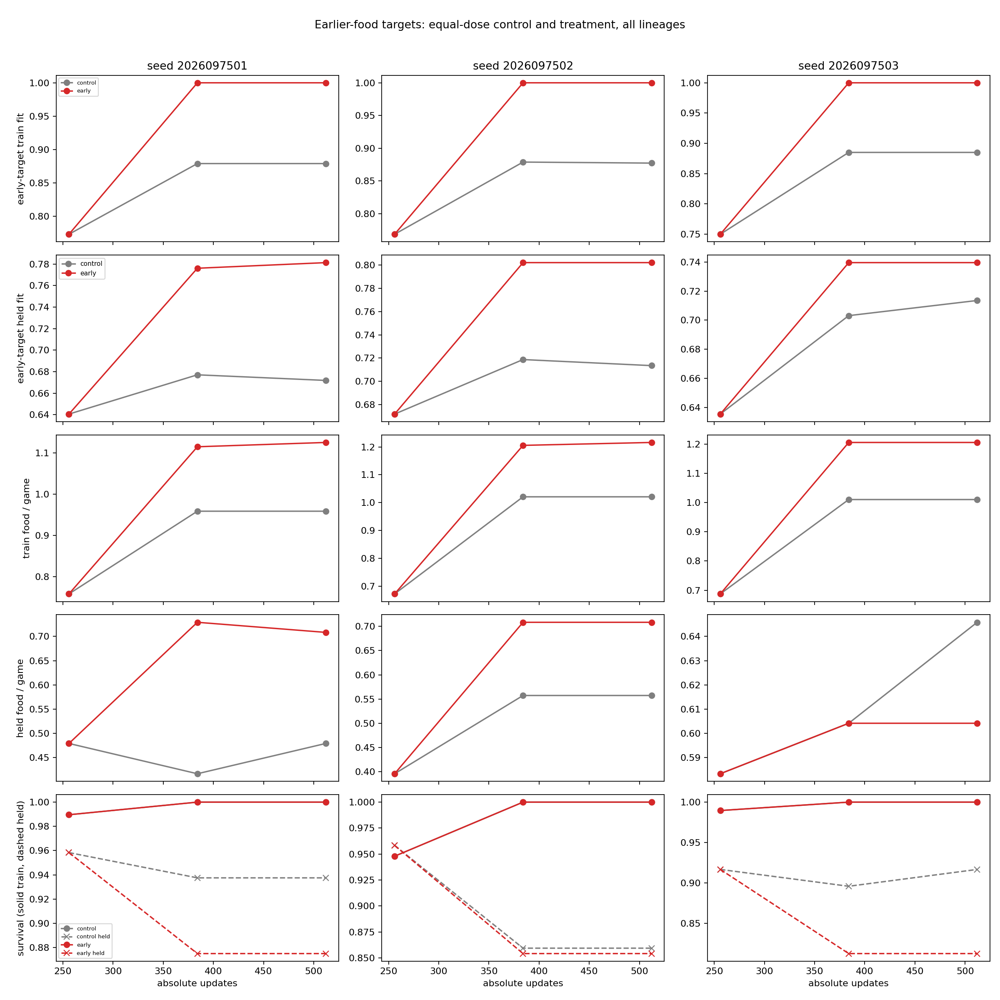
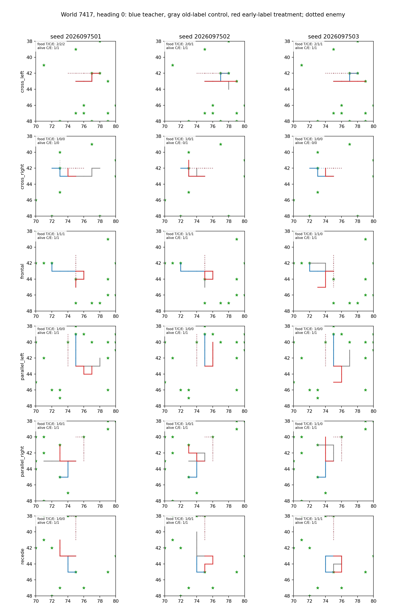

# Controlled-encounter early-target continuation — 2026-09-21

The earlier-food target improved food collection on the familiar training worlds
in all three matched continuations, but it did not establish reliable held-world
benefit. Every lineage failed the unchanged absolute package, the paired-benefit
package, and the additional early-target held-fit gate. This completed study is
not promotion evidence.

It continues the admitted [early-target dataset](../controlled_encounter_early_target_2026-09-21/README.md) and the preceding
[paired aggregation continuation](../controlled_encounter_paired_2026-09-21/README.md).
Each treatment resumed its exact FOOD256 parent with full Adam state; the
completed old-aggregate control, its samples, and its gameplay were reused.
These are warm-start continuations from one adaptive shared corpus, not fresh
initializations or independent new-dataset replications.

## Matched final-512 behavior

Each lineage received 256 new updates and 32,768 examples, reaching final mark
512. Training and held gameplay are distinct: the former is 384 familiar train
games, while the latter is 192 held games. Every early arm reached 100% early
target membership on its 2,576 training rows and survived all 384 train games.

| Seed | Train food: old aggregate → early / survivors | Held food: old aggregate → early | Held survivors: old aggregate → early | Early held-target fit |
| --- | --- | --- | --- | ---: |
| 2026097501 | 368 → 432 / 384 | 92 → 136 | 180 → 168 | 78.125% |
| 2026097502 | 392 → 467 / 384 | 107 → 136 | 165 → 164 | 80.208% |
| 2026097503 | 388 → 463 / 384 | 124 → 116 | 176 → 156 | 73.958% |

The train-world food changes are familiar-data outcomes, not held generalization.
Held food is nonuniform and each early arm has fewer held survivors than its
reused old-aggregate control. In particular, threat survival fell by 0.1250,
0.0104, and 0.2083 respectively; each exceeds the permitted non-regression
drop when compared with the old aggregate.

## Fixed decision rules and result

The original absolute requirements remained unchanged: train teacher-set
membership at least 95% overall and 90% per family; held membership at least
90% overall and 85% per family; held food at least 80% of teacher overall and
60% per family; benign survival at least 99%, threat survival at least 95%, and
90% in every threat family. Each lineage also still needed at least 0.25 held
food contacts per case over its original untrained mark-0 model and every fixed directional and
exact-random comparator, with a positive lower 95% paired-world interval.
All three lineages had to pass.

The added early-target criterion required early-target membership of at least
95% overall and 90% per family on train, plus 90% overall and 85% per family on
held. Although train fit was 100% for every early arm, the held values in the
table are below the 90% overall threshold.

The paired-benefit package applied to both the completed old-aggregate mark-512
control and the same FOOD256 parent. It required at least 0.125 held food
contacts per case, a strictly positive lower 95% paired eight-world bound, no
benign or threat survival drop greater than 0.01, and early-target aggregate-train
membership of at least 95% overall and 90% per family. The old-control food
intervals all cross zero:

| Seed | Early minus old-aggregate held food per case, 95% CI | Paired threat-survival change |
| --- | --- | ---: |
| 2026097501 | +0.2292, [-0.1034, +0.5617] | -0.1250 |
| 2026097502 | +0.1510, [-0.0903, +0.3923] | -0.0104 |
| 2026097503 | -0.0417, [-0.1859, +0.1026] | -0.2083 |

No lineage passed the old absolute package, the early-target held-fit package,
or the paired-benefit package; therefore all-three absolute, paired, and
overall decisions are false. This does not attribute the result to a model
architecture or support changing the incumbent.

## Confirmation boundary and execution record

The fixed held set remains adaptive evidence. The eight previously declared
fresh confirmation worlds were not executed because the all-three fixed-held
activation condition was false. They remain evaluation-only if a later,
separately authorized study reaches that condition; they must not enter
gradients, aggregation, early stopping, or checkpoint selection.

The audited closeout is `COMPLETE_AUDITED` (SHA-256
`baf16af12fafbcbc0a8c3b6098b734b4bed489141b38220e0f1c110f9e075472`).
All nine guarded jobs completed naturally, charging 175.0419154179981 seconds
of the 1,080-second budget. The scientific continuation comprised 768 updates
and 98,304 examples; eight qualification updates were discarded. Peak RSS was
3,547,054,080 bytes and minimum available memory was 30,213,128,192 bytes.

## Source records

- [Frozen early-learning intent](/Users/josenunez/Projects/ml/snake-dqn-artifacts/ongoing-research-20260913/controlled-encounter-early-learning/intent.json)
- [Audited final analysis](/Users/josenunez/Projects/ml/snake-dqn-artifacts/ongoing-research-20260913/controlled-encounter-early-learning/analysis/report.json)
- [Saved learning curves](/Users/josenunez/Projects/ml/snake-dqn-artifacts/ongoing-research-20260913/controlled-encounter-early-learning/analysis/learning-curves.png) and [representative paths](/Users/josenunez/Projects/ml/snake-dqn-artifacts/ongoing-research-20260913/controlled-encounter-early-learning/analysis/representative-paths.png)
- [Audited closeout](/Users/josenunez/Projects/ml/snake-dqn-artifacts/ongoing-research-20260913/controlled-encounter-early-learning/closeout.json)
