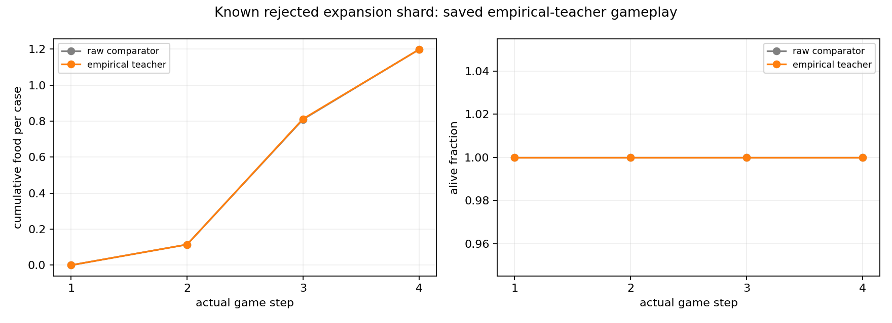
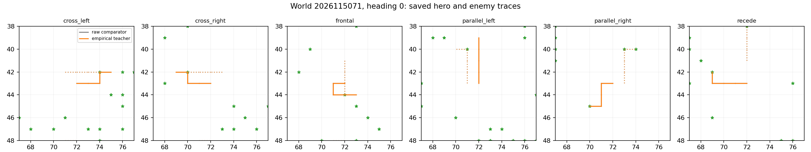

# Controlled-encounter empirical teacher — 2026-09-21

The empirical finite-bank teacher passed all eight saved-analysis qualification
gates on the complete previously rejected expansion shard. It kept all 384
teacher games alive, collected 460 food contacts over 1,536 native frames, and
changed exactly one label without reducing food: case 3419 at step 2 changed
from raw action set `[1]` to target `[2]`. This resolves the known alias within
this bank. It is a teacher-qualification result only: there were zero learner
updates, zero model inference calls, no learned-policy comparison, no global
corpus admission, and no promotion evidence.

The earlier [world-expansion rejection](../controlled_encounter_world_expansion_2026-09-21/README.md)
remains rejected. Apex is unchanged. The receding-teacher and label-intervention
records concern different finite-bank constructions and do not turn this
16-world diagnostic into a generalization result.

## What the finite-bank teacher did

The teacher reconstructed targets from one original future represented at each
identical observation in the full known-failure shard. It is not the eight-donor
receding teacher and does not marginalize over future RNG. The collection covers
only the 16 known training worlds `2026115065`–`2026115080`; it does not sample
new worlds or establish performance outside this shard.

Of the 1,536 occurrences, 1,535 used verified original-shard cache entries and
one used a fresh original-H4 query. There were no donor-H4 queries. The final
reduction has 431 exact-input groups and all six resolved native actions remain
in the contract.

The changed row is in the known four-case alias witness (cases 3416–3419). The
raw labels are `[2]`, `[2]`, `[2]`, and `[1]` respectively; the empirical target
is `[2]`. Thus case 3419 changes while the other 1,535 rows remain identical.
This resolves a represented original-future alias in this finite bank. In the
saved native trace for case 3419, raw actions `[0, 1, 1, 1]` and empirical
actions `[0, 1, 2, 0]` move one food contact from step four to step three while
keeping total food and survival unchanged. It does not prove that every
observation alias, future RNG state, or broader world family is resolved.

## Saved teacher gameplay

The raw teacher and empirical teacher have the same aggregate behavior on these
executed games: 460 food contacts and 384 survivors in 384 games. The
per-family comparison is also unchanged.

| Family | Raw food / survivors | Empirical food / survivors |
| --- | ---: | ---: |
| Frontal | 88 / 64 | 88 / 64 |
| Cross left | 88 / 64 | 88 / 64 |
| Cross right | 80 / 64 | 80 / 64 |
| Recede | 72 / 64 | 72 / 64 |
| Parallel left | 68 / 64 | 68 / 64 |
| Parallel right | 64 / 64 | 64 / 64 |

Every listed world completed its 24 games with all 24 surviving:

| World | Food | Survivors | World | Food | Survivors |
| --- | ---: | ---: | --- | ---: | ---: |
| 2026115065 | 36 | 24 / 24 | 2026115066 | 36 | 24 / 24 |
| 2026115067 | 32 | 24 / 24 | 2026115068 | 32 | 24 / 24 |
| 2026115069 | 16 | 24 / 24 | 2026115070 | 28 | 24 / 24 |
| 2026115071 | 20 | 24 / 24 | 2026115072 | 40 | 24 / 24 |
| 2026115073 | 32 | 24 / 24 | 2026115074 | 28 | 24 / 24 |
| 2026115075 | 20 | 24 / 24 | 2026115076 | 24 | 24 / 24 |
| 2026115077 | 24 | 24 / 24 | 2026115078 | 28 | 24 / 24 |
| 2026115079 | 24 | 24 / 24 | 2026115080 | 40 | 24 / 24 |

These figures show saved teacher behavior, including world `2026115071`,
heading 0, across all six families. They are not learning curves because the
study ran no learner update.

## Qualification gates and execution

All eight saved-analysis gates are true: structural completion; all 1,536
native frames; all 384 games alive; all six families represented by 64 cases;
each family food floor; overall food threshold; and both the known-witness
label-change and target checks. The saved analysis is `COMPLETE_AUDITED` and
reports `teacher_qualification_pass: true`.

The two completed receipts charged 34.54703120898921 seconds of the
300-second budget: collection used 24.917198999901302 seconds and analysis used
9.629832209087908 seconds. The highest observed RSS was 2,135,064,576 bytes and
the lowest available memory was 30,491,803,648 bytes. There were no execution
failures.

Teacher qualification is not a learned-policy result and does not admit this
finite diagnostic bank into the global corpus. A prospective next step is a
192-world empirical-teacher collection followed by separately frozen admission
against the parent union; no learning has been launched from this result.

## Audited closeout

The consolidated closeout is **COMPLETE_AUDITED_TEACHER_PASS**. The independent
saved-evidence audit is **COMPLETE_AUDITED** with no issues. It independently
checked all 431 current and final reductions, the 1,536-row typed NPZ evidence,
native-prefix joins, and both guarded receipts. Its verifier source is recorded
at SHA-256 `93435d00ea6a36a9a50eb6d83bd4fcad19d44369f284cb8ee2c0b37d67c9a170`.

That independent audit did not rerun native queries or H4 enumeration and did
not rehash the entire roughly 10 GB dependency closure. The root closeout
performed the full frozen input rehash: all 3,796 entries in the closeout
freeze passed. These checks confirm the bounded teacher result; they do not
expand it into corpus admission, generalization, a learning result, or policy
promotion.

## Source records

- [Frozen empirical-teacher intent](/Users/josenunez/Projects/ml/snake-dqn-artifacts/ongoing-research-20260913/controlled-encounter-empirical-teacher/intent.json)
  — SHA-256 `cec973da5b871ef30ec0ce54b15a62541c2f4a4d5dbe0f0198d6595f98f6041a`
- [Completed collection report](/Users/josenunez/Projects/ml/snake-dqn-artifacts/ongoing-research-20260913/controlled-encounter-empirical-teacher/collect/report.json)
  — SHA-256 `d259232a6634c60a039e493705bcfca2e24edc96ac25611ed087201a1d77cf50`
- [Completed saved analysis](/Users/josenunez/Projects/ml/snake-dqn-artifacts/ongoing-research-20260913/controlled-encounter-empirical-teacher/analysis/report.json)
  — SHA-256 `6ebb427c2ed2a42bdbf24ac806a39fd79326e8e1625974808e1a0692e371ed44`
- [Saved gameplay records](/Users/josenunez/Projects/ml/snake-dqn-artifacts/ongoing-research-20260913/controlled-encounter-empirical-teacher/collect/games.json)
  — SHA-256 `099baea9a772c1b366345ad3ba9307d54c2079ec86e7d9c61c90e4560e041c28`
- [Independent saved-evidence audit](/Users/josenunez/Projects/ml/snake-dqn-artifacts/ongoing-research-20260913/controlled-encounter-empirical-teacher/independent-audit.json)
  — SHA-256 `c4db73da4b9a64434144c64000d56314adf7f09cc099b4cee675fdcaa3837b78`
- [Audited closeout](/Users/josenunez/Projects/ml/snake-dqn-artifacts/ongoing-research-20260913/controlled-encounter-empirical-teacher/closeout.json)
  — SHA-256 `fbe09a35c344207876337d43550aa145fccd8ec9c396c8a6916b7855a214bfbc`
- [Root closeout input freeze](/Users/josenunez/Projects/ml/snake-dqn-artifacts/ongoing-research-20260913/controlled-encounter-empirical-teacher/input-freeze-closeout.json)
  — SHA-256 `78b686e49b13c03103fdf24884b0ad8e25b28fcc6a92005b1af93261262dc06d`
- [Collection receipt](/Users/josenunez/Projects/ml/snake-dqn-artifacts/ongoing-research-20260913/controlled-encounter-empirical-teacher/supervisor-runs/collect/receipt.json)
  and [saved-analysis receipt](/Users/josenunez/Projects/ml/snake-dqn-artifacts/ongoing-research-20260913/controlled-encounter-empirical-teacher/supervisor-runs/analysis/receipt.json)
- [Teacher gameplay figure source](/Users/josenunez/Projects/ml/snake-dqn-artifacts/ongoing-research-20260913/controlled-encounter-empirical-teacher/analysis/gameplay-curves.png)
  and [representative-gameplay source](/Users/josenunez/Projects/ml/snake-dqn-artifacts/ongoing-research-20260913/controlled-encounter-empirical-teacher/analysis/representative-gameplay.png)
