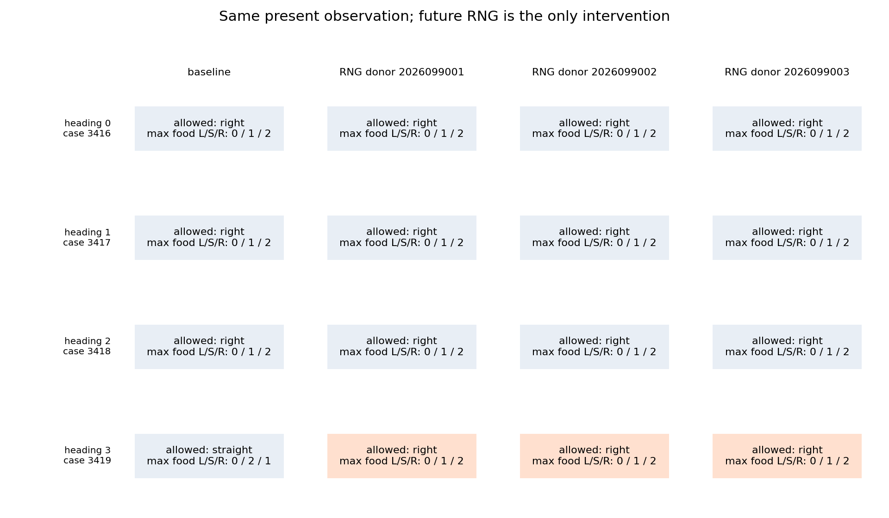
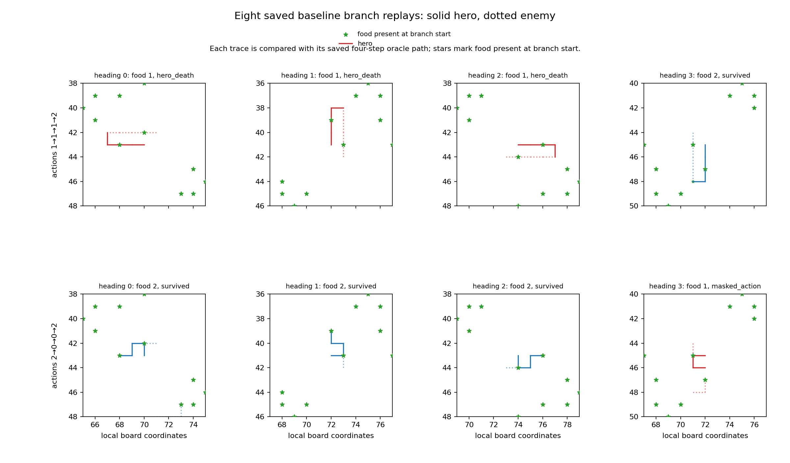

# Controlled-encounter expansion alias probe — 2026-09-21

At the four same-input witnesses that rejected the 256-world expansion,
changing only a receiver's future RNG changed the early-H4 raw target in all
three fixed donor contrasts for case 3419. All 12 donor/witness cells met the
frozen primary-eligibility checks. This is a causal counterexample within the
four selected states: future RNG can change the target while retained current
state, observation tensors, and resolved action mask stay fixed. It does not
measure how often this happens, improve a policy, or admit the rejected corpus.

The probe follows the [rejected world expansion](../controlled_encounter_world_expansion_2026-09-21/README.md) and leaves that rejection in force. The
[world-breadth learning comparison](../controlled_encounter_world_breadth_learning_2026-09-21/README.md)
remains the source of learned-policy curves and representative paths; this
probe ran no learner update or model inference.

## Fixed intervention and target result

The probe used the four preselected exact-input witnesses (cases 3416–3419)
and the three archived canonical RNG donors `2026099001`–`2026099003`. Each
counterfactual deep-copied the receiver and changed only
`receiver._rngs[0]._rng.setstate`; it did not construct new donor worlds. For
every one of the 12 cells, the pre-Watch and prepared non-RNG canonical state,
all retained input tensors, and resolved mask were identical; the prepared RNG
and whole-native state differed. The six prior ALIAS-v3 canonical witnesses
were excluded by the frozen eligibility rule.

| Witness case | Baseline target | Target under each of the three donor RNG states | Eligible cells that changed |
| --- | --- | --- | ---: |
| 3416 | right | right | 0 / 3 |
| 3417 | right | right | 0 / 3 |
| 3418 | right | right | 0 / 3 |
| 3419 | straight | right | 3 / 3 |

There were three target-set changes and three empty baseline/counterfactual
intersections, all from case 3419. All three changes affect the total-food optimum; none is explained solely
by the early-food tie-break. The fixed three-donor contrast is sufficient
to demonstrate this counterexample, but it is not a random sample of future
RNG states or witness nodes. A no-change result in the other nine cells is a
finite noncontrast, not evidence that future randomness is irrelevant.

## Native branch evidence

The probe also replayed eight predeclared baseline native branches: two
lexicographically selected H4-optimal action sequences for each witness. Those
replays took 31 native steps. For cases 3416–3418, sequence `1,1,1,2` collected
one food and ended in hero death at step 3, while `2,0,0,2` collected two food
and remained viable. Case 3419 showed the reverse pattern: `1,1,1,2` collected
two food and remained viable, while `2,0,0,2` collected one food and reached a
masked action at step 3.

Those traces show where the two existing outcome patterns diverge under the
saved branch conditions. They are not an isolated geometry intervention: food
sources, both snake slots, deaths, respawn state, and food reintroduction were
recorded together. The branch comparison therefore supports mechanistic
localization only; it does not establish that a particular branch event causes
the target flip.

## Execution and boundary

The native probe, saved analysis, and saved-only figure correction all completed
with no failure. They charged 26.147256874886807 seconds of the 180-second budget.
Analysis and figure correction together used 16.112 seconds of their 60-second allocation. Peak RSS was
1,857,159,168 bytes and minimum available memory was 31,448,301,568 bytes.
The work comprised eight verified native prefix steps, 12 counterfactual H4
queries, and 31 branch-replay steps. It ran zero learner updates and zero model
inferences. All old criteria remain unchanged; Apex remains the incumbent under
the shared tournament gate, with no promotion or inherent-superiority claim.

The independent audit and consolidated closeout are `COMPLETE_AUDITED`. All
85 independent checks passed, including recomputation of target sets, branch
outcomes, frozen hashes, receipt accounting, and source integrity.

## Source records

- [Frozen alias-probe intent](/Users/josenunez/Projects/ml/snake-dqn-artifacts/ongoing-research-20260913/controlled-encounter-expansion-alias/intent.json)
  — SHA-256 `55ab8e1d5981697dae1617a193077bbeb866342f1b669231e12ba183eb6f0bb3`
- [Completed native probe report](/Users/josenunez/Projects/ml/snake-dqn-artifacts/ongoing-research-20260913/controlled-encounter-expansion-alias/probe/report.json)
  — SHA-256 `b8066fa0dafcb59723bef80b17de0d035c5841d33f8e5123878783efda001243`
- [Completed saved analysis](/Users/josenunez/Projects/ml/snake-dqn-artifacts/ongoing-research-20260913/controlled-encounter-expansion-alias/analysis/report.json)
  — SHA-256 `1647c0df542b24170f05008d81049d996b27975307ae1de35ab6ee173a898eb5`
- [Native-probe receipt](/Users/josenunez/Projects/ml/snake-dqn-artifacts/ongoing-research-20260913/controlled-encounter-expansion-alias/supervisor-runs/probe/receipt.json)
  and [saved-analysis receipt](/Users/josenunez/Projects/ml/snake-dqn-artifacts/ongoing-research-20260913/controlled-encounter-expansion-alias/supervisor-runs/analysis/receipt.json)
- [Copied target-comparison figure source](/Users/josenunez/Projects/ml/snake-dqn-artifacts/ongoing-research-20260913/controlled-encounter-expansion-alias/analysis/rng-target-comparison.png)
  and [native-branch figure source](/Users/josenunez/Projects/ml/snake-dqn-artifacts/ongoing-research-20260913/controlled-encounter-expansion-alias/replot/native-branches.png)

- [Independent saved-artifact audit](/Users/josenunez/Projects/ml/snake-dqn-artifacts/ongoing-research-20260913/controlled-encounter-expansion-alias/independent-audit.json)
- [Consolidated closeout](/Users/josenunez/Projects/ml/snake-dqn-artifacts/ongoing-research-20260913/controlled-encounter-expansion-alias/closeout.json)
  — SHA-256 `e95db43bdba1be1aad4b996c48d51600b3da761534b3e4217b4dca15b3f14829`
- [Saved-only figure correction receipt](/Users/josenunez/Projects/ml/snake-dqn-artifacts/ongoing-research-20260913/controlled-encounter-expansion-alias/supervisor-runs/replot/receipt.json)

## Next bounded question

Qualify a teacher that chooses the same four-action plan across sampled futures
for states with the same input. The diagnostic will check feasibility, food
collection, and target stability before any corpus relabel or learner run.
A plan shared across futures removes the oracle's ability to select a different
continuation after looking at each future, although it also limits useful
replanning from new observations.

This is motivated by the expert/trainee information mismatch studied by
[Warrington et al.](https://proceedings.mlr.press/v139/warrington21a.html) and the
imitation gap described by [Weihs et al.](https://arxiv.org/abs/2007.12173).
Those papers support investigating the mismatch; they do not establish that
this proposed teacher will solve the benchmark.
