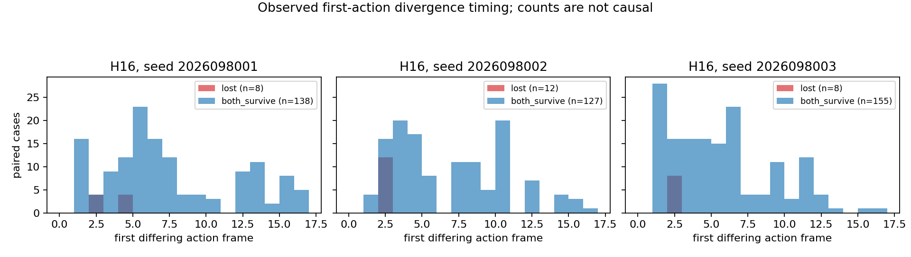
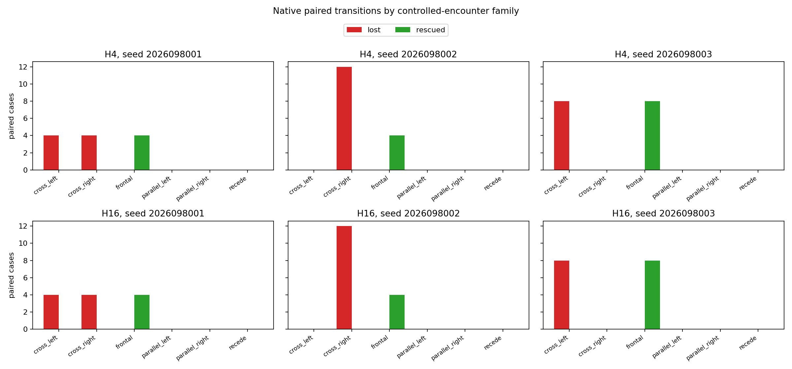
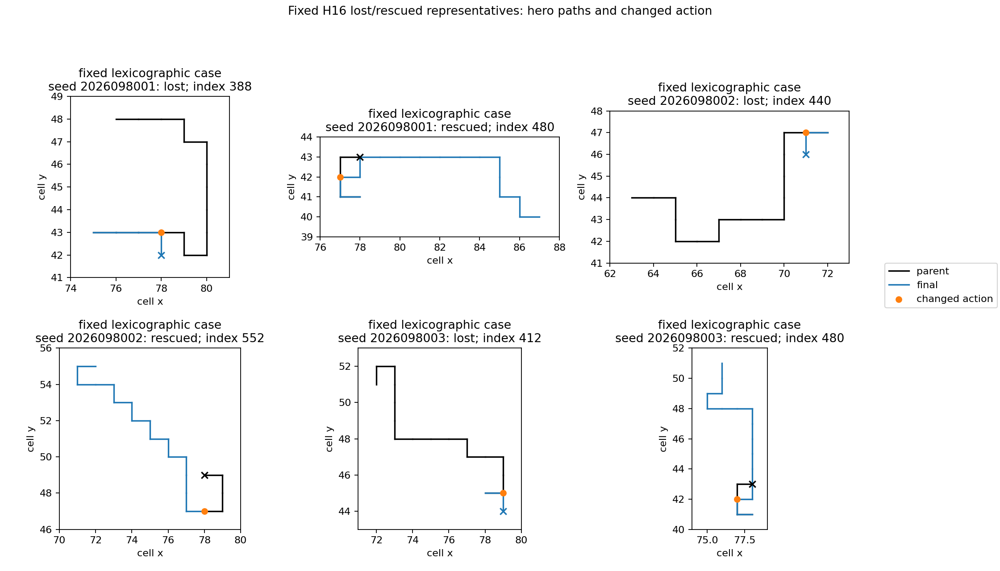

# Controlled-encounter native-TD first-divergence census — 2026-09-21

The completed saved-trace census localizes the first recorded action differences
between the short-cap parent and its age-256 continuation. It does not establish
why the later outcomes differ. The original continuation endpoints and all gate
verdicts are unchanged: there was no training, policy inference, native replay,
fresh confirmation, promotion, or new Apex comparison in this census.

## Saved endpoint comparison

Each lineage has 192 paired cases at each horizon. The eight development worlds
are adaptive rather than fresh confirmation; their four headings are paired
within each world, and H4 and H16 reuse overlapping bounded comparisons.

| Lineage | H4: parent → final food | H4: parent → final survivors | H4 lost / rescued | H16: parent → final food | H16: parent → final survivors | H16 lost / rescued |
| --- | ---: | ---: | ---: | ---: | ---: | ---: |
| 2026098001 | 227 → 224 | 188 → 184 | 8 / 4 | 1,094 → 1,064 | 184 → 180 | 8 / 4 |
| 2026098002 | 216 → 180 | 180 → 172 | 12 / 4 | 1,106 → 978 | 176 → 168 | 12 / 4 |
| 2026098003 | 220 → 204 | 176 → 176 | 8 / 8 | 1,069 → 1,055 | 176 → 176 | 8 / 8 |

The H16 comparison contains 28 parent-survived/final-lost cases and 16
parent-died/final-rescued cases. It keeps the continuation study's endpoint
facts visible without treating this post-hoc census as a new behavioral trial.

## What the stored traces show

The census covered 1,152 paired rows across three lineages and both horizons:
682 have a recorded action divergence and 470 retain an identical recorded path.
There were zero recorded discrepancies in the saved-row checks. Every crossing
loss first diverges at step 2 or 4, while every frontal rescue first diverges at
step 1 or 3. Those patterns focus the next diagnostic on encounter family, but
they are descriptive associations in the same adaptive development worlds.

A sign change in a greedy-action margin is tautological once the selected action
changes. It is not causal evidence that the margin caused a later H16 death.
Recorded equality also does not prove hidden native state or RNG equality, and
missing matching intermediate states were not extrapolated. The completed
census supersedes the earlier first-divergence draft while preserving the
original continuation endpoint evidence and its failed competence and retention packages.

The next question is prospective: does restoring only the parent's action at a
first divergence change H16 survival under the final policy? A one-action rescue
test was separately frozen after the census; its results are in the
[subsequent intervention report](../controlled_encounter_one_action_rescue_2026-09-21/README.md).

## Prior learning curve and execution boundary

This curve is copied from the earlier completed continuation study. It is shown
for context only; the first-divergence census created no learner updates or new
policy gameplay.

All three guarded jobs completed with zero failures: saved census, independent
saved-record audit, and a presentation-only repair that corrected an overlapping
legend and title without changing the audited numerical report. They charged
10.041621500160545 seconds of the 180-second budget. Peak RSS was 1,682,145,280
bytes and minimum available memory was 36,530,946,048 bytes. The independent
audit passed on saved records; it did not independently replay native dynamics.

## Source records

- [Frozen census intent](/Users/josenunez/Projects/ml/snake-dqn-artifacts/ongoing-research-20260913/controlled-encounter-native-td-first-divergence/intent.json)
  — `FROZEN_BEFORE_EXECUTION`; SHA-256
  `ee22547839380387c1a828dba7b6b9ab5a698481202ff12f2bf80ea21d64a979`.
- [Saved census analysis](/Users/josenunez/Projects/ml/snake-dqn-artifacts/ongoing-research-20260913/controlled-encounter-native-td-first-divergence/analysis/report.json)
  — `COMPLETE_SAVED_ONLY`; SHA-256
  `d2af9665cbe2e1586fce5be18d9c91b9f704f7c0736a65244e3988b396221416`.
- [Independent saved-record audit](/Users/josenunez/Projects/ml/snake-dqn-artifacts/ongoing-research-20260913/controlled-encounter-native-td-first-divergence/audit/report.json)
  — `PASS`; SHA-256
  `a9141762f886acfbf67090fcedbbae188b5e8111252797e8144119c942a3dbe2`.
- [Completed closeout](/Users/josenunez/Projects/ml/snake-dqn-artifacts/ongoing-research-20260913/controlled-encounter-native-td-first-divergence/closeout.json)
  — `COMPLETE_AUDITED`; SHA-256
  `4dc2ac45d05fc900f9bf737695e011bd57dc568783fae4e02804ef09b0e1befb`.
- [Input-freeze handoff](/Users/josenunez/Projects/ml/snake-dqn-artifacts/ongoing-research-20260913/controlled-encounter-native-td-first-divergence/input-freeze-handoff.json)
  — SHA-256
  `5d9ffba5a988278c3d47176a3aaebb92724e879094b5caed1fff168a6888e333`.
- [Separately frozen one-action rescue intent](/Users/josenunez/Projects/ml/snake-dqn-artifacts/ongoing-research-20260913/controlled-encounter-one-action-rescue/intent.json)
  — a later intervention study; not part of this saved-only census.
- [Prior age-256 continuation report](../controlled_encounter_native_td_dose_continuation_2026-09-21/README.md)
  — source of the preserved endpoints and earlier behavioral gate verdicts.
