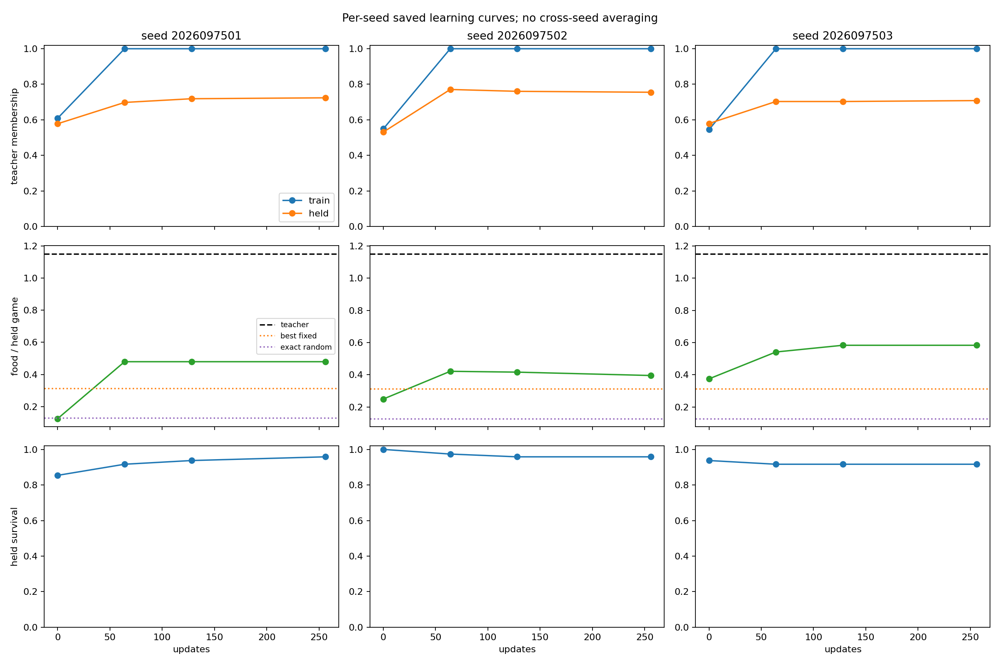
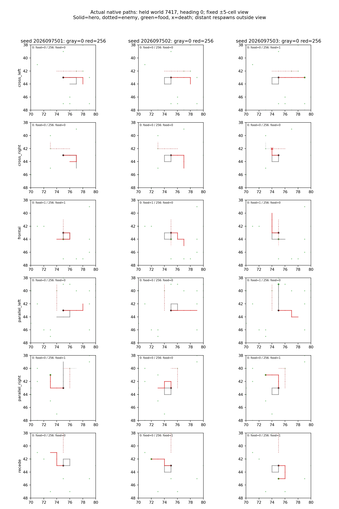

# Controlled-encounter food-label imitation — 2026-09-21

This three-seed behavioral-cloning study replaced the earlier clearance-sensitive
teacher labels with food-only action sets while preserving the frozen
controlled-encounter task, network, data splits, evaluation, and original CI
criteria. It completed its planned scientific runs, but **no seed passed all
original gates at mark 256**. This is not a promotion result and does not assign
the failure to an algorithm or architecture.

## Saved learning evidence

The gameplay columns cover 192 held games. Fit is teacher-set membership on
1,536 training states or 768 held states; food is total contacts; survival is
surviving games. Train membership
reached 100% by 64 updates for every seed, while held membership remained well
below its 90% overall and 85% per-family requirements.

| Seed | Mark | Train fit | Held fit | Held food | Held survival |
| --- | ---: | ---: | ---: | ---: | ---: |
| 2026097501 | 0 | 60.9% | 57.8% | 24 | 164 |
|  | 64 | 100.0% | 69.8% | 92 | 176 |
|  | 128 | 100.0% | 71.9% | 92 | 180 |
|  | 256 | 100.0% | 72.4% | 92 | 184 |
| 2026097502 | 0 | 54.9% | 53.1% | 48 | 192 |
|  | 64 | 100.0% | 77.1% | 81 | 187 |
|  | 128 | 100.0% | 76.0% | 80 | 184 |
|  | 256 | 100.0% | 75.5% | 76 | 184 |
| 2026097503 | 0 | 54.5% | 57.9% | 72 | 180 |
|  | 64 | 100.0% | 70.3% | 104 | 176 |
|  | 128 | 100.0% | 70.3% | 112 | 176 |
|  | 256 | 100.0% | 70.8% | 112 | 176 |

The food-only targets are broader than the original labels, but they are not
constant: the best constant action belongs to 60.7% of training target sets and
59.9% of held target sets. Perfect train fit alongside approximately 70–76% held fit is a
saved outcome, not evidence that a constant target made the task trivial.

## Final gate result

The unchanged archived teacher collected 221 held food contacts. The final
learners collected 92, 76, and 112. Their final food fractions of teacher were
41.6%, 34.4%, and 50.7%, below the frozen 80% overall threshold; all three also
missed one or more 60% family thresholds. Held membership failed for each seed,
as did the required all-three joint pass. Each seed also failed at least one
held threat-survival condition. Food comparisons also require a minimum gain
and a positive lower bound from a paired eight-world t95 interval. Only seed
2026097501 passed the food-improvement comparison with its own mark 0:
+0.3542 contacts/game, 95% CI [0.1023, 0.6060]. The corresponding changes were
+0.1458 [-0.1060, 0.3977] and +0.2083 [-0.0359, 0.4525] for seeds 7502 and 7503.
Benign survival was 100% for every final seed, but that partial result
cannot satisfy the joint criterion.

The decision uses mark 256 only. Marks 0, 64, and 128 are reported above as
descriptive learning evidence; they were not selected as alternative endpoints.
The analysis additionally verified that saved greedy actions matched the native
resolved-mask argmax and that saved food/alive totals matched frame facts.

## Boundaries and follow-up

The study reused only qualified food-label data and did not rerun the original
controlled-encounter imitation experiment. The prior alias diagnostic remains
relevant context: food-only labels resolved its incompatible teacher-set
admission issue, but this completed result did not clear the independent,
unchanged behavior criteria. No learning curve is a promotion claim.

The representative figure above is the root-reviewed `analysis-v2` saved-layout
revision. It changes plot layout only; both analyses retain identical scientific
values and gate decisions.

All ten jobs completed with natural exit code 0 and no source/driver drift.
Elapsed time was **285.93 seconds** against the frozen **1,485-second** budget,
including both saved analyses. Peak observed RSS was 907,247,616 bytes
(about 865 MiB); minimum available memory was 29,774,446,592 bytes
(about 27.7 GiB). The 9.6 GiB reserve and serial numerical-job guards remained
in place. The three seeds received 768 optimizer updates in total; inherited
qualification runs were not repeated.

The next diagnostic evaluates these final models on all 384 training-world
games and records exact membership in the saved teacher-state dataset along
each policy's own trajectory. It reuses held gameplay and performs no learning.

## Source records

- `controlled-encounter-food-labels/analysis/report.json`
- `controlled-encounter-food-labels/closeout.json` — SHA-256
  `82478be6069715864fd2f7e272a963dfaf9a2a1d13f60c9756a736da52436feb`
- `controlled-encounter-food-labels/supervisor-runs/*/receipt.json` (ten guarded jobs,
  including the saved `analysis-v2` layout revision)
- [Original imitation admission closeout](../controlled_encounter_imitation_2026-09-21/README.md)
- [Alias diagnostic closeout](../controlled_encounter_alias_diagnostic_2026-09-21/README.md)
