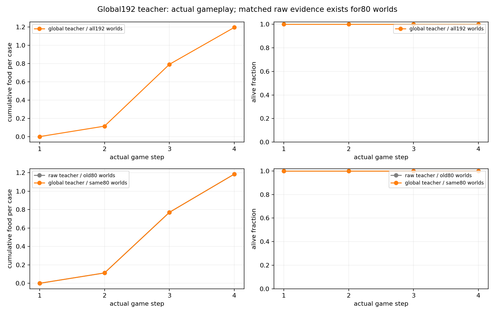
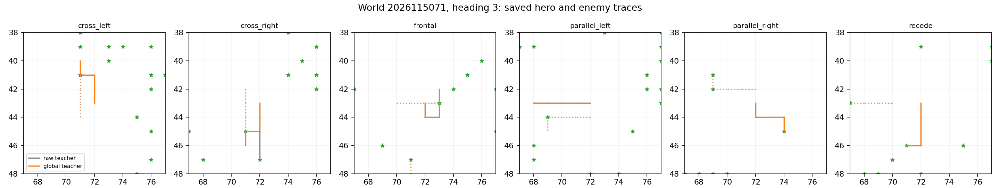
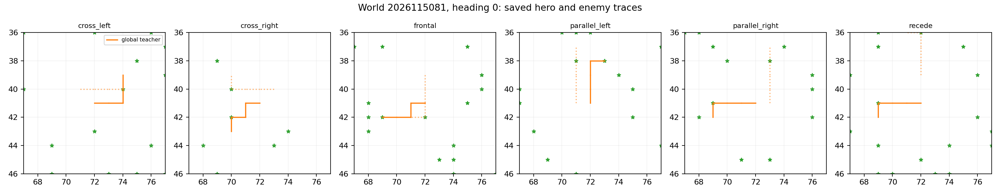

# Controlled-encounter global teacher — 2026-09-21

The global finite-bank teacher completed its 192 planned training worlds and
its saved parent-union admission. All 4,608 teacher games survived, collecting
5,512 food contacts over 18,432 native frames, and all eight frozen analysis
gates passed. The admitted union contains 25,616 training rows across 256
training worlds: the authenticated 7,184-row parent prefix is byte-identical,
and every shared exact input has compatible final target masks. This is a
teacher-construction and data-admission outcome, not a learned-policy,
generalization, or promotion result. No learner updates or model inference ran.

The earlier [world-expansion rejection](../controlled_encounter_world_expansion_2026-09-21/README.md)
remains part of the record. This study preserves that rejection while resolving
its full 192-world finite-bank target construction and admitting the saved union
under the stated compatibility rules.

## Global construction and teacher result

At each of four steps, the collector grouped all planned occurrences by their
current retained input and selected targets from one represented original future
per occurrence. It is not an eight-donor teacher and does not provide an
RNG-marginalization result. The collected worlds are training-only: 80 had been
observed earlier and 112 were previously unexecuted. No confirmation world was
materialized.

The 18,432 candidate cells are all eligible. The reduction produced 5,275
current groups and 5,275 final groups; all six structural conditions pass. Of
the native H4 evidence, 7,680 entries were original-cache reuse (7,679 from
expansion and one empirical reuse) and 10,752 were fresh original-H4 queries.
No donor-H4 query, optimizer update, model inference, or promotion evaluation
occurred.

| Family | Games / survivors | Food contacts | Native frames |
| --- | ---: | ---: | ---: |
| Frontal | 768 / 768 | 1,148 | 3,072 |
| Cross left | 768 / 768 | 1,088 | 3,072 |
| Cross right | 768 / 768 | 1,036 | 3,072 |
| Recede | 768 / 768 | 900 | 3,072 |
| Parallel left | 768 / 768 | 692 | 3,072 |
| Parallel right | 768 / 768 | 648 | 3,072 |
| **All families** | **4,608 / 4,608** | **5,512** | **18,432** |

The matched original 80-world cohort was retained exactly: both the reused raw
teacher and the new teacher collected 2,276 food contacts with 1,920/1,920
survivors. Its family totals also match: frontal 476, cross left 432, cross
right 408, recede 368, parallel left 312, and parallel right 280. The 112 new
worlds do not have completed raw-policy gameplay, so the reported new-world
behavior is teacher gameplay rather than a raw-policy comparison.

## Target changes and gates

The global target differs from raw labels on 9 rows in 5 exact-input groups.
Among all rows, 18,423 target sets are identical, 7 are narrowed, 1 is widened,
and 1 is disjoint; the raw deterministic membership ceiling is
0.9999457465277778. These describe target construction on teacher-visited
states, not a learned policy or a counterfactual raw-policy gameplay result.

All eight gates passed: structural completion; all 192 worlds balanced over
families and headings; all 18,432 native frames; all 4,608 games alive;
per-shard food floors; normal action support; and overall plus per-family food
retention on the matched original 80 worlds.

The three saved figures show teacher behavior only. They are not learning
curves.

## Every executed world

Each world completed 24 games with all 24 surviving. The table reports the
saved teacher food total and survival count for every planned world.

| World | Food | Survival | World | Food | Survival | World | Food | Survival | World | Food | Survival |
| --- | ---: | ---: | --- | ---: | ---: | --- | ---: | ---: | --- | ---: | ---: |
| 2026115001 | 24 | 24/24 | 2026115002 | 24 | 24/24 | 2026115003 | 28 | 24/24 | 2026115004 | 32 | 24/24 |
| 2026115005 | 28 | 24/24 | 2026115006 | 24 | 24/24 | 2026115007 | 20 | 24/24 | 2026115008 | 28 | 24/24 |
| 2026115009 | 32 | 24/24 | 2026115010 | 28 | 24/24 | 2026115011 | 32 | 24/24 | 2026115012 | 20 | 24/24 |
| 2026115013 | 32 | 24/24 | 2026115014 | 24 | 24/24 | 2026115015 | 24 | 24/24 | 2026115016 | 28 | 24/24 |
| 2026115017 | 28 | 24/24 | 2026115018 | 32 | 24/24 | 2026115019 | 24 | 24/24 | 2026115020 | 24 | 24/24 |
| 2026115021 | 24 | 24/24 | 2026115022 | 24 | 24/24 | 2026115023 | 36 | 24/24 | 2026115024 | 28 | 24/24 |
| 2026115025 | 24 | 24/24 | 2026115026 | 32 | 24/24 | 2026115027 | 36 | 24/24 | 2026115028 | 28 | 24/24 |
| 2026115029 | 28 | 24/24 | 2026115030 | 24 | 24/24 | 2026115031 | 24 | 24/24 | 2026115032 | 20 | 24/24 |
| 2026115033 | 32 | 24/24 | 2026115034 | 28 | 24/24 | 2026115035 | 28 | 24/24 | 2026115036 | 24 | 24/24 |
| 2026115037 | 44 | 24/24 | 2026115038 | 28 | 24/24 | 2026115039 | 24 | 24/24 | 2026115040 | 28 | 24/24 |
| 2026115041 | 28 | 24/24 | 2026115042 | 36 | 24/24 | 2026115043 | 28 | 24/24 | 2026115044 | 32 | 24/24 |
| 2026115045 | 36 | 24/24 | 2026115046 | 36 | 24/24 | 2026115047 | 28 | 24/24 | 2026115048 | 28 | 24/24 |
| 2026115049 | 36 | 24/24 | 2026115050 | 32 | 24/24 | 2026115051 | 28 | 24/24 | 2026115052 | 40 | 24/24 |
| 2026115053 | 28 | 24/24 | 2026115054 | 24 | 24/24 | 2026115055 | 28 | 24/24 | 2026115056 | 32 | 24/24 |
| 2026115057 | 24 | 24/24 | 2026115058 | 28 | 24/24 | 2026115059 | 28 | 24/24 | 2026115060 | 24 | 24/24 |
| 2026115061 | 20 | 24/24 | 2026115062 | 32 | 24/24 | 2026115063 | 36 | 24/24 | 2026115064 | 24 | 24/24 |
| 2026115065 | 36 | 24/24 | 2026115066 | 36 | 24/24 | 2026115067 | 32 | 24/24 | 2026115068 | 32 | 24/24 |
| 2026115069 | 16 | 24/24 | 2026115070 | 28 | 24/24 | 2026115071 | 20 | 24/24 | 2026115072 | 40 | 24/24 |
| 2026115073 | 32 | 24/24 | 2026115074 | 28 | 24/24 | 2026115075 | 20 | 24/24 | 2026115076 | 24 | 24/24 |
| 2026115077 | 24 | 24/24 | 2026115078 | 28 | 24/24 | 2026115079 | 24 | 24/24 | 2026115080 | 40 | 24/24 |
| 2026115081 | 24 | 24/24 | 2026115082 | 36 | 24/24 | 2026115083 | 16 | 24/24 | 2026115084 | 40 | 24/24 |
| 2026115085 | 28 | 24/24 | 2026115086 | 36 | 24/24 | 2026115087 | 36 | 24/24 | 2026115088 | 32 | 24/24 |
| 2026115089 | 32 | 24/24 | 2026115090 | 32 | 24/24 | 2026115091 | 40 | 24/24 | 2026115092 | 28 | 24/24 |
| 2026115093 | 24 | 24/24 | 2026115094 | 28 | 24/24 | 2026115095 | 28 | 24/24 | 2026115096 | 28 | 24/24 |
| 2026115097 | 28 | 24/24 | 2026115098 | 32 | 24/24 | 2026115099 | 28 | 24/24 | 2026115100 | 32 | 24/24 |
| 2026115101 | 32 | 24/24 | 2026115102 | 28 | 24/24 | 2026115103 | 20 | 24/24 | 2026115104 | 32 | 24/24 |
| 2026115105 | 32 | 24/24 | 2026115106 | 24 | 24/24 | 2026115107 | 32 | 24/24 | 2026115108 | 24 | 24/24 |
| 2026115109 | 28 | 24/24 | 2026115110 | 24 | 24/24 | 2026115111 | 20 | 24/24 | 2026115112 | 28 | 24/24 |
| 2026115113 | 20 | 24/24 | 2026115114 | 28 | 24/24 | 2026115115 | 40 | 24/24 | 2026115116 | 32 | 24/24 |
| 2026115117 | 24 | 24/24 | 2026115118 | 36 | 24/24 | 2026115119 | 24 | 24/24 | 2026115120 | 20 | 24/24 |
| 2026115121 | 24 | 24/24 | 2026115122 | 28 | 24/24 | 2026115123 | 20 | 24/24 | 2026115124 | 20 | 24/24 |
| 2026115125 | 28 | 24/24 | 2026115126 | 24 | 24/24 | 2026115127 | 32 | 24/24 | 2026115128 | 28 | 24/24 |
| 2026115129 | 28 | 24/24 | 2026115130 | 32 | 24/24 | 2026115131 | 28 | 24/24 | 2026115132 | 28 | 24/24 |
| 2026115133 | 28 | 24/24 | 2026115134 | 24 | 24/24 | 2026115135 | 32 | 24/24 | 2026115136 | 28 | 24/24 |
| 2026115137 | 36 | 24/24 | 2026115138 | 28 | 24/24 | 2026115139 | 20 | 24/24 | 2026115140 | 32 | 24/24 |
| 2026115141 | 36 | 24/24 | 2026115142 | 24 | 24/24 | 2026115143 | 28 | 24/24 | 2026115144 | 32 | 24/24 |
| 2026115145 | 32 | 24/24 | 2026115146 | 44 | 24/24 | 2026115147 | 24 | 24/24 | 2026115148 | 36 | 24/24 |
| 2026115149 | 32 | 24/24 | 2026115150 | 32 | 24/24 | 2026115151 | 28 | 24/24 | 2026115152 | 28 | 24/24 |
| 2026115153 | 32 | 24/24 | 2026115154 | 20 | 24/24 | 2026115155 | 28 | 24/24 | 2026115156 | 32 | 24/24 |
| 2026115157 | 28 | 24/24 | 2026115158 | 32 | 24/24 | 2026115159 | 20 | 24/24 | 2026115160 | 24 | 24/24 |
| 2026115161 | 24 | 24/24 | 2026115162 | 40 | 24/24 | 2026115163 | 24 | 24/24 | 2026115164 | 32 | 24/24 |
| 2026115165 | 24 | 24/24 | 2026115166 | 32 | 24/24 | 2026115167 | 24 | 24/24 | 2026115168 | 36 | 24/24 |
| 2026115169 | 28 | 24/24 | 2026115170 | 32 | 24/24 | 2026115171 | 32 | 24/24 | 2026115172 | 32 | 24/24 |
| 2026115173 | 20 | 24/24 | 2026115174 | 36 | 24/24 | 2026115175 | 28 | 24/24 | 2026115176 | 28 | 24/24 |
| 2026115177 | 36 | 24/24 | 2026115178 | 24 | 24/24 | 2026115179 | 28 | 24/24 | 2026115180 | 16 | 24/24 |
| 2026115181 | 28 | 24/24 | 2026115182 | 32 | 24/24 | 2026115183 | 36 | 24/24 | 2026115184 | 28 | 24/24 |
| 2026115185 | 36 | 24/24 | 2026115186 | 28 | 24/24 | 2026115187 | 24 | 24/24 | 2026115188 | 16 | 24/24 |
| 2026115189 | 28 | 24/24 | 2026115190 | 32 | 24/24 | 2026115191 | 36 | 24/24 | 2026115192 | 40 | 24/24 |

## Union admission and boundary

The saved admission is **COMPLETE_ADMITTED**. It accepted every global row at
its exact position, preserved every array in the 7,184-row parent prefix
byte-for-byte including labels, and requires equal final masks for every shared
exact input. The resulting 25,616-row union spans 64 authenticated parent and
192 new training worlds. It excludes confirmation worlds, retains the prior
expansion rejection, contains no empty or illegal targets, and does not start
learning automatically.

The next prospective question is a separately frozen, three-lineage matched
continuation with 131,072 examples per arm. It must test the expansion package,
including the target-construction difference, rather than attributing any
outcome to world count alone. That continuation had not launched at this teacher
closeout; its qualification and learning results belong to the separate study.

## Execution and audit boundary

The collect, saved analysis, and conditional union-admission jobs completed
without failure. They charged 1,191.8979622080224 seconds of the 2,260-second
budget: 1,150.5086736249505 seconds for collection, 25.296022374997847 for
analysis, and 16.093266208074056 for admission. Peak RSS was 5,304,303,616
bytes and the minimum available memory was 29,667,065,856 bytes.

The independent saved-data audit passed with no issues. It checked all 5,275
current and final reducers, all 18,432 occurrence/game/typed-NPZ rows, every
fresh-index and reused-source join, and byte-exact concatenation of all seven
union arrays. It also hashed 75 recorded provenance files and compared all
three supervisor pre/postflight closures. Native gameplay and H4 enumeration
were not repeated. The root then rehashed all 9,132 files in the final input
closure and recorded **COMPLETE_AUDITED_ADMITTED**. The saved closeout preserves
the earlier rejected expansion and records zero learner updates in this cycle.

## Source records

- [Frozen global-teacher intent](/Users/josenunez/Projects/ml/snake-dqn-artifacts/ongoing-research-20260913/controlled-encounter-global-teacher/intent.json)
  — SHA-256 `8df0ce26abac86465042c7be992c352b8c1d6bd29e21cfc52521a88ea31640b2`
- [Completed global collection report](/Users/josenunez/Projects/ml/snake-dqn-artifacts/ongoing-research-20260913/controlled-encounter-global-teacher/collect/report.json)
  — SHA-256 `6db453572e780666474e2bcfcd44635cb1d17b4cec9f8973f7858c0d51857b27`
- [Completed teacher analysis](/Users/josenunez/Projects/ml/snake-dqn-artifacts/ongoing-research-20260913/controlled-encounter-global-teacher/analysis/report.json)
  — SHA-256 `d03824edf4f8a284085fb6f3ec3ea7225d9b31bf705ff7217110be5dcc05f662`
- [Completed union-admission report](/Users/josenunez/Projects/ml/snake-dqn-artifacts/ongoing-research-20260913/controlled-encounter-global-teacher/admission/report.json)
  — SHA-256 `e91c8f9c208a6f57590e8ac7a04a9dabd6dcbcf26164ff82b3e0684a35c6283c`
- [Independent saved-evidence audit](/Users/josenunez/Projects/ml/snake-dqn-artifacts/ongoing-research-20260913/controlled-encounter-global-teacher/independent-audit.json)
  — SHA-256 `6a194c7c741a9ee64876e8594e9b61c63cc252fd7cdcb3883689870184621fac`
- [Audited closeout](/Users/josenunez/Projects/ml/snake-dqn-artifacts/ongoing-research-20260913/controlled-encounter-global-teacher/closeout.json)
  — SHA-256 `58845e2766b5460fb0d81f9d77268aa9ab36fce2bc5402890a6a8e6e7cac6b67`
- [Collection receipt](/Users/josenunez/Projects/ml/snake-dqn-artifacts/ongoing-research-20260913/controlled-encounter-global-teacher/supervisor-runs/collect/receipt.json),
  [analysis receipt](/Users/josenunez/Projects/ml/snake-dqn-artifacts/ongoing-research-20260913/controlled-encounter-global-teacher/supervisor-runs/analysis/receipt.json),
  and [admission receipt](/Users/josenunez/Projects/ml/snake-dqn-artifacts/ongoing-research-20260913/controlled-encounter-global-teacher/supervisor-runs/admission/receipt.json)
- [Teacher behavior figure sources](/Users/josenunez/Projects/ml/snake-dqn-artifacts/ongoing-research-20260913/controlled-encounter-global-teacher/analysis/gameplay-curves.png),
  [known-conflict gameplay](/Users/josenunez/Projects/ml/snake-dqn-artifacts/ongoing-research-20260913/controlled-encounter-global-teacher/analysis/known-conflict-gameplay.png),
  and [new-world gameplay](/Users/josenunez/Projects/ml/snake-dqn-artifacts/ongoing-research-20260913/controlled-encounter-global-teacher/analysis/new-world-gameplay.png)
