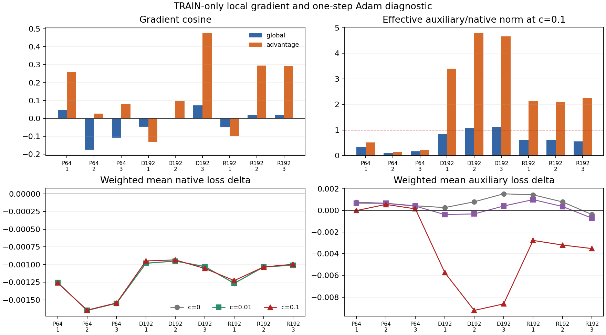

# Controlled-encounter gradient credit — 2026-09-22

This completed diagnostic rejects a prospective coefficient-0.1 teacher-set NLL
continuation on TRAIN data. It produced no learned behavior, candidate checkpoint, promotion
evidence, long-run evidence, or new gameplay. Its result is local: on frozen,
regenerated TRAIN fixtures, the native-TD and crossing-teacher terms did not
meet the predeclared all-parent compatibility gate.

For the prior learning curves and gameplay measurements, see
[crossing rehearsal](../controlled_encounter_crossing_rehearsal_2026-09-22/README.md).
Those results are context only; this report neither reruns them nor attributes
their behavior to particular historical updates.

## What was measured

The diagnostic used the three authenticated `SHORT64` parents (seeds
`2026098001`–`2026098003`) as its sole primary states. The completed native-TD
`dose192` and crossing-`rehearsal192` endpoints were six descriptive states,
excluded from the decision. Each of the nine fixed-policy states supplied 16
new native fixture blocks, or 144 blocks and 13,697 native fixture transitions
in total. The fixed policy was not changed while its collection stream was
generated.

For each block, the instrumented native update used the actual collector,
targets, exact-coverage minibatch semantics, and full Adam state. It made
discarded one-step probes at `c=0`, `c=0.01`, and `c=0.1`; every branch restored
the same frozen network, full Adam state, native-SGD state, and frozen batch
inputs before its step. `c=0.01` and `c=0.1` also restored the same auxiliary
sampler state. These are local counterfactual probes on regenerated fixtures,
not a replay of original training updates.

The raw-gradient check aggregates native and auxiliary gradients for the global
network and the advantage stream. The finite-Adam check compares the fixed-batch
native and auxiliary loss changes after one actual step. A primary parent had to
pass *both* groups, and all three primary parents had to pass before coefficient
0.1 could admit a separately frozen training proposal. The 192-update endpoint
rows below have no admission authority.

## Results

`Cos(global)` is the raw-gradient cosine. `Ratio(global)` and `Ratio(adv)` are
the coefficient-0.1 auxiliary-to-native gradient-norm ratios. `Δ native` and
`Δ aux` are the finite-Adam changes for the `c=0.1` branch; negative is a loss
decrease. The values are reported from the audited analysis without rounding so
the gate decisions remain reproducible.

| State | Seed | Cos(global) | Ratio(global) | Ratio(adv) | Δ native, c=0.1 | Δ aux, c=0.1 | Gate context / decision |
| --- | ---: | ---: | ---: | ---: | ---: | ---: | --- |
| parent64 | 2026098001 | 0.04622225217541885 | 0.3341716706533431 | 0.5130998151135225 | -0.0012591140806128126 | -0.00001691095530986786 | Primary: global PASS; advantage PASS; parent PASS |
| parent64 | 2026098002 | -0.17460988412518463 | 0.10335680084746361 | 0.12879364042451025 | -0.0016430323918987261 | 0.0005506542511284351 | Primary: global raw auxiliary margin negative; finite auxiliary loss increased; REJECT |
| parent64 | 2026098003 | -0.10731141854645129 | 0.1553224286951796 | 0.1970619481092121 | -0.0015418569580024203 | 0.00014138594269752502 | Primary: raw checks passed; finite auxiliary loss increased; REJECT |
| dose192 | 2026098001 | -0.046865257551187145 | 0.8431266400661432 | 3.3949491339292126 | -0.0009477535883585612 | -0.005739832296967506 | Descriptive only; excluded from admission |
| dose192 | 2026098002 | 0.002853211043968828 | 1.081033815036093 | 4.779873665422547 | -0.0009339325477320821 | -0.00923161581158638 | Descriptive only; excluded from admission |
| dose192 | 2026098003 | 0.07302209439088231 | 1.1108005569866615 | 4.6549279512949555 | -0.001054916636095567 | -0.00862973928451538 | Descriptive only; excluded from admission |
| rehearsal192 | 2026098001 | -0.050281079752497196 | 0.6033532310226651 | 2.142096728074553 | -0.0012255531016642078 | -0.002771703526377678 | Descriptive only; excluded from admission |
| rehearsal192 | 2026098002 | 0.01629758517249579 | 0.6136297152192133 | 2.0821245504010917 | -0.001032637453063528 | -0.003198448568582535 | Descriptive only; excluded from admission |
| rehearsal192 | 2026098003 | 0.019086228481051164 | 0.5520666727330918 | 2.259536900643436 | -0.0009955679416107865 | -0.003523480147123337 | Descriptive only; excluded from admission |

`parent64` seed `2026098001` passed both groups. Seed `2026098002` failed the
global raw auxiliary-margin condition and also had a positive finite auxiliary
delta. Seed `2026098003` passed the raw checks but had a positive finite
auxiliary delta. Consequently, all-three-primary admission is false and the
coefficient-0.1 training proposal is rejected. The descriptive results never
enter that decision.

The figure is a presentation of these fixed-state measurements. It is not a
learning curve, a gameplay result, a fresh-world comparison, or evidence that
one loss term caused a historical training outcome.

## Scope and next direction

All 432 probe steps, plus two qualification steps, were discarded: 434 discarded
optimizer steps in total. There were zero scientific training updates, zero
candidate checkpoints, zero new gameplay cycles, and no held-feature or evaluation
report deserialization. Integrity checks may byte-hash inherited held artifacts.
The diagnostic grants no promotion or fresh-confirmation permission. The 192-update endpoints may be
descriptive of their completed studies, but cannot support a coefficient choice.

The next direction is prospective only: test a crossing direction margin anchor. It was not run here. This result rules out scalar
coefficient escalation under the frozen decision rule; it does not establish a
long-horizon trajectory or fresh-world behavior for any alternative.

## Evidence status

The qualification passed with hook-on/off equality and gradient recomposition.
The independent audit-v2 passed with no errors, recomputed both global and
advantage checks, verified the primary-only decision boundary, and verified hash
closure and receipts. Its revised strict equality check found all 13,697 native
fixture transitions exact float32 matches; the preserved failed audit used 45
double-versus-float32 residual checks, with maximum residual
`2.384185791015625e-7`, before the stricter comparison was adopted. Failed
attempt artifacts remain preserved; no probe or analysis was repeated.

Four attempts were charged (three complete, one failed) for
`253.27859495999292` of the 900-second budget. The completed diagnostic peaked
at 5,555,781,632 bytes (5.174 GiB) RSS and observed a minimum of
31,287,590,912 bytes (29.139 GiB) available memory. The frozen runtime source
was `1f32d2de1987d97441fa74c1898ed9039b535f24`; `main` at freeze was
`3c517bde06ee515dacf26c5a1cb53e3710031db2`.

- [Frozen intent](/Users/josenunez/Projects/ml/snake-dqn-artifacts/ongoing-research-20260913/controlled-encounter-gradient-credit/intent.json)
  — SHA-256 `49ffc68db37def3c06f6948fc7200ae253343b9534f71379c30e0643d73c3534`.
- [Completed diagnostic](/Users/josenunez/Projects/ml/snake-dqn-artifacts/ongoing-research-20260913/controlled-encounter-gradient-credit/diagnostic/report.json)
  — `COMPLETE_DIAGNOSTIC`.
- [Audited analysis](/Users/josenunez/Projects/ml/snake-dqn-artifacts/ongoing-research-20260913/controlled-encounter-gradient-credit/analysis/report.json)
  — `COMPLETE_AUDITED`; SHA-256 `c8d1d98f37979247db6a389b1ecec597a71daebc552fa3acce75db8fd2929e06`.
- [Independent audit-v2](/Users/josenunez/Projects/ml/snake-dqn-artifacts/ongoing-research-20260913/controlled-encounter-gradient-credit/audit-v2/report.json)
  — `PASS`; SHA-256 `5449e519880f7fb93f0525e12b83ffb2cd83a97e9d76e14fe51e3d9f6185718c`.
- [Preserved failed audit](/Users/josenunez/Projects/ml/snake-dqn-artifacts/ongoing-research-20260913/controlled-encounter-gradient-credit/audit/report.json)
  — retained as an audit history artifact, not a completion result.
