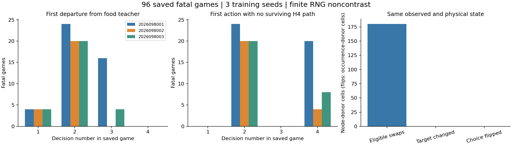

# Controlled-encounter hidden-RNG diagnostic — 2026-09-21

This diagnostic census found a surviving H4 alternative before every fatal
action in 96 selected broad-arm held games. Across three fixed case-0 RNG
donors, however, none of the 180 eligible donor/node cells changed the target,
H4 survival set, or learner membership. That finite noncontrast does not prove
that hidden future RNG is irrelevant or observable, and the conditional fatal
case census is not a population effect or death-causation proof.

The cases come from the completed [world-breadth learning comparison](../controlled_encounter_world_breadth_learning_2026-09-21/README.md), whose learning curves and representative paths remain the source for learned-model behavior. This diagnostic repeats no model gameplay. It performed native replay and oracle queries, so only its final analysis stage is saved-only.

## Conditional fatal-case census

The preselected corpus contains 96 fatal held games and 256 replayed native
frames. Fatal action frames occurred at decision 2 in 64 games and decision 4
in 32 games. The first teacher-target departure is zero-based: 12 at step 0,
64 at step 1, and 20 at step 2. Every game still had an H4-surviving action
available before its fatal action; none first reached an unavoidable state.

| Fresh seed | Fatal games | Replayed frames | Fatal at decision 2 / 4 | First target departure at step 0 / 1 / 2 |
| --- | ---: | ---: | ---: | --- |
| 2026098001 | 44 | 128 | 24 / 20 | 4 / 24 / 16 |
| 2026098002 | 24 | 56 | 20 / 4 | 4 / 20 / 0 |
| 2026098003 | 28 | 72 | 20 / 8 | 4 / 20 / 4 |
| **Total** | **96** | **256** | **64 / 32** | **12 / 64 / 20** |

The census is conditional on those already-observed fatal held cases. It does
not establish that target departure caused death, that every broad-held game
has the same mechanism, or that changing a target would improve a learned
policy.

The complete row-level conditional census is available as
[fatal-game-census.csv](fatal-game-census.csv).

## Fixed-donor hidden-RNG probe

The probe reduced the first teacher departures to 60 unique witness nodes. It
used three finite, fixed case-0 donor RNG states (`2026099001`–`2026099003`),
which produced 180 strict eligible donor/node cells. It found zero changed
targets, zero changed H4 survival sets, and zero membership flips.

Native evidence came from 176 archive hits, 56 fresh H4 baseline queries, and
24 within-run reuses. The counterfactual work comprised 180 donor H4 queries
and 60 H1 queries. No learner update or policy inference ran, but the probe did
replay native frames and compute oracle branches; it should not be described as
wholly saved-only.

The three donors are a finite contrast, not a distribution over future RNG.
Their lack of a change at these witnesses is compatible with hidden future RNG
remaining relevant elsewhere. It also does not demonstrate that action-target
departure, rather than a later state-coverage issue, explains the fatal games.

## Execution record and next question

The audited closeout is `COMPLETE_AUDITED` (SHA-256
`d5de3659d940c93559acb72d8f0bd244cd2eb47f42ce159ff9a3da599852e545`).
Two guarded jobs completed with no failure, charging 37.85355833306676 seconds
of the 240-second budget. Peak RSS was 3,402,940,416 bytes and minimum
available memory was 31,137,415,168 bytes. The independent Luna saved audit
passed, and Sol completed the prelaunch static-semantics review. The incumbent
Apex policy and promotion gate remain unchanged.

The next bounded question is actual-greedy gameplay and training-state coverage
on the 48 newly added training worlds across all three matched small/broad final
checkpoints. It has not been answered by this diagnostic.

## Source records

- [Frozen hidden-RNG intent](/Users/josenunez/Projects/ml/snake-dqn-artifacts/ongoing-research-20260913/controlled-encounter-hidden-rng/intent.json) — SHA-256 `677dbc1b10641618d73125d826013d5a97ba21ce2f9c0e6dfffc3aaf9df1d78a`
- [Native replay and oracle-probe report](/Users/josenunez/Projects/ml/snake-dqn-artifacts/ongoing-research-20260913/controlled-encounter-hidden-rng/probe/report.json) — SHA-256 `d9f23fed29431cfaa22ca5905d6bf97290d70cf6af8fdb2de08ffe4995981da3`
- [Audited conditional census](/Users/josenunez/Projects/ml/snake-dqn-artifacts/ongoing-research-20260913/controlled-encounter-hidden-rng/analysis/report.json) — SHA-256 `7ff587886d4cdd099baa76f1e954dbcc74662b269b60b0e1a727b5fda31bd32a`
- [Copied diagnostic figure source](/Users/josenunez/Projects/ml/snake-dqn-artifacts/ongoing-research-20260913/controlled-encounter-hidden-rng/analysis/diagnostic.png) and [census source](/Users/josenunez/Projects/ml/snake-dqn-artifacts/ongoing-research-20260913/controlled-encounter-hidden-rng/analysis/fatal-game-census.csv)
- [Audited closeout](/Users/josenunez/Projects/ml/snake-dqn-artifacts/ongoing-research-20260913/controlled-encounter-hidden-rng/closeout.json)
