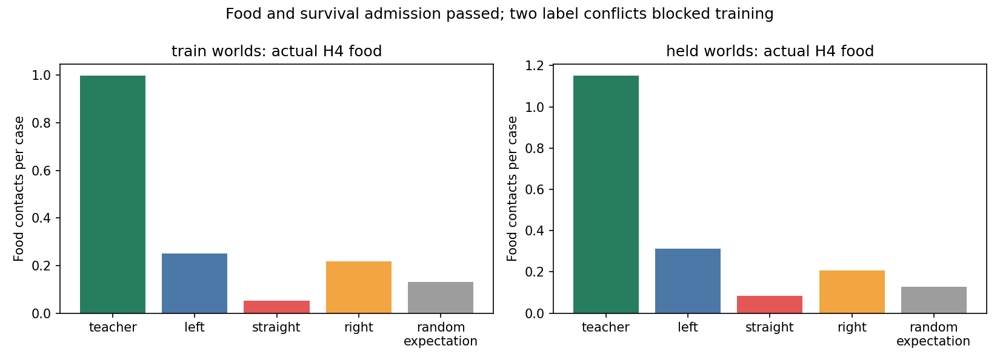
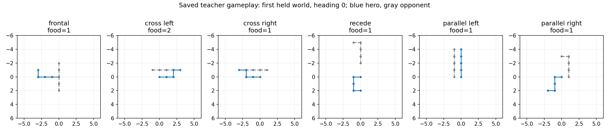

# Controlled-encounter imitation admission — 2026-09-21

This study asked whether the unchanged enemy-visible raster network could learn
four-step, stationary native-teacher trajectories for joint food collection and
survival. The original frozen admission rule rejected the dataset before any
scientific learner run. This is a closeout of that admission decision, not a
learning result and not an architecture comparison.

## What was collected

The frozen bank contained 384 train games and 192 held games, across all six
encounter families and four headings. Each four-step teacher trajectory yielded
four supervised Watch states, so the saved arrays contain **1,536 train labels**
and **768 held labels**. Labels are therefore state rows; the smaller counts are
distinct games.

The stationary native teacher met the food and survival admission checks in both
splits. It survived every game, including every family, and its food contacts per
game were 0.9974 on train and 1.1510 on held. The corresponding strongest fixed
control was 0.2500 on train and 0.3125 on held; exact resolved-action random
expectation was 0.1318 and 0.1285. All frozen food, control-multiple,
four-state, normal-action-support, and train/held non-overlap gates passed.

## Admission result

The required `no_alias_conflicting_teacher` gate failed. The saved-array
diagnostic found **two exact input-feature groups covering six state rows** with
incompatible teacher action sets. The collision was within train data; it was
not a train/held overlap. Sixteen other differing-label groups retained a common
teacher action and were compatible, but the two incompatible groups violate the
original frozen no-alias condition.

The admission records `REJECTED` and `scientific_training_permitted: false`;
the reconciled campaign closeout is `COMPLETE_ADMISSION_REJECTED`.
The original criteria remain intact: no threshold was relaxed, no rows
were discarded, and no alternate fit or gameplay criterion was substituted.

## Execution boundary

No full scientific seed was trained. Seeds `2026097501`, `2026097502`, and
`2026097503` remain unlaunched. The only learner work was the discarded,
eight-update qualification run using smoke seed `2026097599`; it is not a
scientific result and supplies no learning, generalization, or gameplay claim.
There is no scientific learning curve for this rejected study.

All six guarded jobs completed in **247.563655958 seconds** against the frozen
1,530-second budget: qualification collection, qualification training,
qualification evaluation, full collection, admission, and the saved-artifact
admission analysis. Their receipts classify as complete. The admission decision
is tied to the frozen intent, collection report, receipt, and state-audit hashes
recorded in `collection-admission.json` and `admission-analysis/report.json`.
Peak observed RSS was 702,873,600 bytes (about 670 MiB), and the lowest
available-memory sample was 30,384,308,224 bytes (about 28.3 GiB). The jobs
retained the 9.6 GiB available-memory reserve and ran serially. CPU/GPU duty
percentage was not measured.

The next step is a diagnostic of the saved conflicting pair identities. It must
explain why identical full network inputs received incompatible teacher sets
before any new data policy, learner run, or claim of imitation learnability is
considered.

## Source records

- `controlled-encounter-imitation/collection-admission.json`
- `controlled-encounter-imitation/admission-analysis/report.json`
- `controlled-encounter-imitation/collect/report.json`
- `controlled-encounter-imitation/supervisor-runs/*/receipt.json`
- `controlled-encounter-imitation/closeout.json` — SHA-256
  `5d0f78c39870792a3aa2f0d5e8a40eaa10966edf7565a815c0379a701971083b`
