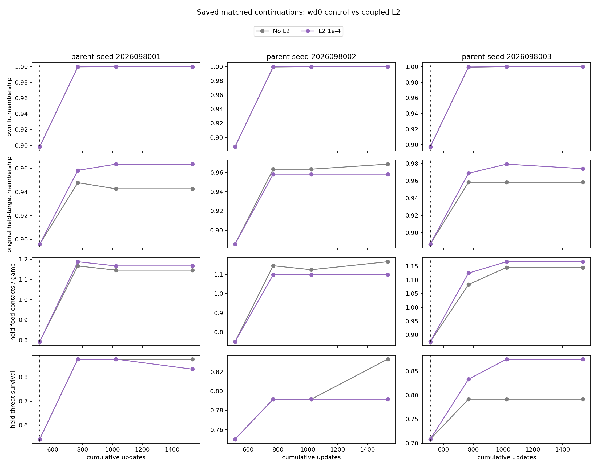
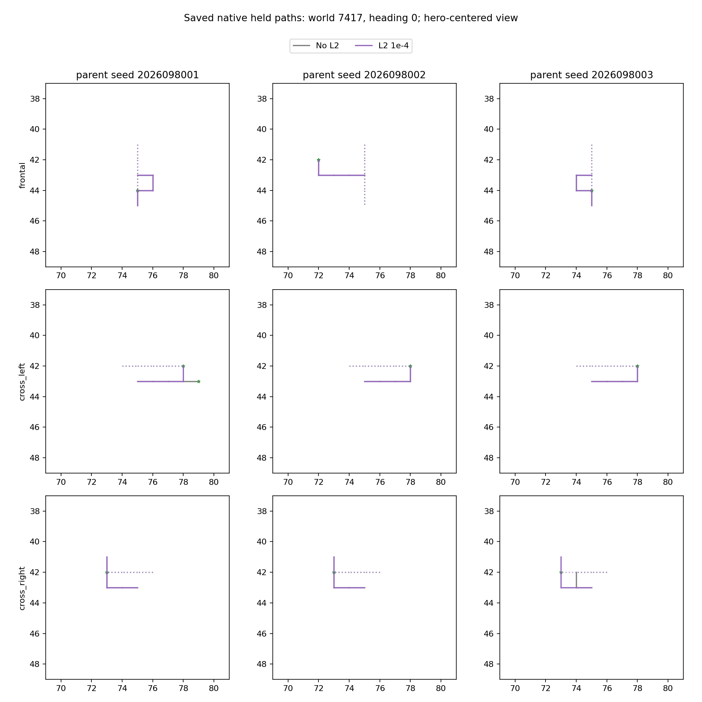

# Controlled-encounter L2 learning — 2026-09-21

Adding coupled Adam L2 regularization with `weight_decay=1e-4` did not improve
the matched held behavior. All three final relative-effect packages are false,
as are all three candidate-competence packages; fresh confirmation is not
permitted. This rejects the fixed tested setting under this continuation, not
regularization in general. It does not promote or replace the incumbent Apex
policy.

The comparison continues the admitted
[global-teacher learning study](../controlled_encounter_global_teacher_learning_2026-09-21/README.md).
Each treatment restored the same stored mark-512 parent network and full Adam
state as its WD=0 control, then changed only the coupled Adam weight decay from
0 to `1e-4`. The one Adam parameter group included every parameter, including
bias and normalization parameters. The network, observation and action
contracts, 25,616-row admitted corpus, 1,024 update draw stream, and 1,024
update dose stayed fixed. These are the same three warm-start
optimizer/initialization lineages, not fresh seeds or independent data
replications.

## Final behavior at mark 1536

Every control and L2 continuation reached 100% membership on its own training
corpus. The table reports the fixed final mark without selecting an earlier
checkpoint. Held behavior covers the eight reused development worlds, so it is
adaptive evidence rather than fresh confirmation.

| Lineage | Held food: WD=0 → L2 | Held survivors: WD=0 → L2 | L2 early-held membership | L2 early-held families | Candidate competence |
| --- | ---: | ---: | ---: | --- | --- |
| 2026098001 | 220 → 224 | 180 → 176 | 94.27% | Fail | Fail |
| 2026098002 | 224 → 211 | 176 → 172 | 94.79% | Pass | Fail |
| 2026098003 | 220 → 224 | 172 → 180 | 94.27% | Pass | Fail |

The candidate-competence decision retains every original requirement: the
absolute gameplay and fit floors, old-corpus and immediate-parent retention,
and all-three-lineage rule. The early-held family failure in lineage 8001 is
one retained failure; all three candidates also fail their complete absolute
packages. Thresholds were not relaxed.

## Relative-effect result

The paired unit is the eight development worlds, not individual heading lanes.
The unchanged relative package requires food's lower 95% bound to exceed
−0.05, threat survival's lower bound to exceed zero, and benign-survival
noninferiority. Benign noninferiority passes in all lineages, but food and
threat gates fail in all three.

| Lineage | L2 − WD=0 food per case, 95% CI | Threat-survival change, 95% CI | Relative package |
| --- | --- | --- | --- |
| 2026098001 | +0.0208, [−0.1361, +0.1777] | −0.0417, [−0.2203, +0.1369] | Fail |
| 2026098002 | −0.0677, [−0.1466, +0.0112] | −0.0417, [−0.1402, +0.0569] | Fail |
| 2026098003 | +0.0208, [−0.0685, +0.1101] | +0.0833, [−0.0457, +0.2123] | Fail |

The curves use saved marks 512, 768, 1024, and 1536. Their held-membership
series uses the original FOOD targets; early-held fit is reported separately in
the table rather than substituted into that series. The paths are saved native
traces at the fixed final mark. Neither figure changes the no-selection rule.

## Qualification and execution record

Each of the three scientific treatments ran 1,024 updates and 131,072
examples, totaling 3,072 updates and 393,216 examples. The qualified
preflight used eight updates and was discarded; scientific arms reloaded the
original stored mark-512 parent. The qualification also confirmed the same
eight archived control draw arrays and a learned-weight change after the one
optimizer-field intervention.

The independent behavior audit passed with no issues for the nine completed
scientific, qualification, and analysis jobs. It recomputed six final held
endpoints, the three paired intervals, all relative gates, and the matched
parent/full-Adam, corpus, dose, and draw-stream identities. Its scope is those
nine jobs; it does not substitute for the closeout's separate presentation and
closure checks.

A tenth, saved-only presentation supplement regenerated the legends and
hero-centered paths without changing the immutable analysis, learner weights,
or any gate. The closeout records all 10 jobs complete with zero failures and
`COMPLETE_AUDITED_NO_RELIABLE_BENEFIT`: 518.5342799602076 charged seconds of
the 1,200-second budget, peak RSS of 7,878,246,400 bytes, and minimum available
memory of 28,782,477,312 bytes. The all-three relative and candidate-competence
gates remain false. No new confirmation-world gameplay occurred, and no Apex
promotion is authorized.

## Source records

- [Frozen L2-learning intent](/Users/josenunez/Projects/ml/snake-dqn-artifacts/ongoing-research-20260913/controlled-encounter-l2-learning/intent.json)
  — SHA-256 `d7a6d31a82a04dd641e025a3dafddb47e136bd82b0702e2cc828338e3e43ff45`
- [Unchanged learning criteria](/Users/josenunez/Projects/ml/snake-dqn-artifacts/ongoing-research-20260913/controlled-encounter-l2-learning/learning-criteria.json)
  — SHA-256 `69814e5ded5fda4ba8adfc8fca3f00aae0d41f0fd1aa64ef654877a8e1896fd4`
- [Completed saved analysis](/Users/josenunez/Projects/ml/snake-dqn-artifacts/ongoing-research-20260913/controlled-encounter-l2-learning/analysis/report.json)
  — SHA-256 `c887c957380f4b68be31c970ee751da6b1372f735955605e5a775b23b9b8047b`
- [Independent behavior audit](/Users/josenunez/Projects/ml/snake-dqn-artifacts/ongoing-research-20260913/controlled-encounter-l2-learning/independent-audit.json)
  — SHA-256 `184e0ca4f332616023f5b0ad0bcf36f5ae169de809bca13a0d84f4a5f48a4038`; [audit script](/Users/josenunez/Projects/ml/snake-dqn-artifacts/ongoing-research-20260913/controlled-encounter-l2-learning/independent-audit.py)
  — SHA-256 `c57b40a0b514cdbef28f43de64484ab78d384f44682e083956c7d2a4cfd872b2`
- [Saved-only presentation supplement](/Users/josenunez/Projects/ml/snake-dqn-artifacts/ongoing-research-20260913/controlled-encounter-l2-learning/presentation-v2/report.json)
  — SHA-256 `20b7024dfe3ac6ed63b3dedea4272789918fe95e8a42bebb260640f07eab5ee9`; [presentation curve source](/Users/josenunez/Projects/ml/snake-dqn-artifacts/ongoing-research-20260913/controlled-encounter-l2-learning/presentation-v2/learning-curves.png) and [path source](/Users/josenunez/Projects/ml/snake-dqn-artifacts/ongoing-research-20260913/controlled-encounter-l2-learning/presentation-v2/representative-paths.png)
- [Audited closeout](/Users/josenunez/Projects/ml/snake-dqn-artifacts/ongoing-research-20260913/controlled-encounter-l2-learning/closeout.json)
  — SHA-256 `b80c2bf5c0a43fc7bd948c6198224db566656c9a6f5d2f2754c26c03635e9186`
