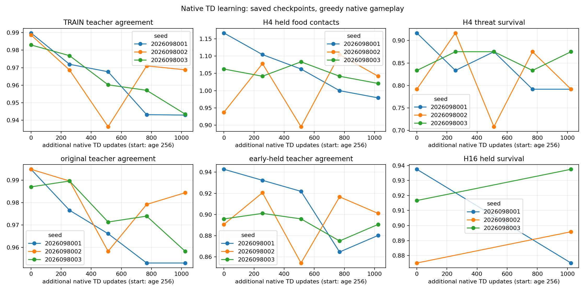
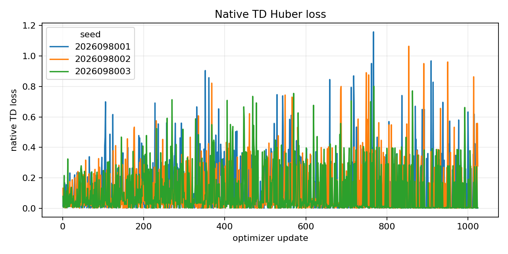
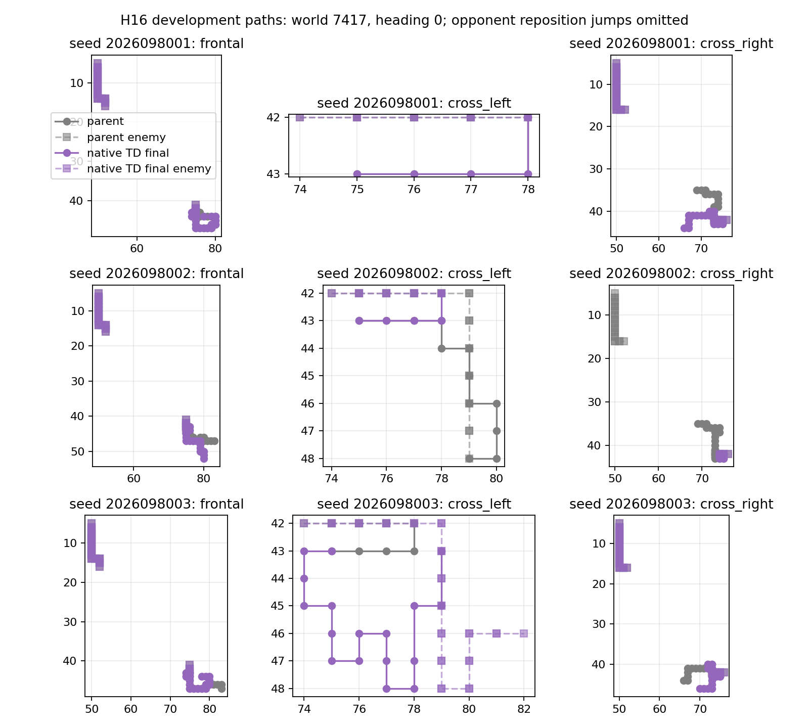

# Controlled-encounter native full cycle — 2026-09-22

The completed full-cycle continuation did not recover reliable behavior under
its frozen rule. All three lineages completed the required 6,144 TRAIN roots
and 1,024 additional native updates, but every final competence and retention
conjunction failed. The unchanged-native-dose line therefore ends: it opens no
fresh confirmation and provides no promotion evidence.

This result is for researchers familiar with the D192 native TD parents,
`SHORT64`, `SHORT0`, and the controlled-encounter held development bank. The
eight held worlds were adaptively reused. They are not untouched generalization
or confirmation evidence. Completion of first-cycle root coverage validates the
execution contract; it does not show that every reachable state/action
trajectory was visited or isolate a causal effect of root breadth.

## Fixed endpoint results

Each D192 parent restored its complete model and Adam state at age 256, then
completed 1,024 native updates to age 1,280. Each of the 24 lanes completed its
declared 256-root first cycle, for 6,144 roots per lineage. The mark-1,024
endpoint was fixed before execution; intervening marks describe curves only.

Entries are `food contacts / survivors` across 192 held cases. Every H16 food
count fell. H16 survivors fell for seed `2026098001` and rose for the other two.
Those changes do not by themselves establish statistically significant harm;
failure of a non-inferiority rule is not itself such a finding.

| Seed | D192 H4 | Final H4 | D192 H16 | Final H16 | First-cycle roots | Final conjunction |
| --- | --- | --- | --- | --- | --- | --- |
| 2026098001 | 224 / 184 | 188 / 172 | 1,064 / 180 | 984 / 168 | 6,144 / 6,144 | FAIL |
| 2026098002 | 180 / 172 | 200 / 172 | 978 / 168 | 889 / 172 | 6,144 / 6,144 | FAIL |
| 2026098003 | 204 / 176 | 196 / 180 | 1,055 / 176 | 1,034 / 180 | 6,144 / 6,144 | FAIL |

The frozen all-three package required original competence, cumulative
`SHORT0`/GLOBAL retention, `SHORT64` retention, immediate D192 retention,
GLOBAL-relative criteria, and first-cycle coverage. Coverage passed for every
lineage; each of the competence and retention all-three conjunctions was false.
No lineage satisfied the complete final conjunction.

## Fit records, reported separately

The table gives rows whose selected action belongs to the admissible teacher
action set at D192 and the fixed final mark.
The denominators are `own TRAIN` 25,616, `original TRAIN` 1,536, `old7184`
7,184, `early held` 768, and `held` 768. These are saved fit records, not a
fresh-world result.

| Seed | Own TRAIN | Original TRAIN | Old 7,184 | Early held | Held |
| --- | --- | --- | --- | --- | --- |
| 2026098001 | 25,355 → 24,154 | 1,528 → 1,464 | 7,111 → 6,768 | 724 → 676 | 732 → 700 |
| 2026098002 | 25,327 → 24,816 | 1,528 → 1,512 | 7,092 → 6,975 | 684 → 692 | 716 → 712 |
| 2026098003 | 25,180 → 24,168 | 1,516 → 1,472 | 7,076 → 6,792 | 688 → 684 | 716 → 704 |

The root reviewer visually inspected all three presentation figures. They
render saved analysis outputs: the figures do not add learning, evaluation, or
confirmation work.

## Decision and limits

The failed final rule ends this unchanged-dose line. Fresh confirmation was not
permitted or executed, and promotion remains ineligible; the shared tournament
gate remains the promotion authority. The result does not select a next
intervention. That choice remains under design.

The campaign ran 3,072 scientific updates and 292,658 scientific hero steps.
One discarded qualification update and 48 qualification games are tracked
separately. Of 12 attempts, 10 completed and two failed, charging
`2281.964562873007` seconds from the frozen 6,200-second budget. Peak RSS was
`6124879872` bytes and minimum available memory was `31391924224` bytes. The
receipts do not record an observed MPS peak; their latest-heartbeat allocations
are not a measured peak and must not be added to RSS on unified memory.

The original qualification attempt is preserved: its child returned code 1 and
exited naturally because the metadata loader compared tuple Adam betas from
checkpoint provenance with their JSON-list representation. A versioned loader
normalized that boundary, retained the other guards, and the resulting
qualification was successfully reused. A separate original training launch was
rejected by the argument parser with return code 2 because its 1,500-second
request exceeded the supervisor's 1,200-second cap; no child launched. The
recovered scientific launches used the stricter 1,200-second cap.

The independent audit passed with no errors. This study does not change any
earlier archived verdict and does not establish a physical-Q mechanism or an
effect outside its fixed, adaptively reused evidence bank.

## Evidence

- [Closeout](/Users/josenunez/Projects/ml/snake-dqn-artifacts/ongoing-research-20260913/controlled-encounter-native-full-cycle/closeout.json)
  — `COMPLETE_AUDITED_UNCHANGED_NATIVE_DOSE_LINE_ENDED`; SHA-256
  `1e7785853e97028572b8eaaf965ea4c60d9a924622963c6309173d12a763e61f`.
- [Audited analysis](/Users/josenunez/Projects/ml/snake-dqn-artifacts/ongoing-research-20260913/controlled-encounter-native-full-cycle/analysis/report.json)
  — `COMPLETE_AUDITED`; SHA-256
  `73d35c37ff9227195f73572cc43e0d33b9e6a67e4b8eed12866d33b0b3e5b331`.
- [Independent audit](/Users/josenunez/Projects/ml/snake-dqn-artifacts/ongoing-research-20260913/controlled-encounter-native-full-cycle/audit/report.json)
  — `PASS`; SHA-256
  `67879f4a14fd44d337849d71693320435934e8412213781bcbbcc12e601f2ca9`.
- [Frozen intent](/Users/josenunez/Projects/ml/snake-dqn-artifacts/ongoing-research-20260913/controlled-encounter-native-full-cycle/intent.json)
  — `FROZEN_BEFORE_EXECUTION`; SHA-256
  `a7f26c9217cf57cc31d2faff4e838b6b35cdaf7187d9eb01bf0bce4636723f4d`.
