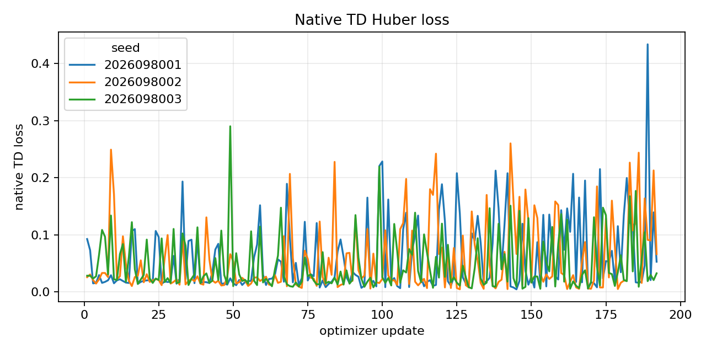
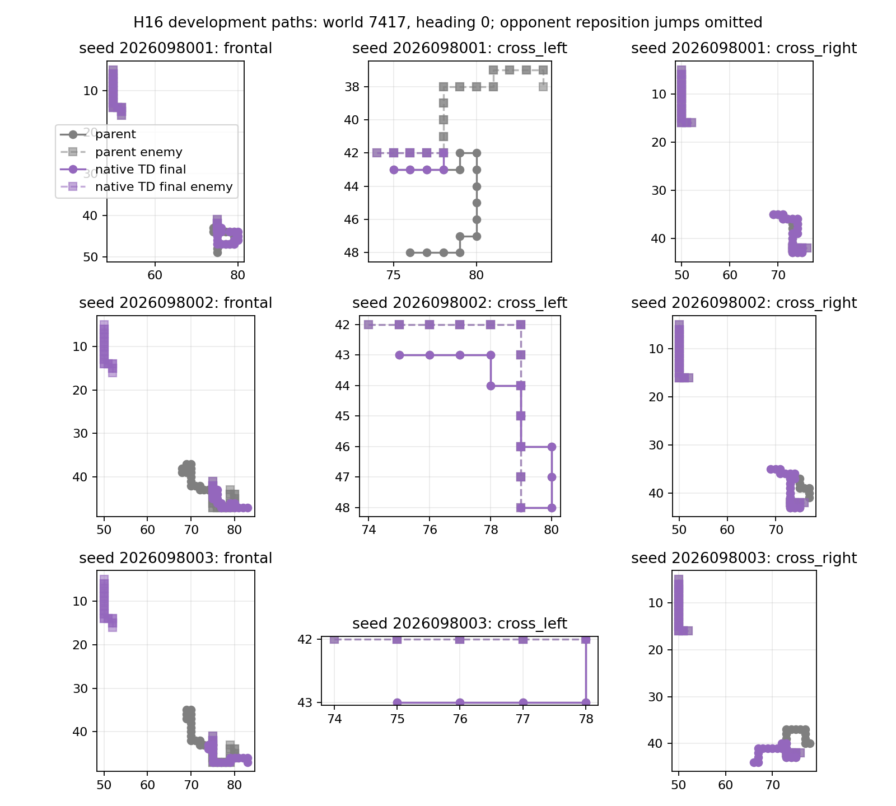

# Controlled-encounter native-TD dose continuation — 2026-09-21

The unchanged-dose continuation is rejected: it reached age 256 but did not
meet the all-lineage original, cumulative, or incremental retention packages.
The result comes from three existing SHORT64 model-and-Adam continuations with
fresh collector episodes and RNG streams, rather than new initializations or an
exact environment resume. The eight adaptive development worlds are not fresh
confirmation. Apex remains the incumbent, and no promotion is authorized.

## Fixed final endpoint

Each H4 and H16 column covers 192 cases. The table compares the authenticated
SHORT64 parent with the fixed age-256 endpoint; own-train fit is separate from
behavioral gates.

| Lineage | H4 food: 64 → 256 | H4 survivors: 64 → 256 | H16 food: 64 → 256 | H16 survivors: 64 → 256 | Age-256 own fit |
| --- | ---: | ---: | ---: | ---: | ---: |
| 2026098001 | 227 → 224 | 188 → 184 | 1,094 → 1,064 | 184 → 180 | 98.98% |
| 2026098002 | 216 → 180 | 180 → 172 | 1,106 → 978 | 176 → 168 | 98.87% |
| 2026098003 | 220 → 204 | 176 → 176 | 1,069 → 1,055 | 176 → 176 | 98.30% |

All three original competence, cumulative GLOBAL-parent retention, and
incremental retention packages are false; the prior criteria were unchanged.
Early-held fit fails for seeds 8002 and 8003, while own fit remains about
98–99%. Seed 8002's incremental H4-food change is −0.1875 per case, 95% CI
[−0.344392, −0.030608], which supports a negative effect on these adaptive
worlds. Other non-inferiority failures do not, by themselves, establish
significant harm.

## What changed and what remains uncertain

The added dose improved frontal avoidance in all three lineages: frontal
survival moved 0.875 → 1.000, 0.750 → 0.875, and 0.750 → 1.000. Crossing safety
worsened in two left and two right comparisons: cross-left 1.000 → 0.875,
1.000 → 1.000, 0.875 → 0.625; cross-right 1.000 → 0.875, 0.875 → 0.500,
0.875 → 0.875. This is descriptive evidence of a skill tradeoff on the eight
adaptive worlds, not an additional success claim. It motivates the next
first-divergence census to stratify by family.

The study performed 576 scientific updates and 54,825 valid hero steps. Eight
qualification-admission gates passed; its one update and 48 games were
discarded. Model and Adam restoration were verified before a fresh
collector/RNG boundary. Ten jobs completed with zero failures, charging
809.920579 seconds of the 1,800-second guard. Peak RSS was 6,214,434,816 bytes
and minimum available memory was 28,422,438,912 bytes. The audit passed on
saved records and did not independently replay native dynamics.

No unchanged-dose extension follows this result. The saved
first-divergence-census draft is not frozen or executed. It should test the
family-stratified trace boundary before any further continuation; no equal-budget
Apex comparison, fresh confirmation, or promotion occurred here.

## Source records

- [Completed closeout](/Users/josenunez/Projects/ml/snake-dqn-artifacts/ongoing-research-20260913/controlled-encounter-native-td-dose-continuation/closeout.json)
  — `COMPLETE_AUDITED_UNCHANGED_DOSE_REJECTED`; SHA-256
  `ccfecebd474fc4e2817366afa4ba09d7c62902c96ef41a78a8a4987154509fa5`.
- [Saved analysis](/Users/josenunez/Projects/ml/snake-dqn-artifacts/ongoing-research-20260913/controlled-encounter-native-td-dose-continuation/analysis/report.json)
  — SHA-256 `69e0e2050beae7d5bfba5ef1e1e3120bfdb93e976dc87be0f83fd6081e851c78`.
- [Saved-record audit](/Users/josenunez/Projects/ml/snake-dqn-artifacts/ongoing-research-20260913/controlled-encounter-native-td-dose-continuation/audit/report.json)
  — `PASS`, SHA-256 `1cf12382d49807ffa4611daf6dfe98e3e173268e4df3b068e9361ecfffbea85e`.
- [Discarded qualification admission](/Users/josenunez/Projects/ml/snake-dqn-artifacts/ongoing-research-20260913/controlled-encounter-native-td-dose-continuation/qualification-admission/report.json)
  — `COMPLETE_QUALIFIED_DISCARDED`, eight gates; SHA-256
  `bd377578a4cc5357e3cc3e0e9ef7736308054351670a85d5e281ce5bee81f5bc`.
- [Unfrozen first-divergence draft](/Users/josenunez/Projects/ml/snake-dqn-artifacts/ongoing-research-20260913/native-td-first-divergence-next.json)
  — trace-census design only; no run has launched.
- [Short-cap parent record](../controlled_encounter_native_td_short_cap_2026-09-21/README.md)
  — archived SHORT64 endpoint and unchanged prior verdicts.
