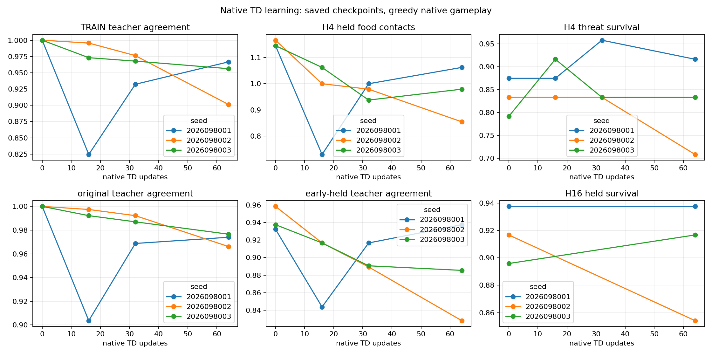
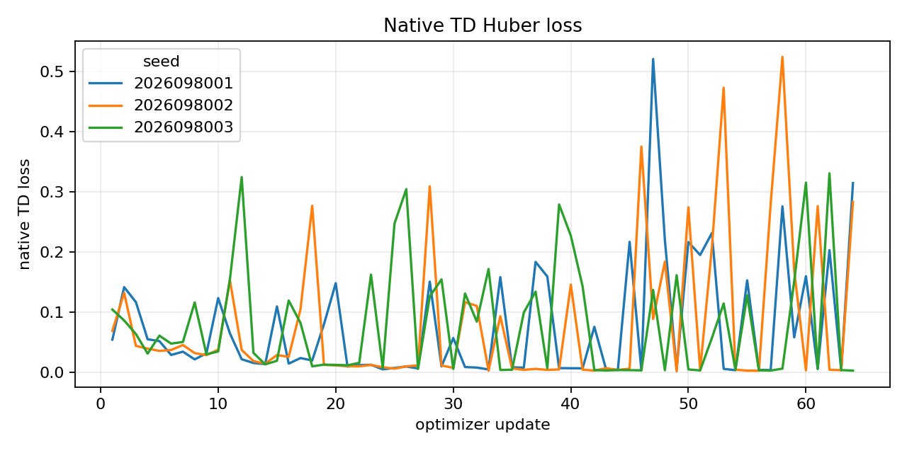
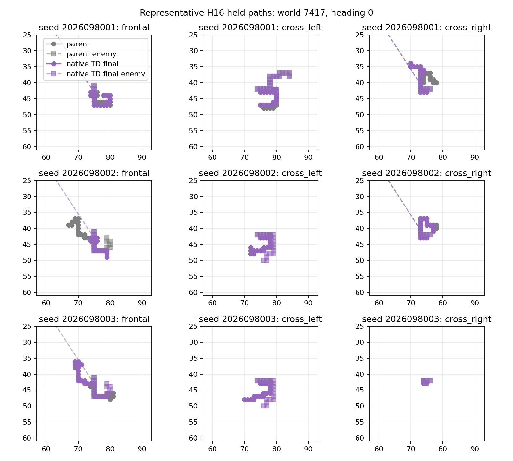

# Controlled-encounter native-TD learning — 2026-09-21

The short native-TD adaptation did not retain a reliable benefit from its GLOBAL
imitation-policy parent. All three parent-relative packages and all three
original competence packages are false; fresh confirmation is not permitted.
H4 food falls in every lineage, with paired declines that exclude zero for
lineages 2026098002 and 2026098003. This is a bounded warm-start adaptation
result, not a result about PQN trained from scratch or an architecture
comparison. Apex remains the incumbent and no promotion is authorized.

The study starts from the GLOBAL mark-1536 network with a fresh canonical native
Adam state in each of three existing lineages. It uses 24 native instances, two
slots per instance, four-frame blocks, and 64 updates per lineage. It is not an
imitation fine-tune: the native learner uses canonical PQN Huber Q(lambda),
with native physical Q values recorded unscaled while the inherited network
keeps `q_scale=0.1`.

## Final behavior at fixed mark 64

H4 parent data at mark 0 is authenticated reuse of the GLOBAL final policy; all
later H4 gameplay is new. Each comparison pairs the same eight adaptively reused
held worlds, so its intervals are development evidence rather than fresh
confirmation. Intermediate marks only describe the curve and cannot replace
this final-mark decision.

| Lineage | H4 food: parent → native TD | H4 survivors: parent → native TD | Food change per case, 95% CI | Threat-survival change, 95% CI |
| --- | ---: | ---: | --- | --- |
| 2026098001 | 220 → 204 | 180 → 184 | −0.0833, [−0.2499, +0.0832] | +0.0417, [−0.1369, +0.2203] |
| 2026098002 | 224 → 164 | 176 → 164 | −0.3125, [−0.5015, −0.1235] | −0.1250, [−0.3323, +0.0823] |
| 2026098003 | 220 → 188 | 172 → 176 | −0.1667, [−0.3156, −0.0177] | +0.0417, [−0.1369, +0.2203] |

The H4 food lower bound had to exceed −0.05, threat survival's lower bound had
to exceed zero, and benign survival could decline by at most 0.01. Benign
survival is unchanged in all three lineages, but the food and threat packages
fail in every lineage. The seed-8001 food interval is inconclusive; seeds 8002
and 8003 have negative intervals. All three retained original competence
conjunctions are also false.

H16 is a newly evaluated longer greedy horizon at marks 0 and 64. Its food
non-inferiority lower bound had to exceed −0.05 per case and its survival change
had to be at least −0.05. Neither all-lineage condition holds.

| Lineage | H16 food: parent → native TD | H16 survivors: parent → native TD | Food change per case, 95% CI | Survival change |
| --- | ---: | ---: | --- | ---: |
| 2026098001 | 1,068 → 1,061 | 180 → 180 | −0.0365, [−0.5698, +0.4969] | 0.0000 |
| 2026098002 | 1,107 → 664 | 176 → 164 | −2.3073, [−3.5562, −1.0584] | −0.0625 |
| 2026098003 | 1,037 → 955 | 172 → 176 | −0.4271, [−1.1301, +0.2760] | +0.0208 |

The figures use saved marks 0, 16, 32, and 64 and fixed representatives. They
illustrate the reported progression but do not select a substitute endpoint.

## Native lifecycle and recording boundary

Only the hero slot is eligible for recording and learning. The valid-slot
fraction and exposure therefore describe sparse recorded hero rows, not all
physical slots or total world exposure. The fixed native GreedyFood enemy's
actual behavior is examined separately by the native-opponent audit.

Live worlds persist across four-frame blocks. A hero death transition is valid,
then later same-block rows are invalid zombie padding; the lane resets only at
the next block. A physical frame-256 time limit is a truncation that bootstraps
from the frame-257 successor before resetting at the next block. Alive block
tails also bootstrap. These rules do not create artificial H4 or H16 terminals.

## Qualification and recovered evaluation

The discarded qualification used four native updates and four read-only fixture
blocks containing 381 steps. Its 12 fixture checks covered real native death,
valid-to-invalid zombie padding, block-boundary reset, frame-256 truncation
and bootstrap, continuity, physical-Q targets, padding isolation, native food
partitioning, and the exact parent network with fresh Adam state. It also ran
48 dedicated greedy H4 games at marks 0 and 4 without accessing held data.
Qualification training took 22.665449 seconds and qualification evaluation
17.179627 seconds. The saved admission is `COMPLETE_QUALIFIED_DISCARDED`.

The initial seed-8001 evaluation hit its watchdog while writing a large JSON
report after 106.636811972 charged seconds. The supervisor confirmed
termination with return code `-15` after the watchdog timeout, with no source
drift, and its immutable partial report was preserved. A reviewed
versioned serializer recovery retained the fully closed marks 0, 16, and 32,
then evaluated only mark 64. It did not repeat qualification or training.
Seeds 8002 and 8003 used the repaired evaluator directly. The completed
saved-behavior crosscheck passed by recomputing the paired results from saved
JSON; it did not run native/Torch behavior or validate checkpoints.

The completed closeout is `COMPLETE_AUDITED_NO_RELIABLE_BENEFIT`. It records
192 scientific updates and 18,296 hero steps (6,108 / 6,102 / 6,086 by lineage),
plus four discarded qualification updates. Across 11 physical attempts, 10
completed and the seed-8001 evaluation failure remains preserved. Immutable
receipts charged 623.6199584726 seconds of the 3,420-second cap. The 9,641-file
closure recorded peak RSS of 6,097,846,272 bytes and minimum available memory of
28,619,571,200 bytes.

The receipt and training-dose audit v2 passed, but it checked saved receipts and
training reports only; it did not execute behavior, native dynamics, or Torch.
The earlier v1 verifier and its failed report are preserved. v1 incorrectly
expected one-based update values, while the frozen native telemetry is
zero-based (`mark = index`, `update = index - 1`). Audit v2 corrects that schema
expectation without changing data, behavior results, or decision criteria.

## Fixed authority and limits

The original WORLDLEARN mark-0 absolute baseline, existing fit floors, and
staged mark-512 retention reference remain unchanged. The GLOBAL parent is a
starting policy, not an accepted replacement baseline. Confirmation would still
require all three original competence packages and both H16 non-inferiority
gates; the stricter H4 parent-relative improvement package is reported
separately. No new teacher, corpus, labels, simulator, observation contract,
action contract, or architecture was introduced.

The frozen aggregate limits were 3,420 seconds, 8 GiB process RSS, 24 GiB MPS
driver allocation, 9.6 GiB available-memory reserve, and two CPU threads under
serialized execution. This failed short diagnostic neither invalidates PQN
from scratch nor establishes that Apex is inherently better.

The selected next design is a matched three-lineage, 64-update continuation
that changes only the learning rate from `5e-4` to `1e-4`, reusing the authenticated
parent and finished control. It is pending an intent freeze and has not launched.
The existing absolute criteria remain unchanged; fit telemetry is separate, and
retention alone will not justify a longer run.

## Source records

- [Frozen native-TD intent](/Users/josenunez/Projects/ml/snake-dqn-artifacts/ongoing-research-20260913/controlled-encounter-native-td-learning/intent.json)
  — SHA-256 `820b29a8e30cbce8bc35016941d624b2c9c7014a43b85c4f16a722deb6bd26ca`
- [Completed saved analysis](/Users/josenunez/Projects/ml/snake-dqn-artifacts/ongoing-research-20260913/controlled-encounter-native-td-learning/analysis/report.json)
  — SHA-256 `72fc4bbd1b92f992cdc8cc2ddce5c1b0ad8443a533148cb072b418693be8df21`
- [Saved-behavior crosscheck](/Users/josenunez/Projects/ml/snake-dqn-artifacts/ongoing-research-20260913/controlled-encounter-native-td-learning/saved-audit/summary.json)
  — SHA-256 `149fedec412e2112e40d4c76b64c1b3920ba077904d1dd460bd676aa7998d918`
- [Completed closeout](/Users/josenunez/Projects/ml/snake-dqn-artifacts/ongoing-research-20260913/controlled-encounter-native-td-learning/closeout.json)
  — SHA-256 `82468555fb4c3a406cde6951c98eebccf647f8f943b74637aa877345029e547a`
- [Receipt and training-dose audit v2](/Users/josenunez/Projects/ml/snake-dqn-artifacts/ongoing-research-20260913/controlled-encounter-native-td-learning/receipt-audit.json)
  — `PASS`, SHA-256 `fe0169f566bb26f2ac7ba624c63f793d876038f3bdf6242fc37a0c21add3844b`; [v2 verifier](/Users/josenunez/Projects/ml/snake-dqn-artifacts/ongoing-research-20260913/controlled-encounter-native-td-learning/receipt_audit.py)
  — SHA-256 `64125a810ad281823914929dde0707d8d4b4121e178150d4549aac5e5a794c17`
- [Preserved v1 audit failure](/Users/josenunez/Projects/ml/snake-dqn-artifacts/ongoing-research-20260913/controlled-encounter-native-td-learning/receipt-audit-v1-failed.json)
  — SHA-256 `be03bf6067048d1a806dba7f2c2ed379aaa4792943ca23d745cec79f0b8d81d2`; [v1 verifier](/Users/josenunez/Projects/ml/snake-dqn-artifacts/ongoing-research-20260913/controlled-encounter-native-td-learning/receipt_audit_v1.py)
  — SHA-256 `a67f600615e813086001e18ee0ea172b5739af8be37bdaa25b1ddc9683501ee6`
- [Serialization repair](/Users/josenunez/Projects/ml/snake-dqn-artifacts/ongoing-research-20260913/controlled-encounter-native-td-learning/serialization-repair.json)
  — SHA-256 `15218d90a06a045873912ad37c50469b28e11dbebc36b392666b0f6fbd8759dc`; [repair static review](/Users/josenunez/Projects/ml/snake-dqn-artifacts/ongoing-research-20260913/controlled-encounter-native-td-learning/report-repair-static-review.json)
  — SHA-256 `b79bb0a3e66b0ba2d76e27422312c637cbd8bebbbf696c70806a249b28e0a92a`
- [Saved learning curves](/Users/josenunez/Projects/ml/snake-dqn-artifacts/ongoing-research-20260913/controlled-encounter-native-td-learning/analysis/learning-curves.png), [native-TD loss](/Users/josenunez/Projects/ml/snake-dqn-artifacts/ongoing-research-20260913/controlled-encounter-native-td-learning/analysis/native-td-loss.png), and [representative H16 paths](/Users/josenunez/Projects/ml/snake-dqn-artifacts/ongoing-research-20260913/controlled-encounter-native-td-learning/analysis/representative-h16-paths.png)
