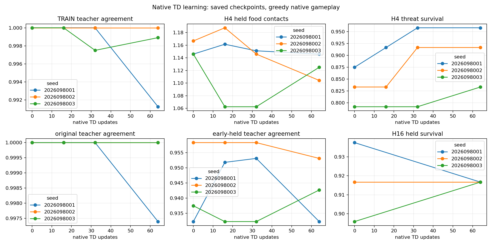
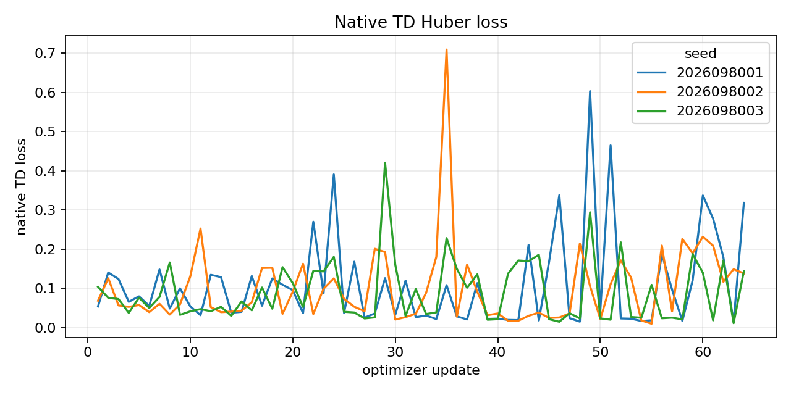
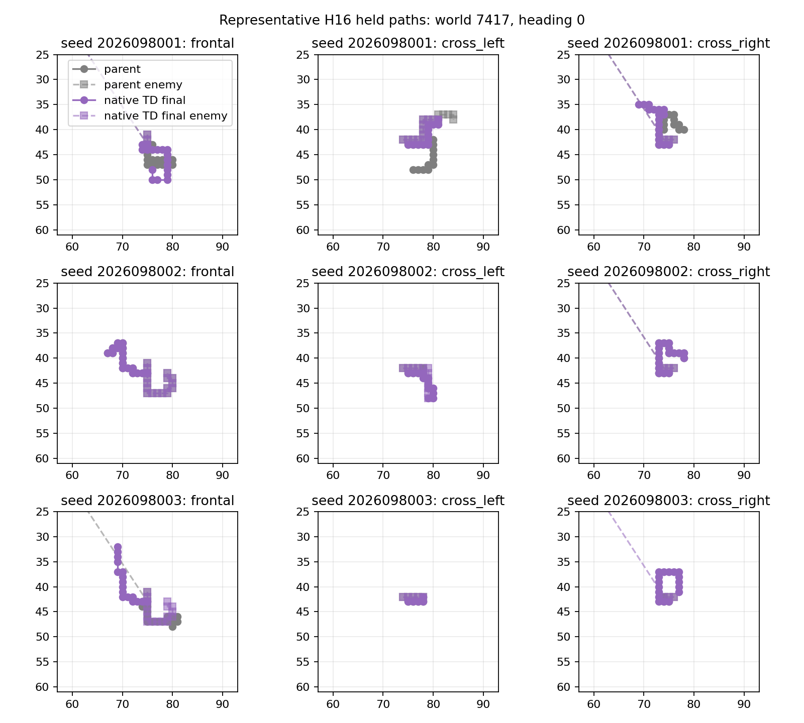
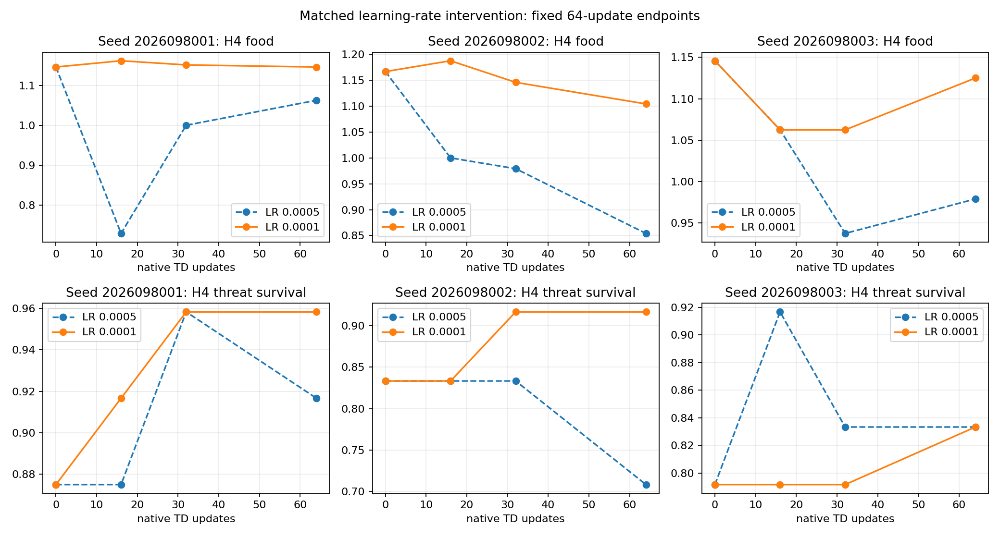

# Controlled-encounter native-TD low-LR study — 2026-09-21

The completed 64-update, `1e-4` native-TD arm gives one encouraging stability
signal, but it does not establish a reliable benefit. Only lineage 2026098002
has a positive paired H4-food lower bound against the completed `5e-4` control.
All three intervention packages, parent-retention packages, original competence
packages, and retained native-TD relative packages are false. Fresh confirmation
and promotion are not permitted.

This remains a single-factor warm-start adaptation study: the same three GLOBAL
mark-1536 parents, fresh empty canonical native Adam states, simulator,
collector, rewards, masks, RNG streams, and 64-update dose were used; only the
learning rate changed from `5e-4` to `1e-4`. Completed `5e-4` training and
mark-0 records were reused after authenticated identity checks, never retrained.
The eight held worlds are adaptively reused development worlds, not fresh
confirmation. Apex remains the incumbent.

## Final H4 endpoint

| Lineage | H4 food: parent → `5e-4` → `1e-4` | H4 survivors: parent → `5e-4` → `1e-4` | `1e-4` vs `5e-4` food change per case, 95% CI |
| --- | ---: | ---: | --- |
| 2026098001 | 220 → 204 → 220 | 180 → 184 → 188 | +0.0833, [−0.1401, +0.3068] |
| 2026098002 | 224 → 164 → 212 | 176 → 164 → 184 | +0.2500, [+0.0145, +0.4855] |
| 2026098003 | 220 → 188 → 216 | 172 → 176 → 176 | +0.1458, [−0.0111, +0.3027] |

Only seed 8002 passes the new strict H4-food comparison against `5e-4`. The
other intervals cross zero, so this is not a three-lineage intervention result.
Candidate final own-train membership remains high (99.13%, 100.00%, and 99.89%
for seeds 8001–8003), but that fit telemetry is separate from behavioral gates.
Final early-held membership is 93.23%, 95.31%, and 94.27%.

The original absolute criteria and the native-TD parent-relative conditions were
not relaxed. In particular, each lineage still had to retain parent H4/H16 food
and survival bounds, while all three had to pass the new `1e-4` versus `5e-4`
food condition. None does. Retention alone would not justify a longer run.

## H16 and execution boundary

The longer H16 endpoint also prevents a general benefit claim. Seed 8001 moves
from 1,068 food and 180 survivors in its parent to 1,060 and 176 at `1e-4`;
the four new deaths are benign. Seed 8002 moves from 1,107 and 176 to 1,119 and
176. Seed 8003 moves from 1,037 and 172 to 1,029 and 176. These fixed,
eight-world comparisons describe a promising stability indication in one
lineage, not a reliable all-lineage benefit or a proven learning-rate mechanism.

All nine guarded jobs completed with no execution failure. The study consumed
192 scientific updates and 18,253 hero steps (6,068 / 6,092 / 6,093 by lineage);
the four qualification updates remain discarded.

## Audited closure and limits

The completed closeout is `COMPLETE_AUDITED_NO_RELIABLE_BENEFIT`. It covers
9,737 closure files, nine complete attempts with zero failures, and
536.2228210408939 charged seconds of the 3,420-second cap. Peak RSS was
5,966,102,528 bytes and minimum available memory was 28,693,299,200 bytes.

Both independent checks passed. The receipt and training-dose audit checks
completed receipt and training-dose JSON only; it does not execute behavior.
The saved-statistics audit independently recomputes the fixed eight-world
statistics and gates from saved per-world totals; it is not an independent
native replay. The pre-execution static review also cleared the frozen design.

The next bounded question is whether a shorter 16-frame native training cap,
compared with the archived 256-frame cap, changes this behavior. Normalization
remains 256, and learning rate, dose, and criteria would remain fixed. That
question has not launched a new experiment.

## Source records

- [Frozen intent](../../../runs/pqn-controlled-encounter-native-td-low-lr/intent.json)
  — SHA-256 `804e8e728f034d890f6c6791477d47821f7c8e6c30c3eb8ce7383217c63d2520`.
- [Staged analyzer](../../../runs/pqn-controlled-encounter-native-td-low-lr/analyze.py)
  — fixed eight-world pairing and preserved gate evaluation.
- [Saved low-LR analysis](/Users/josenunez/Projects/ml/snake-dqn-artifacts/ongoing-research-20260913/controlled-encounter-native-td-low-lr/analysis/report.json)
  — SHA-256 `105e320604276d7978e1f6a1d96b0830571a435d3bb70ea76cd07fd87402d6ec`.
- [Completed closeout](/Users/josenunez/Projects/ml/snake-dqn-artifacts/ongoing-research-20260913/controlled-encounter-native-td-low-lr/closeout.json)
  — SHA-256 `8f58c489dad7157662a6f025e359c27b2c8b486a19824ca057f5afd4e0283abd`.
- [Input-freeze closure manifest](/Users/josenunez/Projects/ml/snake-dqn-artifacts/ongoing-research-20260913/controlled-encounter-native-td-low-lr/input-freeze-closeout.json)
  — 9,737 saved file hashes; SHA-256 `d38f4cc7e857b4e21df8b54fed972d47376e509c8e21e04a7847ef871a732cec`.
- [Receipt and training-dose audit](/Users/josenunez/Projects/ml/snake-dqn-artifacts/ongoing-research-20260913/controlled-encounter-native-td-low-lr/receipt-audit.json)
  — `PASS`, SHA-256 `7a9bbf49cd4a4e4682459bbb90026f1aa9e8465df4150dde0e5ed6ffcd9d9165`.
- [Saved-statistics audit](/Users/josenunez/Projects/ml/snake-dqn-artifacts/ongoing-research-20260913/controlled-encounter-native-td-low-lr/saved-statistics-audit.json)
  — `PASS`, SHA-256 `35b899a71484eb7f8b99e3f020ad79d9d3a06e624ba05fddc53f12797c4640ba`.
- [Pre-execution static review](/Users/josenunez/Projects/ml/snake-dqn-artifacts/ongoing-research-20260913/controlled-encounter-native-td-low-lr/static-review.json)
  — `CLEARED_BEFORE_EXECUTION`, SHA-256 `60adf78e50f88f001da761b6b8f63a8438a6df3efe5a0d86650024e71af10aa3`.
- [Completed `5e-4` native-TD control](../controlled_encounter_native_td_learning_2026-09-21/README.md)
  — analysis SHA-256
  `72fc4bbd1b92f992cdc8cc2ddce5c1b0ad8443a533148cb072b418693be8df21`.
