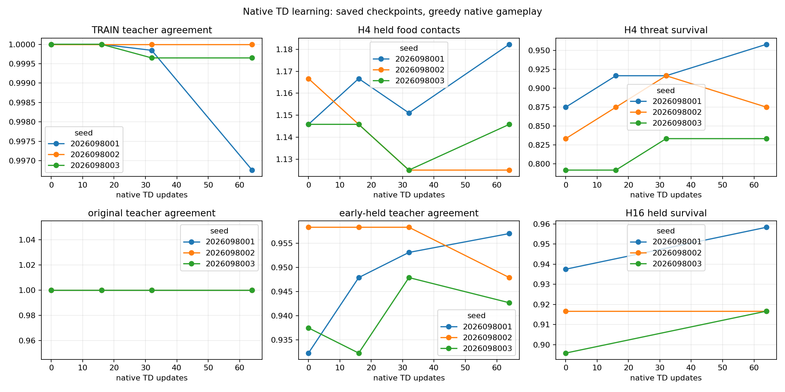
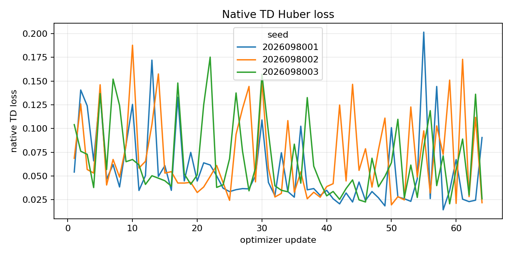
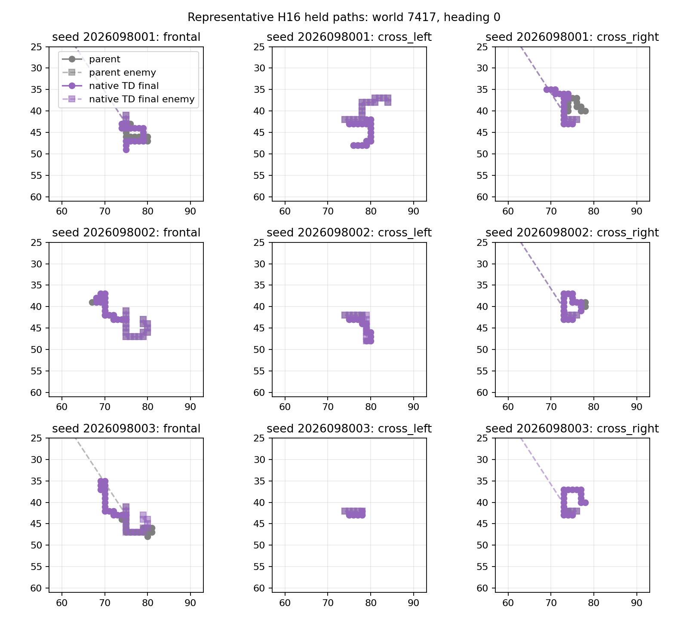
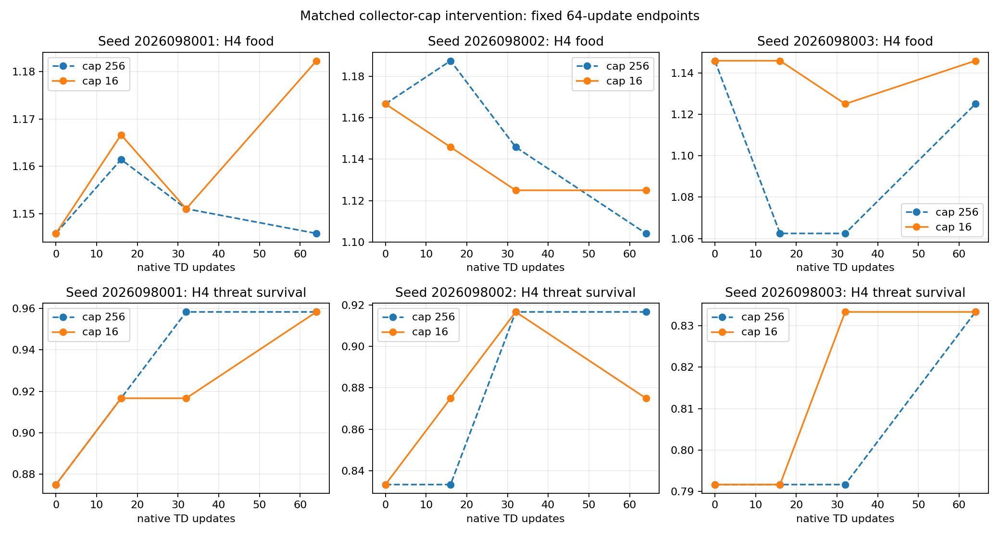

# Controlled-encounter native-TD short-cap study — 2026-09-21

**Status: `COMPLETE_AUDITED_NO_RELIABLE_BENEFIT`.** The cap-16 collector
manipulation completed, but the results did not establish a reliable benefit. All three
short-cap behavior packages, parent-retention packages, original competence
packages, and retained native-TD relative packages are false. Fresh confirmation
and promotion are not permitted.

This is a one-factor warm-start comparison: cap 16 in the actual native
collector versus the completed cap-256 low-LR control. Both retain
`max_frames=256` normalization, the same GLOBAL mark-1536 parents, fresh empty
canonical native Adam, `1e-4` learning rate, simulator, rewards, masks, RNG
streams, and 64-update dose. The eight development worlds are reused and are
not fresh confirmation. Apex remains the incumbent.

## Final endpoints

| Lineage | H4 food: cap 256 → cap 16 | H4 survivors: cap 256 → cap 16 | H4 food change per case, 95% CI |
| --- | ---: | ---: | --- |
| 2026098001 | 220 → 227 | 188 → 188 | +0.0365, [−0.0318, +0.1047] |
| 2026098002 | 212 → 216 | 184 → 180 | +0.0208, [−0.0685, +0.1101] |
| 2026098003 | 216 → 220 | 176 → 176 | +0.0208, [−0.0284, +0.0701] |

All primary H4-food intervals include zero. The result therefore neither
establishes a reliable benefit nor proves zero effect. The original absolute
criteria and native-TD relative criteria were not relaxed. A failed
non-inferiority or retention gate also does not establish a confirmed loss.

| Lineage | H16 food: cap 256 → cap 16 | H16 survivors: cap 256 → cap 16 | H16 food change per case, 95% CI |
| --- | ---: | ---: | --- |
| 2026098001 | 1,060 → 1,094 | 176 → 184 | +0.1771, [+0.0047, +0.3495] |
| 2026098002 | 1,119 → 1,106 | 176 → 176 | −0.0677, [−0.3494, +0.2140] |
| 2026098003 | 1,029 → 1,069 | 176 → 176 | +0.2083, [+0.0503, +0.3663] |

The positive H16 lower bounds for seeds 8001 and 8003 are exploratory secondary
signals. They do not replace the fixed all-lineage H4 decision or establish a
learning-cap mechanism.

## Manipulation and fit

The lifecycle manipulation passed in every lineage: all 64 updates ran over 24
strata, lane age reached 16, and cap truncations occurred. Its proof and
training-distribution checks are valid, but coverage alone is not causal proof.

| Lineage | Unique TRAIN worlds: cap 256 → cap 16 | Valid steps: cap 256 → cap 16 | Cap-16 truncations |
| --- | ---: | ---: | ---: |
| 2026098001 | 63 → 207 | 6,068 → 6,109 | 371 |
| 2026098002 | 55 → 207 | 6,092 → 6,078 | 364 |
| 2026098003 | 51 → 206 | 6,093 → 6,081 | 368 |

Final own-train membership is at least 99.67% in every lineage. Old-7,184 and
early-held fit packages pass in all three. All original food checks and all
original train- and held-fit checks also pass in all three. Absolute competence
still fails solely on gameplay survival: seed 8001 frontal survival is 0.875;
seed 8002 has cross-right 0.875, frontal 0.750, and threat-overall 0.875; seed
8003 has cross-left 0.875, cross-right 0.875, frontal 0.750, and threat-overall
0.8333. Benign survival is 1.0 in every lineage. This identifies a survival
bottleneck without making the intervention reliable.

Nine guarded jobs completed with zero execution failures. Immutable receipts
charged 553.4333233739017 seconds of the 3,420-second cap. The study has 192
scientific updates and 18,268 hero steps (6,109 / 6,078 / 6,081); four
qualification updates remain discarded. The closeout records peak RSS of
6,093,307,904 bytes and minimum available memory of 28,475,097,088 bytes.

## Audited closure and repair record

The completed closeout covers 9,833 frozen file hashes. The receipt and
training-dose audit and saved-statistics audit both pass. The receipt audit
checks saved receipts and dose records; the saved-statistics audit recomputes
saved per-world statistics and gates. Neither is an independent native replay.

Two saved receipt-verifier failures are preserved. They exposed a path-shape
assumption: the ordinary qualification fixture summary is directly under
`qualification_proof.collector`, while the other two are nested. The repaired
verifier accepts the two recorded shapes. This append-only path repair did not
rerun any of the nine scientific jobs and did not change scientific data or
criteria. The original closeout remains unchanged; the audit supplement extends
the freeze to 9,838 file hashes.

The [next unfrozen design](/Users/josenunez/Projects/ml/snake-dqn-artifacts/ongoing-research-20260913/native-td-value-diagnostic-next.json)
will inspect Q targets and gradients in the value, advantage, and shared layers.
The imitation loss is unchanged by adding a common value to every action, so it
does not determine the absolute return level that native TD uses. This is a
mechanism to investigate, not a proven cause of the survival failures. The
diagnostic has not executed; readiness for a long run, fresh confirmation, or
promotion remains unestablished.

## Sources

- [Frozen external intent](/Users/josenunez/Projects/ml/snake-dqn-artifacts/ongoing-research-20260913/controlled-encounter-native-td-short-cap/intent.json)
  — SHA-256 `d3f47e84de6b58b969622f47fb8968a028f3f873c6f486407118ba66116d7269`.
- [Saved short-cap analysis](/Users/josenunez/Projects/ml/snake-dqn-artifacts/ongoing-research-20260913/controlled-encounter-native-td-short-cap/analysis/report.json)
  — SHA-256 `628e56c5d38fba82b7d764dc8a3ddc4b901e1bf85d0cc4b3bdf5e4ba4b331397`.
- [Completed closeout](/Users/josenunez/Projects/ml/snake-dqn-artifacts/ongoing-research-20260913/controlled-encounter-native-td-short-cap/closeout.json)
  — SHA-256 `f310e25f6d0ac25739e0f43919ba8b33a18da634c59ece1d7a78a1da805b720b`.
- [Original closeout freeze](/Users/josenunez/Projects/ml/snake-dqn-artifacts/ongoing-research-20260913/controlled-encounter-native-td-short-cap/input-freeze-closeout.json)
  — 9,833 file hashes; SHA-256 `c530b436c124bddd3b3f75c4eccdc0fa74d71bd5c9f3fd0017631ae6d36d9020`.
- [Receipt and training-dose audit](/Users/josenunez/Projects/ml/snake-dqn-artifacts/ongoing-research-20260913/controlled-encounter-native-td-short-cap/receipt-audit.json)
  — `PASS`, SHA-256 `4c64dbe9ca129772aec1a28830d1162c79afe62c05fbc8613045b29c1e8b0997`.
- [Saved-statistics audit](/Users/josenunez/Projects/ml/snake-dqn-artifacts/ongoing-research-20260913/controlled-encounter-native-td-short-cap/saved-statistics-audit.json)
  — `PASS`, SHA-256 `abe21b2f8a097110c6c71fa35f6f545aafa52c705a8b85fd66d80c11a03a3c50`.
- [Verifier repair record](/Users/josenunez/Projects/ml/snake-dqn-artifacts/ongoing-research-20260913/controlled-encounter-native-td-short-cap/auditor-repair/repair.json)
  — SHA-256 `91df13b1e43edec85522abcbdfe815fe73e57a81351d47c233440901de8ee5b7`; [repaired verifier](/Users/josenunez/Projects/ml/snake-dqn-artifacts/ongoing-research-20260913/controlled-encounter-native-td-short-cap/receipt_audit.py)
  — SHA-256 `5ea845b0af2f56f5a7dacc58072af4af476465725ab28688b2ffc28e81664aac`; [preserved initial failure](/Users/josenunez/Projects/ml/snake-dqn-artifacts/ongoing-research-20260913/controlled-encounter-native-td-short-cap/auditor-repair/initial-failure.json) and [intermediate failure](/Users/josenunez/Projects/ml/snake-dqn-artifacts/ongoing-research-20260913/controlled-encounter-native-td-short-cap/auditor-repair/intermediate-failure.json).
- [Append-only audit-freeze supplement](/Users/josenunez/Projects/ml/snake-dqn-artifacts/ongoing-research-20260913/controlled-encounter-native-td-short-cap/input-freeze-audit-supplement.json)
  — 9,838 file hashes; SHA-256 `f286b2168aec569deca38d84c8e3a73ef60efbd65197742255e9f14b55809c5c`.
- [Completed cap-256 comparator](../controlled_encounter_native_td_low_lr_2026-09-21/README.md)
  — prior control, gates, and audited resource record.
