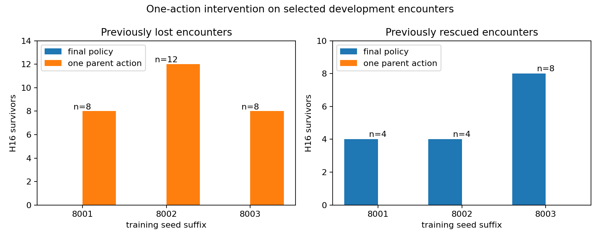
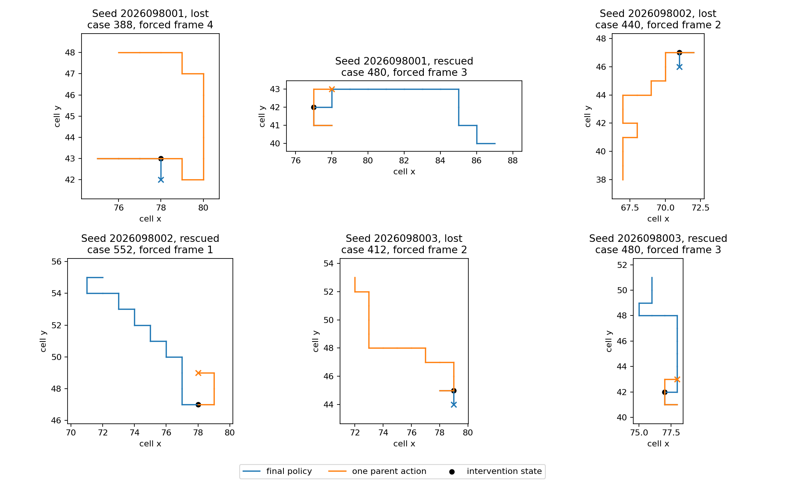

# Controlled-encounter one-action rescue — 2026-09-21

For every selected crossing loss, replacing only the first divergent action with
the parent's action restored H16 survival. For every selected frontal rescue,
restoring that parent action removed H16 survival. This establishes
single-action sufficiency within 44 selected seeded development cases. It does
not establish an optimizer mechanism, a population effect, a deployable policy
correction, or a learned-model improvement. The original learned-model
competence gates remain failed; there was no new trained model, fresh
confirmation, or promotion.

## Predeclared paired intervention

The question was whether the first changed action is sufficient to alter H16
survival when all later choices remain the final greedy policy. Each branch
cloned the actual native pre-action state, including private RNG, and verified
the full native state, Watch descriptor, action mask, and model inputs before
forcing one parent action. Later actions came from the unchanged final model.
There was no RNG intervention, oracle, or training.

The 44 cases are all changed-survival H16 cases from the prior census: 28
crossing losses and 16 frontal rescues. They form 11 seed-world-family groups
across six selected worlds from the eight-world adaptive bank. The four headings
within a world are related observations, rather than independent replicates.

| Lineage | Selected crossing losses: baseline → one-action survival | Food: baseline → one-action | Selected frontal rescues: baseline → parent-action survival | Food: baseline → parent-action |
| --- | ---: | ---: | ---: | ---: |
| 2026098001 | 0/8 → 8/8 | 4 → 48 | 4/4 → 0/4 | 20 → 4 |
| 2026098002 | 0/12 → 12/12 | 0 → 83 | 4/4 → 0/4 | 28 → 4 |
| 2026098003 | 0/8 → 8/8 | 0 → 61 | 8/8 → 0/8 | 48 → 8 |

Both predeclared all-lineage thresholds passed: at least 75% rescue of selected
crossing losses and at least 75% reversal of selected frontal rescues. The
result supports the narrower statement that a critical early choice can switch
outcome in these exact seeded branches. It does not explain why the final model
ranked that action, whether the effect holds beyond the six selected worlds, or
whether the same intervention helps an unseen population.

## Execution, recovery, and scope

The accepted experiment replayed all 44 full baselines for 320 steps and ran 44
branched games for 452 new steps: 772 accepted native steps in total. Model
weights stayed unchanged and no learner update occurred.

The initial replay failed before any intervention because a raw pickle-byte clone
assertion failed on its first selected frame. Its 11.022954541025683 seconds are
preserved and charged. A pre-frozen recovery amendment replaced that invalid
identity test with canonical full-state and RNG equality, while preserving the
original criteria and drivers. Raw pickle hashes differ in 42 of 44 cases, but
canonical clone identity passed in all cases. The failed partial step count was
not persisted, so it is excluded from the accepted 772 native steps.

Two jobs completed and one initial job failed, charging 60.09620612405706 of
360 guarded seconds. Peak RSS was 4,875,583,488 bytes and minimum available
memory was 34,718,466,048 bytes. The independent v2 audit passed. This
counterfactual replay ran native branches, but it did not create a trained-policy
or fresh-world result.

## Prior curve and next question

The curve is copied unchanged from the completed continuation study for context;
it is not output from this intervention.

A subsequent read of the [already computed TRAIN summaries](/Users/josenunez/Projects/ml/snake-dqn-artifacts/ongoing-research-20260913/native-td-training-fit-precomputed-summary.json)
shows lower final teacher membership in all six encounter families in every
lineage, including frontal encounters. The gameplay gains therefore do not map
to an improvement in frontal agreement on the admitted teacher corpus. This is
loss of agreement on previously admitted examples; it does not establish exact
native-TD experience coverage or identify the responsible updates.

The [next saved-record analysis](/Users/josenunez/Projects/ml/snake-dqn-artifacts/ongoing-research-20260913/native-td-training-agreement-next.json)
will localize those changes by exact corpus row, prefix step, and directional
versus boost action changes before choosing an update diagnostic. Full Q margins
are unavailable in the saved fit rows. These 44 held/development cases stay out
of optimization.

## Source records

- [Frozen intervention intent](/Users/josenunez/Projects/ml/snake-dqn-artifacts/ongoing-research-20260913/controlled-encounter-one-action-rescue/intent.json)
  — `FROZEN_BEFORE_EXECUTION`; SHA-256
  `092d2f1791156e3b603ad62b23b9da1418f0540bb38f7314d1143fb79b3c7b88`.
- [Pre-frozen recovery amendment](/Users/josenunez/Projects/ml/snake-dqn-artifacts/ongoing-research-20260913/controlled-encounter-one-action-rescue/recovery-amendment.json)
  — SHA-256 `873b4dbbc568935d819b9fc4f6db891021c04af3e58e0513f45bf5753f2a1e91`.
- [Native replay v2 report](/Users/josenunez/Projects/ml/snake-dqn-artifacts/ongoing-research-20260913/controlled-encounter-one-action-rescue/replay-v2/report.json)
  — `COMPLETE`; SHA-256
  `407283f388684049461bcaa6213a8b51d6938ac9fc66641db7f5596307d07030`.
- [Independent v2 audit](/Users/josenunez/Projects/ml/snake-dqn-artifacts/ongoing-research-20260913/controlled-encounter-one-action-rescue/audit-v2/report.json)
  — `PASS`; SHA-256
  `94abbeacb58169e45c6aec05e2c4ce390b39fa5c25bdeed98f891adeff15cde2`.
- [Completed closeout](/Users/josenunez/Projects/ml/snake-dqn-artifacts/ongoing-research-20260913/controlled-encounter-one-action-rescue/closeout.json)
  — `COMPLETE_AUDITED_SINGLE_ACTION_EFFECT_ALL_THREE`; SHA-256
  `d4318c874b5b58ccbfd72f57d466e328fcf1cae30d03f1f4ef8c9bd9cb42de18`.
- [Input-freeze handoff](/Users/josenunez/Projects/ml/snake-dqn-artifacts/ongoing-research-20260913/controlled-encounter-one-action-rescue/input-freeze-handoff.json)
  — SHA-256 `27116d0ce034342afb03ac254c255bc7689d9bc6bfdad458e7e39082938db89a`.
- [Prior first-divergence census](../controlled_encounter_first_divergence_2026-09-21/README.md)
  — selection source and unchanged continuation endpoint context.
