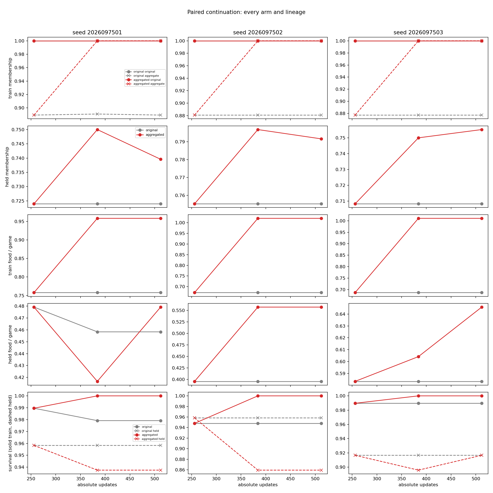
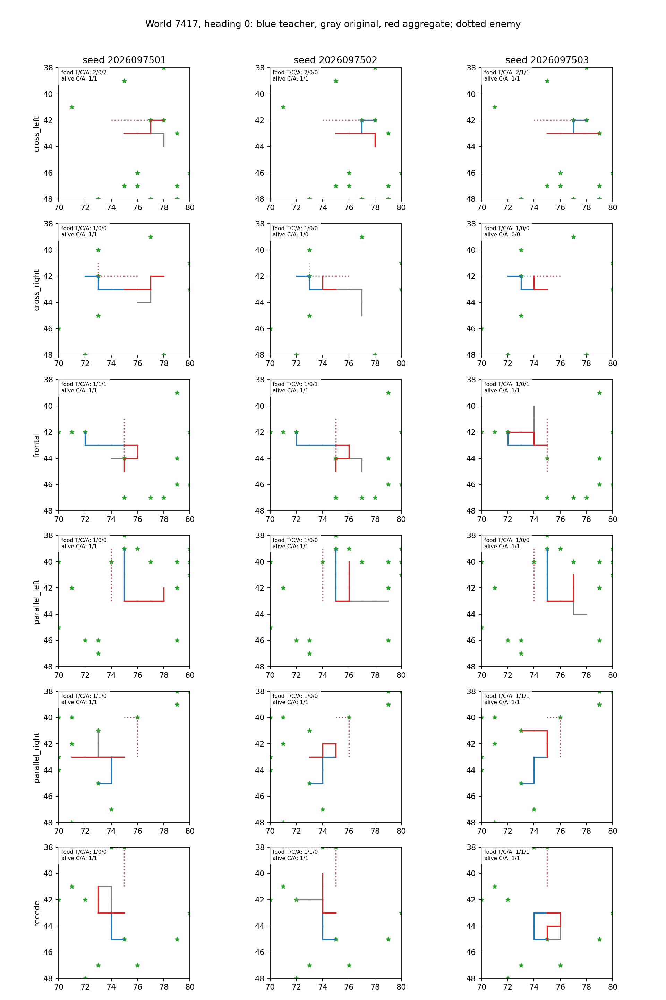

# Controlled-encounter paired aggregation continuation — 2026-09-21

Adding the admitted policy-trajectory labels improved familiar training-world
behavior in all three warm-start lineages, but it did not establish reliable
held-world benefit. No seed passed the unchanged absolute package or the added
paired-benefit package; this study is not promotion evidence.

The comparison follows the [coverage diagnostic](../controlled_encounter_coverage_diagnostic_2026-09-21/README.md), the [aggregation admission](../controlled_encounter_aggregation_2026-09-21/README.md), and the completed [food-label study](../controlled_encounter_food_labels_2026-09-21/README.md).

## Matched continuation

Each pair resumed its completed mark-256 parent with the exact same archived
network and full Adam state. This is a continuation, not training from scratch.
For each of the three lineages, the original arm sampled 1,536 rows and the
aggregated arm sampled 2,576 rows. Both arms received 256 new updates and
32,768 examples. The mark-256 parent was reused; marks 384 and 512 were newly
run, and only final mark 512 determined the result.

All pre-existing absolute thresholds remained frozen: train and held
teacher-set membership, held food relative to the teacher and by family, held
survival, and food gains over the lineage's original mark 0, each of three fixed
direction preferences, and the exact uniformly random valid-action baseline.
The added benefit requirement applied to both final-512
original control and mark-256 parent: at least 0.125 held food contacts per
case, a strictly positive paired eight-world t95 lower bound, and no benign or
threat-survival drop greater than 0.01. All three lineages had to pass.

## Final behavior

All aggregated arms reached 100% teacher-set membership on their 2,576-row
aggregated training dataset. That training fit does not transfer to a held-fit
claim; held membership and gameplay were evaluated separately on the unchanged
768 held states and 192 held games.

| Seed | Aggregated train food / survivors | Parent mark 256 food | Original control mark 512 food | Teacher train food | Aggregated held food / survivors | Original control held food / survivors |
| --- | ---: | ---: | ---: | ---: | ---: | ---: |
| 2026097501 | 368 / 384 | 291 | 291 | 383 | 92 / 180 | 88 / 184 |
| 2026097502 | 392 / 384 | 258 | 258 | 383 | 107 / 165 | 76 / 184 |
| 2026097503 | 388 / 384 | 264 | 264 | 383 | 124 / 176 | 112 / 176 |

Every aggregated arm survived all 384 training games. The held counts show
point differences only. The decision uses paired eight-world intervals, whose
lower bounds were negative for every lineage against both required comparators.

| Seed | Aggregated minus original control: mean, 95% CI | Aggregated minus parent: mean, 95% CI |
| --- | --- | --- |
| 2026097501 | +0.0208, [-0.2418, +0.2835] | 0.0000, [-0.2580, +0.2580] |
| 2026097502 | +0.1615, [-0.0968, +0.4198] | +0.1615, [-0.0968, +0.4198] |
| 2026097503 | +0.0625, [-0.1473, +0.2723] | +0.0625, [-0.1473, +0.2723] |

No confidence interval clears the added strictly-positive lower-bound
requirement. The aggregate-arm held absolute package also failed for every
seed, as did the all-three absolute, paired-benefit, and overall decisions.

## Scope and execution record

The three lineages share one adaptively collected training pool, so they are
warm-start rescue replications rather than independent fresh-dataset
replications. Held tensors and gameplay never entered the optimizer or
aggregation pool, although prior held outcomes motivated the study. Any
positive result would still require a later fresh-world and fresh-lineage
confirmation. The H4 teacher retains full-state and realized-future knowledge;
finite no-alias checks do not establish globally observable targets. This study
does not decide architecture superiority or change the tournament incumbent.

The audited closeout records 19 physical attempts, 17 complete receipts, and
276.06 charged seconds of the 1,800-second budget. It includes
1,536 scientific updates and 196,608 scientific examples, plus eight discarded
qualification updates. Peak RSS was 3,733,667,840 bytes and minimum available
memory was 30,146,101,248 bytes.

Two failed qualification receipts are preserved. The initial metadata check
reported a false provenance mismatch because checkpoint `betas` were a tuple
while the JSON report used the equal list; the repair normalized JSON before
comparing every provenance field. A diagnostic launch used a missing relative
virtual-environment path, started no child, and was charged its full 15-second
cap. The retry reused the complete discarded eight-update qualification
checkpoint only to rerun evaluation in a fresh v2 directory; it did not change
the network, optimizer, datasets, seeds, thresholds, or scientific job budget.

## Source records

- [Frozen paired intent](/Users/josenunez/Projects/ml/snake-dqn-artifacts/ongoing-research-20260913/controlled-encounter-paired/intent.json)
- [Metadata recovery](/Users/josenunez/Projects/ml/snake-dqn-artifacts/ongoing-research-20260913/controlled-encounter-paired/metadata-recovery.json)
- [Saved paired analysis](/Users/josenunez/Projects/ml/snake-dqn-artifacts/ongoing-research-20260913/controlled-encounter-paired/analysis/report.json)
- [Final figure receipt](/Users/josenunez/Projects/ml/snake-dqn-artifacts/ongoing-research-20260913/controlled-encounter-paired/figures-v2/report.json)
- [Audited closeout](/Users/josenunez/Projects/ml/snake-dqn-artifacts/ongoing-research-20260913/controlled-encounter-paired/closeout.json)
