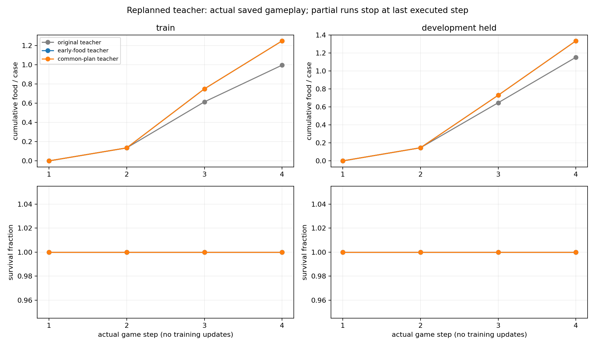
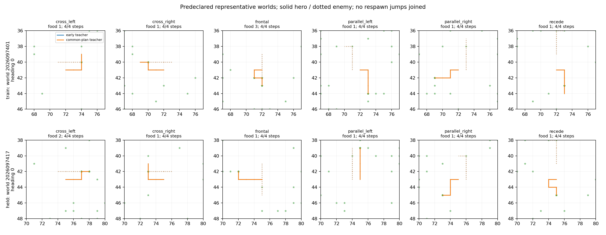

# Controlled-encounter receding teacher — 2026-09-21

The finite-bank receding teacher is **COMPLETE_AUDITED** and qualifies only its
teacher construction for a separately frozen learning comparison. It completed
four train steps and four held steps with every teacher game alive: train
collected 480 food contacts in 384 games and held collected 256 in 192 games.
All nine aggregate qualification gates passed. This is not a learned-policy
result: it ran no optimizer update or model inference, produced no learned
gain, did not admit a corpus automatically, and cannot promote or replace the
incumbent.

This follows the [common-path feasibility probe](../controlled_encounter_common_path_2026-09-21/README.md), which permitted only this separately frozen
teacher qualification. The prior [world-breadth learning comparison](../controlled_encounter_world_breadth_learning_2026-09-21/README.md)
remains the source of learned-policy curves and representative paths. The
rejected expansion and its unexecuted learning comparison remain unchanged.

## Finite-bank receding construction

At each of four game steps, the offline finite-bank procedure regrouped cases
by their current retained input, recomputed the four-step teacher target, took
one target action, and then regrouped at the next state. Every calculation used
the same eight *reused* future-RNG donors; it neither generated an independent
future distribution nor proves robustness outside those donor states. It kept
all six resolved native actions in the underlying action contract.

The teacher used the original FOOD bank: 384 training games and 192 adaptive
held games. The held bank has informed earlier research choices, so it remains
a development evaluation, not an untouched confirmation bank. No confirmation
worlds were materialized.

The frozen food floors were retained without relaxation:

| Split | Original teacher floor | Earlier-food reference | Receding-teacher food |
| --- | ---: | ---: | ---: |
| Train | 383 | 480 | 480 |
| Held | 221 | 256 | 256 |

The 80% earlier-food requirement is therefore satisfied on each split, while
the older FOOD floors remain separate retained comparators. These totals
describe the executed finite banks only; they do not establish unseen-world
performance or a training benefit.

## Audited teacher gameplay

| Split | Games / survivors | Food contacts | Rows | Final groups | Donor H4 queries |
| --- | ---: | ---: | ---: | ---: | ---: |
| Train | 384 / 384 | 480 | 1,536 | 429 | 12,288 |
| Held | 192 / 192 | 256 | 768 | 214 | 6,144 |

Both split records passed their six structural conditions: all cells eligible,
nonempty current and final consensus, every executed action meeting the final
minimum and belonging to the final target, and all games completing four steps.
The aggregate analysis additionally passed full family
coverage, all-games survival, both food floors, both 80%-of-earlier-food
requirements, and zero exact cross-split input overlap: all nine gates are
true.

Every saved world had its full 24-game complement and no deaths. The per-world
food totals were (IDs below omit the shared `202609` prefix):

| Split | World IDs and food contacts |
| --- | --- |
| Train | 7401: 32; 7402: 32; 7403: 32; 7404: 24; 7405: 28; 7406: 40; 7407: 28; 7408: 20; 7409: 36; 7410: 32; 7411: 32; 7412: 40; 7413: 32; 7414: 20; 7415: 20; 7416: 32 |
| Held | 7417: 28; 7418: 40; 7419: 32; 7420: 16; 7421: 40; 7422: 40; 7423: 28; 7424: 32 |

These figures show saved **teacher gameplay by game step**. They are not
learning curves and report no model-optimization trajectory. The early-food
and common-plan curves overlap because their per-step totals match; the
representative paths also overlap in the displayed cases.

## Audit and execution record

The independent stdlib audit is **COMPLETE_AUDITED** with an empty issues list.
It independently reduced 18,432 cells and recomputed all nine gates. Its
bounded limitation is that it did not reopen the typed NPZ contents; it checked
the collection artifact presence and hash, while the recorded main analysis
performed the typed-NPZ verification. The final audit addendum also checks all
guarded receipts and each world's case accounting. It does not independently
rehash the entire multi-gigabyte source closure; the root closeout does that.

Three numerical jobs completed and none failed: train took 1,455.909 seconds,
held took 737.608 seconds, and saved analysis took 15.688 seconds, for
2,209.205 charged seconds of the 3,030-second allowance. Peak RSS was
2,133,245,952 bytes and the minimum available memory was 30,745,067,520 bytes.
The separate pre-admission supervisor-duration argument rejection did not create a child
execution and is not a scientific failure.

The resulting authority is narrow: a new, separately frozen learning study may
now proceed. It still requires its own intent and confirmation design; this
teacher study does not supply independent RNG confirmation, a deployable online
teacher, or evidence of learned-policy improvement. The incumbent remains
unchanged; this study provides no policy promotion evidence.

## Source records

- [Frozen receding-teacher intent](/Users/josenunez/Projects/ml/snake-dqn-artifacts/ongoing-research-20260913/controlled-encounter-receding-teacher/intent.json)
  — SHA-256 `632373d837312dd3db0e07e599d64798c3b51736635fd378f3b970358adb41b2`
- [Completed train collection report](/Users/josenunez/Projects/ml/snake-dqn-artifacts/ongoing-research-20260913/controlled-encounter-receding-teacher/train/report.json)
  — SHA-256 `0e84226dbd2bee8c6cd5733d9010327933c1080bfbe2c0c14e283e45fd882cf3`
- [Completed held collection report](/Users/josenunez/Projects/ml/snake-dqn-artifacts/ongoing-research-20260913/controlled-encounter-receding-teacher/held/report.json)
  — SHA-256 `486827fcce6c898def5cbe1e99e6ad3d517121b57d6a0b580ac10bf0ff796d3f`
- [Audited aggregate analysis](/Users/josenunez/Projects/ml/snake-dqn-artifacts/ongoing-research-20260913/controlled-encounter-receding-teacher/analysis/report.json)
  — SHA-256 `6af17d012e794575ed1c06c4f27c1accfeb2513f9fc172c0dc1ffc4ce0d9c049`
- [Independent audit](/Users/josenunez/Projects/ml/snake-dqn-artifacts/ongoing-research-20260913/controlled-encounter-receding-teacher/independent-audit.json)
  — SHA-256 `09bda2d1e5f2d65f9867ec845ca5ad070a85954cd81fa462fe31629f9a74bf37`
- [Final independent audit](/Users/josenunez/Projects/ml/snake-dqn-artifacts/ongoing-research-20260913/controlled-encounter-receding-teacher/independent-audit-v2.json)
  — SHA-256 `09dd0dc121e65a89596efb5307f64430a1fb7dcffce1619089cccf1b3a21cc14`;
  preserved through the [audit addendum](/Users/josenunez/Projects/ml/snake-dqn-artifacts/ongoing-research-20260913/controlled-encounter-receding-teacher/audit-addendum.json), without changing the original closeout or results.
- [Audited closeout](/Users/josenunez/Projects/ml/snake-dqn-artifacts/ongoing-research-20260913/controlled-encounter-receding-teacher/closeout.json)
  — SHA-256 `0cff6df4ca82316c496807ac5f35c335cf9cdd7f507cc4d6b88ca7b1ed953f34`
- [Teacher gameplay figure source](/Users/josenunez/Projects/ml/snake-dqn-artifacts/ongoing-research-20260913/controlled-encounter-receding-teacher/analysis/gameplay-curves.png)
  and [representative-gameplay source](/Users/josenunez/Projects/ml/snake-dqn-artifacts/ongoing-research-20260913/controlled-encounter-receding-teacher/analysis/representative-gameplay.png)
