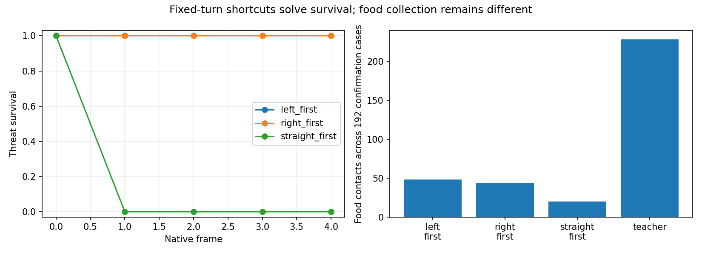
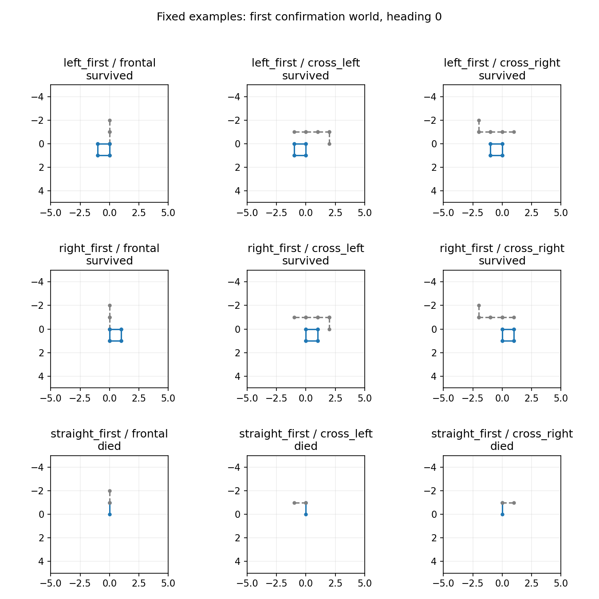

# Controlled-encounter static controls — 2026-09-21

Three fixed action-priority policies were checked against the frozen 576-case encounter bank, with no model inference or training. The qualification used six rows per policy; the full control covered all 576 rows, split across calibration and held-out confirmation. Each encounter ran for up to four native frames.

On confirmation, both fixed turn-priority rules survived **192/192** cases each: **96/96 threat** and **96/96 benign**. The fixed straight-priority rule survived **96/192**: **0/96 threat** and **96/96 benign**. The completed teacher baseline recorded 228 confirmation food contacts; the fixed rules recorded 48, 44, and 20 respectively. These results show that passing the survival criterion alone cannot demonstrate context-sensitive learned decisions. They do not mean the teacher failed, invalidate the completed calibration, or establish that the trained checkpoint failed; the learned-policy probe remains the separate evidence for that question.

The predeclared survival package is threat survival ≥0.95, each threat family ≥0.90, and benign survival ≥0.99. Both turn-priority rules pass it; the straight-priority rule fails on every threat family. This is a diagnostic of the criterion’s insufficiency, not a replacement gate or promotion result. The rules prefer normal-speed actions in orders left/straight/right, straight/left/right, and right/straight/left respectively, choosing the first action allowed by the native resolved mask.

All three supervisor receipts (qualification, full control, saved analysis) classify as complete, show natural exit code 0, and report no source/driver drift. Their elapsed times sum to **13.78 seconds**, within the frozen **120-second** campaign budget. Maximum observed RSS was **268,877,824 bytes (about 257 MiB)**; the lowest available-memory sample was **31,788,384,256 bytes (about 29.6 GiB)**. The receipts do not record observed MPS-driver use. No training or model inference was performed.

The subsequent study qualified a new teacher that replans four steps ahead at every decision and prioritizes food among surviving paths. Its completed fresh-world collection passed the food/survival checks but failed the original label-consistency gate. No scientific training ran; see the [imitation admission closeout](../controlled_encounter_imitation_2026-09-21/README.md).

