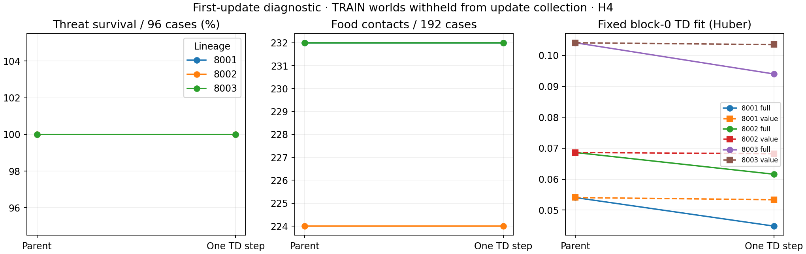
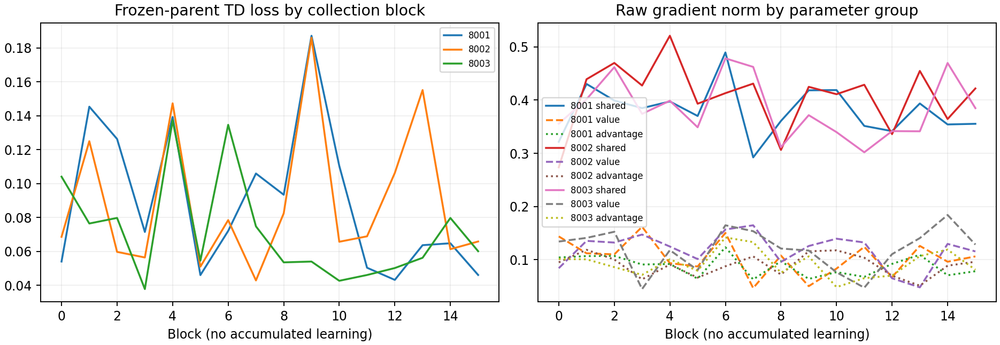
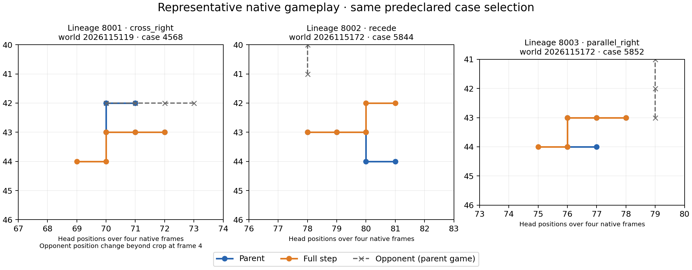

# Controlled-encounter TD-update diagnostic — 2026-09-21

The preregistered one-step diagnostic did not establish immediate TD-update
damage. Across all three existing GLOBAL mark-1536 lineages, parent and one-full
step each survived all 192 H4 cases and collected the same food total. The
pooled eight-world threat-survival delta is exactly zero, so the primary harm
rule is false. This bounded counterfactual neither proves that updates are safe
at larger dose nor identifies a causal value-calibration explanation. Apex
remains the incumbent; confirmation and promotion are not permitted.

## Fixed first-step result

The lineages are existing parents, not new training seeds. Each collected 16
frozen-parent T4 blocks; only block 0 supplied one full or one value-only Adam
step. The 16-block telemetry is descriptive frozen-parent data, not a learning
curve. Eight TRAIN worlds were withheld only from this diagnostic update cohort
and then used for paired H4 gameplay; they are not fresh generalization.

| Lineage | TD loss: before → full → value-only | H4 survivors: parent → full | H4 food: parent → full | Changed full-step action sequences | Valid transitions |
| --- | --- | ---: | ---: | ---: | ---: |
| 2026098001 | 0.05405 → 0.04483 → 0.05335 | 192 → 192 | 232 → 232 | 4 | 1,526 |
| 2026098002 | 0.06862 → 0.06159 → 0.06823 | 192 → 192 | 224 → 224 | 4 | 1,510 |
| 2026098003 | 0.10408 → 0.09399 → 0.10348 | 192 → 192 | 232 → 232 | 3 | 1,529 |

The value-only control changed value parameters but had zero masked-greedy
action mismatches across all 2,304 parent-visited evaluation states. Its common
Q offsets were nonzero, as expected under action-invariant shifts. Full-step
action-sequence changes alone do not establish harm: there were no new threat
deaths or rescues, and the primary pooled interval was [0, 0].

## Descriptive signal and boundaries

The saved transition ledger has 22 terminal targets among 4,565 valid
transitions. Terminal mean absolute residuals range from 3.00 to 3.63, compared
with 0.25 to 0.27 for interior transitions. This motivates checking the experience
distribution; it does not prove that terminals or residual scale caused the
prior behavior.

Qualification passed 16 gates and consumed three disposable qualification steps.
The science used six counterfactual steps, two per lineage, with zero candidate
parent updates. It ran 1,152 actual H4 games. Existing absolute and promotion
criteria were unchanged.

Seven guarded jobs completed. A 15-second wall-timeout during the first audit
was preserved, then saved-record recovery passed under its 45-second guard; no
scientific job was rerun. Charged time was 202.91849175374955 seconds of the
600-second cap. Peak RSS was 3,786,702,848 bytes and minimum available memory
was 28,955,049,984 bytes. The audit checks saved records only and is not an
independent native replay.

The next draft is a bounded 192-update continuation from the saved short-cap
64-update model and Adam state, with a fresh native episode/RNG boundary rather
than an exact environment resume. Mixed earlier curves motivate a last bounded,
unchanged-dose test instead of a very long all-in run. Its thresholds and budget
remain unfrozen; it has not executed. All earlier verdicts remain unchanged.

## Source records

- [Completed closeout](/Users/josenunez/Projects/ml/snake-dqn-artifacts/ongoing-research-20260913/controlled-encounter-td-update-diagnostic/closeout.json)
  — `COMPLETE_AUDITED_IMMEDIATE_DAMAGE_NOT_ESTABLISHED`; SHA-256
  `124380c362dee22c90429e31e20b47ad2b0f601fb902310d65d59719a0eb5c27`.
- [Saved analysis](/Users/josenunez/Projects/ml/snake-dqn-artifacts/ongoing-research-20260913/controlled-encounter-td-update-diagnostic/analysis/report.json)
  — SHA-256 `5ddd999f892a82abc1cb6e671c6ae4b83aca4aa46f7a88e211feee5c5953c07d`.
- [Saved-record audit](/Users/josenunez/Projects/ml/snake-dqn-artifacts/ongoing-research-20260913/controlled-encounter-td-update-diagnostic/audit-v2/report.json)
  — `PASS`, SHA-256 `5d9387fadcf8da0b9f53863ee26744442469499518175c4c07e49ffe44f6f5e1`; [audit recovery](/Users/josenunez/Projects/ml/snake-dqn-artifacts/ongoing-research-20260913/controlled-encounter-td-update-diagnostic/audit-recovery.json)
  — SHA-256 `bd119f4659227bae537a7609ebe729d9b7e42ad306e9ba701c702b88c0fefe39`.
- [Approved representative presentation source](/Users/josenunez/Projects/ml/snake-dqn-artifacts/ongoing-research-20260913/controlled-encounter-td-update-diagnostic/presentation/representative-gameplay.png)
  — replaces the original analysis gameplay plot for its corrected opponent repositioning and crop.
- [Unfrozen dose-continuation draft](/Users/josenunez/Projects/ml/snake-dqn-artifacts/ongoing-research-20260913/native-td-dose-continuation-next.json)
  — design only; no run has launched.
- [Continuation architecture review](/Users/josenunez/Projects/ml/snake-dqn-artifacts/ongoing-research-20260913/controlled-encounter-td-update-diagnostic/next-continuation-review.json)
  — constraints for the still-unfrozen design.
- [Prior short-cap diagnostic](../controlled_encounter_native_td_short_cap_2026-09-21/README.md)
  — prior bounded result and audited authority record.
