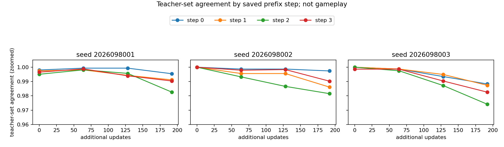
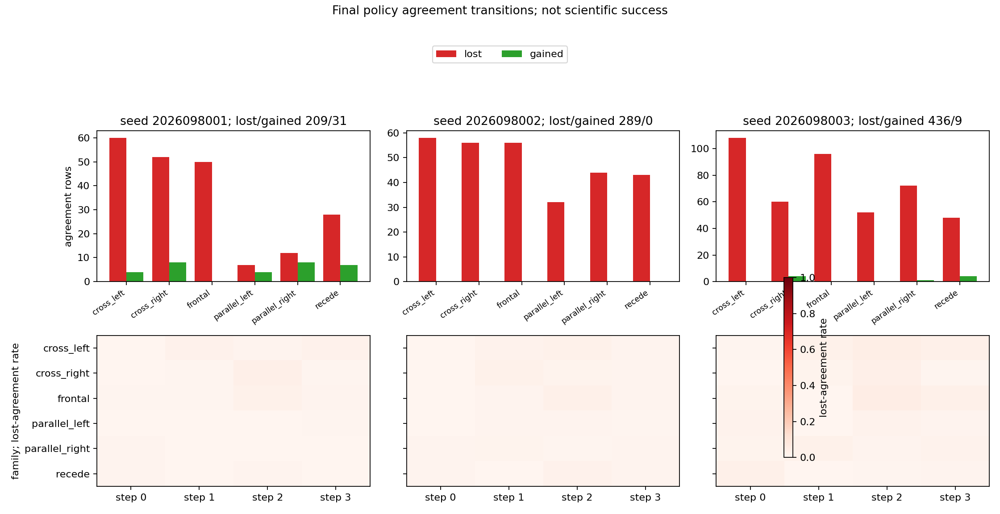
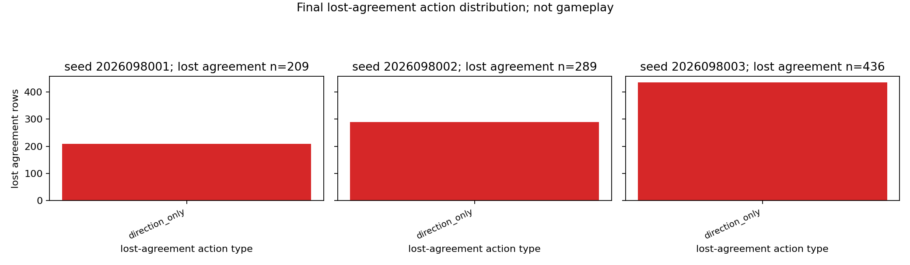
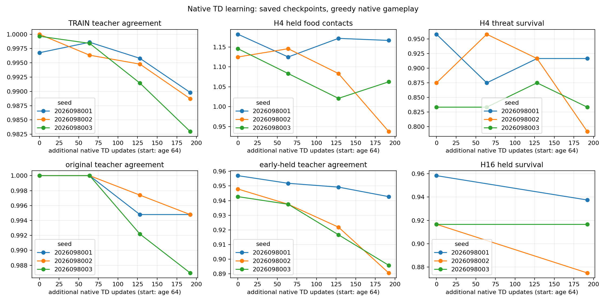

# Controlled-encounter training agreement — 2026-09-22

A completed saved-record census localizes changes in agreement with the fixed
teacher action set on the admitted TRAIN corpus during the native-TD continuation.
It read the three completed lineages at marks 0, 64, 128, and 192; it ran no
learning, model forward pass, native game, new teacher query, or replay. The
independent saved-record audit passed.

## Result

Each seed contains the same 25,616 admitted rows. Relative to mark 0, the final
mark (192) has 934 lost-agreement rows and 40 gained rows across the three seeds:
209/31 for `2026098001`, 289/0 for `2026098002`, and 436/9 for `2026098003`.
The 974 final-mark **membership changes** are all direction-only: the
normal/boost component is unchanged. Step 2 contains 393 membership changes
(40.3%); 381 of the 934 lost-agreement rows are at step 2 (40.8%). This
localizes where the fixed teacher-set agreement moved; it does not show gameplay
success or an update mechanism.

This is separate from policy-action change: the final mark has 4,390 action
changes across the three seeds, while only 974 change teacher-set membership.
Across all post-baseline marks, there are 1,666 membership changes: 1,504 lost
and 162 gained. All are direction-only, and step 2 contains 671 (40.3%). The
figures keep the per-seed and family/step breakdown visible.

| Seed | Mark 0 | Mark 64 | Mark 128 | Mark 192 |
| --- | --- | --- | --- | --- |
| 2026098001 | 25,533 / 25,616 | 25,580 / 25,616 | 25,508 / 25,616 | 25,355 / 25,616 |
| 2026098002 | 25,616 / 25,616 | 25,522 / 25,616 | 25,482 / 25,616 | 25,327 / 25,616 |
| 2026098003 | 25,607 / 25,616 | 25,575 / 25,616 | 25,397 / 25,616 | 25,180 / 25,616 |

## Behavioral context, kept separate

The learning curve is copied unchanged from the completed dose-continuation
study; it is context, not output of this census. Its previously reported
competence verdict remains failed: `promotion_eligible` and
`fresh_confirmation_permitted` are both false. The causal evidence for selected
prior gameplay branches is the separate [first-divergence census](../controlled_encounter_first_divergence_2026-09-21/README.md)
and [one-action rescue replay](../controlled_encounter_one_action_rescue_2026-09-21/README.md),
not this teacher-fit count.

Rows within a world and its headings are related observations, so row counts are
not independent trials. The corpus is TRAIN only; held worlds were excluded.
The surrounding development bank used adaptive held worlds, so neither the
preserved gameplay evidence nor these agreement summaries are fresh-world
confirmation.

## Execution and sources

Three successful guarded jobs (saved census, independent audit, and presentation
repair) charged 12.48986204 seconds against a 90-second budget. Peak RSS was 2.2694854736328125 GiB and minimum available
memory was 33.942779541015625 GiB. The saved analysis reports zero learning
updates, model forwards, and native games. The presentation-only repair reuses
the audited report, separates title and legend, and labels the agreement-axis zoom.

- [Frozen intent](/Users/josenunez/Projects/ml/snake-dqn-artifacts/ongoing-research-20260913/controlled-encounter-training-agreement/intent.json)
  — admitted metadata only; SHA-256 `4416daab2ae5e2fa129a30918ef2a2d9110ba06e3e420df9f4e2a77c3db7e061`.
- [Saved analysis report](/Users/josenunez/Projects/ml/snake-dqn-artifacts/ongoing-research-20260913/controlled-encounter-training-agreement/analysis/report.json)
  — `COMPLETE_SAVED_ONLY`; SHA-256 `78c7fef8dac23fc65193bdb25df7ca9eb321106716777483fc7bdc8df20d2b7f`.
- [Independent audit](/Users/josenunez/Projects/ml/snake-dqn-artifacts/ongoing-research-20260913/controlled-encounter-training-agreement/audit/report.json)
  — `PASS`; SHA-256 `2a2b05a92786f79e57154d70190e9ff60631c48836eca2306b7e0ad01a4a7200`.
- [Completed dose-continuation analysis](/Users/josenunez/Projects/ml/snake-dqn-artifacts/ongoing-research-20260913/controlled-encounter-native-td-dose-continuation/analysis/report.json)
  — source of the copied behavioral curve and retained gate verdict; SHA-256
  `69e0e2050beae7d5bfba5ef1e1e3120bfdb93e976dc87be0f83fd6081e851c78`.
- [Admitted TRAIN artifact](/Users/josenunez/Projects/ml/snake-dqn-artifacts/ongoing-research-20260913/controlled-encounter-global-teacher/admission/split-train.npz)
  — 25,616 rows; SHA-256 `27527d4c7f3c431f292898c451ee9bbafa4098e474465b1bbb063ce9d9b1b9c0`.
