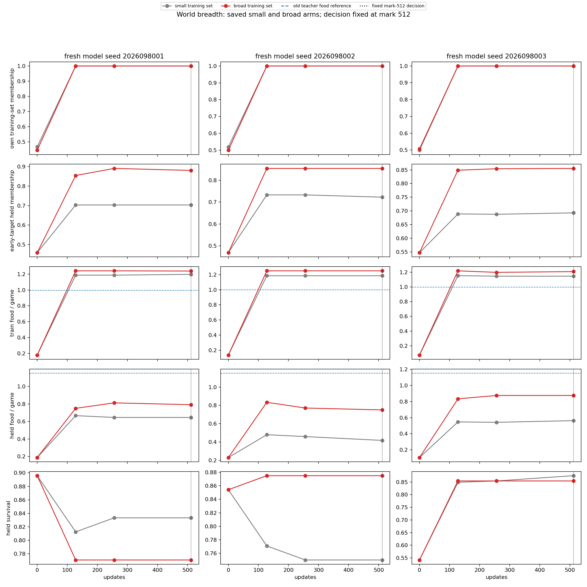
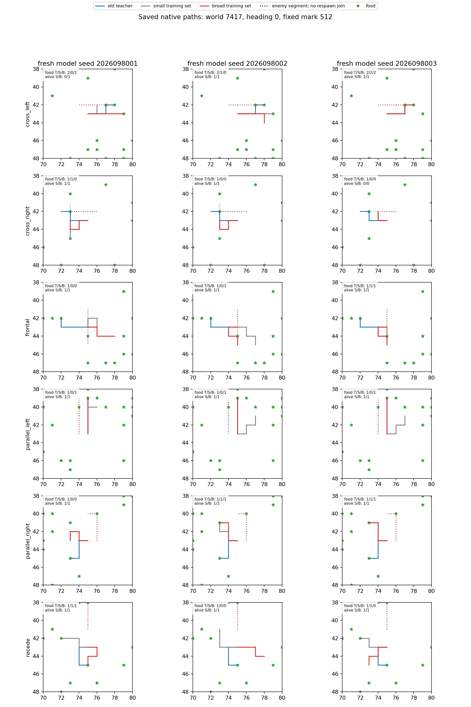

# Controlled-encounter world-breadth learning — 2026-09-21

Broader teacher coverage increased held food in all three fresh model lineages,
but held survival remained unreliable. Only one lineage passed its paired
benefit package and none passed the unchanged absolute package, so the joint
decision is false. This completed comparison does not promote or replace the
incumbent Apex policy.

The study follows the admitted [world-breadth collection](../controlled_encounter_world_breadth_2026-09-21/README.md).
Each arm used an independent fresh initialization under the same model seed:
the small arm trained on 2,576 rows and the broad arm on 7,184 rows. Both arms
received the same 512 updates of 128 rows. This is a three-seed equal-dose
comparison, not a longer-training experiment.

## Final fixed-512 behavior

Every small and broad model reached 100% membership on its own training data.
That complete own-train fit does not resolve held behavior. The held games and
the early-target held fit both remained separate from the optimizer.

| Fresh seed | Held food: small → broad | Held survivors: small → broad | Early-target held fit: small → broad |
| --- | ---: | ---: | ---: |
| 2026098001 | 124 → 152 | 160 → 148 | 70.31% → 88.02% |
| 2026098002 | 80 → 144 | 144 → 168 | 72.27% → 85.42% |
| 2026098003 | 108 → 168 | 168 → 164 | 69.27% → 85.55% |

The broad arm therefore improved held food and early-target held fit in every
lineage. Its held-survivor count fell for seeds 8001 and 8003, so repeated food
gains do not establish reliable gameplay benefit.

## Fixed gates and paired result

The original absolute thresholds were not relaxed: train teacher membership at
least 95% overall and 90% per family; held membership at least 90% overall and
85% per family; held food at least 80% of teacher overall and 60% per family;
benign survival at least 99%, threat survival at least 95%, and 90% in every
threat family. Every lineage also still needed at least 0.25 held food contacts
per case over its initial model and every fixed directional and exact-random
comparator, with a positive lower 95% paired-world interval. All three fresh
seeds had to pass.

The paired broad-versus-small package also remained fixed: at least 0.125 held
food contacts per case, a strictly positive lower 95% interval over the eight
held worlds, and no benign or threat survival drop greater than 0.01. Two food
intervals have positive lower bounds, but only seed 8002 meets the complete
paired package because the other two lose threat survival.

| Seed | Broad minus small held food per case, 95% CI | Threat-survival change | Paired package |
| --- | --- | ---: | --- |
| 2026098001 | +0.1458, [-0.0431, +0.3348] | -0.1250 | Fail |
| 2026098002 | +0.3333, [+0.2043, +0.4623] | +0.2500 | Pass |
| 2026098003 | +0.3125, [+0.0719, +0.5531] | -0.0417 | Fail |

All three absolute decisions are false, as are the all-three paired and
overall decisions. The all-eight-world fresh confirmation bank
(`2026097801`–`2026097808`) was not executed because its all-three fixed-held
activation condition was not met.

## Qualification recovery and execution record

One qualification evaluation failed before gameplay or fit because it wrongly
required dedicated qualification-bank rows (worlds `2026097461`–`2026097466`,
local indices 0–5) to equal scientific-bank rows. The frozen recovery used a
fresh `qualify-eval-v2` output and validated the dedicated qualification bank
instead. It reused the discarded eight-update qualification-training
checkpoint only; scientific evaluation logic, optimizer, data, and thresholds
did not change.

The audited closeout is `COMPLETE_AUDITED`. It records 16 attempts: 15 complete
jobs and the preserved pre-gameplay qualification error. Charged execution was
473.32259275292745 seconds of the 2,805-second budget. The scientific runs
used 3,072 updates and 393,216 examples; the qualification's eight updates
were discarded. Peak RSS was 6,237,995,008 bytes and minimum available memory
was 29,323,657,216 bytes.

The next candidate is a first-error diagnostic for all 96 fatal broad-held
games, followed by a single-RNG-factor test. It is not a longer unchanged
training run: every model already has perfect own-train fit. No later study is
implied by this result.

## Source records

- [Frozen world-breadth learning intent](/Users/josenunez/Projects/ml/snake-dqn-artifacts/ongoing-research-20260913/controlled-encounter-world-breadth-learning/intent.json)
- [Audited final analysis](/Users/josenunez/Projects/ml/snake-dqn-artifacts/ongoing-research-20260913/controlled-encounter-world-breadth-learning/analysis/report.json)
- [Saved learning curves](/Users/josenunez/Projects/ml/snake-dqn-artifacts/ongoing-research-20260913/controlled-encounter-world-breadth-learning/analysis/learning-curves.png) and [representative paths](/Users/josenunez/Projects/ml/snake-dqn-artifacts/ongoing-research-20260913/controlled-encounter-world-breadth-learning/analysis/representative-paths.png)
- [Qualification recovery record](/Users/josenunez/Projects/ml/snake-dqn-artifacts/ongoing-research-20260913/controlled-encounter-world-breadth-learning/recovery-v2.json)
- [Audited closeout](/Users/josenunez/Projects/ml/snake-dqn-artifacts/ongoing-research-20260913/controlled-encounter-world-breadth-learning/closeout.json)
