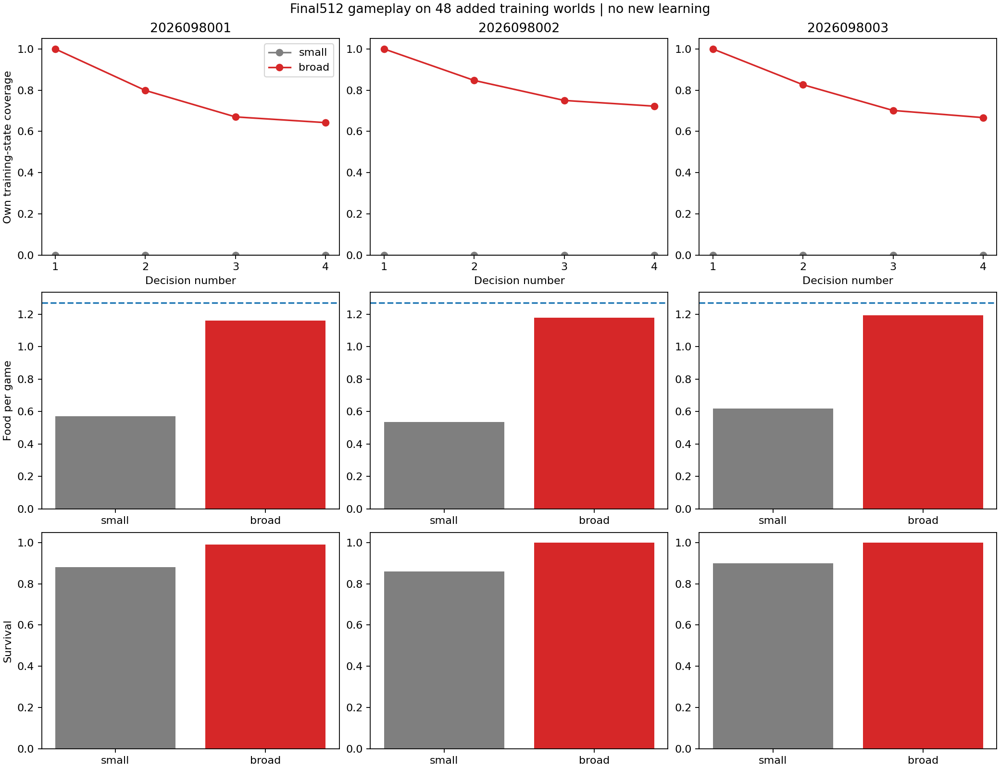
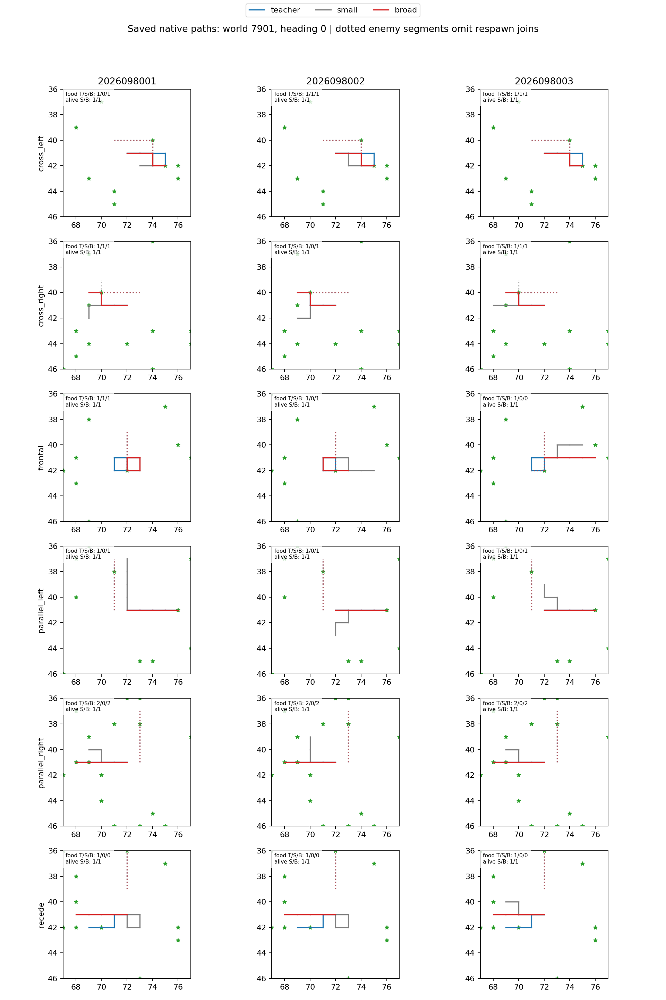

# Controlled-encounter added-world policy coverage — 2026-09-21

All three broader-data models met the predefined competence checks on the 48
added **training** worlds: they collected 91.3–94.0% of the reused teacher food
and survived 99.0–100% of those games. This is not held-world generalization or
promotion evidence. The prior development-held joint gates remain false, no
held or confirmation worlds were replayed, and the incumbent Apex policy is
unchanged.

This audit follows the [world-breadth learning comparison](../controlled_encounter_world_breadth_learning_2026-09-21/README.md), which contains the original learning curves and representative paths. It adds endpoint behavior and state-coverage evidence rather than new learning.

## Actual gameplay on the added training worlds

The audit ran six final-mark-512 models—small and broad arms for fresh seeds
2026098001–2026098003—on all 1,152 cases from worlds `2026097901`–`2026097948`.
That is 6,912 new actual masked-greedy native games. The saved early-H4 teacher's 1,152
completed games were reused exactly: all survived and collected 1,464 food
contacts. No new teacher oracle query or learner update ran.

| Seed | Added-training-world food: small → broad | Survivors: small → broad | New 4,608-row teacher fit: small → broad | Broad own-state coverage | Broad fatal games after an uncovered state |
| --- | ---: | ---: | ---: | ---: | ---: |
| 2026098001 | 657 → 1,336 | 1,016 → 1,140 | 71.20% → 100.00% | 77.78% | 12 |
| 2026098002 | 616 → 1,356 | 992 → 1,152 | 69.57% → 100.00% | 82.99% | 0 |
| 2026098003 | 712 → 1,376 | 1,036 → 1,152 | 74.00% → 100.00% | 79.86% | 0 |

The small models were never trained on these added worlds, so their zero
own-state coverage is expected and does not compare like-for-like with broad
coverage. Broad's own-covered greedy actions were teacher members, every broad
root state was covered, and no fatal trajectory was fully covered. The 12
broad-arm deaths all occurred after an uncovered state in seed 8001. That
pattern motivates a coverage diagnostic; it does not establish causation or a
policy repair.

## What this decision means

The within-training-world checks required broad teacher fit of at least 95%
overall and 90% per family, teacher-food fraction of at least 80% overall and
60% per family, benign survival of at least 99%, threat survival of at least
95%, and 90% survival in every threat family. All three broad models met those
conservative competence checks.

Those checks do not replace the earlier held-world criteria. The existing
held joint result remains false, and this finite training-world census uses no
formal confidence interval. It must not be read as a new-world confirmation,
an explanation for the held failures, or a basis for promotion.

The final analysis used saved artifacts only, but the six model evaluations
were actual native gameplay with model inference. Luna's independent audit
checked saved traces for all 6,912 games and recomputed greedy choices, event
accounting, and teacher/fit/coverage joins; it also verified frozen inputs and receipts; Sol reviewed the protocol and evaluator. The root
reviewed both figures.

## Execution record and next question

The audited closeout is `COMPLETE_AUDITED` (SHA-256
`a289df1bc02875d75578eaa7795062817b7a7ddae21d72659bcb0aba7e454ae3`).
Seven guarded jobs completed with no failure, charging 174.318303209031 seconds
of the 600-second budget. Peak RSS was 4,420,075,520 bytes and minimum
available memory was 30,891,376,640 bytes.

The next bounded question is fixed-example allocation: after freezing and
admitting 192 new teacher worlds, test 131,072 additional examples on 256
teacher worlds from matched broad-512 weights and Adam against repeating 64
worlds. That separate learning comparison has not been executed or promoted.

## Source records

- [Frozen policy-coverage intent](/Users/josenunez/Projects/ml/snake-dqn-artifacts/ongoing-research-20260913/controlled-encounter-world-policy-coverage/intent.json) — SHA-256 `1934ae221685be041e93fa6fbd3f0535c68722c7ce326323ac7e5d7c16583d9f`
- [Audited added-world analysis](/Users/josenunez/Projects/ml/snake-dqn-artifacts/ongoing-research-20260913/controlled-encounter-world-policy-coverage/analysis/report.json) — SHA-256 `ee120d71098e4b1a0c17a23d5e558a033188711d132aac52514a43d4a1ec689e`
- [Saved coverage figure source](/Users/josenunez/Projects/ml/snake-dqn-artifacts/ongoing-research-20260913/controlled-encounter-world-policy-coverage/analysis/coverage-comparison.png) and [representative-path source](/Users/josenunez/Projects/ml/snake-dqn-artifacts/ongoing-research-20260913/controlled-encounter-world-policy-coverage/analysis/representative-paths.png)
- [Audited closeout](/Users/josenunez/Projects/ml/snake-dqn-artifacts/ongoing-research-20260913/controlled-encounter-world-policy-coverage/closeout.json)
