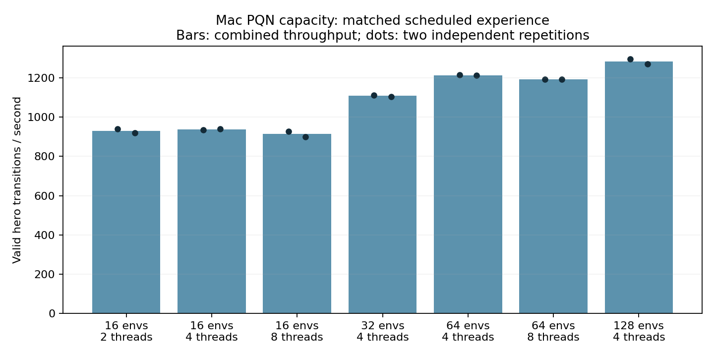

# Mac PQN capacity measurement

On the local M5 Pro / 18-core / 64-GiB Mac, 128 environments with four CPU
threads processed **1,284 valid hero transitions per second**, 38.0% faster than
the original 16-environment/two-thread setting. Both repetitions completed:
1,297 and 1,270 transitions/s. More CPU threads alone did not improve throughput.

| Environments | CPU threads | Combined valid hero transitions/s | Relative throughput |
| ---: | ---: | ---: | ---: |
| 16 | 2 | 930 | 1.000 |
| 16 | 4 | 937 | 1.008 |
| 16 | 8 | 914 | 0.983 |
| 32 | 4 | 1,108 | 1.192 |
| 64 | 4 | 1,214 | 1.306 |
| 64 | 8 | 1,194 | 1.284 |
| 128 | 4 | 1,284 | 1.380 |

The predeclared selection rule required at least 1.20x throughput, then preferred
the smallest environment count within 5% of the best rate. E128/T4 was selected.
This is a candidate configuration for a later behavioral comparison. The longer
dose control retains E16/T2 so its results isolate additional training dose.

Each configuration used the same authenticated CZ visible seed2026096101
mark4608 model and full Adam state, the same six-action raster network, native
S2 simulator, fixed GreedyFood opponent, half-MSE Q(lambda), T16, MB256, exact
one-epoch sample coverage, and constant epsilon .1. After four warmup updates,
each repetition measured 32,768 scheduled hero slots, followed by two separately
profiled updates. Actual valid transitions were counted. The throughput window
includes update bookkeeping and heartbeat writes; MPS is synchronized. Repetition
order was reversed. Performance seeds were 2026097101/02; SGD seeds +1,000,000.

The sample schedule was matched; rollout count, trajectories, warmup volume, and
policy freshness differ. All updates were discarded and no policy checkpoint
was saved. This study establishes throughput, not improved learning or gameplay.
The profiler's printed generic steps/s includes both snakes; the reported rates
above count only actual eligible hero transitions.

Qualification first caught shared mutable Adam step tensors between two benchmark
restores. The failed 2.907-second attempt is preserved. A separate versioned
repair deep-copied the native payload before each restore; model, Adam, simulator
runtime, and selected telemetry then matched exactly after each of two updates
with and without the old passive observer. No checkpoint on disk changed.

All fourteen measurements and saved-data analysis exited naturally with code zero
and no source drift. Total guarded time was **519.111410 seconds** of the frozen
1,830-second cap, including the failed attempt. Maximum monitored process-tree RSS
was **980,189,184 bytes (0.913 GiB)**; minimum observed system availability was
**31,707,906,048 bytes (29.530 GiB)**. The guard reserves 15% of physical RAM
(9.6 GiB), caps RSS at16GiB and MPS driver allocation at24GiB, and holds both shared
CPU locks. RSS and MPS allocations overlap in unified memory. CPU threads are
bounded; an exact85% GPU utilization limit was neither measured nor claimed.

Pinned source: `1f32d2de1987d97441fa74c1898ed9039b535f24`.
Apex remains incumbent pending the shared tournament gate. Its historical training
dose does not establish inherent superiority.

- [Frozen protocol and repair](/Users/josenunez/Projects/ml/snake-dqn-artifacts/ongoing-research-20260913/pqn-capacity-20260921/intent-v2.json)
- [Audited analysis and every input hash](/Users/josenunez/Projects/ml/snake-dqn-artifacts/ongoing-research-20260913/pqn-capacity-20260921/analysis.json)
- [Readable results](/Users/josenunez/Projects/ml/snake-dqn-artifacts/ongoing-research-20260913/pqn-capacity-20260921/results.md)
