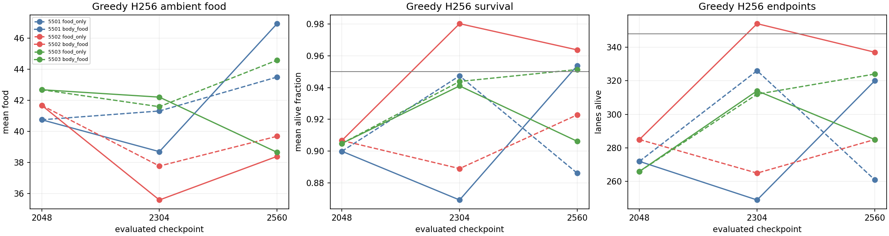
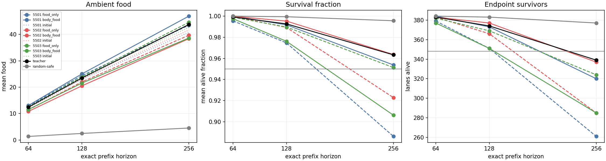
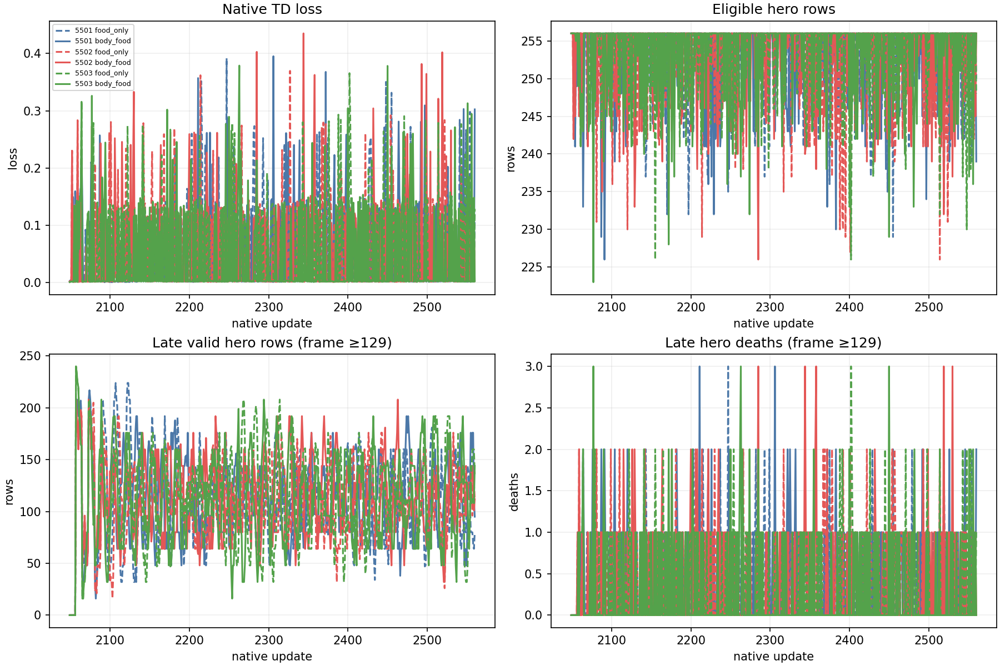
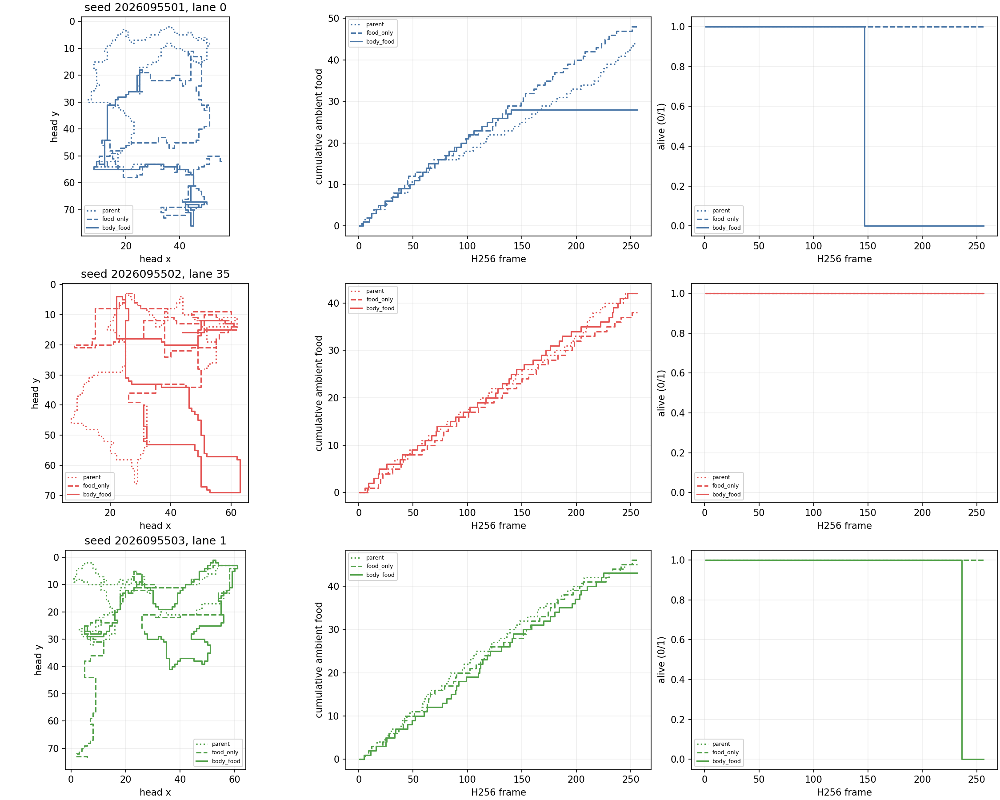

# CK: matched native PQN learning with body information

**Complete and independently audited. Body information did not produce reliable H256 survival: 0/3 body policies pass the absolute criteria, and only 1/3 passes the paired body-effect comparison. No promotion.**

CI's six fixed policies retained food collection but failed H256 survival. CJ replayed all 607 deaths exactly as self-collisions under empty-advisory fallback. CK asks whether exposing the existing own-body tactical channel lets native PQN learn earlier avoidance while preserving food collection.

The root agent owns design, integration and serialized numerical execution. Sol reviewed the native model/trainer/evaluator/qualification path and reducer, Terra implemented bounded model/protocol/analysis slices, and Luna independently checked the host and fresh-bank metadata. Agents did not launch scientific jobs.

## Fixed comparison

Three fresh paired training seeds 2026095501–5503 continue all three CG `train_h128` mark 2048 parents. This common parent-arm choice was made after CI and is not evidence that H128 training was superior. Both arms restore the complete model, Adam, update age and counters into fresh matched environments. Both zero only the first tactical convolution's body-input weight slice and its Adam moments. Control keeps food inputs; treatment additionally keeps own-body TTL. Both begin with identical Q values and native actions. No parameters, auxiliary loss or teacher labels are added.

Each arm receives 512 native updates at H256, ending at mark 2560. Marks 2048/2304/2560 provide greedy gameplay curves; only 2560 determines the outcome. A fresh 32-world bank, with four headings and three reachable-food placements per world, provides 384 lanes. Each H256 trace supplies exact H64/H128 prefixes.

Both comparisons must pass independently for all three seeds: paired body-minus-control H256 endpoint lower95%CI>0, and paired food lower95%CI>−.05 times the control mean. The units are 32 paired world means with df31. Absolute reliability separately preserves CI's 16 conditions: food, all 12 pose cells, time, endpoints and random-relative food at each horizon, plus late food. Treatment must pass both the all-three absolute and all-three relative readouts for overall diagnostic success. Midpoints and historical CG teacher-label fits cannot rescue failures. The teacher and random anchors are descriptive here; CH's earlier calibration failure remains unchanged.

## Qualification evidence and preserved corrections

The full original test invocation finished with 25 passes and one stale freshness-schema expectation in 2.451 seconds, including exactly one CPU Adam fixture step. The immutable r1 corrected only that test expectation; six protocol tests passed in 2.333 seconds.

The first MPS smoke stopped after 6.525830 seconds before any learner update or completed simulator step. Its native input assertion assumed a visible body in a benchmark that deliberately starts with one segment. The full raster was passed correctly; the head is correctly excluded from own-body TTL. Preserve that failed attempt and its 12 prepared selector rows. It made 15 forward calls, including the real-row CPU/MPS parity checks, whose in-memory values had not yet been archived.

Revision r2 changes only the disposable native selector fixture to a deterministic three-segment body, with proper ring order, reward baseline, body/food separation and refreshed masks. Scientific starts remain length one. Five new lightweight repair checks passed in 1.105 seconds, with no additional optimizer step. The corrected smoke passed in 18.416541 seconds. It verifies:

- Exact within-device parent/control/treatment initial Q and action equality; CPU/MPS Q tolerance rtol 1e-5, atol 1e-6 and identical masked actions.
- The actual native selector receives nonzero body input only in treatment.
- The first paired native rollout and TD loss are identical. The treatment body gradient has absolute sum 0.0011715819; control body gradient is zero and every nonslice preclip gradient is exact.
- Full model/Adam round-trips at 2048 and 2049 and exact H64/H128 prefixes of H256 gameplay for both arms.

All attempts total 30.831371 of 180 qualification seconds: one CPU fixture update, two discarded MPS updates and 10,764 completed gameplay lane-frames. The 12 aborted prepared rows are separate. Qualification checkpoints cannot enter scientific lineage. Peak smoke RSS was 1,362,051,072 bytes, MPS driver allocation remained below 1.24 GB, and available memory stayed above 35.6 GB.

## Completed training and resources

All six learners completed their declared 512 additional native updates with natural zero exits: 3,072 updates and 778,144 valid learner transitions in total. These are training counts, not greedy-gameplay results. Every run saved marks 2048, 2304 and 2560.

| Fresh training seed | Control valid transitions | Body-input valid transitions |
| --- | ---: | ---: |
| 2026095501 | 129,662 | 129,583 |
| 2026095502 | 129,573 | 129,768 |
| 2026095503 | 129,808 | 129,750 |

The largest recorded learner RSS was 1,592,836,096 bytes; minimum available memory was 34,980,200,448 bytes; maximum recorded MPS driver allocation was 1,230,323,712 bytes. No learner activated the gradient-norm clip at 10: the largest recorded preclip norm was 0.854834. Failure transitions occurred during training in all six runs, but their counts alone cannot establish a survival benefit.

The new H256 teacher reference collected 43.7604 food per lane, survival time 0.963338 and 339/384 endpoint survivors. Random-safe collected 4.546875 food, survival time 0.995646 and 377/384 survivors. Teacher endpoint survival is below the unchanged 348/384 learner criterion; these descriptive anchors do not change the thresholds.

The science budget is 5,940 seconds for six 512-update MPS learners, seventeen CPU gameplay evaluations and one saved-evidence reduction. Heavy jobs use both existing CPU locks and execute serially, with CPU 2 / interop 1, 4 GiB RSS cap, 12 GiB available-memory floor, 8 GiB MPS-driver cap and 20-second progress watchdog. The host is an M5 Pro Mac17,8 with 64 GiB RAM and 18 cores. The preflight found no competing numeric job.

Apex remains incumbent until the shared tournament gate authorizes replacement. Its larger historical training budget is a confound; incumbent status does not establish architectural superiority.

- [Frozen r2 intent](/Users/josenunez/Projects/ml/snake-dqn-artifacts/ongoing-research-20260913/solo-food-pqn-body-access-r2/intent.json)
- [Full prospective design and qualification history](/Users/josenunez/Projects/ml/snake-dqn-artifacts/ongoing-research-20260913/solo-food-pqn-body-access-r2/design.md)
- [Qualification accounting](/Users/josenunez/Projects/ml/snake-dqn-artifacts/ongoing-research-20260913/solo-food-pqn-body-access-r2/qualification-accounting.json)
- [Real admission evidence](/Users/josenunez/Projects/ml/snake-dqn-artifacts/ongoing-research-20260913/solo-food-pqn-body-access-r2/qualification-smoke/report.json)

## Final greedy gameplay: every seed

These are frozen mark-2560 greedy policies on 32 fresh worlds (384 lanes), with no evaluation exploration or optimizer updates. Food is ambient food collected per lane; time is the fraction of the full horizon alive. Every final policy passes the H64 and H128 criteria, all 36 heading/placement subchecks, and the H256 food and late-food conditions. Every final policy fails the unchanged H256 endpoint floor of 348/384.

| Seed | Arm | H256 food | H256 alive time | End survivors | Absolute checks passed |
| --- | --- | ---: | ---: | ---: | ---: |
| 2026095501 | Food-only control | 43.5000 | 0.886139 | 261/384 | 14/16 |
| 2026095501 | Body + food | 46.9375 | 0.953796 | 320/384 | 15/16 |
| 2026095502 | Food-only control | 39.6875 | 0.922852 | 285/384 | 14/16 |
| 2026095502 | Body + food | 38.3932 | 0.963674 | 337/384 | 15/16 |
| 2026095503 | Food-only control | 44.5859 | 0.951345 | 324/384 | 15/16 |
| 2026095503 | Body + food | 38.6536 | 0.906199 | 285/384 | 14/16 |

The additional time-floor failures are controls 5501/5502 and body 5503. The ledger retains nine absolute constituent failures and three relative failures. Body access improves final endpoints in two seeds, but seed 5503 reverses that effect. This does not establish a repeatable repair.

| Seed | Body−control endpoint fraction, mean [95% CI] | Body−control food, mean [95% CI] | Required food lower bound | Paired effect passes |
| --- | --- | --- | ---: | --- |
| 2026095501 | +0.153646 [0.076154, 0.231137] | +3.437500 [1.644510, 5.230490] | >−2.175000 | Yes |
| 2026095502 | +0.135417 [0.085520, 0.185313] | −1.294271 [−2.167057, −0.421484] | >−1.984375 | No: food retention |
| 2026095503 | −0.101562 [−0.172635, −0.030490] | −5.932292 [−7.436520, −4.428064] | >−2.229297 | No: both |

Intervals use the 32 paired world means separately for each seed, df31; neither lanes nor training seeds are pooled. Midpoint success cannot replace the final result. For example, body seed 5502 has 354 endpoint survivors at 2304 but only 337 at 2560. Control seed 5501 falls from 326 to 261 while collecting more food; its final boost fraction is 0.203532 versus the paired body's 0.100616. These are descriptive behavior changes, not established causes.

## Learning signal and representative evidence

All six runs made finite native PQN updates, but training loss alone does not establish useful behavior. The fit references remain historical CG teacher-label fits, authenticated through lineage and explicitly separated from the current policies; CK performs no new teacher-label fit evaluation. The training figure shows TD loss and actual exposure, including true episode frames at or beyond 129.

The gameplay figure uses the predeclared lanes 0, 35 and 1 for seeds 5501, 5502 and 5503. The body policy dies in the first and third examples; all three compared policies survive the second. The examples were fixed before outcomes and are not selected winners.

## Audit, budget and next experiment

All 24 scientific jobs finished with natural zero exits: six learners, seventeen gameplay evaluations and one saved-evidence analysis. Scientific execution consumed **3,299.096010 / 5,940 seconds**; qualification used **30.831371 / 180 seconds**, including all preserved failed attempts. The independent audit reconciled the completed receipts, frozen inputs, every seed, confidence intervals and unchanged failure ledger. Its first pass differed only in the order of identical failed-check names; the original output is preserved, and an order-independent comparison passes. No science was repeated.

Across current receipts, the highest observed process-tree RSS was **1,594,114,048 bytes**, minimum available memory **34,979,446,784 bytes**, and maximum observed MPS allocation **1,237,827,584 bytes**. Jobs remained serialized and below the frozen guards. These are observed sampled extrema, not an assurance about unsampled usage.

The next bounded question is whether longer-return credit helps a body-aware policy more than equal additional training at the current trace setting. CL will compare λ=.65 and λ=.95 from each complete CK body checkpoint, with full Adam/counters restored, three fresh training seeds, 512 added updates per arm, and a fresh 32-world gameplay bank. It retains the absolute survival/food criteria and requires both paired benefit and food retention relative to the shared parent. No body-channel surgery is repeated. This is a continuation comparison; changing λ affects all valid returns, so even a positive outcome would not isolate terminal credit as the causal mechanism.

- [Complete analysis and failure ledger](/Users/josenunez/Projects/ml/snake-dqn-artifacts/ongoing-research-20260913/solo-food-pqn-body-access-r2/analysis/analysis.json)
- [Independent audit](/Users/josenunez/Projects/ml/snake-dqn-artifacts/ongoing-research-20260913/solo-food-pqn-body-access-r2/independent-audit.json)
- [Audited closeout](/Users/josenunez/Projects/ml/snake-dqn-artifacts/ongoing-research-20260913/solo-food-pqn-body-access-r2/closeout.json)
