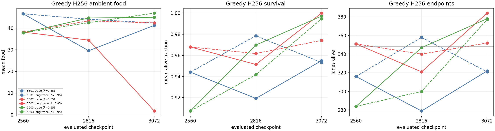
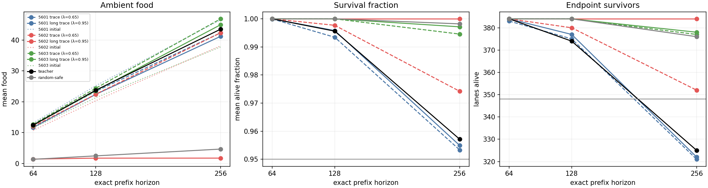
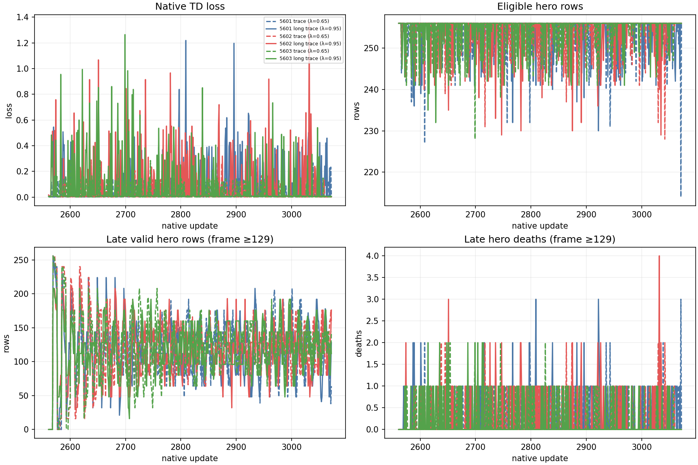
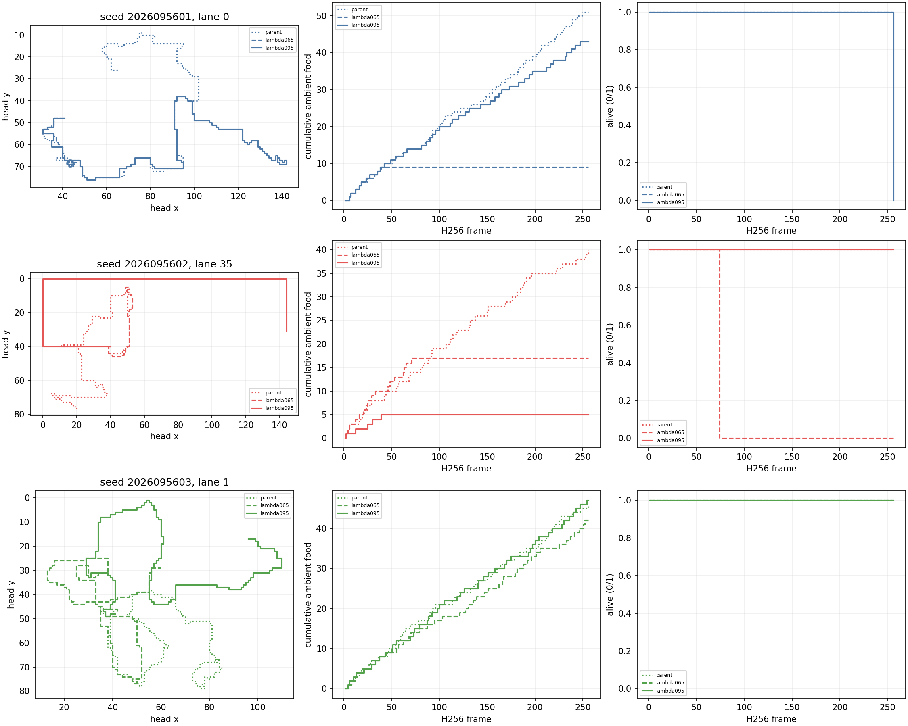

# CL: matched PQN credit-trace continuation

**Complete and independently audited. The current trace passes the absolute H256 criteria in 2/3 seeds; the longer trace passes in 1/3. No seed passes the complete paired trace-effect rule. No promotion.**

CL asks a narrow question: after the same completed CK body-aware parent state,
does a longer native PQN trace (`lambda095`, λ=.95) behave more reliably than the
current trace (`lambda065`, λ=.65)? It is a matched continuation, not a new
architecture, objective, reward, action, or teacher-label experiment. Apex
remains the operational incumbent until the shared tournament gate supports a
replacement. Its larger historical training budget is not evidence of inherent
architectural superiority.

## Frozen comparison

The three common parents are completed CK `body_food` checkpoints at mark 2560.
CL maps them one-to-one to fresh seeds 2026095601–5603. Each pair restores the
complete network, Adam moments and ages, counters, input transform, masks,
rewards, optimizer settings, and native PQN configuration. Both arms receive a
fresh runtime. Within a pair they share the same fresh environment and SGD
streams until their policies diverge; λ is the only paired-arm setting that
changes.

Each arm performs 512 new native updates from mark 2560 through 3072. Mark 2816
is a learning-curve checkpoint only. Mark 3072 is the only decision checkpoint.
The fresh gameplay bank contains 32 worlds (2026108200–8231), four headings, and
three balanced reachable-food placements per world: 384 lanes per role. One H256
archive supplies exact H64 and H128 prefixes. Training never receives evaluation
arrays, and the inherited CG teacher-label fit is historical report-only context,
not a CL measurement.

The long-trace arm must pass all 16 inherited absolute checks in every seed:
food, all 12 pose cells, survival time, endpoints, and paired food versus
random-safe at H64/H128/H256, plus late H256 food. The H256 endpoint threshold is
348/384. It must also pass three final paired-world checks in every seed, using
32 world means and a Student-t interval with 31 degrees of freedom:

1. `lambda095 − lambda065` endpoint CI lower bound is strictly above zero.
2. `lambda095 − lambda065` food CI lower bound is above −5% of the `lambda065`
   world mean.
3. `lambda095 − shared parent` food CI lower bound is above −5% of the parent
   world mean.

No pooling across seeds or lanes is allowed. The `lambda065` absolute result is
reported separately but is not an overall prerequisite. A midpoint, a selected
lane, or an old teacher-label fit cannot rescue a missed final criterion.

## Qualification and operational history

The original numerical qualification remains valid: it used two discarded MPS
updates, zero CPU optimizer updates, 10,764 discarded gameplay lane-frames, and
two separate 16-step × 16-environment training rollouts. It consumed 23.999031
seconds across its preserved attempts. The current R4 metadata repair adds a
new exact-fit-reference check only: **17 tests passed in 2.889 seconds**, with no
new forward pass, optimizer update, or simulation. Cumulative qualification is
**26.888031 / 180 seconds**.

Four earlier scientific attempts remain charged and preserved, totaling
**57.881651 seconds**:

| Attempt | Result | Charged seconds |
| --- | --- | ---: |
| R2 teacher evaluation | Wall guard stopped after archived gameplay, during a broad final input check | 30.101149 |
| R3 teacher recovery | Completed naturally by reusing the archived raw evidence | 12.543018 |
| R3 random-safe evaluation | Completed naturally | 10.435133 |
| R3 initial-parent evaluation | Failed on metadata before yielding a learned comparison | 4.802350 |

R4 adopts the completed R3 teacher and random-safe reports instead of replaying
them. The new metadata-only jobs completed naturally in 4.169698 seconds and
2.938298 seconds. Their adoption records bind the original commands, input
freezes, receipts, raw report pointers, identical bank bytes, and identical
world specifications. They created **zero** gameplay lane-frames, model
forwards, scripted selections, optimizer updates, metric reductions, or NPZ
loads.

The R4 remaining job caps total 5,840 seconds. Together with the preserved
57.881651 seconds, the admitted maximum is 5,897.881651 seconds, within the
unchanged 5,940-second science cap. Heavy jobs remain serialized under the
two-CPU-slot, CPU/BLAS-two-thread, interop-one-thread, 4 GiB RSS, 12 GiB
available-memory, 8 GiB MPS-driver, and 20-second watchdog guards.

## Final greedy gameplay: every seed

All policies are evaluated greedily on the fixed 32 fresh worlds, 384 lanes.
The shared starting checkpoints and the final mark3072 are reported below.
Food is mean ambient food collected; time is the fraction of the full H256
horizon alive. Final policies also retain exact H64/H128 prefix evidence.

| Seed | Policy | H256 food | Alive time | End survivors | Absolute checks |
| --- | --- | ---: | ---: | ---: | ---: |
| 2026095601 | Shared initial | 46.578125 | 0.944163 | 316/384 | Reference |
| 2026095601 | Current λ=.65 | 42.361979 | 0.953328 | 321/384 | 15/16 |
| 2026095601 | Longer λ=.95 | 41.221354 | 0.954926 | 322/384 | 15/16 |
| 2026095602 | Shared initial | 38.143229 | 0.967987 | 351/384 | Reference |
| 2026095602 | Current λ=.65 | 42.367188 | 0.974213 | 352/384 | 16/16 |
| 2026095602 | Longer λ=.95 | 1.747396 | 1.000000 | 384/384 | 6/16 |
| 2026095603 | Shared initial | 37.804688 | 0.907389 | 284/384 | Reference |
| 2026095603 | Current λ=.65 | 46.885417 | 0.994578 | 377/384 | 16/16 |
| 2026095603 | Longer λ=.95 | 44.981771 | 0.997162 | 378/384 | 16/16 |

Both seed5601 finals fail only the H256 endpoint floor. The longer-trace
seed5602 final fails food, pose-cell, and paired food-versus-random conditions
at all three horizons, plus late food: ten absolute failures. Its perfect
survival does not rescue food collection below the random reference (4.677083).
The teacher reference collects 43.539063 food with 325 survivors. These are
anchors, not a relaxation of the learner endpoint floor 348. All other final
absolute conditions pass. Historical teacher-fit references are not current
CL fit measurements; no fit calls were added.

The relative comparison uses 32 paired world means per seed, never pooled lanes
or training seeds. Each of its three confidence-interval conditions must pass.

| Seed | Longer−current endpoints, mean [95% CI] | Longer−current food, mean [95% CI] | Longer−initial food, mean [95% CI] | Relative checks |
| --- | --- | --- | --- | ---: |
| 2026095601 | +0.002604 [−0.064137, 0.069345] | −1.140625 [−2.189143, −0.092107] | −5.356771 [−6.445263, −4.268279] | 0/3 |
| 2026095602 | +0.083333 [0.051868, 0.114798] | −40.619792 [−41.227145, −40.012438] | −36.395833 [−36.940664, −35.851002] | 1/3 |
| 2026095603 | +0.002604 [−0.013556, 0.018765] | −1.903646 [−2.438068, −1.369224] | +7.177083 [5.520862, 8.833305] | 1/3 |

The food lower bounds against current-trace are −2.118099, −2.118359 and
−2.344271; against initial they are −2.328906, −1.907161 and −1.890234.
Endpoint lower bound must be strictly positive. Thus seed5602 passes only
endpoint superiority and seed5603 only food retention against its initial
policy. No seed passes the full relative rule. The full failed-check names and
36 heading/placement subchecks per policy remain in the unchanged ledger.

## Learning and representative gameplay

The six learners completed 3,072 new optimizer updates and 781,367 valid hero
transitions. Their updates remained finite, and gradient clipping at 10 never
activated (largest reported preclip norm 1.027897). Finite loss did not guarantee
useful final behavior. Changing lambda also changes the regression targets,
so raw TD loss across arms is not a common measure of task performance.

The representative lanes were frozen before results: lane 0 for5601, lane 35
for5602 and lane 1 for5603. In the displayed seed5602 lane, the longer-trace head
travels around the boundary while cumulative food stops at 5. This demonstrates
one observed failure pattern; it does not establish the cause of the cohort's
food collapse. The fixed examples, including deaths, are retained unchanged.

## Audit, compute and next question

All 24 current logical jobs completed naturally: six learners, seventeen logical
evaluation reports (two adopted anchors), and one saved-evidence analysis.
There are 28 physical attempts including the four preserved prior attempts.
Charged science is **2336.215777 / 5940 seconds**, including 57.881651 prior
seconds; qualification is **26.888031 / 180 seconds**. No completed science was
rerun. Independent audit verifies 8,040 file hashes, receipt/input lineage,
training dose, every seed and the unchanged confidence-interval decisions.
Its first attempt differed only in failed-check name ordering; that output is
preserved and the ordering-only auditor correction passes.

Current receipt samples show maximum process-tree RSS **1568931840 bytes**,
minimum available memory **34650488832 bytes**, and maximum MPS driver usage
**1205059584 bytes**. All numerical work remained serial under the declared
Mac guards. These are sampled extrema, not a guarantee about unsampled usage.

Equal additional training at λ=.65 yields promising H256 behavior in two
lineages, but the all-three reliability milestone remains unmet. Increasing
lambda to .95 does not establish a reliable improvement and can lose food
seeking despite surviving. Lambda changes all valid returns; this result does
not isolate terminal credit as its causal mechanism.

The next bounded diagnostic, CM, will reuse all saved rollouts to examine
terminal-distance residuals, Huber output-derivative proxies and target
sensitivity to native-selector deviations. It uses no new training or gameplay
and cannot prove parameter-gradient attribution or that a loss change would
repair the policy. Its budget is 120 CPU seconds plus 60 qualification seconds,
frozen before execution. A later learning comparison will follow the evidence.

## Primary records

- [R4 frozen intent](/Users/josenunez/Projects/ml/snake-dqn-artifacts/ongoing-research-20260913/solo-food-pqn-credit-trace-r4/intent.json)
- [R4 design](/Users/josenunez/Projects/ml/snake-dqn-artifacts/ongoing-research-20260913/solo-food-pqn-credit-trace-r4/design.md)
- [R4 qualification accounting](/Users/josenunez/Projects/ml/snake-dqn-artifacts/ongoing-research-20260913/solo-food-pqn-credit-trace-r4/qualification-accounting.json)
- [R4 metadata qualification](/Users/josenunez/Projects/ml/snake-dqn-artifacts/ongoing-research-20260913/solo-food-pqn-credit-trace-r4/qualification-complete.json)
- [R4 teacher adoption](/Users/josenunez/Projects/ml/snake-dqn-artifacts/ongoing-research-20260913/solo-food-pqn-credit-trace-r4/evaluation/teacher-seed0-mark0/adoption.json)
- [R4 random-safe adoption](/Users/josenunez/Projects/ml/snake-dqn-artifacts/ongoing-research-20260913/solo-food-pqn-credit-trace-r4/evaluation/random_safe-seed0-mark0/adoption.json)
- [Completed CK body-access comparison](../solo_food_pqn_body_access_2026-09-20/README.md)

- [Complete analysis and failure ledger](/Users/josenunez/Projects/ml/snake-dqn-artifacts/ongoing-research-20260913/solo-food-pqn-credit-trace-r4/analysis/analysis.json)
- [Independent audit](/Users/josenunez/Projects/ml/snake-dqn-artifacts/ongoing-research-20260913/solo-food-pqn-credit-trace-r4/independent-audit.json)
- [Audited closeout](/Users/josenunez/Projects/ml/snake-dqn-artifacts/ongoing-research-20260913/solo-food-pqn-credit-trace-r4/closeout.json)
